# Projects and dependencies analysis

This document provides a comprehensive overview of the projects and their dependencies in the context of upgrading to .NETCoreApp,Version=v8.0.

## Table of Contents

- [Executive Summary](#executive-Summary)
  - [Highlevel Metrics](#highlevel-metrics)
  - [Projects Compatibility](#projects-compatibility)
  - [Package Compatibility](#package-compatibility)
  - [API Compatibility](#api-compatibility)
  - [Binding Redirect Configuration](#binding-redirect-configuration)
- [Aggregate NuGet packages details](#aggregate-nuget-packages-details)
- [Top API Migration Challenges](#top-api-migration-challenges)
  - [Technologies and Features](#technologies-and-features)
  - [Most Frequent API Issues](#most-frequent-api-issues)
- [Projects Relationship Graph](#projects-relationship-graph)
- [Project Details](#project-details)

  - [Apps\Ashare.Api\Ashare.Api.csproj](#appsashareapiashareapicsproj)
  - [Apps\Ashare.App\Ashare.App.csproj](#appsashareappashareappcsproj)
  - [Apps\Ashare.Shared\Ashare.Shared.csproj](#appsasharesharedasharesharedcsproj)
  - [Apps\Ashare.Web\Ashare.Web.csproj](#appsasharewebasharewebcsproj)
  - [Apps\Rukkab\Driver\Driver.Web\Driver.Web.csproj](#appsrukkabdriverdriverwebdriverwebcsproj)
  - [Apps\Rukkab\Rider\Rider.Web\Rider.Web.csproj](#appsrukkabriderriderwebriderwebcsproj)
  - [Apps\Rukkab\Shared\Rukkab.Shared.Blazor\Rukkab.Shared.Blazor.csproj](#appsrukkabsharedrukkabsharedblazorrukkabsharedblazorcsproj)
  - [Apps\Rukkab\Shared\Rukkab.Shared.Customer\Rukkab.Shared.Customer.csproj](#appsrukkabsharedrukkabsharedcustomerrukkabsharedcustomercsproj)
  - [Apps\Rukkab\Shared\Rukkab.Shared.Driver\Rukkab.Shared.Driver.csproj](#appsrukkabsharedrukkabshareddriverrukkabshareddrivercsproj)
  - [libs\backend\admin\ACommerce.Admin.AuditLog.Api\ACommerce.Admin.AuditLog.Api.csproj](#libsbackendadminacommerceadminauditlogapiacommerceadminauditlogapicsproj)
  - [libs\backend\admin\ACommerce.Admin.AuditLog\ACommerce.Admin.AuditLog.csproj](#libsbackendadminacommerceadminauditlogacommerceadminauditlogcsproj)
  - [libs\backend\admin\ACommerce.Admin.Authorization\ACommerce.Admin.Authorization.csproj](#libsbackendadminacommerceadminauthorizationacommerceadminauthorizationcsproj)
  - [libs\backend\admin\ACommerce.Admin.Dashboard.Api\ACommerce.Admin.Dashboard.Api.csproj](#libsbackendadminacommerceadmindashboardapiacommerceadmindashboardapicsproj)
  - [libs\backend\admin\ACommerce.Admin.Dashboard\ACommerce.Admin.Dashboard.csproj](#libsbackendadminacommerceadmindashboardacommerceadmindashboardcsproj)
  - [libs\backend\admin\ACommerce.Admin.Listings.Api\ACommerce.Admin.Listings.Api.csproj](#libsbackendadminacommerceadminlistingsapiacommerceadminlistingsapicsproj)
  - [libs\backend\admin\ACommerce.Admin.Listings\ACommerce.Admin.Listings.csproj](#libsbackendadminacommerceadminlistingsacommerceadminlistingscsproj)
  - [libs\backend\admin\ACommerce.Admin.Orders.Api\ACommerce.Admin.Orders.Api.csproj](#libsbackendadminacommerceadminordersapiacommerceadminordersapicsproj)
  - [libs\backend\admin\ACommerce.Admin.Orders\ACommerce.Admin.Orders.csproj](#libsbackendadminacommerceadminordersacommerceadminorderscsproj)
  - [libs\backend\admin\ACommerce.Admin.Reports.Api\ACommerce.Admin.Reports.Api.csproj](#libsbackendadminacommerceadminreportsapiacommerceadminreportsapicsproj)
  - [libs\backend\admin\ACommerce.Admin.Reports\ACommerce.Admin.Reports.csproj](#libsbackendadminacommerceadminreportsacommerceadminreportscsproj)
  - [libs\backend\auth\ACommerce.Authentication.Abstractions\ACommerce.Authentication.Abstractions.csproj](#libsbackendauthacommerceauthenticationabstractionsacommerceauthenticationabstractionscsproj)
  - [libs\backend\auth\ACommerce.Authentication.JWT\ACommerce.Authentication.JWT.csproj](#libsbackendauthacommerceauthenticationjwtacommerceauthenticationjwtcsproj)
  - [libs\backend\auth\ACommerce.Authentication.MicrosoftIdentity\ACommerce.Authentication.MicrosoftIdentity.csproj](#libsbackendauthacommerceauthenticationmicrosoftidentityacommerceauthenticationmicrosoftidentitycsproj)
  - [libs\backend\auth\ACommerce.Authentication.OpenIddict\ACommerce.Authentication.OpenIddict.csproj](#libsbackendauthacommerceauthenticationopeniddictacommerceauthenticationopeniddictcsproj)
  - [libs\backend\auth\ACommerce.Authentication.TwoFactor.Abstractions\ACommerce.Authentication.TwoFactor.Abstractions.csproj](#libsbackendauthacommerceauthenticationtwofactorabstractionsacommerceauthenticationtwofactorabstractionscsproj)
  - [libs\backend\auth\ACommerce.Authentication.TwoFactor.Email\ACommerce.Authentication.TwoFactor.Email.csproj](#libsbackendauthacommerceauthenticationtwofactoremailacommerceauthenticationtwofactoremailcsproj)
  - [libs\backend\auth\ACommerce.Authentication.TwoFactor.Nafath\ACommerce.Authentication.TwoFactor.Nafath.csproj](#libsbackendauthacommerceauthenticationtwofactornafathacommerceauthenticationtwofactornafathcsproj)
  - [libs\backend\auth\ACommerce.Authentication.TwoFactor.SessionStore.InMemory\ACommerce.Authentication.TwoFactor.SessionStore.InMemory.csproj](#libsbackendauthacommerceauthenticationtwofactorsessionstoreinmemoryacommerceauthenticationtwofactorsessionstoreinmemorycsproj)
  - [libs\backend\auth\ACommerce.Authentication.TwoFactor.SessionStore.Redis\ACommerce.Authentication.TwoFactor.SessionStore.Redis.csproj](#libsbackendauthacommerceauthenticationtwofactorsessionstoreredisacommerceauthenticationtwofactorsessionstorerediscsproj)
  - [libs\backend\auth\ACommerce.Authentication.Users.Abstractions\ACommerce.Authentication.Users.Abstractions.csproj](#libsbackendauthacommerceauthenticationusersabstractionsacommerceauthenticationusersabstractionscsproj)
  - [libs\backend\auth\ACommerce.Profiles.Api\ACommerce.Profiles.Api.csproj](#libsbackendauthacommerceprofilesapiacommerceprofilesapicsproj)
  - [libs\backend\auth\ACommerce.Profiles\ACommerce.Profiles.csproj](#libsbackendauthacommerceprofilesacommerceprofilescsproj)
  - [libs\backend\catalog\ACommerce.Catalog.Attributes.Api\ACommerce.Catalog.Attributes.Api.csproj](#libsbackendcatalogacommercecatalogattributesapiacommercecatalogattributesapicsproj)
  - [libs\backend\catalog\ACommerce.Catalog.Attributes\ACommerce.Catalog.Attributes.csproj](#libsbackendcatalogacommercecatalogattributesacommercecatalogattributescsproj)
  - [libs\backend\catalog\ACommerce.Catalog.Currencies.Api\ACommerce.Catalog.Currencies.Api.csproj](#libsbackendcatalogacommercecatalogcurrenciesapiacommercecatalogcurrenciesapicsproj)
  - [libs\backend\catalog\ACommerce.Catalog.Currencies\ACommerce.Catalog.Currencies.csproj](#libsbackendcatalogacommercecatalogcurrenciesacommercecatalogcurrenciescsproj)
  - [libs\backend\catalog\ACommerce.Catalog.Listings.Api\ACommerce.Catalog.Listings.Api.csproj](#libsbackendcatalogacommercecataloglistingsapiacommercecataloglistingsapicsproj)
  - [libs\backend\Catalog\ACommerce.Catalog.Listings\ACommerce.Catalog.Listings.csproj](#libsbackendcatalogacommercecataloglistingsacommercecataloglistingscsproj)
  - [libs\backend\catalog\ACommerce.Catalog.Products.Api\ACommerce.Catalog.Products.Api.csproj](#libsbackendcatalogacommercecatalogproductsapiacommercecatalogproductsapicsproj)
  - [libs\backend\catalog\ACommerce.Catalog.Products\ACommerce.Catalog.Products.csproj](#libsbackendcatalogacommercecatalogproductsacommercecatalogproductscsproj)
  - [libs\backend\catalog\ACommerce.Catalog.Units.Api\ACommerce.Catalog.Units.Api.csproj](#libsbackendcatalogacommercecatalogunitsapiacommercecatalogunitsapicsproj)
  - [libs\backend\catalog\ACommerce.Catalog.Units\ACommerce.Catalog.Units.csproj](#libsbackendcatalogacommercecatalogunitsacommercecatalogunitscsproj)
  - [libs\backend\core\ACommerce.AccountingKernel\ACommerce.AccountingKernel.csproj](#libsbackendcoreacommerceaccountingkernelacommerceaccountingkernelcsproj)
  - [libs\backend\core\ACommerce.LegalPages\ACommerce.LegalPages.csproj](#libsbackendcoreacommercelegalpagesacommercelegalpagescsproj)
  - [libs\backend\core\ACommerce.Locations.Abstractions\ACommerce.Locations.Abstractions.csproj](#libsbackendcoreacommercelocationsabstractionsacommercelocationsabstractionscsproj)
  - [libs\backend\core\ACommerce.OperationEngine\ACommerce.OperationEngine.csproj](#libsbackendcoreacommerceoperationengineacommerceoperationenginecsproj)
  - [libs\backend\core\ACommerce.SharedKernel.Abstractions\ACommerce.SharedKernel.Abstractions.csproj](#libsbackendcoreacommercesharedkernelabstractionsacommercesharedkernelabstractionscsproj)
  - [libs\backend\core\ACommerce.SharedKernel.CQRS\ACommerce.SharedKernel.CQRS.csproj](#libsbackendcoreacommercesharedkernelcqrsacommercesharedkernelcqrscsproj)
  - [libs\backend\core\ACommerce.SharedKernel.Infrastructure.EFCores\ACommerce.SharedKernel.Infrastructure.EFCores.csproj](#libsbackendcoreacommercesharedkernelinfrastructureefcoresacommercesharedkernelinfrastructureefcorescsproj)
  - [libs\backend\core\ACommerce.Versions\ACommerce.Versions.csproj](#libsbackendcoreacommerceversionsacommerceversionscsproj)
  - [libs\backend\files\ACommerce.Files.Abstractions\ACommerce.Files.Abstractions.csproj](#libsbackendfilesacommercefilesabstractionsacommercefilesabstractionscsproj)
  - [libs\backend\files\ACommerce.Files.Storage.AliyunOSS\ACommerce.Files.Storage.AliyunOSS.csproj](#libsbackendfilesacommercefilesstoragealiyunossacommercefilesstoragealiyunosscsproj)
  - [libs\backend\files\ACommerce.Files.Storage.GoogleCloud\ACommerce.Files.Storage.GoogleCloud.csproj](#libsbackendfilesacommercefilesstoragegooglecloudacommercefilesstoragegooglecloudcsproj)
  - [libs\backend\files\ACommerce.Files.Storage.Local\ACommerce.Files.Storage.Local.csproj](#libsbackendfilesacommercefilesstoragelocalacommercefilesstoragelocalcsproj)
  - [libs\backend\integration\ACommerce.Authentication.AspNetCore.NafathWH\ACommerce.Authentication.AspNetCore.NafathWH.csproj](#libsbackendintegrationacommerceauthenticationaspnetcorenafathwhacommerceauthenticationaspnetcorenafathwhcsproj)
  - [libs\backend\integration\ACommerce.Authentication.AspNetCore.Swagger\ACommerce.Authentication.AspNetCore.Swagger.csproj](#libsbackendintegrationacommerceauthenticationaspnetcoreswaggeracommerceauthenticationaspnetcoreswaggercsproj)
  - [libs\backend\integration\ACommerce.Authentication.AspNetCore\ACommerce.Authentication.AspNetCore.csproj](#libsbackendintegrationacommerceauthenticationaspnetcoreacommerceauthenticationaspnetcorecsproj)
  - [libs\backend\integration\ACommerce.Files.AspNetCore\ACommerce.Files.AspNetCore.csproj](#libsbackendintegrationacommercefilesaspnetcoreacommercefilesaspnetcorecsproj)
  - [libs\backend\integration\ACommerce.ServiceRegistry.Abstractions\ACommerce.ServiceRegistry.Abstractions.csproj](#libsbackendintegrationacommerceserviceregistryabstractionsacommerceserviceregistryabstractionscsproj)
  - [libs\backend\integration\ACommerce.ServiceRegistry.Core\ACommerce.ServiceRegistry.Core.csproj](#libsbackendintegrationacommerceserviceregistrycoreacommerceserviceregistrycorecsproj)
  - [libs\backend\integration\ACommerce.ServiceRegistry.Server\ACommerce.ServiceRegistry.Server.csproj](#libsbackendintegrationacommerceserviceregistryserveracommerceserviceregistryservercsproj)
  - [libs\backend\integration\ACommerce.SharedKernel.AspNetCore\ACommerce.SharedKernel.AspNetCore.csproj](#libsbackendintegrationacommercesharedkernelaspnetcoreacommercesharedkernelaspnetcorecsproj)
  - [libs\backend\marketing\ACommerce.Marketing.Analytics\ACommerce.Marketing.Analytics.csproj](#libsbackendmarketingacommercemarketinganalyticsacommercemarketinganalyticscsproj)
  - [libs\backend\marketing\ACommerce.Marketing.GoogleConversions\ACommerce.Marketing.GoogleConversions.csproj](#libsbackendmarketingacommercemarketinggoogleconversionsacommercemarketinggoogleconversionscsproj)
  - [libs\backend\marketing\ACommerce.Marketing.MetaConversions\ACommerce.Marketing.MetaConversions.csproj](#libsbackendmarketingacommercemarketingmetaconversionsacommercemarketingmetaconversionscsproj)
  - [libs\backend\marketing\ACommerce.Marketing.SnapchatConversions\ACommerce.Marketing.SnapchatConversions.csproj](#libsbackendmarketingacommercemarketingsnapchatconversionsacommercemarketingsnapchatconversionscsproj)
  - [libs\backend\marketing\ACommerce.Marketing.TikTokConversions\ACommerce.Marketing.TikTokConversions.csproj](#libsbackendmarketingacommercemarketingtiktokconversionsacommercemarketingtiktokconversionscsproj)
  - [libs\backend\marketing\ACommerce.Marketing.TwitterConversions\ACommerce.Marketing.TwitterConversions.csproj](#libsbackendmarketingacommercemarketingtwitterconversionsacommercemarketingtwitterconversionscsproj)
  - [libs\backend\marketplace\ACommerce.Bookings.Api\ACommerce.Bookings.Api.csproj](#libsbackendmarketplaceacommercebookingsapiacommercebookingsapicsproj)
  - [libs\backend\marketplace\ACommerce.Bookings\ACommerce.Bookings.csproj](#libsbackendmarketplaceacommercebookingsacommercebookingscsproj)
  - [libs\backend\marketplace\ACommerce.Subscriptions.Api\ACommerce.Subscriptions.Api.csproj](#libsbackendmarketplaceacommercesubscriptionsapiacommercesubscriptionsapicsproj)
  - [libs\backend\marketplace\ACommerce.Subscriptions\ACommerce.Subscriptions.csproj](#libsbackendmarketplaceacommercesubscriptionsacommercesubscriptionscsproj)
  - [libs\backend\marketplace\ACommerce.Vendors.Api\ACommerce.Vendors.Api.csproj](#libsbackendmarketplaceacommercevendorsapiacommercevendorsapicsproj)
  - [libs\backend\marketplace\ACommerce.Vendors\ACommerce.Vendors.csproj](#libsbackendmarketplaceacommercevendorsacommercevendorscsproj)
  - [libs\backend\messaging\ACommerce.Authentication.Messaging\ACommerce.Authentication.Messaging.csproj](#libsbackendmessagingacommerceauthenticationmessagingacommerceauthenticationmessagingcsproj)
  - [libs\backend\messaging\ACommerce.Chats.Abstractions\ACommerce.Chats.Abstractions.csproj](#libsbackendmessagingacommercechatsabstractionsacommercechatsabstractionscsproj)
  - [libs\backend\messaging\ACommerce.Chats.Api\ACommerce.Chats.Api.csproj](#libsbackendmessagingacommercechatsapiacommercechatsapicsproj)
  - [libs\backend\messaging\ACommerce.Chats.Core\ACommerce.Chats.Core.csproj](#libsbackendmessagingacommercechatscoreacommercechatscorecsproj)
  - [libs\backend\messaging\ACommerce.Messaging.Abstractions\ACommerce.Messaging.Abstractions.csproj](#libsbackendmessagingacommercemessagingabstractionsacommercemessagingabstractionscsproj)
  - [libs\backend\messaging\ACommerce.Messaging.InMemory\ACommerce.Messaging.InMemory.csproj](#libsbackendmessagingacommercemessaginginmemoryacommercemessaginginmemorycsproj)
  - [libs\backend\messaging\ACommerce.Messaging.SignalR.Hub\ACommerce.Messaging.SignalR.Hub.csproj](#libsbackendmessagingacommercemessagingsignalrhubacommercemessagingsignalrhubcsproj)
  - [libs\backend\messaging\ACommerce.Notifications.Abstractions\ACommerce.Notifications.Abstractions.csproj](#libsbackendmessagingacommercenotificationsabstractionsacommercenotificationsabstractionscsproj)
  - [libs\backend\messaging\ACommerce.Notifications.Channels.Firebase.EntityFramework\ACommerce.Notifications.Channels.Firebase.EntityFramework.csproj](#libsbackendmessagingacommercenotificationschannelsfirebaseentityframeworkacommercenotificationschannelsfirebaseentityframeworkcsproj)
  - [libs\backend\messaging\ACommerce.Notifications.Channels.Firebase\ACommerce.Notifications.Channels.Firebase.csproj](#libsbackendmessagingacommercenotificationschannelsfirebaseacommercenotificationschannelsfirebasecsproj)
  - [libs\backend\messaging\ACommerce.Notifications.Channels.InApp\ACommerce.Notifications.Channels.InApp.csproj](#libsbackendmessagingacommercenotificationschannelsinappacommercenotificationschannelsinappcsproj)
  - [libs\backend\messaging\ACommerce.Notifications.Core\ACommerce.Notifications.Core.csproj](#libsbackendmessagingacommercenotificationscoreacommercenotificationscorecsproj)
  - [libs\backend\messaging\ACommerce.Notifications.Messaging\ACommerce.Notifications.Messaging.csproj](#libsbackendmessagingacommercenotificationsmessagingacommercenotificationsmessagingcsproj)
  - [libs\backend\messaging\ACommerce.Notifications.Recipients.Api\ACommerce.Notifications.Recipients.Api.csproj](#libsbackendmessagingacommercenotificationsrecipientsapiacommercenotificationsrecipientsapicsproj)
  - [libs\backend\messaging\ACommerce.Notifications.Recipients\ACommerce.Notifications.Recipients.csproj](#libsbackendmessagingacommercenotificationsrecipientsacommercenotificationsrecipientscsproj)
  - [libs\backend\messaging\ACommerce.Realtime.Abstractions\ACommerce.Realtime.Abstractions.csproj](#libsbackendmessagingacommercerealtimeabstractionsacommercerealtimeabstractionscsproj)
  - [libs\backend\messaging\ACommerce.Realtime.SignalR\ACommerce.Realtime.SignalR.csproj](#libsbackendmessagingacommercerealtimesignalracommercerealtimesignalrcsproj)
  - [libs\backend\other\ACommerce.Transactions.Core.Api\ACommerce.Transactions.Core.Api.csproj](#libsbackendotheracommercetransactionscoreapiacommercetransactionscoreapicsproj)
  - [libs\backend\other\ACommerce.Transactions.Core\ACommerce.Transactions.Core.csproj](#libsbackendotheracommercetransactionscoreacommercetransactionscorecsproj)
  - [libs\backend\sales\ACommerce.Cart\ACommerce.Cart.csproj](#libsbackendsalesacommercecartacommercecartcsproj)
  - [libs\backend\sales\ACommerce.Orders.Api\ACommerce.Orders.Api.csproj](#libsbackendsalesacommerceordersapiacommerceordersapicsproj)
  - [libs\backend\sales\ACommerce.Orders\ACommerce.Orders.csproj](#libsbackendsalesacommerceordersacommerceorderscsproj)
  - [libs\backend\sales\ACommerce.Payments.Abstractions\ACommerce.Payments.Abstractions.csproj](#libsbackendsalesacommercepaymentsabstractionsacommercepaymentsabstractionscsproj)
  - [libs\backend\sales\ACommerce.Payments.Api\ACommerce.Payments.Api.csproj](#libsbackendsalesacommercepaymentsapiacommercepaymentsapicsproj)
  - [libs\backend\sales\ACommerce.Payments.Noon\ACommerce.Payments.Noon.csproj](#libsbackendsalesacommercepaymentsnoonacommercepaymentsnooncsproj)
  - [libs\backend\shipping\ACommerce.Shipping.Abstractions\ACommerce.Shipping.Abstractions.csproj](#libsbackendshippingacommerceshippingabstractionsacommerceshippingabstractionscsproj)
  - [libs\frontend\ACommerce.Widgets\ACommerce.Widgets.csproj](#libsfrontendacommercewidgetsacommercewidgetscsproj)
  - [libs\frontend\clients\ACommerce.Client.Auth\ACommerce.Client.Auth.csproj](#libsfrontendclientsacommerceclientauthacommerceclientauthcsproj)
  - [libs\frontend\clients\ACommerce.Client.Bookings\ACommerce.Client.Bookings.csproj](#libsfrontendclientsacommerceclientbookingsacommerceclientbookingscsproj)
  - [libs\frontend\clients\ACommerce.Client.Cart\ACommerce.Client.Cart.csproj](#libsfrontendclientsacommerceclientcartacommerceclientcartcsproj)
  - [libs\frontend\clients\ACommerce.Client.Categories\ACommerce.Client.Categories.csproj](#libsfrontendclientsacommerceclientcategoriesacommerceclientcategoriescsproj)
  - [libs\frontend\clients\ACommerce.Client.Chats\ACommerce.Client.Chats.csproj](#libsfrontendclientsacommerceclientchatsacommerceclientchatscsproj)
  - [libs\frontend\clients\ACommerce.Client.Complaints\ACommerce.Client.Complaints.csproj](#libsfrontendclientsacommerceclientcomplaintsacommerceclientcomplaintscsproj)
  - [libs\frontend\clients\ACommerce.Client.ContactPoints\ACommerce.Client.ContactPoints.csproj](#libsfrontendclientsacommerceclientcontactpointsacommerceclientcontactpointscsproj)
  - [libs\frontend\clients\ACommerce.Client.Files\ACommerce.Client.Files.csproj](#libsfrontendclientsacommerceclientfilesacommerceclientfilescsproj)
  - [libs\frontend\clients\ACommerce.Client.LegalPages\ACommerce.Client.LegalPages.csproj](#libsfrontendclientsacommerceclientlegalpagesacommerceclientlegalpagescsproj)
  - [libs\frontend\clients\ACommerce.Client.Locations\ACommerce.Client.Locations.csproj](#libsfrontendclientsacommerceclientlocationsacommerceclientlocationscsproj)
  - [libs\frontend\clients\ACommerce.Client.Nafath\ACommerce.Client.Nafath.csproj](#libsfrontendclientsacommerceclientnafathacommerceclientnafathcsproj)
  - [libs\frontend\clients\ACommerce.Client.Notifications\ACommerce.Client.Notifications.csproj](#libsfrontendclientsacommerceclientnotificationsacommerceclientnotificationscsproj)
  - [libs\frontend\clients\ACommerce.Client.Orders\ACommerce.Client.Orders.csproj](#libsfrontendclientsacommerceclientordersacommerceclientorderscsproj)
  - [libs\frontend\clients\ACommerce.Client.Payments\ACommerce.Client.Payments.csproj](#libsfrontendclientsacommerceclientpaymentsacommerceclientpaymentscsproj)
  - [libs\frontend\clients\ACommerce.Client.ProductListings\ACommerce.Client.ProductListings.csproj](#libsfrontendclientsacommerceclientproductlistingsacommerceclientproductlistingscsproj)
  - [libs\frontend\clients\ACommerce.Client.Products\ACommerce.Client.Products.csproj](#libsfrontendclientsacommerceclientproductsacommerceclientproductscsproj)
  - [libs\frontend\clients\ACommerce.Client.Profiles\ACommerce.Client.Profiles.csproj](#libsfrontendclientsacommerceclientprofilesacommerceclientprofilescsproj)
  - [libs\frontend\clients\ACommerce.Client.Realtime\ACommerce.Client.Realtime.csproj](#libsfrontendclientsacommerceclientrealtimeacommerceclientrealtimecsproj)
  - [libs\frontend\clients\ACommerce.Client.Subscriptions\ACommerce.Client.Subscriptions.csproj](#libsfrontendclientsacommerceclientsubscriptionsacommerceclientsubscriptionscsproj)
  - [libs\frontend\clients\ACommerce.Client.Vendors\ACommerce.Client.Vendors.csproj](#libsfrontendclientsacommerceclientvendorsacommerceclientvendorscsproj)
  - [libs\frontend\clients\ACommerce.Client.Versions\ACommerce.Client.Versions.csproj](#libsfrontendclientsacommerceclientversionsacommerceclientversionscsproj)
  - [libs\frontend\core\ACommerce.Client.Core\ACommerce.Client.Core.csproj](#libsfrontendcoreacommerceclientcoreacommerceclientcorecsproj)
  - [libs\frontend\discovery\ACommerce.ServiceRegistry.Client\ACommerce.ServiceRegistry.Client.csproj](#libsfrontenddiscoveryacommerceserviceregistryclientacommerceserviceregistryclientcsproj)
  - [libs\frontend\realtime\ACommerce.Client.Realtime\ACommerce.Client.Realtime.csproj](#libsfrontendrealtimeacommerceclientrealtimeacommerceclientrealtimecsproj)
  - [Modules\ACommerce.Complaints\ACommerce.Complaints.csproj](#modulesacommercecomplaintsacommercecomplaintscsproj)
  - [Modules\ACommerce.Localization\ACommerce.Localization.csproj](#modulesacommercelocalizationacommercelocalizationcsproj)
  - [Modules\ACommerce.Reviews\ACommerce.Reviews.csproj](#modulesacommercereviewsacommercereviewscsproj)
  - [Other\ACommerce.Locations.Api\ACommerce.Locations.Api.csproj](#otheracommercelocationsapiacommercelocationsapicsproj)
  - [Other\ACommerce.Locations\ACommerce.Locations.csproj](#otheracommercelocationsacommercelocationscsproj)
  - [Templates\ACommerce.Templates.Admin\ACommerce.Templates.Admin.csproj](#templatesacommercetemplatesadminacommercetemplatesadmincsproj)
  - [Templates\ACommerce.Templates.Customer\ACommerce.Templates.Customer.csproj](#templatesacommercetemplatescustomeracommercetemplatescustomercsproj)
  - [Templates\ACommerce.Templates.Driver\ACommerce.Templates.Driver.csproj](#templatesacommercetemplatesdriveracommercetemplatesdrivercsproj)


## Executive Summary

### Highlevel Metrics

| Metric | Count | Status |
| :--- | :---: | :--- |
| Total Projects | 205 | 0 require upgrade |
| Total NuGet Packages | 100 | All compatible |
| Total Code Files | 874 |  |
| Total Code Files with Incidents | 0 |  |
| Total Lines of Code | 87602 |  |
| Total Number of Issues | 0 |  |
| Estimated LOC to modify | 0+ | at least 0.0% of codebase |

### Projects Compatibility

| Project | Target Framework | Difficulty | Package Issues | API Issues | Binding Issues | Est. LOC Impact | Description |
| :--- | :---: | :---: | :---: | :---: | :---: | :---: | :--- |
| [Apps\Ashare.Api\Ashare.Api.csproj](#appsashareapiashareapicsproj) | net9.0 | ✅ None | 0 | 0 | 0 |  | AspNetCore, Sdk Style = True |
| [Apps\Ashare.App\Ashare.App.csproj](#appsashareappashareappcsproj) | net8.0-android;net8.0-ios | ✅ None | 0 | 0 | 0 |  | DotNetCoreApp, Sdk Style = True |
| [Apps\Ashare.Shared\Ashare.Shared.csproj](#appsasharesharedasharesharedcsproj) | net8.0 | ✅ None | 0 | 0 | 0 |  | ClassLibrary, Sdk Style = True |
| [Apps\Ashare.Web\Ashare.Web.csproj](#appsasharewebasharewebcsproj) | net9.0 | ✅ None | 0 | 0 | 0 |  | AspNetCore, Sdk Style = True |
| [Apps\Rukkab\Driver\Driver.Web\Driver.Web.csproj](#appsrukkabdriverdriverwebdriverwebcsproj) | net9.0 | ✅ None | 0 | 0 | 0 |  | AspNetCore, Sdk Style = True |
| [Apps\Rukkab\Rider\Rider.Web\Rider.Web.csproj](#appsrukkabriderriderwebriderwebcsproj) | net9.0 | ✅ None | 0 | 0 | 0 |  | AspNetCore, Sdk Style = True |
| [Apps\Rukkab\Shared\Rukkab.Shared.Blazor\Rukkab.Shared.Blazor.csproj](#appsrukkabsharedrukkabsharedblazorrukkabsharedblazorcsproj) | net9.0 | ✅ None | 0 | 0 | 0 |  | ClassLibrary, Sdk Style = True |
| [Apps\Rukkab\Shared\Rukkab.Shared.Customer\Rukkab.Shared.Customer.csproj](#appsrukkabsharedrukkabsharedcustomerrukkabsharedcustomercsproj) | net9.0 | ✅ None | 0 | 0 | 0 |  | ClassLibrary, Sdk Style = True |
| [Apps\Rukkab\Shared\Rukkab.Shared.Driver\Rukkab.Shared.Driver.csproj](#appsrukkabsharedrukkabshareddriverrukkabshareddrivercsproj) | net9.0 | ✅ None | 0 | 0 | 0 |  | ClassLibrary, Sdk Style = True |
| [libs\backend\admin\ACommerce.Admin.AuditLog.Api\ACommerce.Admin.AuditLog.Api.csproj](#libsbackendadminacommerceadminauditlogapiacommerceadminauditlogapicsproj) | net9.0 | ✅ None | 0 | 0 | 0 |  | ClassLibrary, Sdk Style = True |
| [libs\backend\admin\ACommerce.Admin.AuditLog\ACommerce.Admin.AuditLog.csproj](#libsbackendadminacommerceadminauditlogacommerceadminauditlogcsproj) | net9.0 | ✅ None | 0 | 0 | 0 |  | ClassLibrary, Sdk Style = True |
| [libs\backend\admin\ACommerce.Admin.Authorization\ACommerce.Admin.Authorization.csproj](#libsbackendadminacommerceadminauthorizationacommerceadminauthorizationcsproj) | net9.0 | ✅ None | 0 | 0 | 0 |  | ClassLibrary, Sdk Style = True |
| [libs\backend\admin\ACommerce.Admin.Dashboard.Api\ACommerce.Admin.Dashboard.Api.csproj](#libsbackendadminacommerceadmindashboardapiacommerceadmindashboardapicsproj) | net9.0 | ✅ None | 0 | 0 | 0 |  | ClassLibrary, Sdk Style = True |
| [libs\backend\admin\ACommerce.Admin.Dashboard\ACommerce.Admin.Dashboard.csproj](#libsbackendadminacommerceadmindashboardacommerceadmindashboardcsproj) | net9.0 | ✅ None | 0 | 0 | 0 |  | ClassLibrary, Sdk Style = True |
| [libs\backend\admin\ACommerce.Admin.Listings.Api\ACommerce.Admin.Listings.Api.csproj](#libsbackendadminacommerceadminlistingsapiacommerceadminlistingsapicsproj) | net9.0 | ✅ None | 0 | 0 | 0 |  | ClassLibrary, Sdk Style = True |
| [libs\backend\admin\ACommerce.Admin.Listings\ACommerce.Admin.Listings.csproj](#libsbackendadminacommerceadminlistingsacommerceadminlistingscsproj) | net9.0 | ✅ None | 0 | 0 | 0 |  | ClassLibrary, Sdk Style = True |
| [libs\backend\admin\ACommerce.Admin.Orders.Api\ACommerce.Admin.Orders.Api.csproj](#libsbackendadminacommerceadminordersapiacommerceadminordersapicsproj) | net9.0 | ✅ None | 0 | 0 | 0 |  | ClassLibrary, Sdk Style = True |
| [libs\backend\admin\ACommerce.Admin.Orders\ACommerce.Admin.Orders.csproj](#libsbackendadminacommerceadminordersacommerceadminorderscsproj) | net9.0 | ✅ None | 0 | 0 | 0 |  | ClassLibrary, Sdk Style = True |
| [libs\backend\admin\ACommerce.Admin.Reports.Api\ACommerce.Admin.Reports.Api.csproj](#libsbackendadminacommerceadminreportsapiacommerceadminreportsapicsproj) | net9.0 | ✅ None | 0 | 0 | 0 |  | ClassLibrary, Sdk Style = True |
| [libs\backend\admin\ACommerce.Admin.Reports\ACommerce.Admin.Reports.csproj](#libsbackendadminacommerceadminreportsacommerceadminreportscsproj) | net9.0 | ✅ None | 0 | 0 | 0 |  | ClassLibrary, Sdk Style = True |
| [libs\backend\auth\ACommerce.Authentication.Abstractions\ACommerce.Authentication.Abstractions.csproj](#libsbackendauthacommerceauthenticationabstractionsacommerceauthenticationabstractionscsproj) | net9.0 | ✅ None | 0 | 0 | 0 |  | ClassLibrary, Sdk Style = True |
| [libs\backend\auth\ACommerce.Authentication.JWT\ACommerce.Authentication.JWT.csproj](#libsbackendauthacommerceauthenticationjwtacommerceauthenticationjwtcsproj) | net9.0 | ✅ None | 0 | 0 | 0 |  | ClassLibrary, Sdk Style = True |
| [libs\backend\auth\ACommerce.Authentication.MicrosoftIdentity\ACommerce.Authentication.MicrosoftIdentity.csproj](#libsbackendauthacommerceauthenticationmicrosoftidentityacommerceauthenticationmicrosoftidentitycsproj) | net9.0 | ✅ None | 0 | 0 | 0 |  | ClassLibrary, Sdk Style = True |
| [libs\backend\auth\ACommerce.Authentication.OpenIddict\ACommerce.Authentication.OpenIddict.csproj](#libsbackendauthacommerceauthenticationopeniddictacommerceauthenticationopeniddictcsproj) | net9.0 | ✅ None | 0 | 0 | 0 |  | ClassLibrary, Sdk Style = True |
| [libs\backend\auth\ACommerce.Authentication.TwoFactor.Abstractions\ACommerce.Authentication.TwoFactor.Abstractions.csproj](#libsbackendauthacommerceauthenticationtwofactorabstractionsacommerceauthenticationtwofactorabstractionscsproj) | net9.0 | ✅ None | 0 | 0 | 0 |  | ClassLibrary, Sdk Style = True |
| [libs\backend\auth\ACommerce.Authentication.TwoFactor.Email\ACommerce.Authentication.TwoFactor.Email.csproj](#libsbackendauthacommerceauthenticationtwofactoremailacommerceauthenticationtwofactoremailcsproj) | net9.0 | ✅ None | 0 | 0 | 0 |  | ClassLibrary, Sdk Style = True |
| [libs\backend\auth\ACommerce.Authentication.TwoFactor.Nafath\ACommerce.Authentication.TwoFactor.Nafath.csproj](#libsbackendauthacommerceauthenticationtwofactornafathacommerceauthenticationtwofactornafathcsproj) | net9.0 | ✅ None | 0 | 0 | 0 |  | ClassLibrary, Sdk Style = True |
| [libs\backend\auth\ACommerce.Authentication.TwoFactor.SessionStore.InMemory\ACommerce.Authentication.TwoFactor.SessionStore.InMemory.csproj](#libsbackendauthacommerceauthenticationtwofactorsessionstoreinmemoryacommerceauthenticationtwofactorsessionstoreinmemorycsproj) | net9.0 | ✅ None | 0 | 0 | 0 |  | ClassLibrary, Sdk Style = True |
| [libs\backend\auth\ACommerce.Authentication.TwoFactor.SessionStore.Redis\ACommerce.Authentication.TwoFactor.SessionStore.Redis.csproj](#libsbackendauthacommerceauthenticationtwofactorsessionstoreredisacommerceauthenticationtwofactorsessionstorerediscsproj) | net9.0 | ✅ None | 0 | 0 | 0 |  | ClassLibrary, Sdk Style = True |
| [libs\backend\auth\ACommerce.Authentication.Users.Abstractions\ACommerce.Authentication.Users.Abstractions.csproj](#libsbackendauthacommerceauthenticationusersabstractionsacommerceauthenticationusersabstractionscsproj) | net9.0 | ✅ None | 0 | 0 | 0 |  | ClassLibrary, Sdk Style = True |
| [libs\backend\auth\ACommerce.Profiles.Api\ACommerce.Profiles.Api.csproj](#libsbackendauthacommerceprofilesapiacommerceprofilesapicsproj) | net9.0 | ✅ None | 0 | 0 | 0 |  | ClassLibrary, Sdk Style = True |
| [libs\backend\auth\ACommerce.Profiles\ACommerce.Profiles.csproj](#libsbackendauthacommerceprofilesacommerceprofilescsproj) | net9.0 | ✅ None | 0 | 0 | 0 |  | ClassLibrary, Sdk Style = True |
| [libs\backend\catalog\ACommerce.Catalog.Attributes.Api\ACommerce.Catalog.Attributes.Api.csproj](#libsbackendcatalogacommercecatalogattributesapiacommercecatalogattributesapicsproj) | net9.0 | ✅ None | 0 | 0 | 0 |  | ClassLibrary, Sdk Style = True |
| [libs\backend\catalog\ACommerce.Catalog.Attributes\ACommerce.Catalog.Attributes.csproj](#libsbackendcatalogacommercecatalogattributesacommercecatalogattributescsproj) | net9.0 | ✅ None | 0 | 0 | 0 |  | ClassLibrary, Sdk Style = True |
| [libs\backend\catalog\ACommerce.Catalog.Currencies.Api\ACommerce.Catalog.Currencies.Api.csproj](#libsbackendcatalogacommercecatalogcurrenciesapiacommercecatalogcurrenciesapicsproj) | net9.0 | ✅ None | 0 | 0 | 0 |  | ClassLibrary, Sdk Style = True |
| [libs\backend\catalog\ACommerce.Catalog.Currencies\ACommerce.Catalog.Currencies.csproj](#libsbackendcatalogacommercecatalogcurrenciesacommercecatalogcurrenciescsproj) | net9.0 | ✅ None | 0 | 0 | 0 |  | ClassLibrary, Sdk Style = True |
| [libs\backend\catalog\ACommerce.Catalog.Listings.Api\ACommerce.Catalog.Listings.Api.csproj](#libsbackendcatalogacommercecataloglistingsapiacommercecataloglistingsapicsproj) | net9.0 | ✅ None | 0 | 0 | 0 |  | ClassLibrary, Sdk Style = True |
| [libs\backend\Catalog\ACommerce.Catalog.Listings\ACommerce.Catalog.Listings.csproj](#libsbackendcatalogacommercecataloglistingsacommercecataloglistingscsproj) | net9.0 | ✅ None | 0 | 0 | 0 |  | ClassLibrary, Sdk Style = True |
| [libs\backend\catalog\ACommerce.Catalog.Products.Api\ACommerce.Catalog.Products.Api.csproj](#libsbackendcatalogacommercecatalogproductsapiacommercecatalogproductsapicsproj) | net9.0 | ✅ None | 0 | 0 | 0 |  | ClassLibrary, Sdk Style = True |
| [libs\backend\catalog\ACommerce.Catalog.Products\ACommerce.Catalog.Products.csproj](#libsbackendcatalogacommercecatalogproductsacommercecatalogproductscsproj) | net9.0 | ✅ None | 0 | 0 | 0 |  | ClassLibrary, Sdk Style = True |
| [libs\backend\catalog\ACommerce.Catalog.Units.Api\ACommerce.Catalog.Units.Api.csproj](#libsbackendcatalogacommercecatalogunitsapiacommercecatalogunitsapicsproj) | net9.0 | ✅ None | 0 | 0 | 0 |  | ClassLibrary, Sdk Style = True |
| [libs\backend\catalog\ACommerce.Catalog.Units\ACommerce.Catalog.Units.csproj](#libsbackendcatalogacommercecatalogunitsacommercecatalogunitscsproj) | net9.0 | ✅ None | 0 | 0 | 0 |  | ClassLibrary, Sdk Style = True |
| [libs\backend\core\ACommerce.AccountingKernel\ACommerce.AccountingKernel.csproj](#libsbackendcoreacommerceaccountingkernelacommerceaccountingkernelcsproj) | net9.0 | ✅ None | 0 | 0 | 0 |  | ClassLibrary, Sdk Style = True |
| [libs\backend\core\ACommerce.LegalPages\ACommerce.LegalPages.csproj](#libsbackendcoreacommercelegalpagesacommercelegalpagescsproj) | net9.0 | ✅ None | 0 | 0 | 0 |  | ClassLibrary, Sdk Style = True |
| [libs\backend\core\ACommerce.Locations.Abstractions\ACommerce.Locations.Abstractions.csproj](#libsbackendcoreacommercelocationsabstractionsacommercelocationsabstractionscsproj) | net9.0 | ✅ None | 0 | 0 | 0 |  | ClassLibrary, Sdk Style = True |
| [libs\backend\core\ACommerce.OperationEngine\ACommerce.OperationEngine.csproj](#libsbackendcoreacommerceoperationengineacommerceoperationenginecsproj) | net9.0 | ✅ None | 0 | 0 | 0 |  | ClassLibrary, Sdk Style = True |
| [libs\backend\core\ACommerce.SharedKernel.Abstractions\ACommerce.SharedKernel.Abstractions.csproj](#libsbackendcoreacommercesharedkernelabstractionsacommercesharedkernelabstractionscsproj) | net9.0 | ✅ None | 0 | 0 | 0 |  | ClassLibrary, Sdk Style = True |
| [libs\backend\core\ACommerce.SharedKernel.CQRS\ACommerce.SharedKernel.CQRS.csproj](#libsbackendcoreacommercesharedkernelcqrsacommercesharedkernelcqrscsproj) | net9.0 | ✅ None | 0 | 0 | 0 |  | ClassLibrary, Sdk Style = True |
| [libs\backend\core\ACommerce.SharedKernel.Infrastructure.EFCores\ACommerce.SharedKernel.Infrastructure.EFCores.csproj](#libsbackendcoreacommercesharedkernelinfrastructureefcoresacommercesharedkernelinfrastructureefcorescsproj) | net9.0 | ✅ None | 0 | 0 | 0 |  | ClassLibrary, Sdk Style = True |
| [libs\backend\core\ACommerce.Versions\ACommerce.Versions.csproj](#libsbackendcoreacommerceversionsacommerceversionscsproj) | net9.0 | ✅ None | 0 | 0 | 0 |  | ClassLibrary, Sdk Style = True |
| [libs\backend\files\ACommerce.Files.Abstractions\ACommerce.Files.Abstractions.csproj](#libsbackendfilesacommercefilesabstractionsacommercefilesabstractionscsproj) | net9.0 | ✅ None | 0 | 0 | 0 |  | ClassLibrary, Sdk Style = True |
| [libs\backend\files\ACommerce.Files.Storage.AliyunOSS\ACommerce.Files.Storage.AliyunOSS.csproj](#libsbackendfilesacommercefilesstoragealiyunossacommercefilesstoragealiyunosscsproj) | net9.0 | ✅ None | 0 | 0 | 0 |  | ClassLibrary, Sdk Style = True |
| [libs\backend\files\ACommerce.Files.Storage.GoogleCloud\ACommerce.Files.Storage.GoogleCloud.csproj](#libsbackendfilesacommercefilesstoragegooglecloudacommercefilesstoragegooglecloudcsproj) | net9.0 | ✅ None | 0 | 0 | 0 |  | ClassLibrary, Sdk Style = True |
| [libs\backend\files\ACommerce.Files.Storage.Local\ACommerce.Files.Storage.Local.csproj](#libsbackendfilesacommercefilesstoragelocalacommercefilesstoragelocalcsproj) | net9.0 | ✅ None | 0 | 0 | 0 |  | ClassLibrary, Sdk Style = True |
| [libs\backend\integration\ACommerce.Authentication.AspNetCore.NafathWH\ACommerce.Authentication.AspNetCore.NafathWH.csproj](#libsbackendintegrationacommerceauthenticationaspnetcorenafathwhacommerceauthenticationaspnetcorenafathwhcsproj) | net9.0 | ✅ None | 0 | 0 | 0 |  | ClassLibrary, Sdk Style = True |
| [libs\backend\integration\ACommerce.Authentication.AspNetCore.Swagger\ACommerce.Authentication.AspNetCore.Swagger.csproj](#libsbackendintegrationacommerceauthenticationaspnetcoreswaggeracommerceauthenticationaspnetcoreswaggercsproj) | net9.0 | ✅ None | 0 | 0 | 0 |  | ClassLibrary, Sdk Style = True |
| [libs\backend\integration\ACommerce.Authentication.AspNetCore\ACommerce.Authentication.AspNetCore.csproj](#libsbackendintegrationacommerceauthenticationaspnetcoreacommerceauthenticationaspnetcorecsproj) | net9.0 | ✅ None | 0 | 0 | 0 |  | ClassLibrary, Sdk Style = True |
| [libs\backend\integration\ACommerce.Files.AspNetCore\ACommerce.Files.AspNetCore.csproj](#libsbackendintegrationacommercefilesaspnetcoreacommercefilesaspnetcorecsproj) | net9.0 | ✅ None | 0 | 0 | 0 |  | ClassLibrary, Sdk Style = True |
| [libs\backend\integration\ACommerce.ServiceRegistry.Abstractions\ACommerce.ServiceRegistry.Abstractions.csproj](#libsbackendintegrationacommerceserviceregistryabstractionsacommerceserviceregistryabstractionscsproj) | net9.0 | ✅ None | 0 | 0 | 0 |  | ClassLibrary, Sdk Style = True |
| [libs\backend\integration\ACommerce.ServiceRegistry.Core\ACommerce.ServiceRegistry.Core.csproj](#libsbackendintegrationacommerceserviceregistrycoreacommerceserviceregistrycorecsproj) | net9.0 | ✅ None | 0 | 0 | 0 |  | ClassLibrary, Sdk Style = True |
| [libs\backend\integration\ACommerce.ServiceRegistry.Server\ACommerce.ServiceRegistry.Server.csproj](#libsbackendintegrationacommerceserviceregistryserveracommerceserviceregistryservercsproj) | net9.0 | ✅ None | 0 | 0 | 0 |  | AspNetCore, Sdk Style = True |
| [libs\backend\integration\ACommerce.SharedKernel.AspNetCore\ACommerce.SharedKernel.AspNetCore.csproj](#libsbackendintegrationacommercesharedkernelaspnetcoreacommercesharedkernelaspnetcorecsproj) | net9.0 | ✅ None | 0 | 0 | 0 |  | ClassLibrary, Sdk Style = True |
| [libs\backend\marketing\ACommerce.Marketing.Analytics\ACommerce.Marketing.Analytics.csproj](#libsbackendmarketingacommercemarketinganalyticsacommercemarketinganalyticscsproj) | net9.0 | ✅ None | 0 | 0 | 0 |  | ClassLibrary, Sdk Style = True |
| [libs\backend\marketing\ACommerce.Marketing.GoogleConversions\ACommerce.Marketing.GoogleConversions.csproj](#libsbackendmarketingacommercemarketinggoogleconversionsacommercemarketinggoogleconversionscsproj) | net9.0 | ✅ None | 0 | 0 | 0 |  | ClassLibrary, Sdk Style = True |
| [libs\backend\marketing\ACommerce.Marketing.MetaConversions\ACommerce.Marketing.MetaConversions.csproj](#libsbackendmarketingacommercemarketingmetaconversionsacommercemarketingmetaconversionscsproj) | net9.0 | ✅ None | 0 | 0 | 0 |  | ClassLibrary, Sdk Style = True |
| [libs\backend\marketing\ACommerce.Marketing.SnapchatConversions\ACommerce.Marketing.SnapchatConversions.csproj](#libsbackendmarketingacommercemarketingsnapchatconversionsacommercemarketingsnapchatconversionscsproj) | net9.0 | ✅ None | 0 | 0 | 0 |  | ClassLibrary, Sdk Style = True |
| [libs\backend\marketing\ACommerce.Marketing.TikTokConversions\ACommerce.Marketing.TikTokConversions.csproj](#libsbackendmarketingacommercemarketingtiktokconversionsacommercemarketingtiktokconversionscsproj) | net9.0 | ✅ None | 0 | 0 | 0 |  | ClassLibrary, Sdk Style = True |
| [libs\backend\marketing\ACommerce.Marketing.TwitterConversions\ACommerce.Marketing.TwitterConversions.csproj](#libsbackendmarketingacommercemarketingtwitterconversionsacommercemarketingtwitterconversionscsproj) | net9.0 | ✅ None | 0 | 0 | 0 |  | ClassLibrary, Sdk Style = True |
| [libs\backend\marketplace\ACommerce.Bookings.Api\ACommerce.Bookings.Api.csproj](#libsbackendmarketplaceacommercebookingsapiacommercebookingsapicsproj) | net9.0 | ✅ None | 0 | 0 | 0 |  | ClassLibrary, Sdk Style = True |
| [libs\backend\marketplace\ACommerce.Bookings\ACommerce.Bookings.csproj](#libsbackendmarketplaceacommercebookingsacommercebookingscsproj) | net9.0 | ✅ None | 0 | 0 | 0 |  | ClassLibrary, Sdk Style = True |
| [libs\backend\marketplace\ACommerce.Subscriptions.Api\ACommerce.Subscriptions.Api.csproj](#libsbackendmarketplaceacommercesubscriptionsapiacommercesubscriptionsapicsproj) | net9.0 | ✅ None | 0 | 0 | 0 |  | ClassLibrary, Sdk Style = True |
| [libs\backend\marketplace\ACommerce.Subscriptions\ACommerce.Subscriptions.csproj](#libsbackendmarketplaceacommercesubscriptionsacommercesubscriptionscsproj) | net9.0 | ✅ None | 0 | 0 | 0 |  | ClassLibrary, Sdk Style = True |
| [libs\backend\marketplace\ACommerce.Vendors.Api\ACommerce.Vendors.Api.csproj](#libsbackendmarketplaceacommercevendorsapiacommercevendorsapicsproj) | net9.0 | ✅ None | 0 | 0 | 0 |  | ClassLibrary, Sdk Style = True |
| [libs\backend\marketplace\ACommerce.Vendors\ACommerce.Vendors.csproj](#libsbackendmarketplaceacommercevendorsacommercevendorscsproj) | net9.0 | ✅ None | 0 | 0 | 0 |  | ClassLibrary, Sdk Style = True |
| [libs\backend\messaging\ACommerce.Authentication.Messaging\ACommerce.Authentication.Messaging.csproj](#libsbackendmessagingacommerceauthenticationmessagingacommerceauthenticationmessagingcsproj) | net9.0 | ✅ None | 0 | 0 | 0 |  | ClassLibrary, Sdk Style = True |
| [libs\backend\messaging\ACommerce.Chats.Abstractions\ACommerce.Chats.Abstractions.csproj](#libsbackendmessagingacommercechatsabstractionsacommercechatsabstractionscsproj) | net9.0 | ✅ None | 0 | 0 | 0 |  | ClassLibrary, Sdk Style = True |
| [libs\backend\messaging\ACommerce.Chats.Api\ACommerce.Chats.Api.csproj](#libsbackendmessagingacommercechatsapiacommercechatsapicsproj) | net9.0 | ✅ None | 0 | 0 | 0 |  | ClassLibrary, Sdk Style = True |
| [libs\backend\messaging\ACommerce.Chats.Core\ACommerce.Chats.Core.csproj](#libsbackendmessagingacommercechatscoreacommercechatscorecsproj) | net9.0 | ✅ None | 0 | 0 | 0 |  | ClassLibrary, Sdk Style = True |
| [libs\backend\messaging\ACommerce.Messaging.Abstractions\ACommerce.Messaging.Abstractions.csproj](#libsbackendmessagingacommercemessagingabstractionsacommercemessagingabstractionscsproj) | net9.0 | ✅ None | 0 | 0 | 0 |  | ClassLibrary, Sdk Style = True |
| [libs\backend\messaging\ACommerce.Messaging.InMemory\ACommerce.Messaging.InMemory.csproj](#libsbackendmessagingacommercemessaginginmemoryacommercemessaginginmemorycsproj) | net9.0 | ✅ None | 0 | 0 | 0 |  | ClassLibrary, Sdk Style = True |
| [libs\backend\messaging\ACommerce.Messaging.SignalR.Hub\ACommerce.Messaging.SignalR.Hub.csproj](#libsbackendmessagingacommercemessagingsignalrhubacommercemessagingsignalrhubcsproj) | net9.0 | ✅ None | 0 | 0 | 0 |  | ClassLibrary, Sdk Style = True |
| [libs\backend\messaging\ACommerce.Notifications.Abstractions\ACommerce.Notifications.Abstractions.csproj](#libsbackendmessagingacommercenotificationsabstractionsacommercenotificationsabstractionscsproj) | net9.0 | ✅ None | 0 | 0 | 0 |  | ClassLibrary, Sdk Style = True |
| [libs\backend\messaging\ACommerce.Notifications.Channels.Firebase.EntityFramework\ACommerce.Notifications.Channels.Firebase.EntityFramework.csproj](#libsbackendmessagingacommercenotificationschannelsfirebaseentityframeworkacommercenotificationschannelsfirebaseentityframeworkcsproj) | net9.0 | ✅ None | 0 | 0 | 0 |  | ClassLibrary, Sdk Style = True |
| [libs\backend\messaging\ACommerce.Notifications.Channels.Firebase\ACommerce.Notifications.Channels.Firebase.csproj](#libsbackendmessagingacommercenotificationschannelsfirebaseacommercenotificationschannelsfirebasecsproj) | net9.0 | ✅ None | 0 | 0 | 0 |  | ClassLibrary, Sdk Style = True |
| [libs\backend\messaging\ACommerce.Notifications.Channels.InApp\ACommerce.Notifications.Channels.InApp.csproj](#libsbackendmessagingacommercenotificationschannelsinappacommercenotificationschannelsinappcsproj) | net9.0 | ✅ None | 0 | 0 | 0 |  | ClassLibrary, Sdk Style = True |
| [libs\backend\messaging\ACommerce.Notifications.Core\ACommerce.Notifications.Core.csproj](#libsbackendmessagingacommercenotificationscoreacommercenotificationscorecsproj) | net9.0 | ✅ None | 0 | 0 | 0 |  | ClassLibrary, Sdk Style = True |
| [libs\backend\messaging\ACommerce.Notifications.Messaging\ACommerce.Notifications.Messaging.csproj](#libsbackendmessagingacommercenotificationsmessagingacommercenotificationsmessagingcsproj) | net9.0 | ✅ None | 0 | 0 | 0 |  | ClassLibrary, Sdk Style = True |
| [libs\backend\messaging\ACommerce.Notifications.Recipients.Api\ACommerce.Notifications.Recipients.Api.csproj](#libsbackendmessagingacommercenotificationsrecipientsapiacommercenotificationsrecipientsapicsproj) | net9.0 | ✅ None | 0 | 0 | 0 |  | ClassLibrary, Sdk Style = True |
| [libs\backend\messaging\ACommerce.Notifications.Recipients\ACommerce.Notifications.Recipients.csproj](#libsbackendmessagingacommercenotificationsrecipientsacommercenotificationsrecipientscsproj) | net9.0 | ✅ None | 0 | 0 | 0 |  | ClassLibrary, Sdk Style = True |
| [libs\backend\messaging\ACommerce.Realtime.Abstractions\ACommerce.Realtime.Abstractions.csproj](#libsbackendmessagingacommercerealtimeabstractionsacommercerealtimeabstractionscsproj) | net9.0 | ✅ None | 0 | 0 | 0 |  | ClassLibrary, Sdk Style = True |
| [libs\backend\messaging\ACommerce.Realtime.SignalR\ACommerce.Realtime.SignalR.csproj](#libsbackendmessagingacommercerealtimesignalracommercerealtimesignalrcsproj) | net9.0 | ✅ None | 0 | 0 | 0 |  | ClassLibrary, Sdk Style = True |
| [libs\backend\other\ACommerce.Transactions.Core.Api\ACommerce.Transactions.Core.Api.csproj](#libsbackendotheracommercetransactionscoreapiacommercetransactionscoreapicsproj) | net9.0 | ✅ None | 0 | 0 | 0 |  | ClassLibrary, Sdk Style = True |
| [libs\backend\other\ACommerce.Transactions.Core\ACommerce.Transactions.Core.csproj](#libsbackendotheracommercetransactionscoreacommercetransactionscorecsproj) | net9.0 | ✅ None | 0 | 0 | 0 |  | ClassLibrary, Sdk Style = True |
| [libs\backend\sales\ACommerce.Cart\ACommerce.Cart.csproj](#libsbackendsalesacommercecartacommercecartcsproj) | net9.0 | ✅ None | 0 | 0 | 0 |  | ClassLibrary, Sdk Style = True |
| [libs\backend\sales\ACommerce.Orders.Api\ACommerce.Orders.Api.csproj](#libsbackendsalesacommerceordersapiacommerceordersapicsproj) | net9.0 | ✅ None | 0 | 0 | 0 |  | ClassLibrary, Sdk Style = True |
| [libs\backend\sales\ACommerce.Orders\ACommerce.Orders.csproj](#libsbackendsalesacommerceordersacommerceorderscsproj) | net9.0 | ✅ None | 0 | 0 | 0 |  | ClassLibrary, Sdk Style = True |
| [libs\backend\sales\ACommerce.Payments.Abstractions\ACommerce.Payments.Abstractions.csproj](#libsbackendsalesacommercepaymentsabstractionsacommercepaymentsabstractionscsproj) | net9.0 | ✅ None | 0 | 0 | 0 |  | ClassLibrary, Sdk Style = True |
| [libs\backend\sales\ACommerce.Payments.Api\ACommerce.Payments.Api.csproj](#libsbackendsalesacommercepaymentsapiacommercepaymentsapicsproj) | net9.0 | ✅ None | 0 | 0 | 0 |  | ClassLibrary, Sdk Style = True |
| [libs\backend\sales\ACommerce.Payments.Noon\ACommerce.Payments.Noon.csproj](#libsbackendsalesacommercepaymentsnoonacommercepaymentsnooncsproj) | net9.0 | ✅ None | 0 | 0 | 0 |  | ClassLibrary, Sdk Style = True |
| [libs\backend\shipping\ACommerce.Shipping.Abstractions\ACommerce.Shipping.Abstractions.csproj](#libsbackendshippingacommerceshippingabstractionsacommerceshippingabstractionscsproj) | net9.0 | ✅ None | 0 | 0 | 0 |  | ClassLibrary, Sdk Style = True |
| [libs\frontend\ACommerce.Widgets\ACommerce.Widgets.csproj](#libsfrontendacommercewidgetsacommercewidgetscsproj) | net9.0 | ✅ None | 0 | 0 | 0 |  | ClassLibrary, Sdk Style = True |
| [libs\frontend\clients\ACommerce.Client.Auth\ACommerce.Client.Auth.csproj](#libsfrontendclientsacommerceclientauthacommerceclientauthcsproj) | net9.0 | ✅ None | 0 | 0 | 0 |  | ClassLibrary, Sdk Style = True |
| [libs\frontend\clients\ACommerce.Client.Bookings\ACommerce.Client.Bookings.csproj](#libsfrontendclientsacommerceclientbookingsacommerceclientbookingscsproj) | net9.0 | ✅ None | 0 | 0 | 0 |  | ClassLibrary, Sdk Style = True |
| [libs\frontend\clients\ACommerce.Client.Cart\ACommerce.Client.Cart.csproj](#libsfrontendclientsacommerceclientcartacommerceclientcartcsproj) | net9.0 | ✅ None | 0 | 0 | 0 |  | ClassLibrary, Sdk Style = True |
| [libs\frontend\clients\ACommerce.Client.Categories\ACommerce.Client.Categories.csproj](#libsfrontendclientsacommerceclientcategoriesacommerceclientcategoriescsproj) | net9.0 | ✅ None | 0 | 0 | 0 |  | ClassLibrary, Sdk Style = True |
| [libs\frontend\clients\ACommerce.Client.Chats\ACommerce.Client.Chats.csproj](#libsfrontendclientsacommerceclientchatsacommerceclientchatscsproj) | net9.0 | ✅ None | 0 | 0 | 0 |  | ClassLibrary, Sdk Style = True |
| [libs\frontend\clients\ACommerce.Client.Complaints\ACommerce.Client.Complaints.csproj](#libsfrontendclientsacommerceclientcomplaintsacommerceclientcomplaintscsproj) | net9.0 | ✅ None | 0 | 0 | 0 |  | ClassLibrary, Sdk Style = True |
| [libs\frontend\clients\ACommerce.Client.ContactPoints\ACommerce.Client.ContactPoints.csproj](#libsfrontendclientsacommerceclientcontactpointsacommerceclientcontactpointscsproj) | net9.0 | ✅ None | 0 | 0 | 0 |  | ClassLibrary, Sdk Style = True |
| [libs\frontend\clients\ACommerce.Client.Files\ACommerce.Client.Files.csproj](#libsfrontendclientsacommerceclientfilesacommerceclientfilescsproj) | net9.0 | ✅ None | 0 | 0 | 0 |  | ClassLibrary, Sdk Style = True |
| [libs\frontend\clients\ACommerce.Client.LegalPages\ACommerce.Client.LegalPages.csproj](#libsfrontendclientsacommerceclientlegalpagesacommerceclientlegalpagescsproj) | net9.0 | ✅ None | 0 | 0 | 0 |  | ClassLibrary, Sdk Style = True |
| [libs\frontend\clients\ACommerce.Client.Locations\ACommerce.Client.Locations.csproj](#libsfrontendclientsacommerceclientlocationsacommerceclientlocationscsproj) | net9.0 | ✅ None | 0 | 0 | 0 |  | ClassLibrary, Sdk Style = True |
| [libs\frontend\clients\ACommerce.Client.Nafath\ACommerce.Client.Nafath.csproj](#libsfrontendclientsacommerceclientnafathacommerceclientnafathcsproj) | net9.0 | ✅ None | 0 | 0 | 0 |  | ClassLibrary, Sdk Style = True |
| [libs\frontend\clients\ACommerce.Client.Notifications\ACommerce.Client.Notifications.csproj](#libsfrontendclientsacommerceclientnotificationsacommerceclientnotificationscsproj) | net9.0 | ✅ None | 0 | 0 | 0 |  | ClassLibrary, Sdk Style = True |
| [libs\frontend\clients\ACommerce.Client.Orders\ACommerce.Client.Orders.csproj](#libsfrontendclientsacommerceclientordersacommerceclientorderscsproj) | net9.0 | ✅ None | 0 | 0 | 0 |  | ClassLibrary, Sdk Style = True |
| [libs\frontend\clients\ACommerce.Client.Payments\ACommerce.Client.Payments.csproj](#libsfrontendclientsacommerceclientpaymentsacommerceclientpaymentscsproj) | net9.0 | ✅ None | 0 | 0 | 0 |  | ClassLibrary, Sdk Style = True |
| [libs\frontend\clients\ACommerce.Client.ProductListings\ACommerce.Client.ProductListings.csproj](#libsfrontendclientsacommerceclientproductlistingsacommerceclientproductlistingscsproj) | net9.0 | ✅ None | 0 | 0 | 0 |  | ClassLibrary, Sdk Style = True |
| [libs\frontend\clients\ACommerce.Client.Products\ACommerce.Client.Products.csproj](#libsfrontendclientsacommerceclientproductsacommerceclientproductscsproj) | net9.0 | ✅ None | 0 | 0 | 0 |  | ClassLibrary, Sdk Style = True |
| [libs\frontend\clients\ACommerce.Client.Profiles\ACommerce.Client.Profiles.csproj](#libsfrontendclientsacommerceclientprofilesacommerceclientprofilescsproj) | net9.0 | ✅ None | 0 | 0 | 0 |  | ClassLibrary, Sdk Style = True |
| [libs\frontend\clients\ACommerce.Client.Realtime\ACommerce.Client.Realtime.csproj](#libsfrontendclientsacommerceclientrealtimeacommerceclientrealtimecsproj) | net9.0 | ✅ None | 0 | 0 | 0 |  | ClassLibrary, Sdk Style = True |
| [libs\frontend\clients\ACommerce.Client.Subscriptions\ACommerce.Client.Subscriptions.csproj](#libsfrontendclientsacommerceclientsubscriptionsacommerceclientsubscriptionscsproj) | net9.0 | ✅ None | 0 | 0 | 0 |  | ClassLibrary, Sdk Style = True |
| [libs\frontend\clients\ACommerce.Client.Vendors\ACommerce.Client.Vendors.csproj](#libsfrontendclientsacommerceclientvendorsacommerceclientvendorscsproj) | net9.0 | ✅ None | 0 | 0 | 0 |  | ClassLibrary, Sdk Style = True |
| [libs\frontend\clients\ACommerce.Client.Versions\ACommerce.Client.Versions.csproj](#libsfrontendclientsacommerceclientversionsacommerceclientversionscsproj) | net9.0 | ✅ None | 0 | 0 | 0 |  | ClassLibrary, Sdk Style = True |
| [libs\frontend\core\ACommerce.Client.Core\ACommerce.Client.Core.csproj](#libsfrontendcoreacommerceclientcoreacommerceclientcorecsproj) | net9.0 | ✅ None | 0 | 0 | 0 |  | ClassLibrary, Sdk Style = True |
| [libs\frontend\discovery\ACommerce.ServiceRegistry.Client\ACommerce.ServiceRegistry.Client.csproj](#libsfrontenddiscoveryacommerceserviceregistryclientacommerceserviceregistryclientcsproj) | net9.0 | ✅ None | 0 | 0 | 0 |  | ClassLibrary, Sdk Style = True |
| [libs\frontend\realtime\ACommerce.Client.Realtime\ACommerce.Client.Realtime.csproj](#libsfrontendrealtimeacommerceclientrealtimeacommerceclientrealtimecsproj) | net9.0 | ✅ None | 0 | 0 | 0 |  | ClassLibrary, Sdk Style = True |
| [Modules\ACommerce.Complaints\ACommerce.Complaints.csproj](#modulesacommercecomplaintsacommercecomplaintscsproj) | net9.0 | ✅ None | 0 | 0 | 0 |  | ClassLibrary, Sdk Style = True |
| [Modules\ACommerce.Localization\ACommerce.Localization.csproj](#modulesacommercelocalizationacommercelocalizationcsproj) | net9.0 | ✅ None | 0 | 0 | 0 |  | ClassLibrary, Sdk Style = True |
| [Modules\ACommerce.Reviews\ACommerce.Reviews.csproj](#modulesacommercereviewsacommercereviewscsproj) | net9.0 | ✅ None | 0 | 0 | 0 |  | ClassLibrary, Sdk Style = True |
| [Other\ACommerce.Locations.Api\ACommerce.Locations.Api.csproj](#otheracommercelocationsapiacommercelocationsapicsproj) | net9.0 | ✅ None | 0 | 0 | 0 |  | ClassLibrary, Sdk Style = True |
| [Other\ACommerce.Locations\ACommerce.Locations.csproj](#otheracommercelocationsacommercelocationscsproj) | net9.0 | ✅ None | 0 | 0 | 0 |  | ClassLibrary, Sdk Style = True |
| [Templates\ACommerce.Templates.Admin\ACommerce.Templates.Admin.csproj](#templatesacommercetemplatesadminacommercetemplatesadmincsproj) | net9.0 | ✅ None | 0 | 0 | 0 |  | ClassLibrary, Sdk Style = True |
| [Templates\ACommerce.Templates.Customer\ACommerce.Templates.Customer.csproj](#templatesacommercetemplatescustomeracommercetemplatescustomercsproj) | net9.0 | ✅ None | 0 | 0 | 0 |  | ClassLibrary, Sdk Style = True |
| [Templates\ACommerce.Templates.Driver\ACommerce.Templates.Driver.csproj](#templatesacommercetemplatesdriveracommercetemplatesdrivercsproj) | net9.0 | ✅ None | 0 | 0 | 0 |  | ClassLibrary, Sdk Style = True |

### Package Compatibility

| Status | Count | Percentage |
| :--- | :---: | :---: |
| ✅ Compatible | 100 | 100.0% |
| ⚠️ Incompatible | 0 | 0.0% |
| 🔄 Upgrade Recommended | 0 | 0.0% |
| ***Total NuGet Packages*** | ***100*** | ***100%*** |

### API Compatibility

| Category | Count | Impact |
| :--- | :---: | :--- |
| 🔴 Binary Incompatible | 0 | High - Require code changes |
| 🟡 Source Incompatible | 0 | Medium - Needs re-compilation and potential conflicting API error fixing |
| 🔵 Behavioral change | 0 | Low - Behavioral changes that may require testing at runtime |
| ✅ Compatible | 0 |  |
| ***Total APIs Analyzed*** | ***0*** |  |

## Aggregate NuGet packages details

| Package | Current Version | Suggested Version | Projects | Description |
| :--- | :---: | :---: | :--- | :--- |
| Aliyun.OSS.SDK.NetCore | 2.14.1 |  | [ACommerce.Files.Storage.AliyunOSS.csproj](#libsbackendfilesacommercefilesstoragealiyunossacommercefilesstoragealiyunosscsproj) | ✅Compatible |
| AutoMapper | 15.1.0 |  | [ACommerce.SharedKernel.CQRS.csproj](#libsbackendcoreacommercesharedkernelcqrsacommercesharedkernelcqrscsproj) | ✅Compatible |
| AutoMapper | 16.0.0-beta-1 |  | [ACommerce.Catalog.Listings.csproj](#libsbackendcatalogacommercecataloglistingsacommercecataloglistingscsproj) | ✅Compatible |
| BCrypt.Net-Next | 4.0.3 |  | [ACommerce.Admin.Authorization.csproj](#libsbackendadminacommerceadminauthorizationacommerceadminauthorizationcsproj) | ✅Compatible |
| FirebaseAdmin | 3.4.0 |  | [ACommerce.Notifications.Channels.Firebase.csproj](#libsbackendmessagingacommercenotificationschannelsfirebaseacommercenotificationschannelsfirebasecsproj) | ✅Compatible |
| FluentValidation | 12.1.0 |  | [ACommerce.Authentication.Users.Abstractions.csproj](#libsbackendauthacommerceauthenticationusersabstractionsacommerceauthenticationusersabstractionscsproj)<br/>[ACommerce.Catalog.Listings.csproj](#libsbackendcatalogacommercecataloglistingsacommercecataloglistingscsproj)<br/>[ACommerce.SharedKernel.CQRS.csproj](#libsbackendcoreacommercesharedkernelcqrsacommercesharedkernelcqrscsproj) | ✅Compatible |
| FluentValidation.AspNetCore | 11.3.1 |  | [ACommerce.Authentication.AspNetCore.csproj](#libsbackendintegrationacommerceauthenticationaspnetcoreacommerceauthenticationaspnetcorecsproj)<br/>[ACommerce.Files.AspNetCore.csproj](#libsbackendintegrationacommercefilesaspnetcoreacommercefilesaspnetcorecsproj) | ✅Compatible |
| FluentValidation.DependencyInjectionExtensions | 12.1.0 |  | [ACommerce.SharedKernel.CQRS.csproj](#libsbackendcoreacommercesharedkernelcqrsacommercesharedkernelcqrscsproj) | ✅Compatible |
| Google.Cloud.Storage.V1 | 4.10.0 |  | [ACommerce.Files.Storage.GoogleCloud.csproj](#libsbackendfilesacommercefilesstoragegooglecloudacommercefilesstoragegooglecloudcsproj) | ✅Compatible |
| MediatR | 12.4.1 |  | [ACommerce.Marketing.Analytics.csproj](#libsbackendmarketingacommercemarketinganalyticsacommercemarketinganalyticscsproj) | ✅Compatible |
| MediatR | 13.1.0 |  | [ACommerce.Admin.AuditLog.Api.csproj](#libsbackendadminacommerceadminauditlogapiacommerceadminauditlogapicsproj)<br/>[ACommerce.Admin.AuditLog.csproj](#libsbackendadminacommerceadminauditlogacommerceadminauditlogcsproj)<br/>[ACommerce.Admin.Dashboard.Api.csproj](#libsbackendadminacommerceadmindashboardapiacommerceadmindashboardapicsproj)<br/>[ACommerce.Admin.Dashboard.csproj](#libsbackendadminacommerceadmindashboardacommerceadmindashboardcsproj)<br/>[ACommerce.Admin.Listings.Api.csproj](#libsbackendadminacommerceadminlistingsapiacommerceadminlistingsapicsproj)<br/>[ACommerce.Admin.Listings.csproj](#libsbackendadminacommerceadminlistingsacommerceadminlistingscsproj)<br/>[ACommerce.Admin.Orders.Api.csproj](#libsbackendadminacommerceadminordersapiacommerceadminordersapicsproj)<br/>[ACommerce.Admin.Orders.csproj](#libsbackendadminacommerceadminordersacommerceadminorderscsproj)<br/>[ACommerce.Admin.Reports.Api.csproj](#libsbackendadminacommerceadminreportsapiacommerceadminreportsapicsproj)<br/>[ACommerce.Admin.Reports.csproj](#libsbackendadminacommerceadminreportsacommerceadminreportscsproj)<br/>[ACommerce.Chats.Abstractions.csproj](#libsbackendmessagingacommercechatsabstractionsacommercechatsabstractionscsproj)<br/>[ACommerce.SharedKernel.CQRS.csproj](#libsbackendcoreacommercesharedkernelcqrsacommercesharedkernelcqrscsproj) | ✅Compatible |
| Microsoft.AspNetCore.Authentication.JwtBearer | 9.0.0 |  | [ACommerce.Admin.Authorization.csproj](#libsbackendadminacommerceadminauthorizationacommerceadminauthorizationcsproj)<br/>[ACommerce.Authentication.JWT.csproj](#libsbackendauthacommerceauthenticationjwtacommerceauthenticationjwtcsproj) | ✅Compatible |
| Microsoft.AspNetCore.Authentication.JwtBearer | 9.0.10 |  | [ACommerce.Authentication.AspNetCore.Swagger.csproj](#libsbackendintegrationacommerceauthenticationaspnetcoreswaggeracommerceauthenticationaspnetcoreswaggercsproj) | ✅Compatible |
| Microsoft.AspNetCore.Authorization | 9.0.0 |  | [ACommerce.Admin.Dashboard.Api.csproj](#libsbackendadminacommerceadmindashboardapiacommerceadmindashboardapicsproj) | ✅Compatible |
| Microsoft.AspNetCore.Components.Web | 8.0.* |  | [Ashare.Shared.csproj](#appsasharesharedasharesharedcsproj) | ✅Compatible |
| Microsoft.AspNetCore.Components.Web | 9.0.0 |  | [ACommerce.Templates.Customer.csproj](#templatesacommercetemplatescustomeracommercetemplatescustomercsproj)<br/>[ACommerce.Templates.Driver.csproj](#templatesacommercetemplatesdriveracommercetemplatesdrivercsproj)<br/>[ACommerce.Widgets.csproj](#libsfrontendacommercewidgetsacommercewidgetscsproj) | ✅Compatible |
| Microsoft.AspNetCore.Components.Web | 9.0.0-* |  | [Rukkab.Shared.Blazor.csproj](#appsrukkabsharedrukkabsharedblazorrukkabsharedblazorcsproj)<br/>[Rukkab.Shared.Customer.csproj](#appsrukkabsharedrukkabsharedcustomerrukkabsharedcustomercsproj)<br/>[Rukkab.Shared.Driver.csproj](#appsrukkabsharedrukkabshareddriverrukkabshareddrivercsproj) | ✅Compatible |
| Microsoft.AspNetCore.Components.WebAssembly | 9.0.0 |  | [Driver.Web.csproj](#appsrukkabdriverdriverwebdriverwebcsproj)<br/>[Rider.Web.csproj](#appsrukkabriderriderwebriderwebcsproj) | ✅Compatible |
| Microsoft.AspNetCore.Components.WebAssembly.DevServer | 9.0.0 |  | [Driver.Web.csproj](#appsrukkabdriverdriverwebdriverwebcsproj)<br/>[Rider.Web.csproj](#appsrukkabriderriderwebriderwebcsproj) | ✅Compatible |
| Microsoft.AspNetCore.Components.WebView.Maui | 8.0.* |  | [Ashare.App.csproj](#appsashareappashareappcsproj) | ✅Compatible |
| Microsoft.AspNetCore.Cryptography.KeyDerivation | 9.0.0 |  | [ACommerce.Authentication.JWT.csproj](#libsbackendauthacommerceauthenticationjwtacommerceauthenticationjwtcsproj) | ✅Compatible |
| Microsoft.AspNetCore.DataProtection.EntityFrameworkCore | 9.0.0 |  | [Ashare.Api.csproj](#appsashareapiashareapicsproj) | ✅Compatible |
| Microsoft.AspNetCore.Http.Abstractions | 2.3.0 |  | [ACommerce.Messaging.SignalR.Hub.csproj](#libsbackendmessagingacommercemessagingsignalrhubacommercemessagingsignalrhubcsproj) | ✅Compatible |
| Microsoft.AspNetCore.Mvc.Core | 2.2.5 |  | [ACommerce.Admin.Dashboard.Api.csproj](#libsbackendadminacommerceadmindashboardapiacommerceadmindashboardapicsproj) | ✅Compatible |
| Microsoft.AspNetCore.Mvc.Core | 2.3.0 |  | [ACommerce.Complaints.csproj](#modulesacommercecomplaintsacommercecomplaintscsproj)<br/>[ACommerce.LegalPages.csproj](#libsbackendcoreacommercelegalpagesacommercelegalpagescsproj)<br/>[ACommerce.Versions.csproj](#libsbackendcoreacommerceversionsacommerceversionscsproj) | ✅Compatible |
| Microsoft.AspNetCore.OpenApi | 9.0.0 |  | [ACommerce.ServiceRegistry.Server.csproj](#libsbackendintegrationacommerceserviceregistryserveracommerceserviceregistryservercsproj) | ✅Compatible |
| Microsoft.AspNetCore.OpenApi | 9.0.10 |  | [ACommerce.Authentication.AspNetCore.csproj](#libsbackendintegrationacommerceauthenticationaspnetcoreacommerceauthenticationaspnetcorecsproj)<br/>[ACommerce.Authentication.AspNetCore.NafathWH.csproj](#libsbackendintegrationacommerceauthenticationaspnetcorenafathwhacommerceauthenticationaspnetcorenafathwhcsproj) | ✅Compatible |
| Microsoft.AspNetCore.SignalR.Client | 9.0.0 |  | [ACommerce.Client.Realtime.csproj](#libsfrontendclientsacommerceclientrealtimeacommerceclientrealtimecsproj)<br/>[ACommerce.Client.Realtime.csproj](#libsfrontendrealtimeacommerceclientrealtimeacommerceclientrealtimecsproj) | ✅Compatible |
| Microsoft.AspNetCore.SignalR.Core | 1.2.0 |  | [ACommerce.Messaging.SignalR.Hub.csproj](#libsbackendmessagingacommercemessagingsignalrhubacommercemessagingsignalrhubcsproj)<br/>[ACommerce.Realtime.SignalR.csproj](#libsbackendmessagingacommercerealtimesignalracommercerealtimesignalrcsproj) | ✅Compatible |
| Microsoft.AspNetCore.StaticFiles | 2.3.0 |  | [ACommerce.Files.Storage.Local.csproj](#libsbackendfilesacommercefilesstoragelocalacommercefilesstoragelocalcsproj) | ✅Compatible |
| Microsoft.EntityFrameworkCore | 9.0.0 |  | [ACommerce.Catalog.Attributes.csproj](#libsbackendcatalogacommercecatalogattributesacommercecatalogattributescsproj)<br/>[ACommerce.Catalog.Listings.csproj](#libsbackendcatalogacommercecataloglistingsacommercecataloglistingscsproj)<br/>[ACommerce.Catalog.Units.csproj](#libsbackendcatalogacommercecatalogunitsacommercecatalogunitscsproj)<br/>[ACommerce.Marketing.Analytics.csproj](#libsbackendmarketingacommercemarketinganalyticsacommercemarketinganalyticscsproj) | ✅Compatible |
| Microsoft.EntityFrameworkCore | 9.0.10 |  | [ACommerce.SharedKernel.Infrastructure.EFCores.csproj](#libsbackendcoreacommercesharedkernelinfrastructureefcoresacommercesharedkernelinfrastructureefcorescsproj) | ✅Compatible |
| Microsoft.EntityFrameworkCore | 9.0.11 |  | [ACommerce.Admin.AuditLog.csproj](#libsbackendadminacommerceadminauditlogacommerceadminauditlogcsproj)<br/>[ACommerce.Admin.Dashboard.csproj](#libsbackendadminacommerceadmindashboardacommerceadmindashboardcsproj)<br/>[ACommerce.Admin.Listings.csproj](#libsbackendadminacommerceadminlistingsacommerceadminlistingscsproj)<br/>[ACommerce.Admin.Orders.csproj](#libsbackendadminacommerceadminordersacommerceadminorderscsproj)<br/>[ACommerce.Admin.Reports.csproj](#libsbackendadminacommerceadminreportsacommerceadminreportscsproj)<br/>[ACommerce.Locations.csproj](#otheracommercelocationsacommercelocationscsproj)<br/>[ACommerce.Notifications.Channels.Firebase.EntityFramework.csproj](#libsbackendmessagingacommercenotificationschannelsfirebaseentityframeworkacommercenotificationschannelsfirebaseentityframeworkcsproj)<br/>[ACommerce.SharedKernel.AspNetCore.csproj](#libsbackendintegrationacommercesharedkernelaspnetcoreacommercesharedkernelaspnetcorecsproj)<br/>[ACommerce.Subscriptions.csproj](#libsbackendmarketplaceacommercesubscriptionsacommercesubscriptionscsproj) | ✅Compatible |
| Microsoft.EntityFrameworkCore.InMemory | 9.0.0 |  | [ACommerce.SharedKernel.Infrastructure.EFCores.csproj](#libsbackendcoreacommercesharedkernelinfrastructureefcoresacommercesharedkernelinfrastructureefcorescsproj) | ✅Compatible |
| Microsoft.EntityFrameworkCore.Relational | 9.0.0 |  | [ACommerce.Catalog.Attributes.csproj](#libsbackendcatalogacommercecatalogattributesacommercecatalogattributescsproj)<br/>[ACommerce.Catalog.Currencies.csproj](#libsbackendcatalogacommercecatalogcurrenciesacommercecatalogcurrenciescsproj)<br/>[ACommerce.Catalog.Units.csproj](#libsbackendcatalogacommercecatalogunitsacommercecatalogunitscsproj)<br/>[ACommerce.Complaints.csproj](#modulesacommercecomplaintsacommercecomplaintscsproj)<br/>[ACommerce.LegalPages.csproj](#libsbackendcoreacommercelegalpagesacommercelegalpagescsproj)<br/>[ACommerce.Versions.csproj](#libsbackendcoreacommerceversionsacommerceversionscsproj) | ✅Compatible |
| Microsoft.EntityFrameworkCore.Relational | 9.0.10 |  | [ACommerce.SharedKernel.Infrastructure.EFCores.csproj](#libsbackendcoreacommercesharedkernelinfrastructureefcoresacommercesharedkernelinfrastructureefcorescsproj) | ✅Compatible |
| Microsoft.EntityFrameworkCore.Relational | 9.0.11 |  | [ACommerce.Locations.csproj](#otheracommercelocationsacommercelocationscsproj)<br/>[ACommerce.Notifications.Channels.Firebase.EntityFramework.csproj](#libsbackendmessagingacommercenotificationschannelsfirebaseentityframeworkacommercenotificationschannelsfirebaseentityframeworkcsproj)<br/>[ACommerce.Subscriptions.csproj](#libsbackendmarketplaceacommercesubscriptionsacommercesubscriptionscsproj) | ✅Compatible |
| Microsoft.EntityFrameworkCore.Sqlite | 9.0.0 |  | [ACommerce.SharedKernel.Infrastructure.EFCores.csproj](#libsbackendcoreacommercesharedkernelinfrastructureefcoresacommercesharedkernelinfrastructureefcorescsproj) | ✅Compatible |
| Microsoft.EntityFrameworkCore.SqlServer | 9.0.0 |  | [ACommerce.SharedKernel.Infrastructure.EFCores.csproj](#libsbackendcoreacommercesharedkernelinfrastructureefcoresacommercesharedkernelinfrastructureefcorescsproj) | ✅Compatible |
| Microsoft.Extensions.Caching.Memory | 9.0.0 |  | [ACommerce.Client.Core.csproj](#libsfrontendcoreacommerceclientcoreacommerceclientcorecsproj)<br/>[ACommerce.ServiceRegistry.Client.csproj](#libsfrontenddiscoveryacommerceserviceregistryclientacommerceserviceregistryclientcsproj) | ✅Compatible |
| Microsoft.Extensions.Configuration | 9.0.0 |  | [ACommerce.Authentication.TwoFactor.Abstractions.csproj](#libsbackendauthacommerceauthenticationtwofactorabstractionsacommerceauthenticationtwofactorabstractionscsproj)<br/>[ACommerce.Files.Storage.AliyunOSS.csproj](#libsbackendfilesacommercefilesstoragealiyunossacommercefilesstoragealiyunosscsproj)<br/>[ACommerce.Files.Storage.GoogleCloud.csproj](#libsbackendfilesacommercefilesstoragegooglecloudacommercefilesstoragegooglecloudcsproj) | ✅Compatible |
| Microsoft.Extensions.Configuration | 9.0.10 |  | [ACommerce.Authentication.JWT.csproj](#libsbackendauthacommerceauthenticationjwtacommerceauthenticationjwtcsproj) | ✅Compatible |
| Microsoft.Extensions.Configuration.Abstractions | 10.0.0 |  | [ACommerce.Files.Storage.Local.csproj](#libsbackendfilesacommercefilesstoragelocalacommercefilesstoragelocalcsproj) | ✅Compatible |
| Microsoft.Extensions.Configuration.Abstractions | 9.0.0 |  | [ACommerce.Admin.Authorization.csproj](#libsbackendadminacommerceadminauthorizationacommerceadminauthorizationcsproj)<br/>[ACommerce.Templates.Customer.csproj](#templatesacommercetemplatescustomeracommercetemplatescustomercsproj) | ✅Compatible |
| Microsoft.Extensions.Configuration.Abstractions | 9.0.10 |  | [ACommerce.Notifications.Channels.Firebase.csproj](#libsbackendmessagingacommercenotificationschannelsfirebaseacommercenotificationschannelsfirebasecsproj)<br/>[ACommerce.Notifications.Channels.InApp.csproj](#libsbackendmessagingacommercenotificationschannelsinappacommercenotificationschannelsinappcsproj) | ✅Compatible |
| Microsoft.Extensions.Configuration.Binder | 9.0.0 |  | [ACommerce.Files.Storage.AliyunOSS.csproj](#libsbackendfilesacommercefilesstoragealiyunossacommercefilesstoragealiyunosscsproj)<br/>[ACommerce.Files.Storage.GoogleCloud.csproj](#libsbackendfilesacommercefilesstoragegooglecloudacommercefilesstoragegooglecloudcsproj) | ✅Compatible |
| Microsoft.Extensions.Configuration.Binder | 9.0.10 |  | [ACommerce.Notifications.Channels.InApp.csproj](#libsbackendmessagingacommercenotificationschannelsinappacommercenotificationschannelsinappcsproj) | ✅Compatible |
| Microsoft.Extensions.DependencyInjection | 9.0.0 |  | [ACommerce.Files.Storage.AliyunOSS.csproj](#libsbackendfilesacommercefilesstoragealiyunossacommercefilesstoragealiyunosscsproj)<br/>[ACommerce.Files.Storage.GoogleCloud.csproj](#libsbackendfilesacommercefilesstoragegooglecloudacommercefilesstoragegooglecloudcsproj) | ✅Compatible |
| Microsoft.Extensions.DependencyInjection.Abstractions | 10.0.0 |  | [ACommerce.Notifications.Channels.Firebase.EntityFramework.csproj](#libsbackendmessagingacommercenotificationschannelsfirebaseentityframeworkacommercenotificationschannelsfirebaseentityframeworkcsproj) | ✅Compatible |
| Microsoft.Extensions.DependencyInjection.Abstractions | 9.0.0 |  | [ACommerce.Admin.Authorization.csproj](#libsbackendadminacommerceadminauthorizationacommerceadminauthorizationcsproj)<br/>[ACommerce.Authentication.TwoFactor.SessionStore.InMemory.csproj](#libsbackendauthacommerceauthenticationtwofactorsessionstoreinmemoryacommerceauthenticationtwofactorsessionstoreinmemorycsproj)<br/>[ACommerce.Authentication.TwoFactor.SessionStore.Redis.csproj](#libsbackendauthacommerceauthenticationtwofactorsessionstoreredisacommerceauthenticationtwofactorsessionstorerediscsproj)<br/>[ACommerce.Client.Auth.csproj](#libsfrontendclientsacommerceclientauthacommerceclientauthcsproj)<br/>[ACommerce.Client.Core.csproj](#libsfrontendcoreacommerceclientcoreacommerceclientcorecsproj)<br/>[ACommerce.Complaints.csproj](#modulesacommercecomplaintsacommercecomplaintscsproj)<br/>[ACommerce.Marketing.Analytics.csproj](#libsbackendmarketingacommercemarketinganalyticsacommercemarketinganalyticscsproj)<br/>[ACommerce.ServiceRegistry.Client.csproj](#libsfrontenddiscoveryacommerceserviceregistryclientacommerceserviceregistryclientcsproj)<br/>[ACommerce.ServiceRegistry.Core.csproj](#libsbackendintegrationacommerceserviceregistrycoreacommerceserviceregistrycorecsproj) | ✅Compatible |
| Microsoft.Extensions.DependencyInjection.Abstractions | 9.0.10 |  | [ACommerce.AccountingKernel.csproj](#libsbackendcoreacommerceaccountingkernelacommerceaccountingkernelcsproj)<br/>[ACommerce.OperationEngine.csproj](#libsbackendcoreacommerceoperationengineacommerceoperationenginecsproj)<br/>[ACommerce.SharedKernel.CQRS.csproj](#libsbackendcoreacommercesharedkernelcqrsacommercesharedkernelcqrscsproj)<br/>[ACommerce.SharedKernel.Infrastructure.EFCores.csproj](#libsbackendcoreacommercesharedkernelinfrastructureefcoresacommercesharedkernelinfrastructureefcorescsproj) | ✅Compatible |
| Microsoft.Extensions.Hosting.Abstractions | 10.0.0 |  | [ACommerce.Authentication.Messaging.csproj](#libsbackendmessagingacommerceauthenticationmessagingacommerceauthenticationmessagingcsproj) | ✅Compatible |
| Microsoft.Extensions.Hosting.Abstractions | 9.0.0 |  | [ACommerce.Notifications.Messaging.csproj](#libsbackendmessagingacommercenotificationsmessagingacommercenotificationsmessagingcsproj)<br/>[ACommerce.ServiceRegistry.Client.csproj](#libsfrontenddiscoveryacommerceserviceregistryclientacommerceserviceregistryclientcsproj) | ✅Compatible |
| Microsoft.Extensions.Hosting.Abstractions | 9.0.10 |  | [ACommerce.Notifications.Core.csproj](#libsbackendmessagingacommercenotificationscoreacommercenotificationscorecsproj) | ✅Compatible |
| Microsoft.Extensions.Http | 8.0.0 |  | [ACommerce.Payments.Noon.csproj](#libsbackendsalesacommercepaymentsnoonacommercepaymentsnooncsproj) | ✅Compatible |
| Microsoft.Extensions.Http | 9.0.0 |  | [ACommerce.Authentication.TwoFactor.Abstractions.csproj](#libsbackendauthacommerceauthenticationtwofactorabstractionsacommerceauthenticationtwofactorabstractionscsproj)<br/>[ACommerce.Client.Core.csproj](#libsfrontendcoreacommerceclientcoreacommerceclientcorecsproj)<br/>[ACommerce.Marketing.GoogleConversions.csproj](#libsbackendmarketingacommercemarketinggoogleconversionsacommercemarketinggoogleconversionscsproj)<br/>[ACommerce.Marketing.MetaConversions.csproj](#libsbackendmarketingacommercemarketingmetaconversionsacommercemarketingmetaconversionscsproj)<br/>[ACommerce.Marketing.SnapchatConversions.csproj](#libsbackendmarketingacommercemarketingsnapchatconversionsacommercemarketingsnapchatconversionscsproj)<br/>[ACommerce.Marketing.TikTokConversions.csproj](#libsbackendmarketingacommercemarketingtiktokconversionsacommercemarketingtiktokconversionscsproj)<br/>[ACommerce.Marketing.TwitterConversions.csproj](#libsbackendmarketingacommercemarketingtwitterconversionsacommercemarketingtwitterconversionscsproj)<br/>[ACommerce.ServiceRegistry.Client.csproj](#libsfrontenddiscoveryacommerceserviceregistryclientacommerceserviceregistryclientcsproj)<br/>[ACommerce.ServiceRegistry.Core.csproj](#libsbackendintegrationacommerceserviceregistrycoreacommerceserviceregistrycorecsproj) | ✅Compatible |
| Microsoft.Extensions.Http | 9.0.10 |  | [ACommerce.Notifications.Core.csproj](#libsbackendmessagingacommercenotificationscoreacommercenotificationscorecsproj) | ✅Compatible |
| Microsoft.Extensions.Logging.Abstractions | 10.0.0 |  | [ACommerce.Authentication.Messaging.csproj](#libsbackendmessagingacommerceauthenticationmessagingacommerceauthenticationmessagingcsproj)<br/>[ACommerce.Files.Storage.Local.csproj](#libsbackendfilesacommercefilesstoragelocalacommercefilesstoragelocalcsproj)<br/>[ACommerce.Messaging.InMemory.csproj](#libsbackendmessagingacommercemessaginginmemoryacommercemessaginginmemorycsproj)<br/>[ACommerce.Notifications.Channels.Firebase.EntityFramework.csproj](#libsbackendmessagingacommercenotificationschannelsfirebaseentityframeworkacommercenotificationschannelsfirebaseentityframeworkcsproj) | ✅Compatible |
| Microsoft.Extensions.Logging.Abstractions | 9.0.0 |  | [ACommerce.Authentication.TwoFactor.SessionStore.InMemory.csproj](#libsbackendauthacommerceauthenticationtwofactorsessionstoreinmemoryacommerceauthenticationtwofactorsessionstoreinmemorycsproj)<br/>[ACommerce.Authentication.TwoFactor.SessionStore.Redis.csproj](#libsbackendauthacommerceauthenticationtwofactorsessionstoreredisacommerceauthenticationtwofactorsessionstorerediscsproj)<br/>[ACommerce.Client.Core.csproj](#libsfrontendcoreacommerceclientcoreacommerceclientcorecsproj)<br/>[ACommerce.Client.Versions.csproj](#libsfrontendclientsacommerceclientversionsacommerceclientversionscsproj)<br/>[ACommerce.Files.Storage.AliyunOSS.csproj](#libsbackendfilesacommercefilesstoragealiyunossacommercefilesstoragealiyunosscsproj)<br/>[ACommerce.Files.Storage.GoogleCloud.csproj](#libsbackendfilesacommercefilesstoragegooglecloudacommercefilesstoragegooglecloudcsproj)<br/>[ACommerce.Marketing.Analytics.csproj](#libsbackendmarketingacommercemarketinganalyticsacommercemarketinganalyticscsproj)<br/>[ACommerce.Marketing.GoogleConversions.csproj](#libsbackendmarketingacommercemarketinggoogleconversionsacommercemarketinggoogleconversionscsproj)<br/>[ACommerce.Marketing.SnapchatConversions.csproj](#libsbackendmarketingacommercemarketingsnapchatconversionsacommercemarketingsnapchatconversionscsproj)<br/>[ACommerce.Marketing.TikTokConversions.csproj](#libsbackendmarketingacommercemarketingtiktokconversionsacommercemarketingtiktokconversionscsproj)<br/>[ACommerce.Marketing.TwitterConversions.csproj](#libsbackendmarketingacommercemarketingtwitterconversionsacommercemarketingtwitterconversionscsproj)<br/>[ACommerce.Notifications.Messaging.csproj](#libsbackendmessagingacommercenotificationsmessagingacommercenotificationsmessagingcsproj)<br/>[ACommerce.ServiceRegistry.Client.csproj](#libsfrontenddiscoveryacommerceserviceregistryclientacommerceserviceregistryclientcsproj)<br/>[ACommerce.ServiceRegistry.Core.csproj](#libsbackendintegrationacommerceserviceregistrycoreacommerceserviceregistrycorecsproj) | ✅Compatible |
| Microsoft.Extensions.Logging.Abstractions | 9.0.10 |  | [ACommerce.AccountingKernel.csproj](#libsbackendcoreacommerceaccountingkernelacommerceaccountingkernelcsproj)<br/>[ACommerce.Authentication.JWT.csproj](#libsbackendauthacommerceauthenticationjwtacommerceauthenticationjwtcsproj)<br/>[ACommerce.Notifications.Channels.Firebase.csproj](#libsbackendmessagingacommercenotificationschannelsfirebaseacommercenotificationschannelsfirebasecsproj)<br/>[ACommerce.Notifications.Channels.InApp.csproj](#libsbackendmessagingacommercenotificationschannelsinappacommercenotificationschannelsinappcsproj)<br/>[ACommerce.Notifications.Core.csproj](#libsbackendmessagingacommercenotificationscoreacommercenotificationscorecsproj)<br/>[ACommerce.OperationEngine.csproj](#libsbackendcoreacommerceoperationengineacommerceoperationenginecsproj)<br/>[ACommerce.SharedKernel.CQRS.csproj](#libsbackendcoreacommercesharedkernelcqrsacommercesharedkernelcqrscsproj)<br/>[ACommerce.SharedKernel.Infrastructure.EFCores.csproj](#libsbackendcoreacommercesharedkernelinfrastructureefcoresacommercesharedkernelinfrastructureefcorescsproj) | ✅Compatible |
| Microsoft.Extensions.Logging.Debug | 8.0.* |  | [Ashare.App.csproj](#appsashareappashareappcsproj) | ✅Compatible |
| Microsoft.Extensions.Options | 8.0.0 |  | [ACommerce.Payments.Noon.csproj](#libsbackendsalesacommercepaymentsnoonacommercepaymentsnooncsproj) | ✅Compatible |
| Microsoft.Extensions.Options | 9.0.0 |  | [ACommerce.Authentication.TwoFactor.Abstractions.csproj](#libsbackendauthacommerceauthenticationtwofactorabstractionsacommerceauthenticationtwofactorabstractionscsproj)<br/>[ACommerce.Authentication.TwoFactor.SessionStore.Redis.csproj](#libsbackendauthacommerceauthenticationtwofactorsessionstoreredisacommerceauthenticationtwofactorsessionstorerediscsproj)<br/>[ACommerce.Files.Storage.AliyunOSS.csproj](#libsbackendfilesacommercefilesstoragealiyunossacommercefilesstoragealiyunosscsproj)<br/>[ACommerce.Files.Storage.GoogleCloud.csproj](#libsbackendfilesacommercefilesstoragegooglecloudacommercefilesstoragegooglecloudcsproj)<br/>[ACommerce.Marketing.GoogleConversions.csproj](#libsbackendmarketingacommercemarketinggoogleconversionsacommercemarketinggoogleconversionscsproj)<br/>[ACommerce.Marketing.MetaConversions.csproj](#libsbackendmarketingacommercemarketingmetaconversionsacommercemarketingmetaconversionscsproj)<br/>[ACommerce.Marketing.SnapchatConversions.csproj](#libsbackendmarketingacommercemarketingsnapchatconversionsacommercemarketingsnapchatconversionscsproj)<br/>[ACommerce.Marketing.TikTokConversions.csproj](#libsbackendmarketingacommercemarketingtiktokconversionsacommercemarketingtiktokconversionscsproj)<br/>[ACommerce.Marketing.TwitterConversions.csproj](#libsbackendmarketingacommercemarketingtwitterconversionsacommercemarketingtwitterconversionscsproj)<br/>[ACommerce.Templates.Customer.csproj](#templatesacommercetemplatescustomeracommercetemplatescustomercsproj)<br/>[ACommerce.Templates.Driver.csproj](#templatesacommercetemplatesdriveracommercetemplatesdrivercsproj) | ✅Compatible |
| Microsoft.Extensions.Options | 9.0.10 |  | [ACommerce.AccountingKernel.csproj](#libsbackendcoreacommerceaccountingkernelacommerceaccountingkernelcsproj)<br/>[ACommerce.Authentication.JWT.csproj](#libsbackendauthacommerceauthenticationjwtacommerceauthenticationjwtcsproj)<br/>[ACommerce.Notifications.Channels.Firebase.csproj](#libsbackendmessagingacommercenotificationschannelsfirebaseacommercenotificationschannelsfirebasecsproj)<br/>[ACommerce.Notifications.Core.csproj](#libsbackendmessagingacommercenotificationscoreacommercenotificationscorecsproj)<br/>[ACommerce.OperationEngine.csproj](#libsbackendcoreacommerceoperationengineacommerceoperationenginecsproj) | ✅Compatible |
| Microsoft.Extensions.Options.ConfigurationExtensions | 10.0.0 |  | [ACommerce.Files.Storage.Local.csproj](#libsbackendfilesacommercefilesstoragelocalacommercefilesstoragelocalcsproj) | ✅Compatible |
| Microsoft.Extensions.Options.ConfigurationExtensions | 9.0.0 |  | [ACommerce.Files.Storage.AliyunOSS.csproj](#libsbackendfilesacommercefilesstoragealiyunossacommercefilesstoragealiyunosscsproj)<br/>[ACommerce.Files.Storage.GoogleCloud.csproj](#libsbackendfilesacommercefilesstoragegooglecloudacommercefilesstoragegooglecloudcsproj) | ✅Compatible |
| Microsoft.Extensions.Options.ConfigurationExtensions | 9.0.10 |  | [ACommerce.Authentication.JWT.csproj](#libsbackendauthacommerceauthenticationjwtacommerceauthenticationjwtcsproj)<br/>[ACommerce.Notifications.Core.csproj](#libsbackendmessagingacommercenotificationscoreacommercenotificationscorecsproj) | ✅Compatible |
| Microsoft.Extensions.Options.DataAnnotations | 10.0.0 |  | [ACommerce.Files.Storage.Local.csproj](#libsbackendfilesacommercefilesstoragelocalacommercefilesstoragelocalcsproj) | ✅Compatible |
| Microsoft.Extensions.Options.DataAnnotations | 9.0.0 |  | [ACommerce.Files.Storage.AliyunOSS.csproj](#libsbackendfilesacommercefilesstoragealiyunossacommercefilesstoragealiyunosscsproj)<br/>[ACommerce.Files.Storage.GoogleCloud.csproj](#libsbackendfilesacommercefilesstoragegooglecloudacommercefilesstoragegooglecloudcsproj) | ✅Compatible |
| Microsoft.Extensions.Options.DataAnnotations | 9.0.10 |  | [ACommerce.Authentication.JWT.csproj](#libsbackendauthacommerceauthenticationjwtacommerceauthenticationjwtcsproj)<br/>[ACommerce.Authentication.TwoFactor.Nafath.csproj](#libsbackendauthacommerceauthenticationtwofactornafathacommerceauthenticationtwofactornafathcsproj)<br/>[ACommerce.Notifications.Core.csproj](#libsbackendmessagingacommercenotificationscoreacommercenotificationscorecsproj) | ✅Compatible |
| Microsoft.Maui.Controls | 8.0.* |  | [Ashare.App.csproj](#appsashareappashareappcsproj) | ✅Compatible |
| Microsoft.Maui.Controls.Compatibility | 8.0.* |  | [Ashare.App.csproj](#appsashareappashareappcsproj) | ✅Compatible |
| NetTopologySuite | 2.6.0 |  | [ACommerce.Locations.csproj](#otheracommercelocationsacommercelocationscsproj) | ✅Compatible |
| Npgsql.EntityFrameworkCore.PostgreSQL | 9.0.1 |  | [ACommerce.SharedKernel.Infrastructure.EFCores.csproj](#libsbackendcoreacommercesharedkernelinfrastructureefcoresacommercesharedkernelinfrastructureefcorescsproj) | ✅Compatible |
| Plugin.Firebase.CloudMessaging | 4.0.0 |  | [Ashare.App.csproj](#appsashareappashareappcsproj) | ✅Compatible |
| Serilog.AspNetCore | 8.0.3 |  | [Ashare.Api.csproj](#appsashareapiashareapicsproj) | ✅Compatible |
| Serilog.Sinks.Console | 6.0.0 |  | [Ashare.Api.csproj](#appsashareapiashareapicsproj) | ✅Compatible |
| Serilog.Sinks.File | 6.0.0 |  | [Ashare.Api.csproj](#appsashareapiashareapicsproj) | ✅Compatible |
| SkiaSharp | 3.116.1 |  | [Ashare.App.csproj](#appsashareappashareappcsproj) | ✅Compatible |
| StackExchange.Redis | 2.8.16 |  | [ACommerce.Authentication.TwoFactor.SessionStore.Redis.csproj](#libsbackendauthacommerceauthenticationtwofactorsessionstoreredisacommerceauthenticationtwofactorsessionstorerediscsproj) | ✅Compatible |
| Swashbuckle.AspNetCore | 7.2.0 |  | [ACommerce.ServiceRegistry.Server.csproj](#libsbackendintegrationacommerceserviceregistryserveracommerceserviceregistryservercsproj) | ✅Compatible |
| Swashbuckle.AspNetCore | 9.0.6 |  | [ACommerce.Authentication.AspNetCore.Swagger.csproj](#libsbackendintegrationacommerceauthenticationaspnetcoreswaggeracommerceauthenticationaspnetcoreswaggercsproj) | ✅Compatible |
| Swashbuckle.AspNetCore.Annotations | 9.0.6 |  | [ACommerce.Authentication.AspNetCore.Swagger.csproj](#libsbackendintegrationacommerceauthenticationaspnetcoreswaggeracommerceauthenticationaspnetcoreswaggercsproj) | ✅Compatible |
| Swashbuckle.AspNetCore.SwaggerGen | 9.0.6 |  | [ACommerce.Authentication.AspNetCore.Swagger.csproj](#libsbackendintegrationacommerceauthenticationaspnetcoreswaggeracommerceauthenticationaspnetcoreswaggercsproj) | ✅Compatible |
| Syncfusion.Blazor.Buttons | 31.2.18 |  | [ACommerce.Templates.Admin.csproj](#templatesacommercetemplatesadminacommercetemplatesadmincsproj) | ✅Compatible |
| Syncfusion.Blazor.Calendars | 31.2.18 |  | [ACommerce.Templates.Admin.csproj](#templatesacommercetemplatesadminacommercetemplatesadmincsproj) | ✅Compatible |
| Syncfusion.Blazor.Cards | 31.2.18 |  | [ACommerce.Templates.Admin.csproj](#templatesacommercetemplatesadminacommercetemplatesadmincsproj) | ✅Compatible |
| Syncfusion.Blazor.Charts | 31.2.18 |  | [ACommerce.Templates.Admin.csproj](#templatesacommercetemplatesadminacommercetemplatesadmincsproj) | ✅Compatible |
| Syncfusion.Blazor.DropDowns | 31.2.18 |  | [ACommerce.Templates.Admin.csproj](#templatesacommercetemplatesadminacommercetemplatesadmincsproj) | ✅Compatible |
| Syncfusion.Blazor.Grid | 31.2.18 |  | [ACommerce.Templates.Admin.csproj](#templatesacommercetemplatesadminacommercetemplatesadmincsproj) | ✅Compatible |
| Syncfusion.Blazor.Inputs | 31.2.18 |  | [ACommerce.Templates.Admin.csproj](#templatesacommercetemplatesadminacommercetemplatesadmincsproj) | ✅Compatible |
| Syncfusion.Blazor.Layouts | 31.2.18 |  | [ACommerce.Templates.Admin.csproj](#templatesacommercetemplatesadminacommercetemplatesadmincsproj) | ✅Compatible |
| Syncfusion.Blazor.Navigations | 31.2.18 |  | [ACommerce.Templates.Admin.csproj](#templatesacommercetemplatesadminacommercetemplatesadmincsproj) | ✅Compatible |
| Syncfusion.Blazor.Notifications | 31.2.18 |  | [ACommerce.Templates.Admin.csproj](#templatesacommercetemplatesadminacommercetemplatesadmincsproj) | ✅Compatible |
| Syncfusion.Blazor.Popups | 31.2.18 |  | [ACommerce.Templates.Admin.csproj](#templatesacommercetemplatesadminacommercetemplatesadmincsproj) | ✅Compatible |
| Syncfusion.Blazor.Spinner | 31.2.18 |  | [ACommerce.Templates.Admin.csproj](#templatesacommercetemplatesadminacommercetemplatesadmincsproj) | ✅Compatible |
| Syncfusion.Blazor.Themes | 31.2.18 |  | [ACommerce.Templates.Admin.csproj](#templatesacommercetemplatesadminacommercetemplatesadmincsproj) | ✅Compatible |
| System.IdentityModel.Tokens.Jwt | 8.14.0 |  | [ACommerce.Authentication.JWT.csproj](#libsbackendauthacommerceauthenticationjwtacommerceauthenticationjwtcsproj) | ✅Compatible |
| System.Text.Json | 8.0.5 |  | [ACommerce.Payments.Noon.csproj](#libsbackendsalesacommercepaymentsnoonacommercepaymentsnooncsproj) | ✅Compatible |
| System.Text.Json | 9.0.0 |  | [ACommerce.Client.Core.csproj](#libsfrontendcoreacommerceclientcoreacommerceclientcorecsproj)<br/>[ACommerce.Marketing.MetaConversions.csproj](#libsbackendmarketingacommercemarketingmetaconversionsacommercemarketingmetaconversionscsproj) | ✅Compatible |

## Top API Migration Challenges

### Technologies and Features

| Technology | Issues | Percentage | Migration Path |
| :--- | :---: | :---: | :--- |

### Most Frequent API Issues

| API | Count | Percentage | Category |
| :--- | :---: | :---: | :--- |

## Projects Relationship Graph

Legend:
📦 SDK-style project
⚙️ Classic project

```mermaid
flowchart LR
    P1["<b>📦&nbsp;ACommerce.Authentication.AspNetCore.csproj</b><br/><small>net9.0</small>"]
    P2["<b>📦&nbsp;ACommerce.Authentication.AspNetCore.NafathWH.csproj</b><br/><small>net9.0</small>"]
    P3["<b>📦&nbsp;ACommerce.Authentication.AspNetCore.Swagger.csproj</b><br/><small>net9.0</small>"]
    P4["<b>📦&nbsp;ACommerce.Files.AspNetCore.csproj</b><br/><small>net9.0</small>"]
    P5["<b>📦&nbsp;ACommerce.Authentication.Abstractions.csproj</b><br/><small>net9.0</small>"]
    P6["<b>📦&nbsp;ACommerce.Authentication.JWT.csproj</b><br/><small>net9.0</small>"]
    P7["<b>📦&nbsp;ACommerce.Authentication.Users.Abstractions.csproj</b><br/><small>net9.0</small>"]
    P8["<b>📦&nbsp;ACommerce.Authentication.MicrosoftIdentity.csproj</b><br/><small>net9.0</small>"]
    P9["<b>📦&nbsp;ACommerce.Authentication.OpenIddict.csproj</b><br/><small>net9.0</small>"]
    P10["<b>📦&nbsp;ACommerce.Authentication.TwoFactor.Abstractions.csproj</b><br/><small>net9.0</small>"]
    P11["<b>📦&nbsp;ACommerce.Authentication.TwoFactor.Email.csproj</b><br/><small>net9.0</small>"]
    P12["<b>📦&nbsp;ACommerce.Authentication.TwoFactor.Nafath.csproj</b><br/><small>net9.0</small>"]
    P14["<b>📦&nbsp;ACommerce.Chats.Abstractions.csproj</b><br/><small>net9.0</small>"]
    P15["<b>📦&nbsp;ACommerce.Notifications.Abstractions.csproj</b><br/><small>net9.0</small>"]
    P16["<b>📦&nbsp;ACommerce.Realtime.Abstractions.csproj</b><br/><small>net9.0</small>"]
    P17["<b>📦&nbsp;ACommerce.Files.Abstractions.csproj</b><br/><small>net9.0</small>"]
    P19["<b>📦&nbsp;ACommerce.Files.Storage.Local.csproj</b><br/><small>net9.0</small>"]
    P21["<b>📦&nbsp;ACommerce.Transactions.Core.csproj</b><br/><small>net9.0</small>"]
    P22["<b>📦&nbsp;ACommerce.Catalog.Attributes.csproj</b><br/><small>net9.0</small>"]
    P23["<b>📦&nbsp;ACommerce.Catalog.Currencies.csproj</b><br/><small>net9.0</small>"]
    P24["<b>📦&nbsp;ACommerce.Catalog.Units.csproj</b><br/><small>net9.0</small>"]
    P26["<b>📦&nbsp;ACommerce.Catalog.Attributes.Api.csproj</b><br/><small>net9.0</small>"]
    P27["<b>📦&nbsp;ACommerce.Catalog.Currencies.Api.csproj</b><br/><small>net9.0</small>"]
    P28["<b>📦&nbsp;ACommerce.Catalog.Products.csproj</b><br/><small>net9.0</small>"]
    P29["<b>📦&nbsp;ACommerce.Catalog.Products.Api.csproj</b><br/><small>net9.0</small>"]
    P31["<b>📦&nbsp;ACommerce.Catalog.Units.Api.csproj</b><br/><small>net9.0</small>"]
    P32["<b>📦&nbsp;ACommerce.Chats.Api.csproj</b><br/><small>net9.0</small>"]
    P33["<b>📦&nbsp;ACommerce.Chats.Core.csproj</b><br/><small>net9.0</small>"]
    P34["<b>📦&nbsp;ACommerce.Realtime.SignalR.csproj</b><br/><small>net9.0</small>"]
    P36["<b>📦&nbsp;ACommerce.Notifications.Channels.Firebase.csproj</b><br/><small>net9.0</small>"]
    P37["<b>📦&nbsp;ACommerce.Notifications.Channels.InApp.csproj</b><br/><small>net9.0</small>"]
    P38["<b>📦&nbsp;ACommerce.Notifications.Core.csproj</b><br/><small>net9.0</small>"]
    P39["<b>📦&nbsp;ACommerce.Notifications.Recipients.csproj</b><br/><small>net9.0</small>"]
    P40["<b>📦&nbsp;ACommerce.Notifications.Recipients.Api.csproj</b><br/><small>net9.0</small>"]
    P41["<b>📦&nbsp;ACommerce.Transactions.Core.Api.csproj</b><br/><small>net9.0</small>"]
    P42["<b>📦&nbsp;ACommerce.SharedKernel.Abstractions.csproj</b><br/><small>net9.0</small>"]
    P43["<b>📦&nbsp;ACommerce.SharedKernel.CQRS.csproj</b><br/><small>net9.0</small>"]
    P44["<b>📦&nbsp;ACommerce.SharedKernel.Infrastructure.EFCores.csproj</b><br/><small>net9.0</small>"]
    P45["<b>📦&nbsp;ACommerce.SharedKernel.AspNetCore.csproj</b><br/><small>net9.0</small>"]
    P46["<b>📦&nbsp;ACommerce.Messaging.Abstractions.csproj</b><br/><small>net9.0</small>"]
    P47["<b>📦&nbsp;ACommerce.Messaging.InMemory.csproj</b><br/><small>net9.0</small>"]
    P49["<b>📦&nbsp;ACommerce.Authentication.Messaging.csproj</b><br/><small>net9.0</small>"]
    P50["<b>📦&nbsp;ACommerce.Messaging.SignalR.Hub.csproj</b><br/><small>net9.0</small>"]
    P51["<b>📦&nbsp;ACommerce.Authentication.TwoFactor.SessionStore.InMemory.csproj</b><br/><small>net9.0</small>"]
    P53["<b>📦&nbsp;ACommerce.Profiles.csproj</b><br/><small>net9.0</small>"]
    P54["<b>📦&nbsp;ACommerce.Profiles.Api.csproj</b><br/><small>net9.0</small>"]
    P55["<b>📦&nbsp;ACommerce.Vendors.csproj</b><br/><small>net9.0</small>"]
    P56["<b>📦&nbsp;ACommerce.Vendors.Api.csproj</b><br/><small>net9.0</small>"]
    P58["<b>📦&nbsp;ACommerce.Catalog.Listings.Api.csproj</b><br/><small>net9.0</small>"]
    P59["<b>📦&nbsp;ACommerce.Cart.csproj</b><br/><small>net9.0</small>"]
    P60["<b>📦&nbsp;ACommerce.Orders.csproj</b><br/><small>net9.0</small>"]
    P61["<b>📦&nbsp;ACommerce.Orders.Api.csproj</b><br/><small>net9.0</small>"]
    P62["<b>📦&nbsp;ACommerce.Payments.Abstractions.csproj</b><br/><small>net9.0</small>"]
    P64["<b>📦&nbsp;ACommerce.Payments.Noon.csproj</b><br/><small>net9.0</small>"]
    P65["<b>📦&nbsp;ACommerce.Shipping.Abstractions.csproj</b><br/><small>net9.0</small>"]
    P67["<b>📦&nbsp;ACommerce.Reviews.csproj</b><br/><small>net9.0</small>"]
    P68["<b>📦&nbsp;ACommerce.Complaints.csproj</b><br/><small>net9.0</small>"]
    P69["<b>📦&nbsp;ACommerce.Localization.csproj</b><br/><small>net9.0</small>"]
    P74["<b>📦&nbsp;ACommerce.Notifications.Messaging.csproj</b><br/><small>net9.0</small>"]
    P75["<b>📦&nbsp;ACommerce.Client.Auth.csproj</b><br/><small>net9.0</small>"]
    P76["<b>📦&nbsp;ACommerce.Client.Cart.csproj</b><br/><small>net9.0</small>"]
    P77["<b>📦&nbsp;ACommerce.Client.Categories.csproj</b><br/><small>net9.0</small>"]
    P78["<b>📦&nbsp;ACommerce.Client.Chats.csproj</b><br/><small>net9.0</small>"]
    P79["<b>📦&nbsp;ACommerce.Client.ContactPoints.csproj</b><br/><small>net9.0</small>"]
    P80["<b>📦&nbsp;ACommerce.Client.Core.csproj</b><br/><small>net9.0</small>"]
    P81["<b>📦&nbsp;ACommerce.Client.Files.csproj</b><br/><small>net9.0</small>"]
    P82["<b>📦&nbsp;ACommerce.Client.Notifications.csproj</b><br/><small>net9.0</small>"]
    P83["<b>📦&nbsp;ACommerce.Client.Complaints.csproj</b><br/><small>net9.0</small>"]
    P84["<b>📦&nbsp;ACommerce.Client.Orders.csproj</b><br/><small>net9.0</small>"]
    P85["<b>📦&nbsp;ACommerce.Client.Payments.csproj</b><br/><small>net9.0</small>"]
    P86["<b>📦&nbsp;ACommerce.Client.ProductListings.csproj</b><br/><small>net9.0</small>"]
    P87["<b>📦&nbsp;ACommerce.Client.Products.csproj</b><br/><small>net9.0</small>"]
    P88["<b>📦&nbsp;ACommerce.Client.Profiles.csproj</b><br/><small>net9.0</small>"]
    P89["<b>📦&nbsp;ACommerce.Client.Realtime.csproj</b><br/><small>net9.0</small>"]
    P91["<b>📦&nbsp;ACommerce.Client.Vendors.csproj</b><br/><small>net9.0</small>"]
    P92["<b>📦&nbsp;ACommerce.Client.Locations.csproj</b><br/><small>net9.0</small>"]
    P93["<b>📦&nbsp;ACommerce.Client.Nafath.csproj</b><br/><small>net9.0</small>"]
    P94["<b>📦&nbsp;ACommerce.ServiceRegistry.Abstractions.csproj</b><br/><small>net9.0</small>"]
    P95["<b>📦&nbsp;ACommerce.ServiceRegistry.Client.csproj</b><br/><small>net9.0</small>"]
    P96["<b>📦&nbsp;ACommerce.ServiceRegistry.Core.csproj</b><br/><small>net9.0</small>"]
    P97["<b>📦&nbsp;ACommerce.ServiceRegistry.Server.csproj</b><br/><small>net9.0</small>"]
    P100["<b>📦&nbsp;Ashare.App.csproj</b><br/><small>net8.0-android;net8.0-ios</small>"]
    P101["<b>📦&nbsp;Ashare.Api.csproj</b><br/><small>net9.0</small>"]
    P103["<b>📦&nbsp;ACommerce.Locations.csproj</b><br/><small>net9.0</small>"]
    P104["<b>📦&nbsp;ACommerce.Locations.Api.csproj</b><br/><small>net9.0</small>"]
    P105["<b>📦&nbsp;ACommerce.Locations.Abstractions.csproj</b><br/><small>net9.0</small>"]
    P106["<b>📦&nbsp;Ashare.Shared.csproj</b><br/><small>net8.0</small>"]
    P107["<b>📦&nbsp;Ashare.Web.csproj</b><br/><small>net9.0</small>"]
    P111["<b>📦&nbsp;ACommerce.Subscriptions.csproj</b><br/><small>net9.0</small>"]
    P112["<b>📦&nbsp;ACommerce.Subscriptions.Api.csproj</b><br/><small>net9.0</small>"]
    P113["<b>📦&nbsp;ACommerce.Client.Subscriptions.csproj</b><br/><small>net9.0</small>"]
    P114["<b>📦&nbsp;ACommerce.Payments.Api.csproj</b><br/><small>net9.0</small>"]
    P115["<b>📦&nbsp;ACommerce.Files.Storage.AliyunOSS.csproj</b><br/><small>net9.0</small>"]
    P117["<b>📦&nbsp;ACommerce.Templates.Admin.csproj</b><br/><small>net9.0</small>"]
    P118["<b>📦&nbsp;ACommerce.Marketing.Analytics.csproj</b><br/><small>net9.0</small>"]
    P119["<b>📦&nbsp;ACommerce.Admin.AuditLog.csproj</b><br/><small>net9.0</small>"]
    P120["<b>📦&nbsp;ACommerce.Admin.AuditLog.Api.csproj</b><br/><small>net9.0</small>"]
    P121["<b>📦&nbsp;ACommerce.Admin.Authorization.csproj</b><br/><small>net9.0</small>"]
    P122["<b>📦&nbsp;ACommerce.Admin.Dashboard.csproj</b><br/><small>net9.0</small>"]
    P123["<b>📦&nbsp;ACommerce.Admin.Dashboard.Api.csproj</b><br/><small>net9.0</small>"]
    P124["<b>📦&nbsp;ACommerce.Admin.Listings.csproj</b><br/><small>net9.0</small>"]
    P125["<b>📦&nbsp;ACommerce.Admin.Listings.Api.csproj</b><br/><small>net9.0</small>"]
    P126["<b>📦&nbsp;ACommerce.Admin.Orders.csproj</b><br/><small>net9.0</small>"]
    P127["<b>📦&nbsp;ACommerce.Admin.Orders.Api.csproj</b><br/><small>net9.0</small>"]
    P128["<b>📦&nbsp;ACommerce.Admin.Reports.csproj</b><br/><small>net9.0</small>"]
    P129["<b>📦&nbsp;ACommerce.Admin.Reports.Api.csproj</b><br/><small>net9.0</small>"]
    P130["<b>📦&nbsp;ACommerce.LegalPages.csproj</b><br/><small>net9.0</small>"]
    P131["<b>📦&nbsp;ACommerce.Client.LegalPages.csproj</b><br/><small>net9.0</small>"]
    P132["<b>📦&nbsp;ACommerce.Versions.csproj</b><br/><small>net9.0</small>"]
    P133["<b>📦&nbsp;ACommerce.Client.Versions.csproj</b><br/><small>net9.0</small>"]
    P134["<b>📦&nbsp;ACommerce.Marketing.MetaConversions.csproj</b><br/><small>net9.0</small>"]
    P135["<b>📦&nbsp;ACommerce.Authentication.TwoFactor.SessionStore.Redis.csproj</b><br/><small>net9.0</small>"]
    P136["<b>📦&nbsp;ACommerce.Templates.Customer.csproj</b><br/><small>net9.0</small>"]
    P137["<b>📦&nbsp;ACommerce.Bookings.csproj</b><br/><small>net9.0</small>"]
    P138["<b>📦&nbsp;ACommerce.Bookings.Api.csproj</b><br/><small>net9.0</small>"]
    P139["<b>📦&nbsp;ACommerce.Client.Bookings.csproj</b><br/><small>net9.0</small>"]
    P140["<b>📦&nbsp;ACommerce.Marketing.GoogleConversions.csproj</b><br/><small>net9.0</small>"]
    P141["<b>📦&nbsp;ACommerce.Marketing.SnapchatConversions.csproj</b><br/><small>net9.0</small>"]
    P142["<b>📦&nbsp;ACommerce.Marketing.TikTokConversions.csproj</b><br/><small>net9.0</small>"]
    P143["<b>📦&nbsp;ACommerce.Marketing.TwitterConversions.csproj</b><br/><small>net9.0</small>"]
    P152["<b>📦&nbsp;ACommerce.Notifications.Channels.Firebase.EntityFramework.csproj</b><br/><small>net9.0</small>"]
    P153["<b>📦&nbsp;ACommerce.Client.Realtime.csproj</b><br/><small>net9.0</small>"]
    P154["<b>📦&nbsp;ACommerce.Files.Storage.GoogleCloud.csproj</b><br/><small>net9.0</small>"]
    P156["<b>📦&nbsp;Driver.Web.csproj</b><br/><small>net9.0</small>"]
    P157["<b>📦&nbsp;Rukkab.Shared.Blazor.csproj</b><br/><small>net9.0</small>"]
    P160["<b>📦&nbsp;Rider.Web.csproj</b><br/><small>net9.0</small>"]
    P161["<b>📦&nbsp;ACommerce.Templates.Driver.csproj</b><br/><small>net9.0</small>"]
    P164["<b>📦&nbsp;Rukkab.Shared.Customer.csproj</b><br/><small>net9.0</small>"]
    P165["<b>📦&nbsp;Rukkab.Shared.Driver.csproj</b><br/><small>net9.0</small>"]
    P166["<b>📦&nbsp;ACommerce.AccountingKernel.csproj</b><br/><small>net9.0</small>"]
    P170["<b>📦&nbsp;ACommerce.OperationEngine.csproj</b><br/><small>net9.0</small>"]
    P204["<b>📦&nbsp;ACommerce.Widgets.csproj</b><br/><small>net9.0</small>"]
    P1 --> P5
    P1 --> P46
    P1 --> P7
    P2 --> P12
    P3 --> P5
    P4 --> P17
    P5 --> P42
    P6 --> P5
    P6 --> P7
    P10 --> P5
    P12 --> P10
    P12 --> P46
    P12 --> P45
    P13 --> P10
    P14 --> P42
    P18 --> P17
    P19 --> P17
    P20 --> P21
    P21 --> P24
    P21 --> P43
    P21 --> P22
    P21 --> P23
    P21 --> P42
    P22 --> P43
    P23 --> P45
    P24 --> P43
    P25 --> P20
    P25 --> P45
    P26 --> P22
    P26 --> P45
    P27 --> P45
    P27 --> P23
    P28 --> P22
    P28 --> P24
    P28 --> P23
    P29 --> P45
    P29 --> P28
    P30 --> P45
    P30 --> P28
    P31 --> P45
    P31 --> P24
    P32 --> P118
    P32 --> P15
    P32 --> P33
    P32 --> P45
    P33 --> P16
    P33 --> P43
    P33 --> P34
    P33 --> P14
    P34 --> P16
    P35 --> P15
    P36 --> P15
    P37 --> P16
    P37 --> P15
    P38 --> P46
    P38 --> P15
    P39 --> P43
    P39 --> P42
    P40 --> P45
    P40 --> P39
    P41 --> P45
    P41 --> P21
    P43 --> P42
    P44 --> P42
    P45 --> P43
    P46 --> P42
    P47 --> P46
    P48 --> P46
    P49 --> P10
    P49 --> P46
    P49 --> P15
    P49 --> P74
    P50 --> P46
    P51 --> P10
    P52 --> P10
    P53 --> P42
    P53 --> P7
    P54 --> P53
    P54 --> P43
    P54 --> P45
    P55 --> P53
    P55 --> P42
    P56 --> P43
    P56 --> P55
    P56 --> P45
    P57 --> P55
    P57 --> P42
    P58 --> P57
    P58 --> P118
    P58 --> P43
    P58 --> P22
    P58 --> P45
    P58 --> P111
    P59 --> P43
    P59 --> P57
    P59 --> P45
    P59 --> P42
    P60 --> P55
    P60 --> P59
    P60 --> P21
    P60 --> P42
    P61 --> P43
    P61 --> P60
    P61 --> P45
    P63 --> P62
    P64 --> P62
    P66 --> P65
    P67 --> P42
    P68 --> P42
    P69 --> P42
    P70 --> P42
    P71 --> P147
    P71 --> P66
    P71 --> P59
    P71 --> P148
    P71 --> P67
    P71 --> P61
    P71 --> P56
    P71 --> P63
    P71 --> P42
    P71 --> P58
    P71 --> P62
    P71 --> P53
    P71 --> P57
    P71 --> P65
    P71 --> P44
    P71 --> P70
    P71 --> P43
    P71 --> P69
    P71 --> P55
    P71 --> P60
    P71 --> P54
    P72 --> P59
    P72 --> P32
    P72 --> P38
    P72 --> P61
    P72 --> P29
    P72 --> P19
    P72 --> P56
    P72 --> P4
    P72 --> P26
    P72 --> P6
    P72 --> P62
    P72 --> P27
    P72 --> P53
    P72 --> P33
    P72 --> P65
    P72 --> P44
    P72 --> P39
    P72 --> P45
    P72 --> P23
    P72 --> P16
    P72 --> P28
    P72 --> P43
    P72 --> P1
    P72 --> P34
    P72 --> P24
    P72 --> P55
    P72 --> P60
    P72 --> P40
    P72 --> P54
    P72 --> P31
    P72 --> P3
    P73 --> P91
    P73 --> P76
    P73 --> P84
    P73 --> P87
    P73 --> P88
    P73 --> P75
    P73 --> P89
    P73 --> P77
    P73 --> P86
    P74 --> P53
    P74 --> P46
    P74 --> P15
    P75 --> P80
    P76 --> P80
    P77 --> P80
    P78 --> P80
    P79 --> P80
    P80 --> P95
    P81 --> P95
    P81 --> P80
    P82 --> P80
    P83 --> P80
    P84 --> P80
    P85 --> P80
    P86 --> P80
    P87 --> P80
    P88 --> P80
    P89 --> P95
    P89 --> P80
    P90 --> P80
    P91 --> P80
    P92 --> P80
    P93 --> P80
    P95 --> P94
    P96 --> P94
    P97 --> P96
    P98 --> P81
    P98 --> P91
    P98 --> P76
    P98 --> P84
    P98 --> P87
    P98 --> P79
    P98 --> P82
    P98 --> P88
    P98 --> P90
    P98 --> P78
    P98 --> P75
    P98 --> P85
    P98 --> P89
    P98 --> P77
    P98 --> P86
    P99 --> P81
    P99 --> P136
    P99 --> P91
    P99 --> P76
    P99 --> P84
    P99 --> P93
    P99 --> P87
    P99 --> P113
    P99 --> P82
    P99 --> P80
    P99 --> P92
    P99 --> P153
    P99 --> P88
    P99 --> P78
    P99 --> P75
    P99 --> P85
    P99 --> P95
    P99 --> P106
    P99 --> P77
    P99 --> P86
    P100 --> P136
    P100 --> P133
    P100 --> P80
    P100 --> P153
    P100 --> P75
    P100 --> P85
    P100 --> P95
    P100 --> P106
    P101 --> P59
    P101 --> P67
    P101 --> P152
    P101 --> P49
    P101 --> P74
    P101 --> P32
    P101 --> P38
    P101 --> P104
    P101 --> P61
    P101 --> P29
    P101 --> P12
    P101 --> P114
    P101 --> P19
    P101 --> P56
    P101 --> P42
    P101 --> P154
    P101 --> P4
    P101 --> P26
    P101 --> P6
    P101 --> P58
    P101 --> P37
    P101 --> P2
    P101 --> P27
    P101 --> P129
    P101 --> P53
    P101 --> P64
    P101 --> P112
    P101 --> P130
    P101 --> P36
    P101 --> P33
    P101 --> P68
    P101 --> P138
    P101 --> P115
    P101 --> P44
    P101 --> P127
    P101 --> P45
    P101 --> P47
    P101 --> P125
    P101 --> P123
    P101 --> P132
    P101 --> P118
    P101 --> P50
    P101 --> P41
    P101 --> P96
    P101 --> P134
    P101 --> P28
    P101 --> P43
    P101 --> P1
    P101 --> P51
    P101 --> P69
    P101 --> P34
    P101 --> P40
    P101 --> P120
    P101 --> P54
    P101 --> P106
    P101 --> P97
    P101 --> P135
    P101 --> P31
    P101 --> P3
    P102 --> P59
    P102 --> P61
    P102 --> P29
    P102 --> P114
    P102 --> P56
    P102 --> P42
    P102 --> P154
    P102 --> P4
    P102 --> P26
    P102 --> P46
    P102 --> P6
    P102 --> P58
    P102 --> P62
    P102 --> P27
    P102 --> P53
    P102 --> P112
    P102 --> P44
    P102 --> P45
    P102 --> P70
    P102 --> P47
    P102 --> P132
    P102 --> P41
    P102 --> P28
    P102 --> P43
    P102 --> P1
    P102 --> P54
    P102 --> P135
    P102 --> P31
    P102 --> P3
    P103 --> P105
    P104 --> P103
    P105 --> P42
    P106 --> P139
    P106 --> P81
    P106 --> P136
    P106 --> P91
    P106 --> P133
    P106 --> P76
    P106 --> P84
    P106 --> P93
    P106 --> P87
    P106 --> P113
    P106 --> P79
    P106 --> P82
    P106 --> P80
    P106 --> P92
    P106 --> P153
    P106 --> P131
    P106 --> P88
    P106 --> P78
    P106 --> P69
    P106 --> P85
    P106 --> P83
    P106 --> P77
    P106 --> P86
    P107 --> P85
    P107 --> P95
    P107 --> P106
    P108 --> P136
    P108 --> P133
    P108 --> P76
    P108 --> P84
    P108 --> P87
    P108 --> P80
    P108 --> P88
    P108 --> P75
    P108 --> P69
    P108 --> P85
    P108 --> P77
    P109 --> P136
    P109 --> P108
    P109 --> P80
    P110 --> P136
    P110 --> P133
    P110 --> P108
    P110 --> P80
    P110 --> P85
    P111 --> P42
    P112 --> P111
    P112 --> P118
    P113 --> P111
    P113 --> P80
    P114 --> P118
    P114 --> P43
    P114 --> P62
    P114 --> P45
    P115 --> P17
    P116 --> P133
    P116 --> P117
    P116 --> P80
    P116 --> P118
    P118 --> P143
    P118 --> P140
    P118 --> P141
    P118 --> P42
    P118 --> P142
    P118 --> P134
    P119 --> P42
    P120 --> P119
    P122 --> P53
    P122 --> P57
    P122 --> P60
    P122 --> P111
    P122 --> P42
    P123 --> P122
    P124 --> P57
    P124 --> P42
    P125 --> P124
    P126 --> P60
    P126 --> P42
    P127 --> P126
    P128 --> P53
    P128 --> P57
    P128 --> P55
    P128 --> P60
    P128 --> P42
    P129 --> P128
    P130 --> P42
    P131 --> P80
    P132 --> P42
    P133 --> P80
    P135 --> P10
    P136 --> P81
    P136 --> P76
    P136 --> P84
    P136 --> P87
    P136 --> P82
    P136 --> P80
    P136 --> P92
    P136 --> P88
    P136 --> P78
    P136 --> P75
    P136 --> P77
    P137 --> P43
    P138 --> P118
    P138 --> P43
    P138 --> P57
    P138 --> P137
    P138 --> P15
    P138 --> P45
    P139 --> P80
    P144 --> P59
    P144 --> P49
    P144 --> P74
    P144 --> P38
    P144 --> P104
    P144 --> P61
    P144 --> P29
    P144 --> P114
    P144 --> P19
    P144 --> P56
    P144 --> P63
    P144 --> P42
    P144 --> P4
    P144 --> P6
    P144 --> P58
    P144 --> P37
    P144 --> P53
    P144 --> P36
    P144 --> P44
    P144 --> P45
    P144 --> P47
    P144 --> P145
    P144 --> P50
    P144 --> P96
    P144 --> P28
    P144 --> P43
    P144 --> P1
    P144 --> P51
    P144 --> P34
    P144 --> P40
    P144 --> P54
    P144 --> P97
    P144 --> P13
    P144 --> P3
    P145 --> P81
    P145 --> P136
    P145 --> P91
    P145 --> P84
    P145 --> P87
    P145 --> P82
    P145 --> P80
    P145 --> P92
    P145 --> P153
    P145 --> P88
    P145 --> P75
    P145 --> P85
    P145 --> P77
    P145 --> P86
    P146 --> P136
    P146 --> P80
    P146 --> P153
    P146 --> P145
    P146 --> P75
    P146 --> P95
    P147 --> P45
    P147 --> P148
    P148 --> P149
    P148 --> P151
    P148 --> P150
    P149 --> P43
    P150 --> P45
    P151 --> P43
    P152 --> P42
    P152 --> P36
    P153 --> P95
    P153 --> P80
    P154 --> P17
    P155 --> P38
    P155 --> P158
    P155 --> P114
    P155 --> P6
    P155 --> P1
    P155 --> P33
    P155 --> P34
    P155 --> P97
    P155 --> P50
    P155 --> P47
    P155 --> P104
    P155 --> P45
    P155 --> P61
    P155 --> P3
    P155 --> P44
    P155 --> P37
    P155 --> P96
    P155 --> P42
    P155 --> P7
    P155 --> P103
    P155 --> P54
    P155 --> P19
    P155 --> P32
    P155 --> P74
    P155 --> P40
    P156 --> P157
    P158 --> P42
    P159 --> P38
    P159 --> P158
    P159 --> P114
    P159 --> P6
    P159 --> P1
    P159 --> P33
    P159 --> P34
    P159 --> P97
    P159 --> P50
    P159 --> P47
    P159 --> P104
    P159 --> P45
    P159 --> P61
    P159 --> P3
    P159 --> P44
    P159 --> P37
    P159 --> P96
    P159 --> P42
    P159 --> P7
    P159 --> P103
    P159 --> P54
    P159 --> P19
    P159 --> P32
    P159 --> P74
    P159 --> P40
    P160 --> P157
    P161 --> P82
    P161 --> P80
    P161 --> P92
    P161 --> P78
    P161 --> P75
    P161 --> P89
    P162 --> P89
    P162 --> P165
    P163 --> P89
    P163 --> P164
    P164 --> P136
    P165 --> P161
    P167 --> P42
    P167 --> P44
    P167 --> P166
    P168 --> P166
    P169 --> P166
    P171 --> P170
    P172 --> P171
    P173 --> P171
    P174 --> P170
    P175 --> P170
    P176 --> P175
    P176 --> P42
    P176 --> P170
    P177 --> P170
    P177 --> P175
    P177 --> P42
    P178 --> P170
    P178 --> P175
    P179 --> P170
    P180 --> P179
    P181 --> P179
    P181 --> P170
    P182 --> P181
    P183 --> P181
    P184 --> P181
    P185 --> P170
    P186 --> P185
    P187 --> P171
    P187 --> P173
    P188 --> P173
    P189 --> P16
    P189 --> P171
    P190 --> P171
    P191 --> P170
    P191 --> P171
    P192 --> P191
    P193 --> P17
    P193 --> P170
    P194 --> P170
    P194 --> P42
    P195 --> P170
    P195 --> P175
    P195 --> P42
    P196 --> P174
    P196 --> P175
    P196 --> P170
    P197 --> P196
    P197 --> P174
    P197 --> P170
    P198 --> P174
    P199 --> P196
    P199 --> P174
    P199 --> P197
    P199 --> P198
    P199 --> P170
    P200 --> P196
    P200 --> P174
    P200 --> P197
    P200 --> P170
    P201 --> P196
    P201 --> P174
    P201 --> P197
    P201 --> P170
    P202 --> P174
    P202 --> P175
    P202 --> P190
    P202 --> P171
    P202 --> P182
    P202 --> P188
    P202 --> P186
    P202 --> P173
    P202 --> P19
    P202 --> P42
    P202 --> P154
    P202 --> P193
    P202 --> P185
    P202 --> P183
    P202 --> P181
    P202 --> P115
    P202 --> P179
    P202 --> P44
    P202 --> P184
    P202 --> P180
    P202 --> P177
    P202 --> P17
    P202 --> P170
    P202 --> P195
    P202 --> P194
    P202 --> P178
    P202 --> P187
    P203 --> P174
    P203 --> P175
    P203 --> P197
    P203 --> P200
    P203 --> P198
    P203 --> P205
    P203 --> P204
    P203 --> P196
    P203 --> P201
    P203 --> P170
    P205 --> P204
    click P1 "#libsbackendintegrationacommerceauthenticationaspnetcoreacommerceauthenticationaspnetcorecsproj"
    click P2 "#libsbackendintegrationacommerceauthenticationaspnetcorenafathwhacommerceauthenticationaspnetcorenafathwhcsproj"
    click P3 "#libsbackendintegrationacommerceauthenticationaspnetcoreswaggeracommerceauthenticationaspnetcoreswaggercsproj"
    click P4 "#libsbackendintegrationacommercefilesaspnetcoreacommercefilesaspnetcorecsproj"
    click P5 "#libsbackendauthacommerceauthenticationabstractionsacommerceauthenticationabstractionscsproj"
    click P6 "#libsbackendauthacommerceauthenticationjwtacommerceauthenticationjwtcsproj"
    click P7 "#libsbackendauthacommerceauthenticationusersabstractionsacommerceauthenticationusersabstractionscsproj"
    click P8 "#libsbackendauthacommerceauthenticationmicrosoftidentityacommerceauthenticationmicrosoftidentitycsproj"
    click P9 "#libsbackendauthacommerceauthenticationopeniddictacommerceauthenticationopeniddictcsproj"
    click P10 "#libsbackendauthacommerceauthenticationtwofactorabstractionsacommerceauthenticationtwofactorabstractionscsproj"
    click P11 "#libsbackendauthacommerceauthenticationtwofactoremailacommerceauthenticationtwofactoremailcsproj"
    click P12 "#libsbackendauthacommerceauthenticationtwofactornafathacommerceauthenticationtwofactornafathcsproj"
    click P14 "#libsbackendmessagingacommercechatsabstractionsacommercechatsabstractionscsproj"
    click P15 "#libsbackendmessagingacommercenotificationsabstractionsacommercenotificationsabstractionscsproj"
    click P16 "#libsbackendmessagingacommercerealtimeabstractionsacommercerealtimeabstractionscsproj"
    click P17 "#libsbackendfilesacommercefilesabstractionsacommercefilesabstractionscsproj"
    click P19 "#libsbackendfilesacommercefilesstoragelocalacommercefilesstoragelocalcsproj"
    click P21 "#libsbackendotheracommercetransactionscoreacommercetransactionscorecsproj"
    click P22 "#libsbackendcatalogacommercecatalogattributesacommercecatalogattributescsproj"
    click P23 "#libsbackendcatalogacommercecatalogcurrenciesacommercecatalogcurrenciescsproj"
    click P24 "#libsbackendcatalogacommercecatalogunitsacommercecatalogunitscsproj"
    click P26 "#libsbackendcatalogacommercecatalogattributesapiacommercecatalogattributesapicsproj"
    click P27 "#libsbackendcatalogacommercecatalogcurrenciesapiacommercecatalogcurrenciesapicsproj"
    click P28 "#libsbackendcatalogacommercecatalogproductsacommercecatalogproductscsproj"
    click P29 "#libsbackendcatalogacommercecatalogproductsapiacommercecatalogproductsapicsproj"
    click P31 "#libsbackendcatalogacommercecatalogunitsapiacommercecatalogunitsapicsproj"
    click P32 "#libsbackendmessagingacommercechatsapiacommercechatsapicsproj"
    click P33 "#libsbackendmessagingacommercechatscoreacommercechatscorecsproj"
    click P34 "#libsbackendmessagingacommercerealtimesignalracommercerealtimesignalrcsproj"
    click P36 "#libsbackendmessagingacommercenotificationschannelsfirebaseacommercenotificationschannelsfirebasecsproj"
    click P37 "#libsbackendmessagingacommercenotificationschannelsinappacommercenotificationschannelsinappcsproj"
    click P38 "#libsbackendmessagingacommercenotificationscoreacommercenotificationscorecsproj"
    click P39 "#libsbackendmessagingacommercenotificationsrecipientsacommercenotificationsrecipientscsproj"
    click P40 "#libsbackendmessagingacommercenotificationsrecipientsapiacommercenotificationsrecipientsapicsproj"
    click P41 "#libsbackendotheracommercetransactionscoreapiacommercetransactionscoreapicsproj"
    click P42 "#libsbackendcoreacommercesharedkernelabstractionsacommercesharedkernelabstractionscsproj"
    click P43 "#libsbackendcoreacommercesharedkernelcqrsacommercesharedkernelcqrscsproj"
    click P44 "#libsbackendcoreacommercesharedkernelinfrastructureefcoresacommercesharedkernelinfrastructureefcorescsproj"
    click P45 "#libsbackendintegrationacommercesharedkernelaspnetcoreacommercesharedkernelaspnetcorecsproj"
    click P46 "#libsbackendmessagingacommercemessagingabstractionsacommercemessagingabstractionscsproj"
    click P47 "#libsbackendmessagingacommercemessaginginmemoryacommercemessaginginmemorycsproj"
    click P49 "#libsbackendmessagingacommerceauthenticationmessagingacommerceauthenticationmessagingcsproj"
    click P50 "#libsbackendmessagingacommercemessagingsignalrhubacommercemessagingsignalrhubcsproj"
    click P51 "#libsbackendauthacommerceauthenticationtwofactorsessionstoreinmemoryacommerceauthenticationtwofactorsessionstoreinmemorycsproj"
    click P53 "#libsbackendauthacommerceprofilesacommerceprofilescsproj"
    click P54 "#libsbackendauthacommerceprofilesapiacommerceprofilesapicsproj"
    click P55 "#libsbackendmarketplaceacommercevendorsacommercevendorscsproj"
    click P56 "#libsbackendmarketplaceacommercevendorsapiacommercevendorsapicsproj"
    click P58 "#libsbackendcatalogacommercecataloglistingsapiacommercecataloglistingsapicsproj"
    click P59 "#libsbackendsalesacommercecartacommercecartcsproj"
    click P60 "#libsbackendsalesacommerceordersacommerceorderscsproj"
    click P61 "#libsbackendsalesacommerceordersapiacommerceordersapicsproj"
    click P62 "#libsbackendsalesacommercepaymentsabstractionsacommercepaymentsabstractionscsproj"
    click P64 "#libsbackendsalesacommercepaymentsnoonacommercepaymentsnooncsproj"
    click P65 "#libsbackendshippingacommerceshippingabstractionsacommerceshippingabstractionscsproj"
    click P67 "#modulesacommercereviewsacommercereviewscsproj"
    click P68 "#modulesacommercecomplaintsacommercecomplaintscsproj"
    click P69 "#modulesacommercelocalizationacommercelocalizationcsproj"
    click P74 "#libsbackendmessagingacommercenotificationsmessagingacommercenotificationsmessagingcsproj"
    click P75 "#libsfrontendclientsacommerceclientauthacommerceclientauthcsproj"
    click P76 "#libsfrontendclientsacommerceclientcartacommerceclientcartcsproj"
    click P77 "#libsfrontendclientsacommerceclientcategoriesacommerceclientcategoriescsproj"
    click P78 "#libsfrontendclientsacommerceclientchatsacommerceclientchatscsproj"
    click P79 "#libsfrontendclientsacommerceclientcontactpointsacommerceclientcontactpointscsproj"
    click P80 "#libsfrontendcoreacommerceclientcoreacommerceclientcorecsproj"
    click P81 "#libsfrontendclientsacommerceclientfilesacommerceclientfilescsproj"
    click P82 "#libsfrontendclientsacommerceclientnotificationsacommerceclientnotificationscsproj"
    click P83 "#libsfrontendclientsacommerceclientcomplaintsacommerceclientcomplaintscsproj"
    click P84 "#libsfrontendclientsacommerceclientordersacommerceclientorderscsproj"
    click P85 "#libsfrontendclientsacommerceclientpaymentsacommerceclientpaymentscsproj"
    click P86 "#libsfrontendclientsacommerceclientproductlistingsacommerceclientproductlistingscsproj"
    click P87 "#libsfrontendclientsacommerceclientproductsacommerceclientproductscsproj"
    click P88 "#libsfrontendclientsacommerceclientprofilesacommerceclientprofilescsproj"
    click P89 "#libsfrontendrealtimeacommerceclientrealtimeacommerceclientrealtimecsproj"
    click P91 "#libsfrontendclientsacommerceclientvendorsacommerceclientvendorscsproj"
    click P92 "#libsfrontendclientsacommerceclientlocationsacommerceclientlocationscsproj"
    click P93 "#libsfrontendclientsacommerceclientnafathacommerceclientnafathcsproj"
    click P94 "#libsbackendintegrationacommerceserviceregistryabstractionsacommerceserviceregistryabstractionscsproj"
    click P95 "#libsfrontenddiscoveryacommerceserviceregistryclientacommerceserviceregistryclientcsproj"
    click P96 "#libsbackendintegrationacommerceserviceregistrycoreacommerceserviceregistrycorecsproj"
    click P97 "#libsbackendintegrationacommerceserviceregistryserveracommerceserviceregistryservercsproj"
    click P100 "#appsashareappashareappcsproj"
    click P101 "#appsashareapiashareapicsproj"
    click P103 "#otheracommercelocationsacommercelocationscsproj"
    click P104 "#otheracommercelocationsapiacommercelocationsapicsproj"
    click P105 "#libsbackendcoreacommercelocationsabstractionsacommercelocationsabstractionscsproj"
    click P106 "#appsasharesharedasharesharedcsproj"
    click P107 "#appsasharewebasharewebcsproj"
    click P111 "#libsbackendmarketplaceacommercesubscriptionsacommercesubscriptionscsproj"
    click P112 "#libsbackendmarketplaceacommercesubscriptionsapiacommercesubscriptionsapicsproj"
    click P113 "#libsfrontendclientsacommerceclientsubscriptionsacommerceclientsubscriptionscsproj"
    click P114 "#libsbackendsalesacommercepaymentsapiacommercepaymentsapicsproj"
    click P115 "#libsbackendfilesacommercefilesstoragealiyunossacommercefilesstoragealiyunosscsproj"
    click P117 "#templatesacommercetemplatesadminacommercetemplatesadmincsproj"
    click P118 "#libsbackendmarketingacommercemarketinganalyticsacommercemarketinganalyticscsproj"
    click P119 "#libsbackendadminacommerceadminauditlogacommerceadminauditlogcsproj"
    click P120 "#libsbackendadminacommerceadminauditlogapiacommerceadminauditlogapicsproj"
    click P121 "#libsbackendadminacommerceadminauthorizationacommerceadminauthorizationcsproj"
    click P122 "#libsbackendadminacommerceadmindashboardacommerceadmindashboardcsproj"
    click P123 "#libsbackendadminacommerceadmindashboardapiacommerceadmindashboardapicsproj"
    click P124 "#libsbackendadminacommerceadminlistingsacommerceadminlistingscsproj"
    click P125 "#libsbackendadminacommerceadminlistingsapiacommerceadminlistingsapicsproj"
    click P126 "#libsbackendadminacommerceadminordersacommerceadminorderscsproj"
    click P127 "#libsbackendadminacommerceadminordersapiacommerceadminordersapicsproj"
    click P128 "#libsbackendadminacommerceadminreportsacommerceadminreportscsproj"
    click P129 "#libsbackendadminacommerceadminreportsapiacommerceadminreportsapicsproj"
    click P130 "#libsbackendcoreacommercelegalpagesacommercelegalpagescsproj"
    click P131 "#libsfrontendclientsacommerceclientlegalpagesacommerceclientlegalpagescsproj"
    click P132 "#libsbackendcoreacommerceversionsacommerceversionscsproj"
    click P133 "#libsfrontendclientsacommerceclientversionsacommerceclientversionscsproj"
    click P134 "#libsbackendmarketingacommercemarketingmetaconversionsacommercemarketingmetaconversionscsproj"
    click P135 "#libsbackendauthacommerceauthenticationtwofactorsessionstoreredisacommerceauthenticationtwofactorsessionstorerediscsproj"
    click P136 "#templatesacommercetemplatescustomeracommercetemplatescustomercsproj"
    click P137 "#libsbackendmarketplaceacommercebookingsacommercebookingscsproj"
    click P138 "#libsbackendmarketplaceacommercebookingsapiacommercebookingsapicsproj"
    click P139 "#libsfrontendclientsacommerceclientbookingsacommerceclientbookingscsproj"
    click P140 "#libsbackendmarketingacommercemarketinggoogleconversionsacommercemarketinggoogleconversionscsproj"
    click P141 "#libsbackendmarketingacommercemarketingsnapchatconversionsacommercemarketingsnapchatconversionscsproj"
    click P142 "#libsbackendmarketingacommercemarketingtiktokconversionsacommercemarketingtiktokconversionscsproj"
    click P143 "#libsbackendmarketingacommercemarketingtwitterconversionsacommercemarketingtwitterconversionscsproj"
    click P152 "#libsbackendmessagingacommercenotificationschannelsfirebaseentityframeworkacommercenotificationschannelsfirebaseentityframeworkcsproj"
    click P153 "#libsfrontendclientsacommerceclientrealtimeacommerceclientrealtimecsproj"
    click P154 "#libsbackendfilesacommercefilesstoragegooglecloudacommercefilesstoragegooglecloudcsproj"
    click P156 "#appsrukkabdriverdriverwebdriverwebcsproj"
    click P157 "#appsrukkabsharedrukkabsharedblazorrukkabsharedblazorcsproj"
    click P160 "#appsrukkabriderriderwebriderwebcsproj"
    click P161 "#templatesacommercetemplatesdriveracommercetemplatesdrivercsproj"
    click P164 "#appsrukkabsharedrukkabsharedcustomerrukkabsharedcustomercsproj"
    click P165 "#appsrukkabsharedrukkabshareddriverrukkabshareddrivercsproj"
    click P166 "#libsbackendcoreacommerceaccountingkernelacommerceaccountingkernelcsproj"
    click P170 "#libsbackendcoreacommerceoperationengineacommerceoperationenginecsproj"
    click P204 "#libsfrontendacommercewidgetsacommercewidgetscsproj"

```

## Project Details

<a id="appsashareapiashareapicsproj"></a>
### Apps\Ashare.Api\Ashare.Api.csproj

#### Project Info

- **Current Target Framework:** net9.0✅
- **SDK-style**: True
- **Project Kind:** AspNetCore
- **Dependencies**: 59
- **Dependants**: 0
- **Number of Files**: 22
- **Lines of Code**: 7333
- **Estimated LOC to modify**: 0+ (at least 0.0% of the project)

#### Dependency Graph

Legend:
📦 SDK-style project
⚙️ Classic project


### API Compatibility

| Category | Count | Impact |
| :--- | :---: | :--- |
| 🔴 Binary Incompatible | 0 | High - Require code changes |
| 🟡 Source Incompatible | 0 | Medium - Needs re-compilation and potential conflicting API error fixing |
| 🔵 Behavioral change | 0 | Low - Behavioral changes that may require testing at runtime |
| ✅ Compatible | 0 |  |
| ***Total APIs Analyzed*** | ***0*** |  |

<a id="appsashareappashareappcsproj"></a>
### Apps\Ashare.App\Ashare.App.csproj

#### Project Info

- **Current Target Framework:** net8.0-android;net8.0-ios✅
- **SDK-style**: True
- **Project Kind:** DotNetCoreApp
- **Dependencies**: 8
- **Dependants**: 0
- **Number of Files**: 34
- **Lines of Code**: 3222
- **Estimated LOC to modify**: 0+ (at least 0.0% of the project)

#### Dependency Graph

Legend:
📦 SDK-style project
⚙️ Classic project

```mermaid
flowchart TB
    subgraph current["Ashare.App.csproj"]
        MAIN["<b>📦&nbsp;Ashare.App.csproj</b><br/><small>net8.0-android;net8.0-ios</small>"]
        click MAIN "#appsashareappashareappcsproj"
    end
    subgraph downstream["Dependencies (8"]
        P136["<b>📦&nbsp;ACommerce.Templates.Customer.csproj</b><br/><small>net9.0</small>"]
        P133["<b>📦&nbsp;ACommerce.Client.Versions.csproj</b><br/><small>net9.0</small>"]
        P80["<b>📦&nbsp;ACommerce.Client.Core.csproj</b><br/><small>net9.0</small>"]
        P153["<b>📦&nbsp;ACommerce.Client.Realtime.csproj</b><br/><small>net9.0</small>"]
        P75["<b>📦&nbsp;ACommerce.Client.Auth.csproj</b><br/><small>net9.0</small>"]
        P85["<b>📦&nbsp;ACommerce.Client.Payments.csproj</b><br/><small>net9.0</small>"]
        P95["<b>📦&nbsp;ACommerce.ServiceRegistry.Client.csproj</b><br/><small>net9.0</small>"]
        P106["<b>📦&nbsp;Ashare.Shared.csproj</b><br/><small>net8.0</small>"]
        click P136 "#templatesacommercetemplatescustomeracommercetemplatescustomercsproj"
        click P133 "#libsfrontendclientsacommerceclientversionsacommerceclientversionscsproj"
        click P80 "#libsfrontendcoreacommerceclientcoreacommerceclientcorecsproj"
        click P153 "#libsfrontendclientsacommerceclientrealtimeacommerceclientrealtimecsproj"
        click P75 "#libsfrontendclientsacommerceclientauthacommerceclientauthcsproj"
        click P85 "#libsfrontendclientsacommerceclientpaymentsacommerceclientpaymentscsproj"
        click P95 "#libsfrontenddiscoveryacommerceserviceregistryclientacommerceserviceregistryclientcsproj"
        click P106 "#appsasharesharedasharesharedcsproj"
    end
    MAIN --> P136
    MAIN --> P133
    MAIN --> P80
    MAIN --> P153
    MAIN --> P75
    MAIN --> P85
    MAIN --> P95
    MAIN --> P106

```

### API Compatibility

| Category | Count | Impact |
| :--- | :---: | :--- |
| 🔴 Binary Incompatible | 0 | High - Require code changes |
| 🟡 Source Incompatible | 0 | Medium - Needs re-compilation and potential conflicting API error fixing |
| 🔵 Behavioral change | 0 | Low - Behavioral changes that may require testing at runtime |
| ✅ Compatible | 0 |  |
| ***Total APIs Analyzed*** | ***0*** |  |

<a id="appsasharesharedasharesharedcsproj"></a>
### Apps\Ashare.Shared\Ashare.Shared.csproj

#### Project Info

- **Current Target Framework:** net8.0✅
- **SDK-style**: True
- **Project Kind:** ClassLibrary
- **Dependencies**: 23
- **Dependants**: 4
- **Number of Files**: 52
- **Lines of Code**: 4673
- **Estimated LOC to modify**: 0+ (at least 0.0% of the project)

#### Dependency Graph

Legend:
📦 SDK-style project
⚙️ Classic project

```mermaid
flowchart TB
    subgraph upstream["Dependants (4)"]
        P100["<b>📦&nbsp;Ashare.App.csproj</b><br/><small>net8.0-android;net8.0-ios</small>"]
        P101["<b>📦&nbsp;Ashare.Api.csproj</b><br/><small>net9.0</small>"]
        P107["<b>📦&nbsp;Ashare.Web.csproj</b><br/><small>net9.0</small>"]
        click P100 "#appsashareappashareappcsproj"
        click P101 "#appsashareapiashareapicsproj"
        click P107 "#appsasharewebasharewebcsproj"
    end
    subgraph current["Ashare.Shared.csproj"]
        MAIN["<b>📦&nbsp;Ashare.Shared.csproj</b><br/><small>net8.0</small>"]
        click MAIN "#appsasharesharedasharesharedcsproj"
    end
    subgraph downstream["Dependencies (23"]
        P139["<b>📦&nbsp;ACommerce.Client.Bookings.csproj</b><br/><small>net9.0</small>"]
        P81["<b>📦&nbsp;ACommerce.Client.Files.csproj</b><br/><small>net9.0</small>"]
        P136["<b>📦&nbsp;ACommerce.Templates.Customer.csproj</b><br/><small>net9.0</small>"]
        P91["<b>📦&nbsp;ACommerce.Client.Vendors.csproj</b><br/><small>net9.0</small>"]
        P133["<b>📦&nbsp;ACommerce.Client.Versions.csproj</b><br/><small>net9.0</small>"]
        P76["<b>📦&nbsp;ACommerce.Client.Cart.csproj</b><br/><small>net9.0</small>"]
        P84["<b>📦&nbsp;ACommerce.Client.Orders.csproj</b><br/><small>net9.0</small>"]
        P93["<b>📦&nbsp;ACommerce.Client.Nafath.csproj</b><br/><small>net9.0</small>"]
        P87["<b>📦&nbsp;ACommerce.Client.Products.csproj</b><br/><small>net9.0</small>"]
        P113["<b>📦&nbsp;ACommerce.Client.Subscriptions.csproj</b><br/><small>net9.0</small>"]
        P79["<b>📦&nbsp;ACommerce.Client.ContactPoints.csproj</b><br/><small>net9.0</small>"]
        P82["<b>📦&nbsp;ACommerce.Client.Notifications.csproj</b><br/><small>net9.0</small>"]
        P80["<b>📦&nbsp;ACommerce.Client.Core.csproj</b><br/><small>net9.0</small>"]
        P92["<b>📦&nbsp;ACommerce.Client.Locations.csproj</b><br/><small>net9.0</small>"]
        P153["<b>📦&nbsp;ACommerce.Client.Realtime.csproj</b><br/><small>net9.0</small>"]
        P131["<b>📦&nbsp;ACommerce.Client.LegalPages.csproj</b><br/><small>net9.0</small>"]
        P88["<b>📦&nbsp;ACommerce.Client.Profiles.csproj</b><br/><small>net9.0</small>"]
        P78["<b>📦&nbsp;ACommerce.Client.Chats.csproj</b><br/><small>net9.0</small>"]
        P69["<b>📦&nbsp;ACommerce.Localization.csproj</b><br/><small>net9.0</small>"]
        P85["<b>📦&nbsp;ACommerce.Client.Payments.csproj</b><br/><small>net9.0</small>"]
        P83["<b>📦&nbsp;ACommerce.Client.Complaints.csproj</b><br/><small>net9.0</small>"]
        P77["<b>📦&nbsp;ACommerce.Client.Categories.csproj</b><br/><small>net9.0</small>"]
        P86["<b>📦&nbsp;ACommerce.Client.ProductListings.csproj</b><br/><small>net9.0</small>"]
        click P139 "#libsfrontendclientsacommerceclientbookingsacommerceclientbookingscsproj"
        click P81 "#libsfrontendclientsacommerceclientfilesacommerceclientfilescsproj"
        click P136 "#templatesacommercetemplatescustomeracommercetemplatescustomercsproj"
        click P91 "#libsfrontendclientsacommerceclientvendorsacommerceclientvendorscsproj"
        click P133 "#libsfrontendclientsacommerceclientversionsacommerceclientversionscsproj"
        click P76 "#libsfrontendclientsacommerceclientcartacommerceclientcartcsproj"
        click P84 "#libsfrontendclientsacommerceclientordersacommerceclientorderscsproj"
        click P93 "#libsfrontendclientsacommerceclientnafathacommerceclientnafathcsproj"
        click P87 "#libsfrontendclientsacommerceclientproductsacommerceclientproductscsproj"
        click P113 "#libsfrontendclientsacommerceclientsubscriptionsacommerceclientsubscriptionscsproj"
        click P79 "#libsfrontendclientsacommerceclientcontactpointsacommerceclientcontactpointscsproj"
        click P82 "#libsfrontendclientsacommerceclientnotificationsacommerceclientnotificationscsproj"
        click P80 "#libsfrontendcoreacommerceclientcoreacommerceclientcorecsproj"
        click P92 "#libsfrontendclientsacommerceclientlocationsacommerceclientlocationscsproj"
        click P153 "#libsfrontendclientsacommerceclientrealtimeacommerceclientrealtimecsproj"
        click P131 "#libsfrontendclientsacommerceclientlegalpagesacommerceclientlegalpagescsproj"
        click P88 "#libsfrontendclientsacommerceclientprofilesacommerceclientprofilescsproj"
        click P78 "#libsfrontendclientsacommerceclientchatsacommerceclientchatscsproj"
        click P69 "#modulesacommercelocalizationacommercelocalizationcsproj"
        click P85 "#libsfrontendclientsacommerceclientpaymentsacommerceclientpaymentscsproj"
        click P83 "#libsfrontendclientsacommerceclientcomplaintsacommerceclientcomplaintscsproj"
        click P77 "#libsfrontendclientsacommerceclientcategoriesacommerceclientcategoriescsproj"
        click P86 "#libsfrontendclientsacommerceclientproductlistingsacommerceclientproductlistingscsproj"
    end
    P99 --> MAIN
    P100 --> MAIN
    P101 --> MAIN
    P107 --> MAIN
    MAIN --> P139
    MAIN --> P81
    MAIN --> P136
    MAIN --> P91
    MAIN --> P133
    MAIN --> P76
    MAIN --> P84
    MAIN --> P93
    MAIN --> P87
    MAIN --> P113
    MAIN --> P79
    MAIN --> P82
    MAIN --> P80
    MAIN --> P92
    MAIN --> P153
    MAIN --> P131
    MAIN --> P88
    MAIN --> P78
    MAIN --> P69
    MAIN --> P85
    MAIN --> P83
    MAIN --> P77
    MAIN --> P86

```

### API Compatibility

| Category | Count | Impact |
| :--- | :---: | :--- |
| 🔴 Binary Incompatible | 0 | High - Require code changes |
| 🟡 Source Incompatible | 0 | Medium - Needs re-compilation and potential conflicting API error fixing |
| 🔵 Behavioral change | 0 | Low - Behavioral changes that may require testing at runtime |
| ✅ Compatible | 0 |  |
| ***Total APIs Analyzed*** | ***0*** |  |

<a id="appsasharewebasharewebcsproj"></a>
### Apps\Ashare.Web\Ashare.Web.csproj

#### Project Info

- **Current Target Framework:** net9.0✅
- **SDK-style**: True
- **Project Kind:** AspNetCore
- **Dependencies**: 3
- **Dependants**: 0
- **Number of Files**: 13
- **Lines of Code**: 478
- **Estimated LOC to modify**: 0+ (at least 0.0% of the project)

#### Dependency Graph

Legend:
📦 SDK-style project
⚙️ Classic project

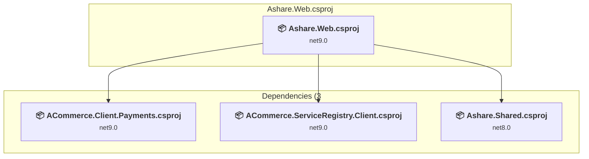

### API Compatibility

| Category | Count | Impact |
| :--- | :---: | :--- |
| 🔴 Binary Incompatible | 0 | High - Require code changes |
| 🟡 Source Incompatible | 0 | Medium - Needs re-compilation and potential conflicting API error fixing |
| 🔵 Behavioral change | 0 | Low - Behavioral changes that may require testing at runtime |
| ✅ Compatible | 0 |  |
| ***Total APIs Analyzed*** | ***0*** |  |

<a id="appsrukkabdriverdriverwebdriverwebcsproj"></a>
### Apps\Rukkab\Driver\Driver.Web\Driver.Web.csproj

#### Project Info

- **Current Target Framework:** net9.0✅
- **SDK-style**: True
- **Project Kind:** AspNetCore
- **Dependencies**: 1
- **Dependants**: 0
- **Number of Files**: 0
- **Lines of Code**: 0
- **Estimated LOC to modify**: 0+ (at least 0.0% of the project)

#### Dependency Graph

Legend:
📦 SDK-style project
⚙️ Classic project

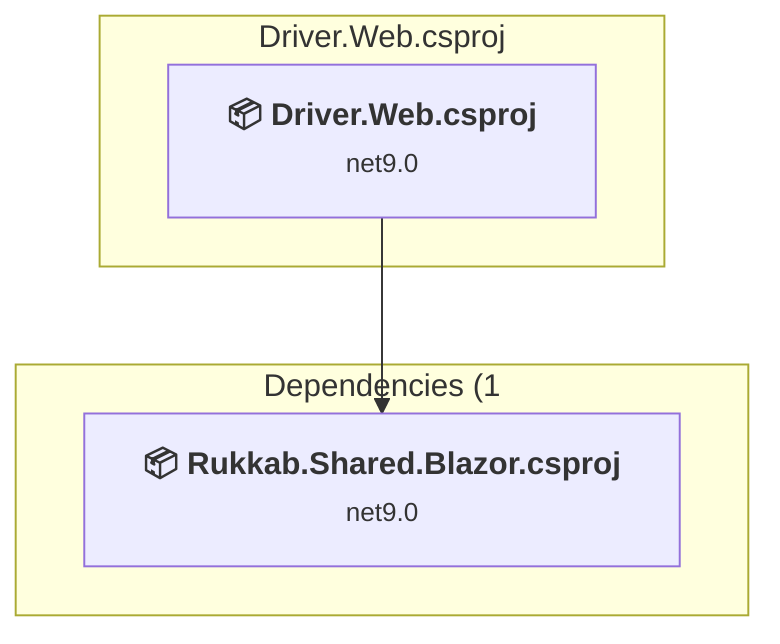

### API Compatibility

| Category | Count | Impact |
| :--- | :---: | :--- |
| 🔴 Binary Incompatible | 0 | High - Require code changes |
| 🟡 Source Incompatible | 0 | Medium - Needs re-compilation and potential conflicting API error fixing |
| 🔵 Behavioral change | 0 | Low - Behavioral changes that may require testing at runtime |
| ✅ Compatible | 0 |  |
| ***Total APIs Analyzed*** | ***0*** |  |

<a id="appsrukkabriderriderwebriderwebcsproj"></a>
### Apps\Rukkab\Rider\Rider.Web\Rider.Web.csproj

#### Project Info

- **Current Target Framework:** net9.0✅
- **SDK-style**: True
- **Project Kind:** AspNetCore
- **Dependencies**: 1
- **Dependants**: 0
- **Number of Files**: 0
- **Lines of Code**: 0
- **Estimated LOC to modify**: 0+ (at least 0.0% of the project)

#### Dependency Graph

Legend:
📦 SDK-style project
⚙️ Classic project

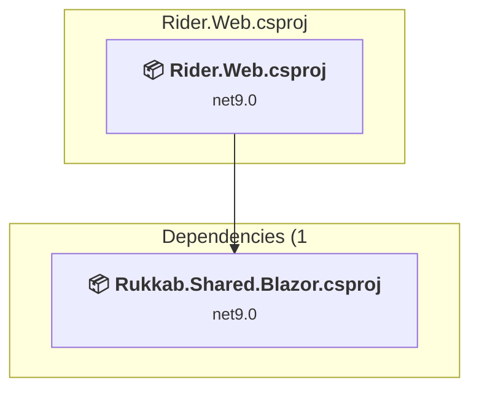

### API Compatibility

| Category | Count | Impact |
| :--- | :---: | :--- |
| 🔴 Binary Incompatible | 0 | High - Require code changes |
| 🟡 Source Incompatible | 0 | Medium - Needs re-compilation and potential conflicting API error fixing |
| 🔵 Behavioral change | 0 | Low - Behavioral changes that may require testing at runtime |
| ✅ Compatible | 0 |  |
| ***Total APIs Analyzed*** | ***0*** |  |

<a id="appsrukkabsharedrukkabsharedblazorrukkabsharedblazorcsproj"></a>
### Apps\Rukkab\Shared\Rukkab.Shared.Blazor\Rukkab.Shared.Blazor.csproj

#### Project Info

- **Current Target Framework:** net9.0✅
- **SDK-style**: True
- **Project Kind:** ClassLibrary
- **Dependencies**: 0
- **Dependants**: 2
- **Number of Files**: 4
- **Lines of Code**: 0
- **Estimated LOC to modify**: 0+ (at least 0.0% of the project)

#### Dependency Graph

Legend:
📦 SDK-style project
⚙️ Classic project

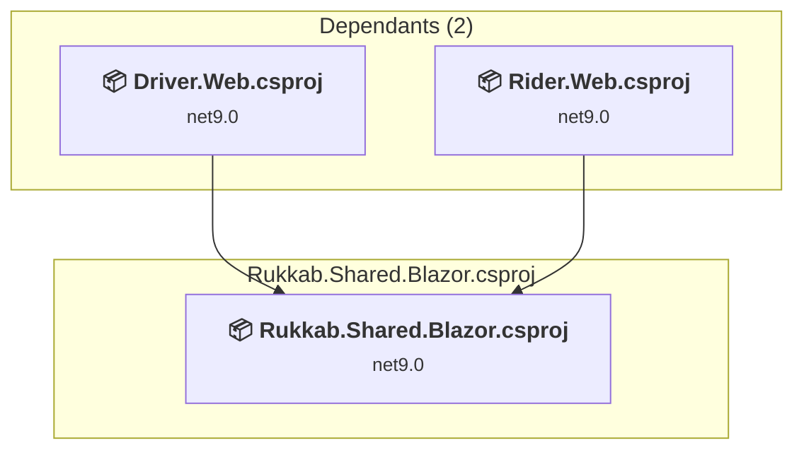

### API Compatibility

| Category | Count | Impact |
| :--- | :---: | :--- |
| 🔴 Binary Incompatible | 0 | High - Require code changes |
| 🟡 Source Incompatible | 0 | Medium - Needs re-compilation and potential conflicting API error fixing |
| 🔵 Behavioral change | 0 | Low - Behavioral changes that may require testing at runtime |
| ✅ Compatible | 0 |  |
| ***Total APIs Analyzed*** | ***0*** |  |

<a id="appsrukkabsharedrukkabsharedcustomerrukkabsharedcustomercsproj"></a>
### Apps\Rukkab\Shared\Rukkab.Shared.Customer\Rukkab.Shared.Customer.csproj

#### Project Info

- **Current Target Framework:** net9.0✅
- **SDK-style**: True
- **Project Kind:** ClassLibrary
- **Dependencies**: 1
- **Dependants**: 1
- **Number of Files**: 1
- **Lines of Code**: 0
- **Estimated LOC to modify**: 0+ (at least 0.0% of the project)

#### Dependency Graph

Legend:
📦 SDK-style project
⚙️ Classic project

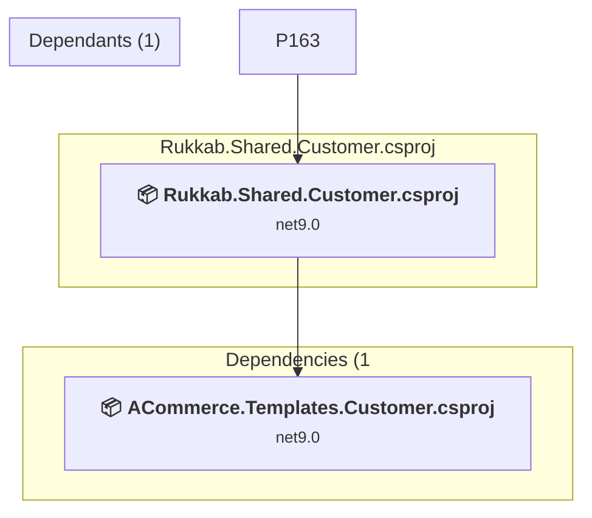

### API Compatibility

| Category | Count | Impact |
| :--- | :---: | :--- |
| 🔴 Binary Incompatible | 0 | High - Require code changes |
| 🟡 Source Incompatible | 0 | Medium - Needs re-compilation and potential conflicting API error fixing |
| 🔵 Behavioral change | 0 | Low - Behavioral changes that may require testing at runtime |
| ✅ Compatible | 0 |  |
| ***Total APIs Analyzed*** | ***0*** |  |

<a id="appsrukkabsharedrukkabshareddriverrukkabshareddrivercsproj"></a>
### Apps\Rukkab\Shared\Rukkab.Shared.Driver\Rukkab.Shared.Driver.csproj

#### Project Info

- **Current Target Framework:** net9.0✅
- **SDK-style**: True
- **Project Kind:** ClassLibrary
- **Dependencies**: 1
- **Dependants**: 1
- **Number of Files**: 1
- **Lines of Code**: 0
- **Estimated LOC to modify**: 0+ (at least 0.0% of the project)

#### Dependency Graph

Legend:
📦 SDK-style project
⚙️ Classic project

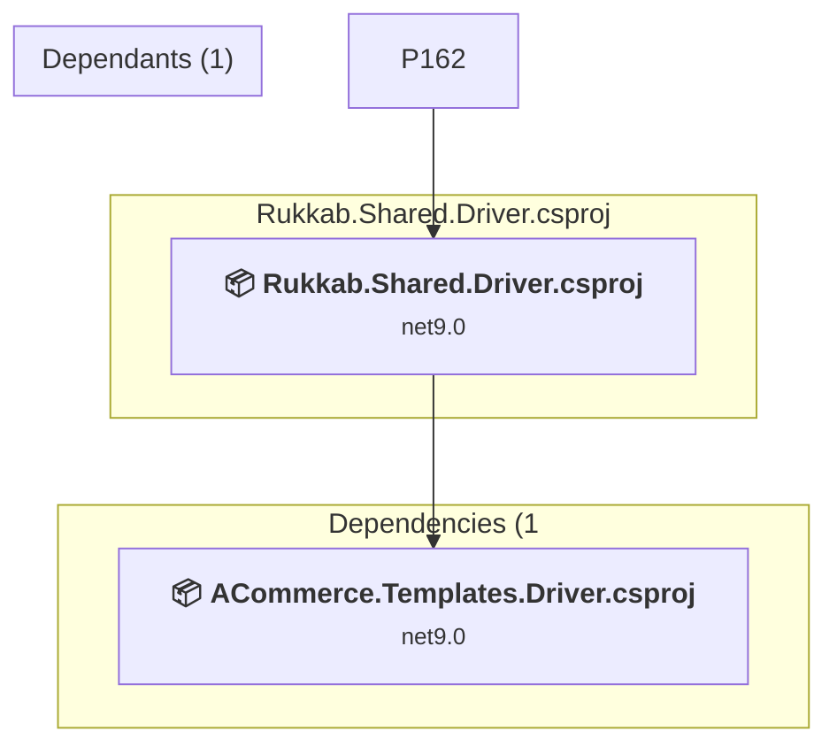

### API Compatibility

| Category | Count | Impact |
| :--- | :---: | :--- |
| 🔴 Binary Incompatible | 0 | High - Require code changes |
| 🟡 Source Incompatible | 0 | Medium - Needs re-compilation and potential conflicting API error fixing |
| 🔵 Behavioral change | 0 | Low - Behavioral changes that may require testing at runtime |
| ✅ Compatible | 0 |  |
| ***Total APIs Analyzed*** | ***0*** |  |

<a id="libsbackendadminacommerceadminauditlogapiacommerceadminauditlogapicsproj"></a>
### libs\backend\admin\ACommerce.Admin.AuditLog.Api\ACommerce.Admin.AuditLog.Api.csproj

#### Project Info

- **Current Target Framework:** net9.0✅
- **SDK-style**: True
- **Project Kind:** ClassLibrary
- **Dependencies**: 1
- **Dependants**: 1
- **Number of Files**: 1
- **Lines of Code**: 56
- **Estimated LOC to modify**: 0+ (at least 0.0% of the project)

#### Dependency Graph

Legend:
📦 SDK-style project
⚙️ Classic project

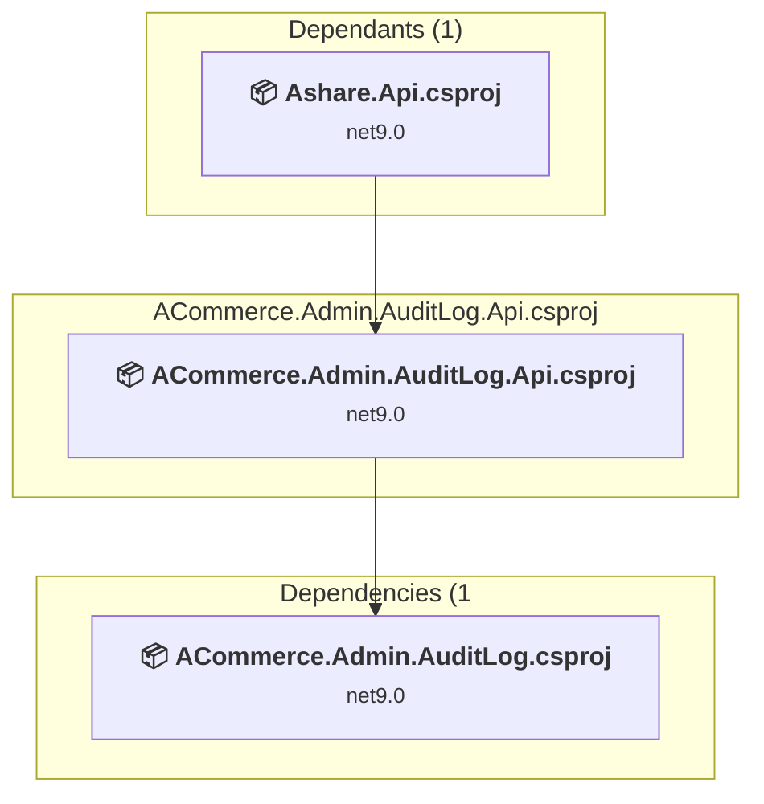

### API Compatibility

| Category | Count | Impact |
| :--- | :---: | :--- |
| 🔴 Binary Incompatible | 0 | High - Require code changes |
| 🟡 Source Incompatible | 0 | Medium - Needs re-compilation and potential conflicting API error fixing |
| 🔵 Behavioral change | 0 | Low - Behavioral changes that may require testing at runtime |
| ✅ Compatible | 0 |  |
| ***Total APIs Analyzed*** | ***0*** |  |

<a id="libsbackendadminacommerceadminauditlogacommerceadminauditlogcsproj"></a>
### libs\backend\admin\ACommerce.Admin.AuditLog\ACommerce.Admin.AuditLog.csproj

#### Project Info

- **Current Target Framework:** net9.0✅
- **SDK-style**: True
- **Project Kind:** ClassLibrary
- **Dependencies**: 1
- **Dependants**: 1
- **Number of Files**: 5
- **Lines of Code**: 243
- **Estimated LOC to modify**: 0+ (at least 0.0% of the project)

#### Dependency Graph

Legend:
📦 SDK-style project
⚙️ Classic project

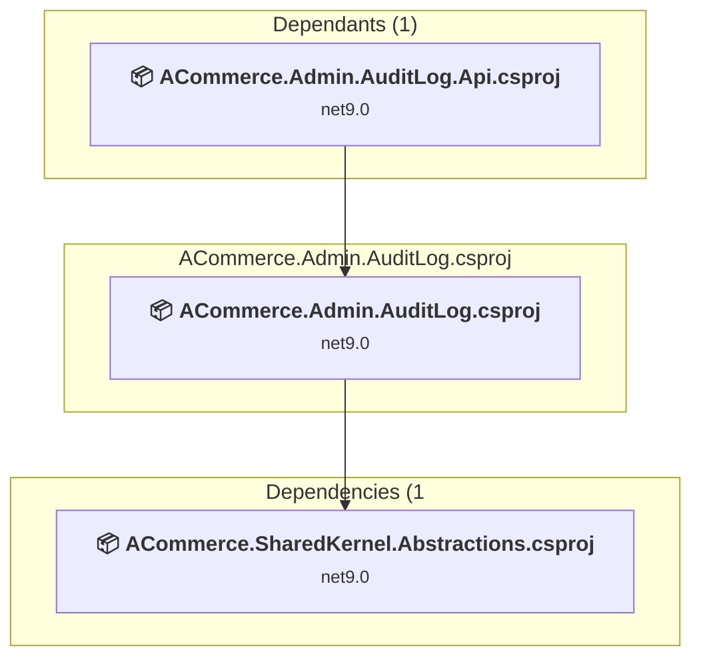

### API Compatibility

| Category | Count | Impact |
| :--- | :---: | :--- |
| 🔴 Binary Incompatible | 0 | High - Require code changes |
| 🟡 Source Incompatible | 0 | Medium - Needs re-compilation and potential conflicting API error fixing |
| 🔵 Behavioral change | 0 | Low - Behavioral changes that may require testing at runtime |
| ✅ Compatible | 0 |  |
| ***Total APIs Analyzed*** | ***0*** |  |

<a id="libsbackendadminacommerceadminauthorizationacommerceadminauthorizationcsproj"></a>
### libs\backend\admin\ACommerce.Admin.Authorization\ACommerce.Admin.Authorization.csproj

#### Project Info

- **Current Target Framework:** net9.0✅
- **SDK-style**: True
- **Project Kind:** ClassLibrary
- **Dependencies**: 0
- **Dependants**: 0
- **Number of Files**: 14
- **Lines of Code**: 766
- **Estimated LOC to modify**: 0+ (at least 0.0% of the project)

#### Dependency Graph

Legend:
📦 SDK-style project
⚙️ Classic project

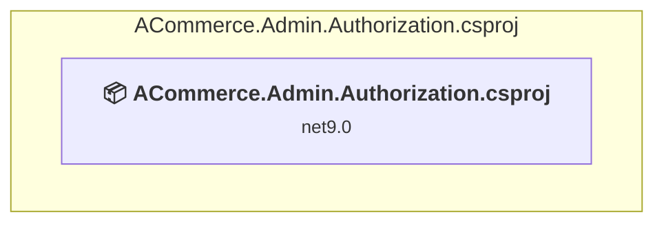

### API Compatibility

| Category | Count | Impact |
| :--- | :---: | :--- |
| 🔴 Binary Incompatible | 0 | High - Require code changes |
| 🟡 Source Incompatible | 0 | Medium - Needs re-compilation and potential conflicting API error fixing |
| 🔵 Behavioral change | 0 | Low - Behavioral changes that may require testing at runtime |
| ✅ Compatible | 0 |  |
| ***Total APIs Analyzed*** | ***0*** |  |

<a id="libsbackendadminacommerceadmindashboardapiacommerceadmindashboardapicsproj"></a>
### libs\backend\admin\ACommerce.Admin.Dashboard.Api\ACommerce.Admin.Dashboard.Api.csproj

#### Project Info

- **Current Target Framework:** net9.0✅
- **SDK-style**: True
- **Project Kind:** ClassLibrary
- **Dependencies**: 1
- **Dependants**: 1
- **Number of Files**: 1
- **Lines of Code**: 41
- **Estimated LOC to modify**: 0+ (at least 0.0% of the project)

#### Dependency Graph

Legend:
📦 SDK-style project
⚙️ Classic project

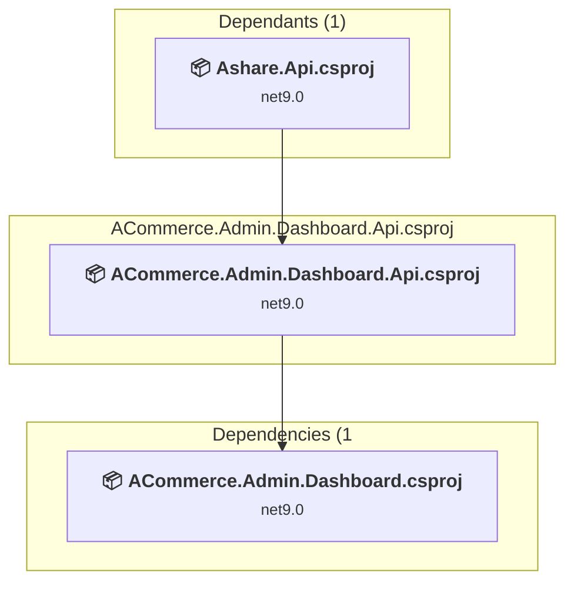

### API Compatibility

| Category | Count | Impact |
| :--- | :---: | :--- |
| 🔴 Binary Incompatible | 0 | High - Require code changes |
| 🟡 Source Incompatible | 0 | Medium - Needs re-compilation and potential conflicting API error fixing |
| 🔵 Behavioral change | 0 | Low - Behavioral changes that may require testing at runtime |
| ✅ Compatible | 0 |  |
| ***Total APIs Analyzed*** | ***0*** |  |

<a id="libsbackendadminacommerceadmindashboardacommerceadmindashboardcsproj"></a>
### libs\backend\admin\ACommerce.Admin.Dashboard\ACommerce.Admin.Dashboard.csproj

#### Project Info

- **Current Target Framework:** net9.0✅
- **SDK-style**: True
- **Project Kind:** ClassLibrary
- **Dependencies**: 5
- **Dependants**: 1
- **Number of Files**: 5
- **Lines of Code**: 226
- **Estimated LOC to modify**: 0+ (at least 0.0% of the project)

#### Dependency Graph

Legend:
📦 SDK-style project
⚙️ Classic project

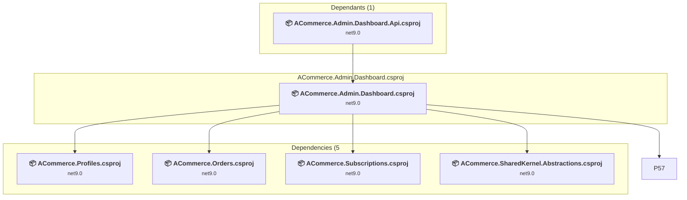

### API Compatibility

| Category | Count | Impact |
| :--- | :---: | :--- |
| 🔴 Binary Incompatible | 0 | High - Require code changes |
| 🟡 Source Incompatible | 0 | Medium - Needs re-compilation and potential conflicting API error fixing |
| 🔵 Behavioral change | 0 | Low - Behavioral changes that may require testing at runtime |
| ✅ Compatible | 0 |  |
| ***Total APIs Analyzed*** | ***0*** |  |

<a id="libsbackendadminacommerceadminlistingsapiacommerceadminlistingsapicsproj"></a>
### libs\backend\admin\ACommerce.Admin.Listings.Api\ACommerce.Admin.Listings.Api.csproj

#### Project Info

- **Current Target Framework:** net9.0✅
- **SDK-style**: True
- **Project Kind:** ClassLibrary
- **Dependencies**: 1
- **Dependants**: 1
- **Number of Files**: 1
- **Lines of Code**: 58
- **Estimated LOC to modify**: 0+ (at least 0.0% of the project)

#### Dependency Graph

Legend:
📦 SDK-style project
⚙️ Classic project


### API Compatibility

| Category | Count | Impact |
| :--- | :---: | :--- |
| 🔴 Binary Incompatible | 0 | High - Require code changes |
| 🟡 Source Incompatible | 0 | Medium - Needs re-compilation and potential conflicting API error fixing |
| 🔵 Behavioral change | 0 | Low - Behavioral changes that may require testing at runtime |
| ✅ Compatible | 0 |  |
| ***Total APIs Analyzed*** | ***0*** |  |

<a id="libsbackendadminacommerceadminlistingsacommerceadminlistingscsproj"></a>
### libs\backend\admin\ACommerce.Admin.Listings\ACommerce.Admin.Listings.csproj

#### Project Info

- **Current Target Framework:** net9.0✅
- **SDK-style**: True
- **Project Kind:** ClassLibrary
- **Dependencies**: 2
- **Dependants**: 1
- **Number of Files**: 3
- **Lines of Code**: 147
- **Estimated LOC to modify**: 0+ (at least 0.0% of the project)

#### Dependency Graph

Legend:
📦 SDK-style project
⚙️ Classic project

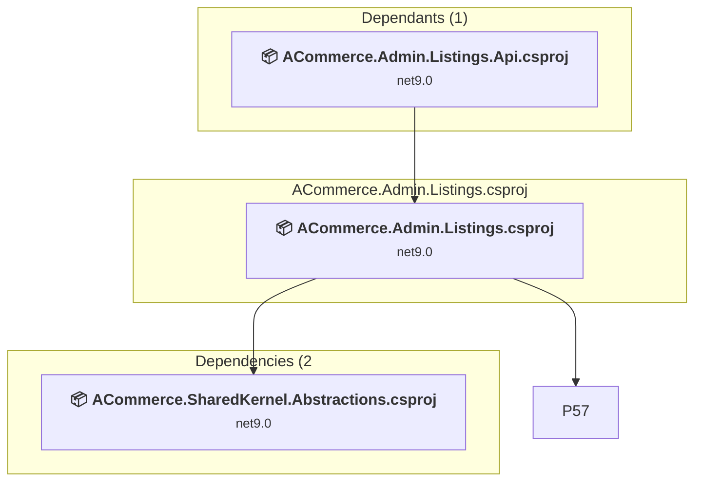

### API Compatibility

| Category | Count | Impact |
| :--- | :---: | :--- |
| 🔴 Binary Incompatible | 0 | High - Require code changes |
| 🟡 Source Incompatible | 0 | Medium - Needs re-compilation and potential conflicting API error fixing |
| 🔵 Behavioral change | 0 | Low - Behavioral changes that may require testing at runtime |
| ✅ Compatible | 0 |  |
| ***Total APIs Analyzed*** | ***0*** |  |

<a id="libsbackendadminacommerceadminordersapiacommerceadminordersapicsproj"></a>
### libs\backend\admin\ACommerce.Admin.Orders.Api\ACommerce.Admin.Orders.Api.csproj

#### Project Info

- **Current Target Framework:** net9.0✅
- **SDK-style**: True
- **Project Kind:** ClassLibrary
- **Dependencies**: 1
- **Dependants**: 1
- **Number of Files**: 1
- **Lines of Code**: 57
- **Estimated LOC to modify**: 0+ (at least 0.0% of the project)

#### Dependency Graph

Legend:
📦 SDK-style project
⚙️ Classic project

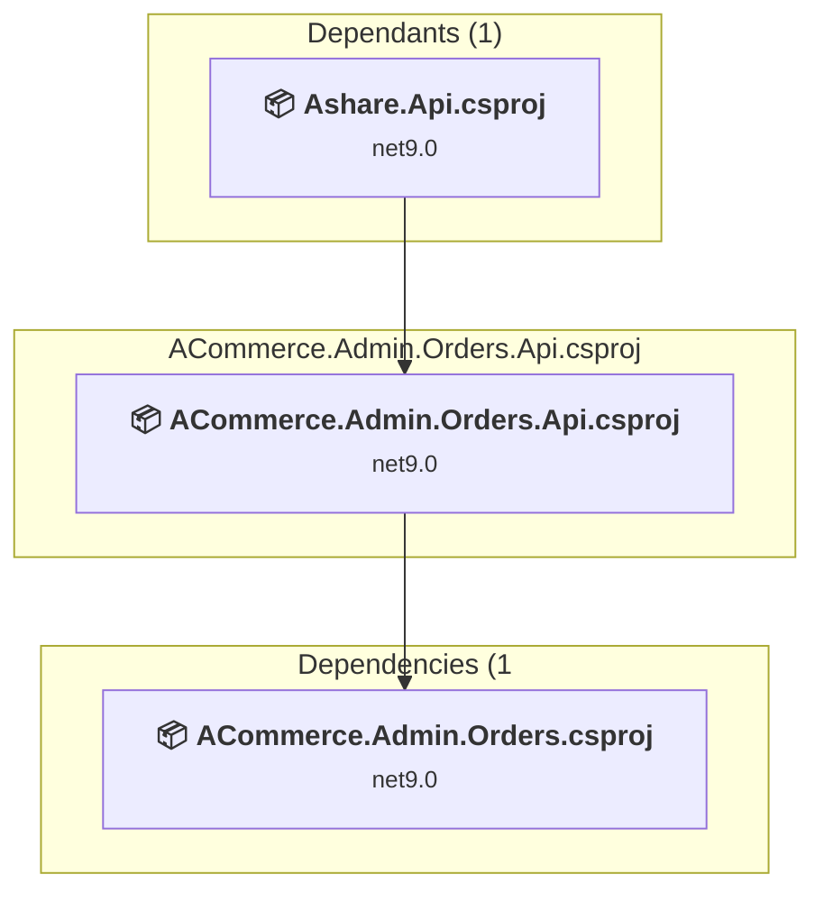

### API Compatibility

| Category | Count | Impact |
| :--- | :---: | :--- |
| 🔴 Binary Incompatible | 0 | High - Require code changes |
| 🟡 Source Incompatible | 0 | Medium - Needs re-compilation and potential conflicting API error fixing |
| 🔵 Behavioral change | 0 | Low - Behavioral changes that may require testing at runtime |
| ✅ Compatible | 0 |  |
| ***Total APIs Analyzed*** | ***0*** |  |

<a id="libsbackendadminacommerceadminordersacommerceadminorderscsproj"></a>
### libs\backend\admin\ACommerce.Admin.Orders\ACommerce.Admin.Orders.csproj

#### Project Info

- **Current Target Framework:** net9.0✅
- **SDK-style**: True
- **Project Kind:** ClassLibrary
- **Dependencies**: 2
- **Dependants**: 1
- **Number of Files**: 3
- **Lines of Code**: 145
- **Estimated LOC to modify**: 0+ (at least 0.0% of the project)

#### Dependency Graph

Legend:
📦 SDK-style project
⚙️ Classic project

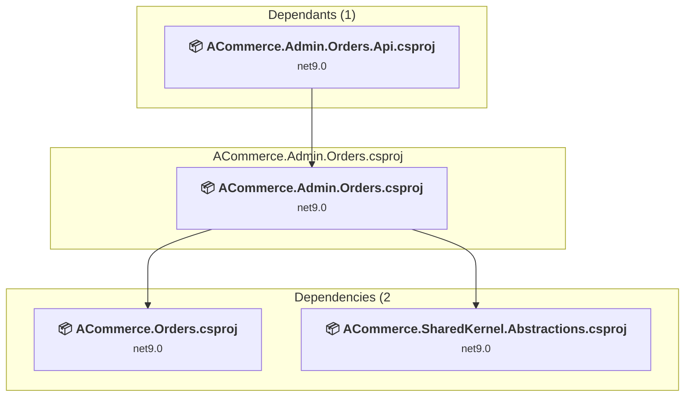

### API Compatibility

| Category | Count | Impact |
| :--- | :---: | :--- |
| 🔴 Binary Incompatible | 0 | High - Require code changes |
| 🟡 Source Incompatible | 0 | Medium - Needs re-compilation and potential conflicting API error fixing |
| 🔵 Behavioral change | 0 | Low - Behavioral changes that may require testing at runtime |
| ✅ Compatible | 0 |  |
| ***Total APIs Analyzed*** | ***0*** |  |

<a id="libsbackendadminacommerceadminreportsapiacommerceadminreportsapicsproj"></a>
### libs\backend\admin\ACommerce.Admin.Reports.Api\ACommerce.Admin.Reports.Api.csproj

#### Project Info

- **Current Target Framework:** net9.0✅
- **SDK-style**: True
- **Project Kind:** ClassLibrary
- **Dependencies**: 1
- **Dependants**: 1
- **Number of Files**: 1
- **Lines of Code**: 48
- **Estimated LOC to modify**: 0+ (at least 0.0% of the project)

#### Dependency Graph

Legend:
📦 SDK-style project
⚙️ Classic project

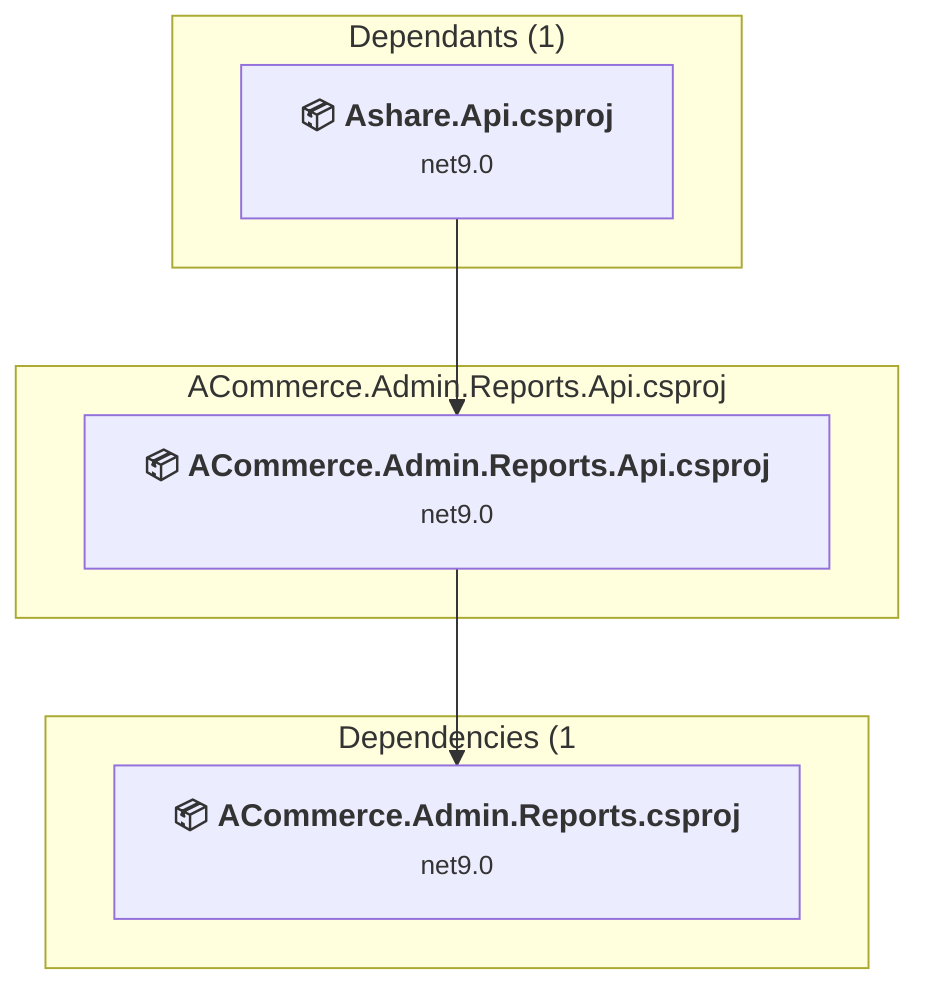

### API Compatibility

| Category | Count | Impact |
| :--- | :---: | :--- |
| 🔴 Binary Incompatible | 0 | High - Require code changes |
| 🟡 Source Incompatible | 0 | Medium - Needs re-compilation and potential conflicting API error fixing |
| 🔵 Behavioral change | 0 | Low - Behavioral changes that may require testing at runtime |
| ✅ Compatible | 0 |  |
| ***Total APIs Analyzed*** | ***0*** |  |

<a id="libsbackendadminacommerceadminreportsacommerceadminreportscsproj"></a>
### libs\backend\admin\ACommerce.Admin.Reports\ACommerce.Admin.Reports.csproj

#### Project Info

- **Current Target Framework:** net9.0✅
- **SDK-style**: True
- **Project Kind:** ClassLibrary
- **Dependencies**: 5
- **Dependants**: 1
- **Number of Files**: 5
- **Lines of Code**: 293
- **Estimated LOC to modify**: 0+ (at least 0.0% of the project)

#### Dependency Graph

Legend:
📦 SDK-style project
⚙️ Classic project

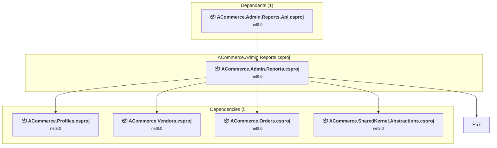

### API Compatibility

| Category | Count | Impact |
| :--- | :---: | :--- |
| 🔴 Binary Incompatible | 0 | High - Require code changes |
| 🟡 Source Incompatible | 0 | Medium - Needs re-compilation and potential conflicting API error fixing |
| 🔵 Behavioral change | 0 | Low - Behavioral changes that may require testing at runtime |
| ✅ Compatible | 0 |  |
| ***Total APIs Analyzed*** | ***0*** |  |

<a id="libsbackendauthacommerceauthenticationabstractionsacommerceauthenticationabstractionscsproj"></a>
### libs\backend\auth\ACommerce.Authentication.Abstractions\ACommerce.Authentication.Abstractions.csproj

#### Project Info

- **Current Target Framework:** net9.0✅
- **SDK-style**: True
- **Project Kind:** ClassLibrary
- **Dependencies**: 1
- **Dependants**: 4
- **Number of Files**: 22
- **Lines of Code**: 374
- **Estimated LOC to modify**: 0+ (at least 0.0% of the project)

#### Dependency Graph

Legend:
📦 SDK-style project
⚙️ Classic project

```mermaid
flowchart TB
    subgraph upstream["Dependants (4)"]
        P1["<b>📦&nbsp;ACommerce.Authentication.AspNetCore.csproj</b><br/><small>net9.0</small>"]
        P3["<b>📦&nbsp;ACommerce.Authentication.AspNetCore.Swagger.csproj</b><br/><small>net9.0</small>"]
        P6["<b>📦&nbsp;ACommerce.Authentication.JWT.csproj</b><br/><small>net9.0</small>"]
        P10["<b>📦&nbsp;ACommerce.Authentication.TwoFactor.Abstractions.csproj</b><br/><small>net9.0</small>"]
        click P1 "#libsbackendintegrationacommerceauthenticationaspnetcoreacommerceauthenticationaspnetcorecsproj"
        click P3 "#libsbackendintegrationacommerceauthenticationaspnetcoreswaggeracommerceauthenticationaspnetcoreswaggercsproj"
        click P6 "#libsbackendauthacommerceauthenticationjwtacommerceauthenticationjwtcsproj"
        click P10 "#libsbackendauthacommerceauthenticationtwofactorabstractionsacommerceauthenticationtwofactorabstractionscsproj"
    end
    subgraph current["ACommerce.Authentication.Abstractions.csproj"]
        MAIN["<b>📦&nbsp;ACommerce.Authentication.Abstractions.csproj</b><br/><small>net9.0</small>"]
        click MAIN "#libsbackendauthacommerceauthenticationabstractionsacommerceauthenticationabstractionscsproj"
    end
    subgraph downstream["Dependencies (1"]
        P42["<b>📦&nbsp;ACommerce.SharedKernel.Abstractions.csproj</b><br/><small>net9.0</small>"]
        click P42 "#libsbackendcoreacommercesharedkernelabstractionsacommercesharedkernelabstractionscsproj"
    end
    P1 --> MAIN
    P3 --> MAIN
    P6 --> MAIN
    P10 --> MAIN
    MAIN --> P42

```

### API Compatibility

| Category | Count | Impact |
| :--- | :---: | :--- |
| 🔴 Binary Incompatible | 0 | High - Require code changes |
| 🟡 Source Incompatible | 0 | Medium - Needs re-compilation and potential conflicting API error fixing |
| 🔵 Behavioral change | 0 | Low - Behavioral changes that may require testing at runtime |
| ✅ Compatible | 0 |  |
| ***Total APIs Analyzed*** | ***0*** |  |

<a id="libsbackendauthacommerceauthenticationjwtacommerceauthenticationjwtcsproj"></a>
### libs\backend\auth\ACommerce.Authentication.JWT\ACommerce.Authentication.JWT.csproj

#### Project Info

- **Current Target Framework:** net9.0✅
- **SDK-style**: True
- **Project Kind:** ClassLibrary
- **Dependencies**: 2
- **Dependants**: 6
- **Number of Files**: 5
- **Lines of Code**: 1037
- **Estimated LOC to modify**: 0+ (at least 0.0% of the project)

#### Dependency Graph

Legend:
📦 SDK-style project
⚙️ Classic project

```mermaid
flowchart TB
    subgraph upstream["Dependants (6)"]
        P101["<b>📦&nbsp;Ashare.Api.csproj</b><br/><small>net9.0</small>"]
        click P101 "#appsashareapiashareapicsproj"
    end
    subgraph current["ACommerce.Authentication.JWT.csproj"]
        MAIN["<b>📦&nbsp;ACommerce.Authentication.JWT.csproj</b><br/><small>net9.0</small>"]
        click MAIN "#libsbackendauthacommerceauthenticationjwtacommerceauthenticationjwtcsproj"
    end
    subgraph downstream["Dependencies (2"]
        P5["<b>📦&nbsp;ACommerce.Authentication.Abstractions.csproj</b><br/><small>net9.0</small>"]
        P7["<b>📦&nbsp;ACommerce.Authentication.Users.Abstractions.csproj</b><br/><small>net9.0</small>"]
        click P5 "#libsbackendauthacommerceauthenticationabstractionsacommerceauthenticationabstractionscsproj"
        click P7 "#libsbackendauthacommerceauthenticationusersabstractionsacommerceauthenticationusersabstractionscsproj"
    end
    P72 --> MAIN
    P101 --> MAIN
    P102 --> MAIN
    P144 --> MAIN
    P155 --> MAIN
    P159 --> MAIN
    MAIN --> P5
    MAIN --> P7

```

### API Compatibility

| Category | Count | Impact |
| :--- | :---: | :--- |
| 🔴 Binary Incompatible | 0 | High - Require code changes |
| 🟡 Source Incompatible | 0 | Medium - Needs re-compilation and potential conflicting API error fixing |
| 🔵 Behavioral change | 0 | Low - Behavioral changes that may require testing at runtime |
| ✅ Compatible | 0 |  |
| ***Total APIs Analyzed*** | ***0*** |  |

<a id="libsbackendauthacommerceauthenticationmicrosoftidentityacommerceauthenticationmicrosoftidentitycsproj"></a>
### libs\backend\auth\ACommerce.Authentication.MicrosoftIdentity\ACommerce.Authentication.MicrosoftIdentity.csproj

#### Project Info

- **Current Target Framework:** net9.0✅
- **SDK-style**: True
- **Project Kind:** ClassLibrary
- **Dependencies**: 0
- **Dependants**: 0
- **Number of Files**: 0
- **Lines of Code**: 0
- **Estimated LOC to modify**: 0+ (at least 0.0% of the project)

#### Dependency Graph

Legend:
📦 SDK-style project
⚙️ Classic project

```mermaid
flowchart TB
    subgraph current["ACommerce.Authentication.MicrosoftIdentity.csproj"]
        MAIN["<b>📦&nbsp;ACommerce.Authentication.MicrosoftIdentity.csproj</b><br/><small>net9.0</small>"]
        click MAIN "#libsbackendauthacommerceauthenticationmicrosoftidentityacommerceauthenticationmicrosoftidentitycsproj"
    end

```

### API Compatibility

| Category | Count | Impact |
| :--- | :---: | :--- |
| 🔴 Binary Incompatible | 0 | High - Require code changes |
| 🟡 Source Incompatible | 0 | Medium - Needs re-compilation and potential conflicting API error fixing |
| 🔵 Behavioral change | 0 | Low - Behavioral changes that may require testing at runtime |
| ✅ Compatible | 0 |  |
| ***Total APIs Analyzed*** | ***0*** |  |

<a id="libsbackendauthacommerceauthenticationopeniddictacommerceauthenticationopeniddictcsproj"></a>
### libs\backend\auth\ACommerce.Authentication.OpenIddict\ACommerce.Authentication.OpenIddict.csproj

#### Project Info

- **Current Target Framework:** net9.0✅
- **SDK-style**: True
- **Project Kind:** ClassLibrary
- **Dependencies**: 0
- **Dependants**: 0
- **Number of Files**: 0
- **Lines of Code**: 0
- **Estimated LOC to modify**: 0+ (at least 0.0% of the project)

#### Dependency Graph

Legend:
📦 SDK-style project
⚙️ Classic project

```mermaid
flowchart TB
    subgraph current["ACommerce.Authentication.OpenIddict.csproj"]
        MAIN["<b>📦&nbsp;ACommerce.Authentication.OpenIddict.csproj</b><br/><small>net9.0</small>"]
        click MAIN "#libsbackendauthacommerceauthenticationopeniddictacommerceauthenticationopeniddictcsproj"
    end

```

### API Compatibility

| Category | Count | Impact |
| :--- | :---: | :--- |
| 🔴 Binary Incompatible | 0 | High - Require code changes |
| 🟡 Source Incompatible | 0 | Medium - Needs re-compilation and potential conflicting API error fixing |
| 🔵 Behavioral change | 0 | Low - Behavioral changes that may require testing at runtime |
| ✅ Compatible | 0 |  |
| ***Total APIs Analyzed*** | ***0*** |  |

<a id="libsbackendauthacommerceauthenticationtwofactorabstractionsacommerceauthenticationtwofactorabstractionscsproj"></a>
### libs\backend\auth\ACommerce.Authentication.TwoFactor.Abstractions\ACommerce.Authentication.TwoFactor.Abstractions.csproj

#### Project Info

- **Current Target Framework:** net9.0✅
- **SDK-style**: True
- **Project Kind:** ClassLibrary
- **Dependencies**: 1
- **Dependants**: 6
- **Number of Files**: 5
- **Lines of Code**: 102
- **Estimated LOC to modify**: 0+ (at least 0.0% of the project)

#### Dependency Graph

Legend:
📦 SDK-style project
⚙️ Classic project

```mermaid
flowchart TB
    subgraph upstream["Dependants (6)"]
        P12["<b>📦&nbsp;ACommerce.Authentication.TwoFactor.Nafath.csproj</b><br/><small>net9.0</small>"]
        P49["<b>📦&nbsp;ACommerce.Authentication.Messaging.csproj</b><br/><small>net9.0</small>"]
        P51["<b>📦&nbsp;ACommerce.Authentication.TwoFactor.SessionStore.InMemory.csproj</b><br/><small>net9.0</small>"]
        P135["<b>📦&nbsp;ACommerce.Authentication.TwoFactor.SessionStore.Redis.csproj</b><br/><small>net9.0</small>"]
        click P12 "#libsbackendauthacommerceauthenticationtwofactornafathacommerceauthenticationtwofactornafathcsproj"
        click P49 "#libsbackendmessagingacommerceauthenticationmessagingacommerceauthenticationmessagingcsproj"
        click P51 "#libsbackendauthacommerceauthenticationtwofactorsessionstoreinmemoryacommerceauthenticationtwofactorsessionstoreinmemorycsproj"
        click P135 "#libsbackendauthacommerceauthenticationtwofactorsessionstoreredisacommerceauthenticationtwofactorsessionstorerediscsproj"
    end
    subgraph current["ACommerce.Authentication.TwoFactor.Abstractions.csproj"]
        MAIN["<b>📦&nbsp;ACommerce.Authentication.TwoFactor.Abstractions.csproj</b><br/><small>net9.0</small>"]
        click MAIN "#libsbackendauthacommerceauthenticationtwofactorabstractionsacommerceauthenticationtwofactorabstractionscsproj"
    end
    subgraph downstream["Dependencies (1"]
        P5["<b>📦&nbsp;ACommerce.Authentication.Abstractions.csproj</b><br/><small>net9.0</small>"]
        click P5 "#libsbackendauthacommerceauthenticationabstractionsacommerceauthenticationabstractionscsproj"
    end
    P12 --> MAIN
    P13 --> MAIN
    P49 --> MAIN
    P51 --> MAIN
    P52 --> MAIN
    P135 --> MAIN
    MAIN --> P5

```

### API Compatibility

| Category | Count | Impact |
| :--- | :---: | :--- |
| 🔴 Binary Incompatible | 0 | High - Require code changes |
| 🟡 Source Incompatible | 0 | Medium - Needs re-compilation and potential conflicting API error fixing |
| 🔵 Behavioral change | 0 | Low - Behavioral changes that may require testing at runtime |
| ✅ Compatible | 0 |  |
| ***Total APIs Analyzed*** | ***0*** |  |

<a id="libsbackendauthacommerceauthenticationtwofactoremailacommerceauthenticationtwofactoremailcsproj"></a>
### libs\backend\auth\ACommerce.Authentication.TwoFactor.Email\ACommerce.Authentication.TwoFactor.Email.csproj

#### Project Info

- **Current Target Framework:** net9.0✅
- **SDK-style**: True
- **Project Kind:** ClassLibrary
- **Dependencies**: 0
- **Dependants**: 0
- **Number of Files**: 0
- **Lines of Code**: 0
- **Estimated LOC to modify**: 0+ (at least 0.0% of the project)

#### Dependency Graph

Legend:
📦 SDK-style project
⚙️ Classic project

```mermaid
flowchart TB
    subgraph current["ACommerce.Authentication.TwoFactor.Email.csproj"]
        MAIN["<b>📦&nbsp;ACommerce.Authentication.TwoFactor.Email.csproj</b><br/><small>net9.0</small>"]
        click MAIN "#libsbackendauthacommerceauthenticationtwofactoremailacommerceauthenticationtwofactoremailcsproj"
    end

```

### API Compatibility

| Category | Count | Impact |
| :--- | :---: | :--- |
| 🔴 Binary Incompatible | 0 | High - Require code changes |
| 🟡 Source Incompatible | 0 | Medium - Needs re-compilation and potential conflicting API error fixing |
| 🔵 Behavioral change | 0 | Low - Behavioral changes that may require testing at runtime |
| ✅ Compatible | 0 |  |
| ***Total APIs Analyzed*** | ***0*** |  |

<a id="libsbackendauthacommerceauthenticationtwofactornafathacommerceauthenticationtwofactornafathcsproj"></a>
### libs\backend\auth\ACommerce.Authentication.TwoFactor.Nafath\ACommerce.Authentication.TwoFactor.Nafath.csproj

#### Project Info

- **Current Target Framework:** net9.0✅
- **SDK-style**: True
- **Project Kind:** ClassLibrary
- **Dependencies**: 3
- **Dependants**: 2
- **Number of Files**: 7
- **Lines of Code**: 669
- **Estimated LOC to modify**: 0+ (at least 0.0% of the project)

#### Dependency Graph

Legend:
📦 SDK-style project
⚙️ Classic project

```mermaid
flowchart TB
    subgraph upstream["Dependants (2)"]
        P2["<b>📦&nbsp;ACommerce.Authentication.AspNetCore.NafathWH.csproj</b><br/><small>net9.0</small>"]
        P101["<b>📦&nbsp;Ashare.Api.csproj</b><br/><small>net9.0</small>"]
        click P2 "#libsbackendintegrationacommerceauthenticationaspnetcorenafathwhacommerceauthenticationaspnetcorenafathwhcsproj"
        click P101 "#appsashareapiashareapicsproj"
    end
    subgraph current["ACommerce.Authentication.TwoFactor.Nafath.csproj"]
        MAIN["<b>📦&nbsp;ACommerce.Authentication.TwoFactor.Nafath.csproj</b><br/><small>net9.0</small>"]
        click MAIN "#libsbackendauthacommerceauthenticationtwofactornafathacommerceauthenticationtwofactornafathcsproj"
    end
    subgraph downstream["Dependencies (3"]
        P10["<b>📦&nbsp;ACommerce.Authentication.TwoFactor.Abstractions.csproj</b><br/><small>net9.0</small>"]
        P46["<b>📦&nbsp;ACommerce.Messaging.Abstractions.csproj</b><br/><small>net9.0</small>"]
        P45["<b>📦&nbsp;ACommerce.SharedKernel.AspNetCore.csproj</b><br/><small>net9.0</small>"]
        click P10 "#libsbackendauthacommerceauthenticationtwofactorabstractionsacommerceauthenticationtwofactorabstractionscsproj"
        click P46 "#libsbackendmessagingacommercemessagingabstractionsacommercemessagingabstractionscsproj"
        click P45 "#libsbackendintegrationacommercesharedkernelaspnetcoreacommercesharedkernelaspnetcorecsproj"
    end
    P2 --> MAIN
    P101 --> MAIN
    MAIN --> P10
    MAIN --> P46
    MAIN --> P45

```

### API Compatibility

| Category | Count | Impact |
| :--- | :---: | :--- |
| 🔴 Binary Incompatible | 0 | High - Require code changes |
| 🟡 Source Incompatible | 0 | Medium - Needs re-compilation and potential conflicting API error fixing |
| 🔵 Behavioral change | 0 | Low - Behavioral changes that may require testing at runtime |
| ✅ Compatible | 0 |  |
| ***Total APIs Analyzed*** | ***0*** |  |

<a id="libsbackendauthacommerceauthenticationtwofactorsessionstoreinmemoryacommerceauthenticationtwofactorsessionstoreinmemorycsproj"></a>
### libs\backend\auth\ACommerce.Authentication.TwoFactor.SessionStore.InMemory\ACommerce.Authentication.TwoFactor.SessionStore.InMemory.csproj

#### Project Info

- **Current Target Framework:** net9.0✅
- **SDK-style**: True
- **Project Kind:** ClassLibrary
- **Dependencies**: 1
- **Dependants**: 2
- **Number of Files**: 2
- **Lines of Code**: 142
- **Estimated LOC to modify**: 0+ (at least 0.0% of the project)

#### Dependency Graph

Legend:
📦 SDK-style project
⚙️ Classic project

```mermaid
flowchart TB
    subgraph upstream["Dependants (2)"]
        P101["<b>📦&nbsp;Ashare.Api.csproj</b><br/><small>net9.0</small>"]
        click P101 "#appsashareapiashareapicsproj"
    end
    subgraph current["ACommerce.Authentication.TwoFactor.SessionStore.InMemory.csproj"]
        MAIN["<b>📦&nbsp;ACommerce.Authentication.TwoFactor.SessionStore.InMemory.csproj</b><br/><small>net9.0</small>"]
        click MAIN "#libsbackendauthacommerceauthenticationtwofactorsessionstoreinmemoryacommerceauthenticationtwofactorsessionstoreinmemorycsproj"
    end
    subgraph downstream["Dependencies (1"]
        P10["<b>📦&nbsp;ACommerce.Authentication.TwoFactor.Abstractions.csproj</b><br/><small>net9.0</small>"]
        click P10 "#libsbackendauthacommerceauthenticationtwofactorabstractionsacommerceauthenticationtwofactorabstractionscsproj"
    end
    P101 --> MAIN
    P144 --> MAIN
    MAIN --> P10

```

### API Compatibility

| Category | Count | Impact |
| :--- | :---: | :--- |
| 🔴 Binary Incompatible | 0 | High - Require code changes |
| 🟡 Source Incompatible | 0 | Medium - Needs re-compilation and potential conflicting API error fixing |
| 🔵 Behavioral change | 0 | Low - Behavioral changes that may require testing at runtime |
| ✅ Compatible | 0 |  |
| ***Total APIs Analyzed*** | ***0*** |  |

<a id="libsbackendauthacommerceauthenticationtwofactorsessionstoreredisacommerceauthenticationtwofactorsessionstorerediscsproj"></a>
### libs\backend\auth\ACommerce.Authentication.TwoFactor.SessionStore.Redis\ACommerce.Authentication.TwoFactor.SessionStore.Redis.csproj

#### Project Info

- **Current Target Framework:** net9.0✅
- **SDK-style**: True
- **Project Kind:** ClassLibrary
- **Dependencies**: 1
- **Dependants**: 2
- **Number of Files**: 3
- **Lines of Code**: 197
- **Estimated LOC to modify**: 0+ (at least 0.0% of the project)

#### Dependency Graph

Legend:
📦 SDK-style project
⚙️ Classic project

```mermaid
flowchart TB
    subgraph upstream["Dependants (2)"]
        P101["<b>📦&nbsp;Ashare.Api.csproj</b><br/><small>net9.0</small>"]
        click P101 "#appsashareapiashareapicsproj"
    end
    subgraph current["ACommerce.Authentication.TwoFactor.SessionStore.Redis.csproj"]
        MAIN["<b>📦&nbsp;ACommerce.Authentication.TwoFactor.SessionStore.Redis.csproj</b><br/><small>net9.0</small>"]
        click MAIN "#libsbackendauthacommerceauthenticationtwofactorsessionstoreredisacommerceauthenticationtwofactorsessionstorerediscsproj"
    end
    subgraph downstream["Dependencies (1"]
        P10["<b>📦&nbsp;ACommerce.Authentication.TwoFactor.Abstractions.csproj</b><br/><small>net9.0</small>"]
        click P10 "#libsbackendauthacommerceauthenticationtwofactorabstractionsacommerceauthenticationtwofactorabstractionscsproj"
    end
    P101 --> MAIN
    P102 --> MAIN
    MAIN --> P10

```

### API Compatibility

| Category | Count | Impact |
| :--- | :---: | :--- |
| 🔴 Binary Incompatible | 0 | High - Require code changes |
| 🟡 Source Incompatible | 0 | Medium - Needs re-compilation and potential conflicting API error fixing |
| 🔵 Behavioral change | 0 | Low - Behavioral changes that may require testing at runtime |
| ✅ Compatible | 0 |  |
| ***Total APIs Analyzed*** | ***0*** |  |

<a id="libsbackendauthacommerceauthenticationusersabstractionsacommerceauthenticationusersabstractionscsproj"></a>
### libs\backend\auth\ACommerce.Authentication.Users.Abstractions\ACommerce.Authentication.Users.Abstractions.csproj

#### Project Info

- **Current Target Framework:** net9.0✅
- **SDK-style**: True
- **Project Kind:** ClassLibrary
- **Dependencies**: 0
- **Dependants**: 5
- **Number of Files**: 15
- **Lines of Code**: 383
- **Estimated LOC to modify**: 0+ (at least 0.0% of the project)

#### Dependency Graph

Legend:
📦 SDK-style project
⚙️ Classic project

```mermaid
flowchart TB
    subgraph upstream["Dependants (5)"]
        P1["<b>📦&nbsp;ACommerce.Authentication.AspNetCore.csproj</b><br/><small>net9.0</small>"]
        P6["<b>📦&nbsp;ACommerce.Authentication.JWT.csproj</b><br/><small>net9.0</small>"]
        P53["<b>📦&nbsp;ACommerce.Profiles.csproj</b><br/><small>net9.0</small>"]
        click P1 "#libsbackendintegrationacommerceauthenticationaspnetcoreacommerceauthenticationaspnetcorecsproj"
        click P6 "#libsbackendauthacommerceauthenticationjwtacommerceauthenticationjwtcsproj"
        click P53 "#libsbackendauthacommerceprofilesacommerceprofilescsproj"
    end
    subgraph current["ACommerce.Authentication.Users.Abstractions.csproj"]
        MAIN["<b>📦&nbsp;ACommerce.Authentication.Users.Abstractions.csproj</b><br/><small>net9.0</small>"]
        click MAIN "#libsbackendauthacommerceauthenticationusersabstractionsacommerceauthenticationusersabstractionscsproj"
    end
    P1 --> MAIN
    P6 --> MAIN
    P53 --> MAIN
    P155 --> MAIN
    P159 --> MAIN

```

### API Compatibility

| Category | Count | Impact |
| :--- | :---: | :--- |
| 🔴 Binary Incompatible | 0 | High - Require code changes |
| 🟡 Source Incompatible | 0 | Medium - Needs re-compilation and potential conflicting API error fixing |
| 🔵 Behavioral change | 0 | Low - Behavioral changes that may require testing at runtime |
| ✅ Compatible | 0 |  |
| ***Total APIs Analyzed*** | ***0*** |  |

<a id="libsbackendauthacommerceprofilesapiacommerceprofilesapicsproj"></a>
### libs\backend\auth\ACommerce.Profiles.Api\ACommerce.Profiles.Api.csproj

#### Project Info

- **Current Target Framework:** net9.0✅
- **SDK-style**: True
- **Project Kind:** ClassLibrary
- **Dependencies**: 3
- **Dependants**: 7
- **Number of Files**: 1
- **Lines of Code**: 172
- **Estimated LOC to modify**: 0+ (at least 0.0% of the project)

#### Dependency Graph

Legend:
📦 SDK-style project
⚙️ Classic project

```mermaid
flowchart TB
    subgraph upstream["Dependants (7)"]
        P101["<b>📦&nbsp;Ashare.Api.csproj</b><br/><small>net9.0</small>"]
        click P101 "#appsashareapiashareapicsproj"
    end
    subgraph current["ACommerce.Profiles.Api.csproj"]
        MAIN["<b>📦&nbsp;ACommerce.Profiles.Api.csproj</b><br/><small>net9.0</small>"]
        click MAIN "#libsbackendauthacommerceprofilesapiacommerceprofilesapicsproj"
    end
    subgraph downstream["Dependencies (3"]
        P53["<b>📦&nbsp;ACommerce.Profiles.csproj</b><br/><small>net9.0</small>"]
        P43["<b>📦&nbsp;ACommerce.SharedKernel.CQRS.csproj</b><br/><small>net9.0</small>"]
        P45["<b>📦&nbsp;ACommerce.SharedKernel.AspNetCore.csproj</b><br/><small>net9.0</small>"]
        click P53 "#libsbackendauthacommerceprofilesacommerceprofilescsproj"
        click P43 "#libsbackendcoreacommercesharedkernelcqrsacommercesharedkernelcqrscsproj"
        click P45 "#libsbackendintegrationacommercesharedkernelaspnetcoreacommercesharedkernelaspnetcorecsproj"
    end
    P71 --> MAIN
    P72 --> MAIN
    P101 --> MAIN
    P102 --> MAIN
    P144 --> MAIN
    P155 --> MAIN
    P159 --> MAIN
    MAIN --> P53
    MAIN --> P43
    MAIN --> P45

```

### API Compatibility

| Category | Count | Impact |
| :--- | :---: | :--- |
| 🔴 Binary Incompatible | 0 | High - Require code changes |
| 🟡 Source Incompatible | 0 | Medium - Needs re-compilation and potential conflicting API error fixing |
| 🔵 Behavioral change | 0 | Low - Behavioral changes that may require testing at runtime |
| ✅ Compatible | 0 |  |
| ***Total APIs Analyzed*** | ***0*** |  |

<a id="libsbackendauthacommerceprofilesacommerceprofilescsproj"></a>
### libs\backend\auth\ACommerce.Profiles\ACommerce.Profiles.csproj

#### Project Info

- **Current Target Framework:** net9.0✅
- **SDK-style**: True
- **Project Kind:** ClassLibrary
- **Dependencies**: 2
- **Dependants**: 10
- **Number of Files**: 6
- **Lines of Code**: 245
- **Estimated LOC to modify**: 0+ (at least 0.0% of the project)

#### Dependency Graph

Legend:
📦 SDK-style project
⚙️ Classic project

```mermaid
flowchart TB
    subgraph upstream["Dependants (10)"]
        P54["<b>📦&nbsp;ACommerce.Profiles.Api.csproj</b><br/><small>net9.0</small>"]
        P55["<b>📦&nbsp;ACommerce.Vendors.csproj</b><br/><small>net9.0</small>"]
        P74["<b>📦&nbsp;ACommerce.Notifications.Messaging.csproj</b><br/><small>net9.0</small>"]
        P101["<b>📦&nbsp;Ashare.Api.csproj</b><br/><small>net9.0</small>"]
        P122["<b>📦&nbsp;ACommerce.Admin.Dashboard.csproj</b><br/><small>net9.0</small>"]
        P128["<b>📦&nbsp;ACommerce.Admin.Reports.csproj</b><br/><small>net9.0</small>"]
        click P54 "#libsbackendauthacommerceprofilesapiacommerceprofilesapicsproj"
        click P55 "#libsbackendmarketplaceacommercevendorsacommercevendorscsproj"
        click P74 "#libsbackendmessagingacommercenotificationsmessagingacommercenotificationsmessagingcsproj"
        click P101 "#appsashareapiashareapicsproj"
        click P122 "#libsbackendadminacommerceadmindashboardacommerceadmindashboardcsproj"
        click P128 "#libsbackendadminacommerceadminreportsacommerceadminreportscsproj"
    end
    subgraph current["ACommerce.Profiles.csproj"]
        MAIN["<b>📦&nbsp;ACommerce.Profiles.csproj</b><br/><small>net9.0</small>"]
        click MAIN "#libsbackendauthacommerceprofilesacommerceprofilescsproj"
    end
    subgraph downstream["Dependencies (2"]
        P42["<b>📦&nbsp;ACommerce.SharedKernel.Abstractions.csproj</b><br/><small>net9.0</small>"]
        P7["<b>📦&nbsp;ACommerce.Authentication.Users.Abstractions.csproj</b><br/><small>net9.0</small>"]
        click P42 "#libsbackendcoreacommercesharedkernelabstractionsacommercesharedkernelabstractionscsproj"
        click P7 "#libsbackendauthacommerceauthenticationusersabstractionsacommerceauthenticationusersabstractionscsproj"
    end
    P54 --> MAIN
    P55 --> MAIN
    P71 --> MAIN
    P72 --> MAIN
    P74 --> MAIN
    P101 --> MAIN
    P102 --> MAIN
    P122 --> MAIN
    P128 --> MAIN
    P144 --> MAIN
    MAIN --> P42
    MAIN --> P7

```

### API Compatibility

| Category | Count | Impact |
| :--- | :---: | :--- |
| 🔴 Binary Incompatible | 0 | High - Require code changes |
| 🟡 Source Incompatible | 0 | Medium - Needs re-compilation and potential conflicting API error fixing |
| 🔵 Behavioral change | 0 | Low - Behavioral changes that may require testing at runtime |
| ✅ Compatible | 0 |  |
| ***Total APIs Analyzed*** | ***0*** |  |

<a id="libsbackendcatalogacommercecatalogattributesapiacommercecatalogattributesapicsproj"></a>
### libs\backend\catalog\ACommerce.Catalog.Attributes.Api\ACommerce.Catalog.Attributes.Api.csproj

#### Project Info

- **Current Target Framework:** net9.0✅
- **SDK-style**: True
- **Project Kind:** ClassLibrary
- **Dependencies**: 2
- **Dependants**: 3
- **Number of Files**: 4
- **Lines of Code**: 1052
- **Estimated LOC to modify**: 0+ (at least 0.0% of the project)

#### Dependency Graph

Legend:
📦 SDK-style project
⚙️ Classic project

```mermaid
flowchart TB
    subgraph upstream["Dependants (3)"]
        P101["<b>📦&nbsp;Ashare.Api.csproj</b><br/><small>net9.0</small>"]
        click P101 "#appsashareapiashareapicsproj"
    end
    subgraph current["ACommerce.Catalog.Attributes.Api.csproj"]
        MAIN["<b>📦&nbsp;ACommerce.Catalog.Attributes.Api.csproj</b><br/><small>net9.0</small>"]
        click MAIN "#libsbackendcatalogacommercecatalogattributesapiacommercecatalogattributesapicsproj"
    end
    subgraph downstream["Dependencies (2"]
        P22["<b>📦&nbsp;ACommerce.Catalog.Attributes.csproj</b><br/><small>net9.0</small>"]
        P45["<b>📦&nbsp;ACommerce.SharedKernel.AspNetCore.csproj</b><br/><small>net9.0</small>"]
        click P22 "#libsbackendcatalogacommercecatalogattributesacommercecatalogattributescsproj"
        click P45 "#libsbackendintegrationacommercesharedkernelaspnetcoreacommercesharedkernelaspnetcorecsproj"
    end
    P72 --> MAIN
    P101 --> MAIN
    P102 --> MAIN
    MAIN --> P22
    MAIN --> P45

```

### API Compatibility

| Category | Count | Impact |
| :--- | :---: | :--- |
| 🔴 Binary Incompatible | 0 | High - Require code changes |
| 🟡 Source Incompatible | 0 | Medium - Needs re-compilation and potential conflicting API error fixing |
| 🔵 Behavioral change | 0 | Low - Behavioral changes that may require testing at runtime |
| ✅ Compatible | 0 |  |
| ***Total APIs Analyzed*** | ***0*** |  |

<a id="libsbackendcatalogacommercecatalogattributesacommercecatalogattributescsproj"></a>
### libs\backend\catalog\ACommerce.Catalog.Attributes\ACommerce.Catalog.Attributes.csproj

#### Project Info

- **Current Target Framework:** net9.0✅
- **SDK-style**: True
- **Project Kind:** ClassLibrary
- **Dependencies**: 1
- **Dependants**: 4
- **Number of Files**: 23
- **Lines of Code**: 894
- **Estimated LOC to modify**: 0+ (at least 0.0% of the project)

#### Dependency Graph

Legend:
📦 SDK-style project
⚙️ Classic project

```mermaid
flowchart TB
    subgraph upstream["Dependants (4)"]
        P21["<b>📦&nbsp;ACommerce.Transactions.Core.csproj</b><br/><small>net9.0</small>"]
        P26["<b>📦&nbsp;ACommerce.Catalog.Attributes.Api.csproj</b><br/><small>net9.0</small>"]
        P28["<b>📦&nbsp;ACommerce.Catalog.Products.csproj</b><br/><small>net9.0</small>"]
        P58["<b>📦&nbsp;ACommerce.Catalog.Listings.Api.csproj</b><br/><small>net9.0</small>"]
        click P21 "#libsbackendotheracommercetransactionscoreacommercetransactionscorecsproj"
        click P26 "#libsbackendcatalogacommercecatalogattributesapiacommercecatalogattributesapicsproj"
        click P28 "#libsbackendcatalogacommercecatalogproductsacommercecatalogproductscsproj"
        click P58 "#libsbackendcatalogacommercecataloglistingsapiacommercecataloglistingsapicsproj"
    end
    subgraph current["ACommerce.Catalog.Attributes.csproj"]
        MAIN["<b>📦&nbsp;ACommerce.Catalog.Attributes.csproj</b><br/><small>net9.0</small>"]
        click MAIN "#libsbackendcatalogacommercecatalogattributesacommercecatalogattributescsproj"
    end
    subgraph downstream["Dependencies (1"]
        P43["<b>📦&nbsp;ACommerce.SharedKernel.CQRS.csproj</b><br/><small>net9.0</small>"]
        click P43 "#libsbackendcoreacommercesharedkernelcqrsacommercesharedkernelcqrscsproj"
    end
    P21 --> MAIN
    P26 --> MAIN
    P28 --> MAIN
    P58 --> MAIN
    MAIN --> P43

```

### API Compatibility

| Category | Count | Impact |
| :--- | :---: | :--- |
| 🔴 Binary Incompatible | 0 | High - Require code changes |
| 🟡 Source Incompatible | 0 | Medium - Needs re-compilation and potential conflicting API error fixing |
| 🔵 Behavioral change | 0 | Low - Behavioral changes that may require testing at runtime |
| ✅ Compatible | 0 |  |
| ***Total APIs Analyzed*** | ***0*** |  |

<a id="libsbackendcatalogacommercecatalogcurrenciesapiacommercecatalogcurrenciesapicsproj"></a>
### libs\backend\catalog\ACommerce.Catalog.Currencies.Api\ACommerce.Catalog.Currencies.Api.csproj

#### Project Info

- **Current Target Framework:** net9.0✅
- **SDK-style**: True
- **Project Kind:** ClassLibrary
- **Dependencies**: 2
- **Dependants**: 3
- **Number of Files**: 3
- **Lines of Code**: 916
- **Estimated LOC to modify**: 0+ (at least 0.0% of the project)

#### Dependency Graph

Legend:
📦 SDK-style project
⚙️ Classic project

```mermaid
flowchart TB
    subgraph upstream["Dependants (3)"]
        P101["<b>📦&nbsp;Ashare.Api.csproj</b><br/><small>net9.0</small>"]
        click P101 "#appsashareapiashareapicsproj"
    end
    subgraph current["ACommerce.Catalog.Currencies.Api.csproj"]
        MAIN["<b>📦&nbsp;ACommerce.Catalog.Currencies.Api.csproj</b><br/><small>net9.0</small>"]
        click MAIN "#libsbackendcatalogacommercecatalogcurrenciesapiacommercecatalogcurrenciesapicsproj"
    end
    subgraph downstream["Dependencies (2"]
        P45["<b>📦&nbsp;ACommerce.SharedKernel.AspNetCore.csproj</b><br/><small>net9.0</small>"]
        P23["<b>📦&nbsp;ACommerce.Catalog.Currencies.csproj</b><br/><small>net9.0</small>"]
        click P45 "#libsbackendintegrationacommercesharedkernelaspnetcoreacommercesharedkernelaspnetcorecsproj"
        click P23 "#libsbackendcatalogacommercecatalogcurrenciesacommercecatalogcurrenciescsproj"
    end
    P72 --> MAIN
    P101 --> MAIN
    P102 --> MAIN
    MAIN --> P45
    MAIN --> P23

```

### API Compatibility

| Category | Count | Impact |
| :--- | :---: | :--- |
| 🔴 Binary Incompatible | 0 | High - Require code changes |
| 🟡 Source Incompatible | 0 | Medium - Needs re-compilation and potential conflicting API error fixing |
| 🔵 Behavioral change | 0 | Low - Behavioral changes that may require testing at runtime |
| ✅ Compatible | 0 |  |
| ***Total APIs Analyzed*** | ***0*** |  |

<a id="libsbackendcatalogacommercecatalogcurrenciesacommercecatalogcurrenciescsproj"></a>
### libs\backend\catalog\ACommerce.Catalog.Currencies\ACommerce.Catalog.Currencies.csproj

#### Project Info

- **Current Target Framework:** net9.0✅
- **SDK-style**: True
- **Project Kind:** ClassLibrary
- **Dependencies**: 1
- **Dependants**: 4
- **Number of Files**: 15
- **Lines of Code**: 842
- **Estimated LOC to modify**: 0+ (at least 0.0% of the project)

#### Dependency Graph

Legend:
📦 SDK-style project
⚙️ Classic project

```mermaid
flowchart TB
    subgraph upstream["Dependants (4)"]
        P21["<b>📦&nbsp;ACommerce.Transactions.Core.csproj</b><br/><small>net9.0</small>"]
        P27["<b>📦&nbsp;ACommerce.Catalog.Currencies.Api.csproj</b><br/><small>net9.0</small>"]
        P28["<b>📦&nbsp;ACommerce.Catalog.Products.csproj</b><br/><small>net9.0</small>"]
        click P21 "#libsbackendotheracommercetransactionscoreacommercetransactionscorecsproj"
        click P27 "#libsbackendcatalogacommercecatalogcurrenciesapiacommercecatalogcurrenciesapicsproj"
        click P28 "#libsbackendcatalogacommercecatalogproductsacommercecatalogproductscsproj"
    end
    subgraph current["ACommerce.Catalog.Currencies.csproj"]
        MAIN["<b>📦&nbsp;ACommerce.Catalog.Currencies.csproj</b><br/><small>net9.0</small>"]
        click MAIN "#libsbackendcatalogacommercecatalogcurrenciesacommercecatalogcurrenciescsproj"
    end
    subgraph downstream["Dependencies (1"]
        P45["<b>📦&nbsp;ACommerce.SharedKernel.AspNetCore.csproj</b><br/><small>net9.0</small>"]
        click P45 "#libsbackendintegrationacommercesharedkernelaspnetcoreacommercesharedkernelaspnetcorecsproj"
    end
    P21 --> MAIN
    P27 --> MAIN
    P28 --> MAIN
    P72 --> MAIN
    MAIN --> P45

```

### API Compatibility

| Category | Count | Impact |
| :--- | :---: | :--- |
| 🔴 Binary Incompatible | 0 | High - Require code changes |
| 🟡 Source Incompatible | 0 | Medium - Needs re-compilation and potential conflicting API error fixing |
| 🔵 Behavioral change | 0 | Low - Behavioral changes that may require testing at runtime |
| ✅ Compatible | 0 |  |
| ***Total APIs Analyzed*** | ***0*** |  |

<a id="libsbackendcatalogacommercecataloglistingsapiacommercecataloglistingsapicsproj"></a>
### libs\backend\catalog\ACommerce.Catalog.Listings.Api\ACommerce.Catalog.Listings.Api.csproj

#### Project Info

- **Current Target Framework:** net9.0✅
- **SDK-style**: True
- **Project Kind:** ClassLibrary
- **Dependencies**: 6
- **Dependants**: 4
- **Number of Files**: 1
- **Lines of Code**: 878
- **Estimated LOC to modify**: 0+ (at least 0.0% of the project)

#### Dependency Graph

Legend:
📦 SDK-style project
⚙️ Classic project

```mermaid
flowchart TB
    subgraph upstream["Dependants (4)"]
        P101["<b>📦&nbsp;Ashare.Api.csproj</b><br/><small>net9.0</small>"]
        click P101 "#appsashareapiashareapicsproj"
    end
    subgraph current["ACommerce.Catalog.Listings.Api.csproj"]
        MAIN["<b>📦&nbsp;ACommerce.Catalog.Listings.Api.csproj</b><br/><small>net9.0</small>"]
        click MAIN "#libsbackendcatalogacommercecataloglistingsapiacommercecataloglistingsapicsproj"
    end
    subgraph downstream["Dependencies (6"]
        P118["<b>📦&nbsp;ACommerce.Marketing.Analytics.csproj</b><br/><small>net9.0</small>"]
        P43["<b>📦&nbsp;ACommerce.SharedKernel.CQRS.csproj</b><br/><small>net9.0</small>"]
        P22["<b>📦&nbsp;ACommerce.Catalog.Attributes.csproj</b><br/><small>net9.0</small>"]
        P45["<b>📦&nbsp;ACommerce.SharedKernel.AspNetCore.csproj</b><br/><small>net9.0</small>"]
        P111["<b>📦&nbsp;ACommerce.Subscriptions.csproj</b><br/><small>net9.0</small>"]
        click P118 "#libsbackendmarketingacommercemarketinganalyticsacommercemarketinganalyticscsproj"
        click P43 "#libsbackendcoreacommercesharedkernelcqrsacommercesharedkernelcqrscsproj"
        click P22 "#libsbackendcatalogacommercecatalogattributesacommercecatalogattributescsproj"
        click P45 "#libsbackendintegrationacommercesharedkernelaspnetcoreacommercesharedkernelaspnetcorecsproj"
        click P111 "#libsbackendmarketplaceacommercesubscriptionsacommercesubscriptionscsproj"
    end
    P71 --> MAIN
    P101 --> MAIN
    P102 --> MAIN
    P144 --> MAIN
    MAIN --> P57
    MAIN --> P118
    MAIN --> P43
    MAIN --> P22
    MAIN --> P45
    MAIN --> P111

```

### API Compatibility

| Category | Count | Impact |
| :--- | :---: | :--- |
| 🔴 Binary Incompatible | 0 | High - Require code changes |
| 🟡 Source Incompatible | 0 | Medium - Needs re-compilation and potential conflicting API error fixing |
| 🔵 Behavioral change | 0 | Low - Behavioral changes that may require testing at runtime |
| ✅ Compatible | 0 |  |
| ***Total APIs Analyzed*** | ***0*** |  |

<a id="libsbackendcatalogacommercecatalogproductsapiacommercecatalogproductsapicsproj"></a>
### libs\backend\catalog\ACommerce.Catalog.Products.Api\ACommerce.Catalog.Products.Api.csproj

#### Project Info

- **Current Target Framework:** net9.0✅
- **SDK-style**: True
- **Project Kind:** ClassLibrary
- **Dependencies**: 2
- **Dependants**: 4
- **Number of Files**: 6
- **Lines of Code**: 1555
- **Estimated LOC to modify**: 0+ (at least 0.0% of the project)

#### Dependency Graph

Legend:
📦 SDK-style project
⚙️ Classic project

```mermaid
flowchart TB
    subgraph upstream["Dependants (4)"]
        P101["<b>📦&nbsp;Ashare.Api.csproj</b><br/><small>net9.0</small>"]
        click P101 "#appsashareapiashareapicsproj"
    end
    subgraph current["ACommerce.Catalog.Products.Api.csproj"]
        MAIN["<b>📦&nbsp;ACommerce.Catalog.Products.Api.csproj</b><br/><small>net9.0</small>"]
        click MAIN "#libsbackendcatalogacommercecatalogproductsapiacommercecatalogproductsapicsproj"
    end
    subgraph downstream["Dependencies (2"]
        P45["<b>📦&nbsp;ACommerce.SharedKernel.AspNetCore.csproj</b><br/><small>net9.0</small>"]
        P28["<b>📦&nbsp;ACommerce.Catalog.Products.csproj</b><br/><small>net9.0</small>"]
        click P45 "#libsbackendintegrationacommercesharedkernelaspnetcoreacommercesharedkernelaspnetcorecsproj"
        click P28 "#libsbackendcatalogacommercecatalogproductsacommercecatalogproductscsproj"
    end
    P72 --> MAIN
    P101 --> MAIN
    P102 --> MAIN
    P144 --> MAIN
    MAIN --> P45
    MAIN --> P28

```

### API Compatibility

| Category | Count | Impact |
| :--- | :---: | :--- |
| 🔴 Binary Incompatible | 0 | High - Require code changes |
| 🟡 Source Incompatible | 0 | Medium - Needs re-compilation and potential conflicting API error fixing |
| 🔵 Behavioral change | 0 | Low - Behavioral changes that may require testing at runtime |
| ✅ Compatible | 0 |  |
| ***Total APIs Analyzed*** | ***0*** |  |

<a id="libsbackendcatalogacommercecatalogproductsacommercecatalogproductscsproj"></a>
### libs\backend\catalog\ACommerce.Catalog.Products\ACommerce.Catalog.Products.csproj

#### Project Info

- **Current Target Framework:** net9.0✅
- **SDK-style**: True
- **Project Kind:** ClassLibrary
- **Dependencies**: 3
- **Dependants**: 6
- **Number of Files**: 45
- **Lines of Code**: 2194
- **Estimated LOC to modify**: 0+ (at least 0.0% of the project)

#### Dependency Graph

Legend:
📦 SDK-style project
⚙️ Classic project

```mermaid
flowchart TB
    subgraph upstream["Dependants (6)"]
        P29["<b>📦&nbsp;ACommerce.Catalog.Products.Api.csproj</b><br/><small>net9.0</small>"]
        P101["<b>📦&nbsp;Ashare.Api.csproj</b><br/><small>net9.0</small>"]
        click P29 "#libsbackendcatalogacommercecatalogproductsapiacommercecatalogproductsapicsproj"
        click P101 "#appsashareapiashareapicsproj"
    end
    subgraph current["ACommerce.Catalog.Products.csproj"]
        MAIN["<b>📦&nbsp;ACommerce.Catalog.Products.csproj</b><br/><small>net9.0</small>"]
        click MAIN "#libsbackendcatalogacommercecatalogproductsacommercecatalogproductscsproj"
    end
    subgraph downstream["Dependencies (3"]
        P22["<b>📦&nbsp;ACommerce.Catalog.Attributes.csproj</b><br/><small>net9.0</small>"]
        P24["<b>📦&nbsp;ACommerce.Catalog.Units.csproj</b><br/><small>net9.0</small>"]
        P23["<b>📦&nbsp;ACommerce.Catalog.Currencies.csproj</b><br/><small>net9.0</small>"]
        click P22 "#libsbackendcatalogacommercecatalogattributesacommercecatalogattributescsproj"
        click P24 "#libsbackendcatalogacommercecatalogunitsacommercecatalogunitscsproj"
        click P23 "#libsbackendcatalogacommercecatalogcurrenciesacommercecatalogcurrenciescsproj"
    end
    P29 --> MAIN
    P30 --> MAIN
    P72 --> MAIN
    P101 --> MAIN
    P102 --> MAIN
    P144 --> MAIN
    MAIN --> P22
    MAIN --> P24
    MAIN --> P23

```

### API Compatibility

| Category | Count | Impact |
| :--- | :---: | :--- |
| 🔴 Binary Incompatible | 0 | High - Require code changes |
| 🟡 Source Incompatible | 0 | Medium - Needs re-compilation and potential conflicting API error fixing |
| 🔵 Behavioral change | 0 | Low - Behavioral changes that may require testing at runtime |
| ✅ Compatible | 0 |  |
| ***Total APIs Analyzed*** | ***0*** |  |

<a id="libsbackendcatalogacommercecatalogunitsapiacommercecatalogunitsapicsproj"></a>
### libs\backend\catalog\ACommerce.Catalog.Units.Api\ACommerce.Catalog.Units.Api.csproj

#### Project Info

- **Current Target Framework:** net9.0✅
- **SDK-style**: True
- **Project Kind:** ClassLibrary
- **Dependencies**: 2
- **Dependants**: 3
- **Number of Files**: 4
- **Lines of Code**: 1071
- **Estimated LOC to modify**: 0+ (at least 0.0% of the project)

#### Dependency Graph

Legend:
📦 SDK-style project
⚙️ Classic project

```mermaid
flowchart TB
    subgraph upstream["Dependants (3)"]
        P101["<b>📦&nbsp;Ashare.Api.csproj</b><br/><small>net9.0</small>"]
        click P101 "#appsashareapiashareapicsproj"
    end
    subgraph current["ACommerce.Catalog.Units.Api.csproj"]
        MAIN["<b>📦&nbsp;ACommerce.Catalog.Units.Api.csproj</b><br/><small>net9.0</small>"]
        click MAIN "#libsbackendcatalogacommercecatalogunitsapiacommercecatalogunitsapicsproj"
    end
    subgraph downstream["Dependencies (2"]
        P45["<b>📦&nbsp;ACommerce.SharedKernel.AspNetCore.csproj</b><br/><small>net9.0</small>"]
        P24["<b>📦&nbsp;ACommerce.Catalog.Units.csproj</b><br/><small>net9.0</small>"]
        click P45 "#libsbackendintegrationacommercesharedkernelaspnetcoreacommercesharedkernelaspnetcorecsproj"
        click P24 "#libsbackendcatalogacommercecatalogunitsacommercecatalogunitscsproj"
    end
    P72 --> MAIN
    P101 --> MAIN
    P102 --> MAIN
    MAIN --> P45
    MAIN --> P24

```

### API Compatibility

| Category | Count | Impact |
| :--- | :---: | :--- |
| 🔴 Binary Incompatible | 0 | High - Require code changes |
| 🟡 Source Incompatible | 0 | Medium - Needs re-compilation and potential conflicting API error fixing |
| 🔵 Behavioral change | 0 | Low - Behavioral changes that may require testing at runtime |
| ✅ Compatible | 0 |  |
| ***Total APIs Analyzed*** | ***0*** |  |

<a id="libsbackendcatalogacommercecatalogunitsacommercecatalogunitscsproj"></a>
### libs\backend\catalog\ACommerce.Catalog.Units\ACommerce.Catalog.Units.csproj

#### Project Info

- **Current Target Framework:** net9.0✅
- **SDK-style**: True
- **Project Kind:** ClassLibrary
- **Dependencies**: 1
- **Dependants**: 4
- **Number of Files**: 21
- **Lines of Code**: 942
- **Estimated LOC to modify**: 0+ (at least 0.0% of the project)

#### Dependency Graph

Legend:
📦 SDK-style project
⚙️ Classic project

```mermaid
flowchart TB
    subgraph upstream["Dependants (4)"]
        P21["<b>📦&nbsp;ACommerce.Transactions.Core.csproj</b><br/><small>net9.0</small>"]
        P28["<b>📦&nbsp;ACommerce.Catalog.Products.csproj</b><br/><small>net9.0</small>"]
        P31["<b>📦&nbsp;ACommerce.Catalog.Units.Api.csproj</b><br/><small>net9.0</small>"]
        click P21 "#libsbackendotheracommercetransactionscoreacommercetransactionscorecsproj"
        click P28 "#libsbackendcatalogacommercecatalogproductsacommercecatalogproductscsproj"
        click P31 "#libsbackendcatalogacommercecatalogunitsapiacommercecatalogunitsapicsproj"
    end
    subgraph current["ACommerce.Catalog.Units.csproj"]
        MAIN["<b>📦&nbsp;ACommerce.Catalog.Units.csproj</b><br/><small>net9.0</small>"]
        click MAIN "#libsbackendcatalogacommercecatalogunitsacommercecatalogunitscsproj"
    end
    subgraph downstream["Dependencies (1"]
        P43["<b>📦&nbsp;ACommerce.SharedKernel.CQRS.csproj</b><br/><small>net9.0</small>"]
        click P43 "#libsbackendcoreacommercesharedkernelcqrsacommercesharedkernelcqrscsproj"
    end
    P21 --> MAIN
    P28 --> MAIN
    P31 --> MAIN
    P72 --> MAIN
    MAIN --> P43

```

### API Compatibility

| Category | Count | Impact |
| :--- | :---: | :--- |
| 🔴 Binary Incompatible | 0 | High - Require code changes |
| 🟡 Source Incompatible | 0 | Medium - Needs re-compilation and potential conflicting API error fixing |
| 🔵 Behavioral change | 0 | Low - Behavioral changes that may require testing at runtime |
| ✅ Compatible | 0 |  |
| ***Total APIs Analyzed*** | ***0*** |  |

<a id="libsbackendcoreacommerceaccountingkernelacommerceaccountingkernelcsproj"></a>
### libs\backend\core\ACommerce.AccountingKernel\ACommerce.AccountingKernel.csproj

#### Project Info

- **Current Target Framework:** net9.0✅
- **SDK-style**: True
- **Project Kind:** ClassLibrary
- **Dependencies**: 0
- **Dependants**: 3
- **Number of Files**: 13
- **Lines of Code**: 1214
- **Estimated LOC to modify**: 0+ (at least 0.0% of the project)

#### Dependency Graph

Legend:
📦 SDK-style project
⚙️ Classic project

```mermaid
flowchart TB
    subgraph upstream["Dependants (3)"]
    end
    subgraph current["ACommerce.AccountingKernel.csproj"]
        MAIN["<b>📦&nbsp;ACommerce.AccountingKernel.csproj</b><br/><small>net9.0</small>"]
        click MAIN "#libsbackendcoreacommerceaccountingkernelacommerceaccountingkernelcsproj"
    end
    P167 --> MAIN
    P168 --> MAIN
    P169 --> MAIN

```

### API Compatibility

| Category | Count | Impact |
| :--- | :---: | :--- |
| 🔴 Binary Incompatible | 0 | High - Require code changes |
| 🟡 Source Incompatible | 0 | Medium - Needs re-compilation and potential conflicting API error fixing |
| 🔵 Behavioral change | 0 | Low - Behavioral changes that may require testing at runtime |
| ✅ Compatible | 0 |  |
| ***Total APIs Analyzed*** | ***0*** |  |

<a id="libsbackendcoreacommercelegalpagesacommercelegalpagescsproj"></a>
### libs\backend\core\ACommerce.LegalPages\ACommerce.LegalPages.csproj

#### Project Info

- **Current Target Framework:** net9.0✅
- **SDK-style**: True
- **Project Kind:** ClassLibrary
- **Dependencies**: 1
- **Dependants**: 1
- **Number of Files**: 7
- **Lines of Code**: 321
- **Estimated LOC to modify**: 0+ (at least 0.0% of the project)

#### Dependency Graph

Legend:
📦 SDK-style project
⚙️ Classic project

```mermaid
flowchart TB
    subgraph upstream["Dependants (1)"]
        P101["<b>📦&nbsp;Ashare.Api.csproj</b><br/><small>net9.0</small>"]
        click P101 "#appsashareapiashareapicsproj"
    end
    subgraph current["ACommerce.LegalPages.csproj"]
        MAIN["<b>📦&nbsp;ACommerce.LegalPages.csproj</b><br/><small>net9.0</small>"]
        click MAIN "#libsbackendcoreacommercelegalpagesacommercelegalpagescsproj"
    end
    subgraph downstream["Dependencies (1"]
        P42["<b>📦&nbsp;ACommerce.SharedKernel.Abstractions.csproj</b><br/><small>net9.0</small>"]
        click P42 "#libsbackendcoreacommercesharedkernelabstractionsacommercesharedkernelabstractionscsproj"
    end
    P101 --> MAIN
    MAIN --> P42

```

### API Compatibility

| Category | Count | Impact |
| :--- | :---: | :--- |
| 🔴 Binary Incompatible | 0 | High - Require code changes |
| 🟡 Source Incompatible | 0 | Medium - Needs re-compilation and potential conflicting API error fixing |
| 🔵 Behavioral change | 0 | Low - Behavioral changes that may require testing at runtime |
| ✅ Compatible | 0 |  |
| ***Total APIs Analyzed*** | ***0*** |  |

<a id="libsbackendcoreacommercelocationsabstractionsacommercelocationsabstractionscsproj"></a>
### libs\backend\core\ACommerce.Locations.Abstractions\ACommerce.Locations.Abstractions.csproj

#### Project Info

- **Current Target Framework:** net9.0✅
- **SDK-style**: True
- **Project Kind:** ClassLibrary
- **Dependencies**: 1
- **Dependants**: 1
- **Number of Files**: 14
- **Lines of Code**: 1216
- **Estimated LOC to modify**: 0+ (at least 0.0% of the project)

#### Dependency Graph

Legend:
📦 SDK-style project
⚙️ Classic project

```mermaid
flowchart TB
    subgraph upstream["Dependants (1)"]
        P103["<b>📦&nbsp;ACommerce.Locations.csproj</b><br/><small>net9.0</small>"]
        click P103 "#otheracommercelocationsacommercelocationscsproj"
    end
    subgraph current["ACommerce.Locations.Abstractions.csproj"]
        MAIN["<b>📦&nbsp;ACommerce.Locations.Abstractions.csproj</b><br/><small>net9.0</small>"]
        click MAIN "#libsbackendcoreacommercelocationsabstractionsacommercelocationsabstractionscsproj"
    end
    subgraph downstream["Dependencies (1"]
        P42["<b>📦&nbsp;ACommerce.SharedKernel.Abstractions.csproj</b><br/><small>net9.0</small>"]
        click P42 "#libsbackendcoreacommercesharedkernelabstractionsacommercesharedkernelabstractionscsproj"
    end
    P103 --> MAIN
    MAIN --> P42

```

### API Compatibility

| Category | Count | Impact |
| :--- | :---: | :--- |
| 🔴 Binary Incompatible | 0 | High - Require code changes |
| 🟡 Source Incompatible | 0 | Medium - Needs re-compilation and potential conflicting API error fixing |
| 🔵 Behavioral change | 0 | Low - Behavioral changes that may require testing at runtime |
| ✅ Compatible | 0 |  |
| ***Total APIs Analyzed*** | ***0*** |  |

<a id="libsbackendcoreacommerceoperationengineacommerceoperationenginecsproj"></a>
### libs\backend\core\ACommerce.OperationEngine\ACommerce.OperationEngine.csproj

#### Project Info

- **Current Target Framework:** net9.0✅
- **SDK-style**: True
- **Project Kind:** ClassLibrary
- **Dependencies**: 0
- **Dependants**: 20
- **Number of Files**: 14
- **Lines of Code**: 1416
- **Estimated LOC to modify**: 0+ (at least 0.0% of the project)

#### Dependency Graph

Legend:
📦 SDK-style project
⚙️ Classic project

```mermaid
flowchart TB
    subgraph upstream["Dependants (20)"]
    end
    subgraph current["ACommerce.OperationEngine.csproj"]
        MAIN["<b>📦&nbsp;ACommerce.OperationEngine.csproj</b><br/><small>net9.0</small>"]
        click MAIN "#libsbackendcoreacommerceoperationengineacommerceoperationenginecsproj"
    end
    P171 --> MAIN
    P174 --> MAIN
    P175 --> MAIN
    P176 --> MAIN
    P177 --> MAIN
    P178 --> MAIN
    P179 --> MAIN
    P181 --> MAIN
    P185 --> MAIN
    P191 --> MAIN
    P193 --> MAIN
    P194 --> MAIN
    P195 --> MAIN
    P196 --> MAIN
    P197 --> MAIN
    P199 --> MAIN
    P200 --> MAIN
    P201 --> MAIN
    P202 --> MAIN
    P203 --> MAIN

```

### API Compatibility

| Category | Count | Impact |
| :--- | :---: | :--- |
| 🔴 Binary Incompatible | 0 | High - Require code changes |
| 🟡 Source Incompatible | 0 | Medium - Needs re-compilation and potential conflicting API error fixing |
| 🔵 Behavioral change | 0 | Low - Behavioral changes that may require testing at runtime |
| ✅ Compatible | 0 |  |
| ***Total APIs Analyzed*** | ***0*** |  |

<a id="libsbackendcoreacommercesharedkernelabstractionsacommercesharedkernelabstractionscsproj"></a>
### libs\backend\core\ACommerce.SharedKernel.Abstractions\ACommerce.SharedKernel.Abstractions.csproj

#### Project Info

- **Current Target Framework:** net9.0✅
- **SDK-style**: True
- **Project Kind:** ClassLibrary
- **Dependencies**: 0
- **Dependants**: 40
- **Number of Files**: 11
- **Lines of Code**: 757
- **Estimated LOC to modify**: 0+ (at least 0.0% of the project)

#### Dependency Graph

Legend:
📦 SDK-style project
⚙️ Classic project

```mermaid
flowchart TB
    subgraph upstream["Dependants (40)"]
        P5["<b>📦&nbsp;ACommerce.Authentication.Abstractions.csproj</b><br/><small>net9.0</small>"]
        P14["<b>📦&nbsp;ACommerce.Chats.Abstractions.csproj</b><br/><small>net9.0</small>"]
        P21["<b>📦&nbsp;ACommerce.Transactions.Core.csproj</b><br/><small>net9.0</small>"]
        P39["<b>📦&nbsp;ACommerce.Notifications.Recipients.csproj</b><br/><small>net9.0</small>"]
        P43["<b>📦&nbsp;ACommerce.SharedKernel.CQRS.csproj</b><br/><small>net9.0</small>"]
        P44["<b>📦&nbsp;ACommerce.SharedKernel.Infrastructure.EFCores.csproj</b><br/><small>net9.0</small>"]
        P46["<b>📦&nbsp;ACommerce.Messaging.Abstractions.csproj</b><br/><small>net9.0</small>"]
        P53["<b>📦&nbsp;ACommerce.Profiles.csproj</b><br/><small>net9.0</small>"]
        P55["<b>📦&nbsp;ACommerce.Vendors.csproj</b><br/><small>net9.0</small>"]
        P59["<b>📦&nbsp;ACommerce.Cart.csproj</b><br/><small>net9.0</small>"]
        P60["<b>📦&nbsp;ACommerce.Orders.csproj</b><br/><small>net9.0</small>"]
        P67["<b>📦&nbsp;ACommerce.Reviews.csproj</b><br/><small>net9.0</small>"]
        P68["<b>📦&nbsp;ACommerce.Complaints.csproj</b><br/><small>net9.0</small>"]
        P69["<b>📦&nbsp;ACommerce.Localization.csproj</b><br/><small>net9.0</small>"]
        P101["<b>📦&nbsp;Ashare.Api.csproj</b><br/><small>net9.0</small>"]
        P105["<b>📦&nbsp;ACommerce.Locations.Abstractions.csproj</b><br/><small>net9.0</small>"]
        P111["<b>📦&nbsp;ACommerce.Subscriptions.csproj</b><br/><small>net9.0</small>"]
        P118["<b>📦&nbsp;ACommerce.Marketing.Analytics.csproj</b><br/><small>net9.0</small>"]
        P119["<b>📦&nbsp;ACommerce.Admin.AuditLog.csproj</b><br/><small>net9.0</small>"]
        P122["<b>📦&nbsp;ACommerce.Admin.Dashboard.csproj</b><br/><small>net9.0</small>"]
        P124["<b>📦&nbsp;ACommerce.Admin.Listings.csproj</b><br/><small>net9.0</small>"]
        P126["<b>📦&nbsp;ACommerce.Admin.Orders.csproj</b><br/><small>net9.0</small>"]
        P128["<b>📦&nbsp;ACommerce.Admin.Reports.csproj</b><br/><small>net9.0</small>"]
        P130["<b>📦&nbsp;ACommerce.LegalPages.csproj</b><br/><small>net9.0</small>"]
        P132["<b>📦&nbsp;ACommerce.Versions.csproj</b><br/><small>net9.0</small>"]
        P152["<b>📦&nbsp;ACommerce.Notifications.Channels.Firebase.EntityFramework.csproj</b><br/><small>net9.0</small>"]
        click P5 "#libsbackendauthacommerceauthenticationabstractionsacommerceauthenticationabstractionscsproj"
        click P14 "#libsbackendmessagingacommercechatsabstractionsacommercechatsabstractionscsproj"
        click P21 "#libsbackendotheracommercetransactionscoreacommercetransactionscorecsproj"
        click P39 "#libsbackendmessagingacommercenotificationsrecipientsacommercenotificationsrecipientscsproj"
        click P43 "#libsbackendcoreacommercesharedkernelcqrsacommercesharedkernelcqrscsproj"
        click P44 "#libsbackendcoreacommercesharedkernelinfrastructureefcoresacommercesharedkernelinfrastructureefcorescsproj"
        click P46 "#libsbackendmessagingacommercemessagingabstractionsacommercemessagingabstractionscsproj"
        click P53 "#libsbackendauthacommerceprofilesacommerceprofilescsproj"
        click P55 "#libsbackendmarketplaceacommercevendorsacommercevendorscsproj"
        click P59 "#libsbackendsalesacommercecartacommercecartcsproj"
        click P60 "#libsbackendsalesacommerceordersacommerceorderscsproj"
        click P67 "#modulesacommercereviewsacommercereviewscsproj"
        click P68 "#modulesacommercecomplaintsacommercecomplaintscsproj"
        click P69 "#modulesacommercelocalizationacommercelocalizationcsproj"
        click P101 "#appsashareapiashareapicsproj"
        click P105 "#libsbackendcoreacommercelocationsabstractionsacommercelocationsabstractionscsproj"
        click P111 "#libsbackendmarketplaceacommercesubscriptionsacommercesubscriptionscsproj"
        click P118 "#libsbackendmarketingacommercemarketinganalyticsacommercemarketinganalyticscsproj"
        click P119 "#libsbackendadminacommerceadminauditlogacommerceadminauditlogcsproj"
        click P122 "#libsbackendadminacommerceadmindashboardacommerceadmindashboardcsproj"
        click P124 "#libsbackendadminacommerceadminlistingsacommerceadminlistingscsproj"
        click P126 "#libsbackendadminacommerceadminordersacommerceadminorderscsproj"
        click P128 "#libsbackendadminacommerceadminreportsacommerceadminreportscsproj"
        click P130 "#libsbackendcoreacommercelegalpagesacommercelegalpagescsproj"
        click P132 "#libsbackendcoreacommerceversionsacommerceversionscsproj"
        click P152 "#libsbackendmessagingacommercenotificationschannelsfirebaseentityframeworkacommercenotificationschannelsfirebaseentityframeworkcsproj"
    end
    subgraph current["ACommerce.SharedKernel.Abstractions.csproj"]
        MAIN["<b>📦&nbsp;ACommerce.SharedKernel.Abstractions.csproj</b><br/><small>net9.0</small>"]
        click MAIN "#libsbackendcoreacommercesharedkernelabstractionsacommercesharedkernelabstractionscsproj"
    end
    P5 --> MAIN
    P14 --> MAIN
    P21 --> MAIN
    P39 --> MAIN
    P43 --> MAIN
    P44 --> MAIN
    P46 --> MAIN
    P53 --> MAIN
    P55 --> MAIN
    P57 --> MAIN
    P59 --> MAIN
    P60 --> MAIN
    P67 --> MAIN
    P68 --> MAIN
    P69 --> MAIN
    P70 --> MAIN
    P71 --> MAIN
    P101 --> MAIN
    P102 --> MAIN
    P105 --> MAIN
    P111 --> MAIN
    P118 --> MAIN
    P119 --> MAIN
    P122 --> MAIN
    P124 --> MAIN
    P126 --> MAIN
    P128 --> MAIN
    P130 --> MAIN
    P132 --> MAIN
    P144 --> MAIN
    P152 --> MAIN
    P155 --> MAIN
    P158 --> MAIN
    P159 --> MAIN
    P167 --> MAIN
    P176 --> MAIN
    P177 --> MAIN
    P194 --> MAIN
    P195 --> MAIN
    P202 --> MAIN

```

### API Compatibility

| Category | Count | Impact |
| :--- | :---: | :--- |
| 🔴 Binary Incompatible | 0 | High - Require code changes |
| 🟡 Source Incompatible | 0 | Medium - Needs re-compilation and potential conflicting API error fixing |
| 🔵 Behavioral change | 0 | Low - Behavioral changes that may require testing at runtime |
| ✅ Compatible | 0 |  |
| ***Total APIs Analyzed*** | ***0*** |  |

<a id="libsbackendcoreacommercesharedkernelcqrsacommercesharedkernelcqrscsproj"></a>
### libs\backend\core\ACommerce.SharedKernel.CQRS\ACommerce.SharedKernel.CQRS.csproj

#### Project Info

- **Current Target Framework:** net9.0✅
- **SDK-style**: True
- **Project Kind:** ClassLibrary
- **Dependencies**: 1
- **Dependants**: 21
- **Number of Files**: 19
- **Lines of Code**: 1211
- **Estimated LOC to modify**: 0+ (at least 0.0% of the project)

#### Dependency Graph

Legend:
📦 SDK-style project
⚙️ Classic project

```mermaid
flowchart TB
    subgraph upstream["Dependants (21)"]
        P21["<b>📦&nbsp;ACommerce.Transactions.Core.csproj</b><br/><small>net9.0</small>"]
        P22["<b>📦&nbsp;ACommerce.Catalog.Attributes.csproj</b><br/><small>net9.0</small>"]
        P24["<b>📦&nbsp;ACommerce.Catalog.Units.csproj</b><br/><small>net9.0</small>"]
        P33["<b>📦&nbsp;ACommerce.Chats.Core.csproj</b><br/><small>net9.0</small>"]
        P39["<b>📦&nbsp;ACommerce.Notifications.Recipients.csproj</b><br/><small>net9.0</small>"]
        P45["<b>📦&nbsp;ACommerce.SharedKernel.AspNetCore.csproj</b><br/><small>net9.0</small>"]
        P54["<b>📦&nbsp;ACommerce.Profiles.Api.csproj</b><br/><small>net9.0</small>"]
        P56["<b>📦&nbsp;ACommerce.Vendors.Api.csproj</b><br/><small>net9.0</small>"]
        P58["<b>📦&nbsp;ACommerce.Catalog.Listings.Api.csproj</b><br/><small>net9.0</small>"]
        P59["<b>📦&nbsp;ACommerce.Cart.csproj</b><br/><small>net9.0</small>"]
        P61["<b>📦&nbsp;ACommerce.Orders.Api.csproj</b><br/><small>net9.0</small>"]
        P101["<b>📦&nbsp;Ashare.Api.csproj</b><br/><small>net9.0</small>"]
        P114["<b>📦&nbsp;ACommerce.Payments.Api.csproj</b><br/><small>net9.0</small>"]
        P137["<b>📦&nbsp;ACommerce.Bookings.csproj</b><br/><small>net9.0</small>"]
        P138["<b>📦&nbsp;ACommerce.Bookings.Api.csproj</b><br/><small>net9.0</small>"]
        click P21 "#libsbackendotheracommercetransactionscoreacommercetransactionscorecsproj"
        click P22 "#libsbackendcatalogacommercecatalogattributesacommercecatalogattributescsproj"
        click P24 "#libsbackendcatalogacommercecatalogunitsacommercecatalogunitscsproj"
        click P33 "#libsbackendmessagingacommercechatscoreacommercechatscorecsproj"
        click P39 "#libsbackendmessagingacommercenotificationsrecipientsacommercenotificationsrecipientscsproj"
        click P45 "#libsbackendintegrationacommercesharedkernelaspnetcoreacommercesharedkernelaspnetcorecsproj"
        click P54 "#libsbackendauthacommerceprofilesapiacommerceprofilesapicsproj"
        click P56 "#libsbackendmarketplaceacommercevendorsapiacommercevendorsapicsproj"
        click P58 "#libsbackendcatalogacommercecataloglistingsapiacommercecataloglistingsapicsproj"
        click P59 "#libsbackendsalesacommercecartacommercecartcsproj"
        click P61 "#libsbackendsalesacommerceordersapiacommerceordersapicsproj"
        click P101 "#appsashareapiashareapicsproj"
        click P114 "#libsbackendsalesacommercepaymentsapiacommercepaymentsapicsproj"
        click P137 "#libsbackendmarketplaceacommercebookingsacommercebookingscsproj"
        click P138 "#libsbackendmarketplaceacommercebookingsapiacommercebookingsapicsproj"
    end
    subgraph current["ACommerce.SharedKernel.CQRS.csproj"]
        MAIN["<b>📦&nbsp;ACommerce.SharedKernel.CQRS.csproj</b><br/><small>net9.0</small>"]
        click MAIN "#libsbackendcoreacommercesharedkernelcqrsacommercesharedkernelcqrscsproj"
    end
    subgraph downstream["Dependencies (1"]
        P42["<b>📦&nbsp;ACommerce.SharedKernel.Abstractions.csproj</b><br/><small>net9.0</small>"]
        click P42 "#libsbackendcoreacommercesharedkernelabstractionsacommercesharedkernelabstractionscsproj"
    end
    P21 --> MAIN
    P22 --> MAIN
    P24 --> MAIN
    P33 --> MAIN
    P39 --> MAIN
    P45 --> MAIN
    P54 --> MAIN
    P56 --> MAIN
    P58 --> MAIN
    P59 --> MAIN
    P61 --> MAIN
    P71 --> MAIN
    P72 --> MAIN
    P101 --> MAIN
    P102 --> MAIN
    P114 --> MAIN
    P137 --> MAIN
    P138 --> MAIN
    P144 --> MAIN
    P149 --> MAIN
    P151 --> MAIN
    MAIN --> P42

```

### API Compatibility

| Category | Count | Impact |
| :--- | :---: | :--- |
| 🔴 Binary Incompatible | 0 | High - Require code changes |
| 🟡 Source Incompatible | 0 | Medium - Needs re-compilation and potential conflicting API error fixing |
| 🔵 Behavioral change | 0 | Low - Behavioral changes that may require testing at runtime |
| ✅ Compatible | 0 |  |
| ***Total APIs Analyzed*** | ***0*** |  |

<a id="libsbackendcoreacommercesharedkernelinfrastructureefcoresacommercesharedkernelinfrastructureefcorescsproj"></a>
### libs\backend\core\ACommerce.SharedKernel.Infrastructure.EFCores\ACommerce.SharedKernel.Infrastructure.EFCores.csproj

#### Project Info

- **Current Target Framework:** net9.0✅
- **SDK-style**: True
- **Project Kind:** ClassLibrary
- **Dependencies**: 1
- **Dependants**: 9
- **Number of Files**: 5
- **Lines of Code**: 1046
- **Estimated LOC to modify**: 0+ (at least 0.0% of the project)

#### Dependency Graph

Legend:
📦 SDK-style project
⚙️ Classic project

```mermaid
flowchart TB
    subgraph upstream["Dependants (9)"]
        P101["<b>📦&nbsp;Ashare.Api.csproj</b><br/><small>net9.0</small>"]
        click P101 "#appsashareapiashareapicsproj"
    end
    subgraph current["ACommerce.SharedKernel.Infrastructure.EFCores.csproj"]
        MAIN["<b>📦&nbsp;ACommerce.SharedKernel.Infrastructure.EFCores.csproj</b><br/><small>net9.0</small>"]
        click MAIN "#libsbackendcoreacommercesharedkernelinfrastructureefcoresacommercesharedkernelinfrastructureefcorescsproj"
    end
    subgraph downstream["Dependencies (1"]
        P42["<b>📦&nbsp;ACommerce.SharedKernel.Abstractions.csproj</b><br/><small>net9.0</small>"]
        click P42 "#libsbackendcoreacommercesharedkernelabstractionsacommercesharedkernelabstractionscsproj"
    end
    P71 --> MAIN
    P72 --> MAIN
    P101 --> MAIN
    P102 --> MAIN
    P144 --> MAIN
    P155 --> MAIN
    P159 --> MAIN
    P167 --> MAIN
    P202 --> MAIN
    MAIN --> P42

```

### API Compatibility

| Category | Count | Impact |
| :--- | :---: | :--- |
| 🔴 Binary Incompatible | 0 | High - Require code changes |
| 🟡 Source Incompatible | 0 | Medium - Needs re-compilation and potential conflicting API error fixing |
| 🔵 Behavioral change | 0 | Low - Behavioral changes that may require testing at runtime |
| ✅ Compatible | 0 |  |
| ***Total APIs Analyzed*** | ***0*** |  |

<a id="libsbackendcoreacommerceversionsacommerceversionscsproj"></a>
### libs\backend\core\ACommerce.Versions\ACommerce.Versions.csproj

#### Project Info

- **Current Target Framework:** net9.0✅
- **SDK-style**: True
- **Project Kind:** ClassLibrary
- **Dependencies**: 1
- **Dependants**: 2
- **Number of Files**: 8
- **Lines of Code**: 1030
- **Estimated LOC to modify**: 0+ (at least 0.0% of the project)

#### Dependency Graph

Legend:
📦 SDK-style project
⚙️ Classic project

```mermaid
flowchart TB
    subgraph upstream["Dependants (2)"]
        P101["<b>📦&nbsp;Ashare.Api.csproj</b><br/><small>net9.0</small>"]
        click P101 "#appsashareapiashareapicsproj"
    end
    subgraph current["ACommerce.Versions.csproj"]
        MAIN["<b>📦&nbsp;ACommerce.Versions.csproj</b><br/><small>net9.0</small>"]
        click MAIN "#libsbackendcoreacommerceversionsacommerceversionscsproj"
    end
    subgraph downstream["Dependencies (1"]
        P42["<b>📦&nbsp;ACommerce.SharedKernel.Abstractions.csproj</b><br/><small>net9.0</small>"]
        click P42 "#libsbackendcoreacommercesharedkernelabstractionsacommercesharedkernelabstractionscsproj"
    end
    P101 --> MAIN
    P102 --> MAIN
    MAIN --> P42

```

### API Compatibility

| Category | Count | Impact |
| :--- | :---: | :--- |
| 🔴 Binary Incompatible | 0 | High - Require code changes |
| 🟡 Source Incompatible | 0 | Medium - Needs re-compilation and potential conflicting API error fixing |
| 🔵 Behavioral change | 0 | Low - Behavioral changes that may require testing at runtime |
| ✅ Compatible | 0 |  |
| ***Total APIs Analyzed*** | ***0*** |  |

<a id="libsbackendfilesacommercefilesabstractionsacommercefilesabstractionscsproj"></a>
### libs\backend\files\ACommerce.Files.Abstractions\ACommerce.Files.Abstractions.csproj

#### Project Info

- **Current Target Framework:** net9.0✅
- **SDK-style**: True
- **Project Kind:** ClassLibrary
- **Dependencies**: 0
- **Dependants**: 7
- **Number of Files**: 17
- **Lines of Code**: 493
- **Estimated LOC to modify**: 0+ (at least 0.0% of the project)

#### Dependency Graph

Legend:
📦 SDK-style project
⚙️ Classic project

```mermaid
flowchart TB
    subgraph upstream["Dependants (7)"]
        P4["<b>📦&nbsp;ACommerce.Files.AspNetCore.csproj</b><br/><small>net9.0</small>"]
        P19["<b>📦&nbsp;ACommerce.Files.Storage.Local.csproj</b><br/><small>net9.0</small>"]
        P115["<b>📦&nbsp;ACommerce.Files.Storage.AliyunOSS.csproj</b><br/><small>net9.0</small>"]
        P154["<b>📦&nbsp;ACommerce.Files.Storage.GoogleCloud.csproj</b><br/><small>net9.0</small>"]
        click P4 "#libsbackendintegrationacommercefilesaspnetcoreacommercefilesaspnetcorecsproj"
        click P19 "#libsbackendfilesacommercefilesstoragelocalacommercefilesstoragelocalcsproj"
        click P115 "#libsbackendfilesacommercefilesstoragealiyunossacommercefilesstoragealiyunosscsproj"
        click P154 "#libsbackendfilesacommercefilesstoragegooglecloudacommercefilesstoragegooglecloudcsproj"
    end
    subgraph current["ACommerce.Files.Abstractions.csproj"]
        MAIN["<b>📦&nbsp;ACommerce.Files.Abstractions.csproj</b><br/><small>net9.0</small>"]
        click MAIN "#libsbackendfilesacommercefilesabstractionsacommercefilesabstractionscsproj"
    end
    P4 --> MAIN
    P18 --> MAIN
    P19 --> MAIN
    P115 --> MAIN
    P154 --> MAIN
    P193 --> MAIN
    P202 --> MAIN

```

### API Compatibility

| Category | Count | Impact |
| :--- | :---: | :--- |
| 🔴 Binary Incompatible | 0 | High - Require code changes |
| 🟡 Source Incompatible | 0 | Medium - Needs re-compilation and potential conflicting API error fixing |
| 🔵 Behavioral change | 0 | Low - Behavioral changes that may require testing at runtime |
| ✅ Compatible | 0 |  |
| ***Total APIs Analyzed*** | ***0*** |  |

<a id="libsbackendfilesacommercefilesstoragealiyunossacommercefilesstoragealiyunosscsproj"></a>
### libs\backend\files\ACommerce.Files.Storage.AliyunOSS\ACommerce.Files.Storage.AliyunOSS.csproj

#### Project Info

- **Current Target Framework:** net9.0✅
- **SDK-style**: True
- **Project Kind:** ClassLibrary
- **Dependencies**: 1
- **Dependants**: 2
- **Number of Files**: 3
- **Lines of Code**: 330
- **Estimated LOC to modify**: 0+ (at least 0.0% of the project)

#### Dependency Graph

Legend:
📦 SDK-style project
⚙️ Classic project

```mermaid
flowchart TB
    subgraph upstream["Dependants (2)"]
        P101["<b>📦&nbsp;Ashare.Api.csproj</b><br/><small>net9.0</small>"]
        click P101 "#appsashareapiashareapicsproj"
    end
    subgraph current["ACommerce.Files.Storage.AliyunOSS.csproj"]
        MAIN["<b>📦&nbsp;ACommerce.Files.Storage.AliyunOSS.csproj</b><br/><small>net9.0</small>"]
        click MAIN "#libsbackendfilesacommercefilesstoragealiyunossacommercefilesstoragealiyunosscsproj"
    end
    subgraph downstream["Dependencies (1"]
        P17["<b>📦&nbsp;ACommerce.Files.Abstractions.csproj</b><br/><small>net9.0</small>"]
        click P17 "#libsbackendfilesacommercefilesabstractionsacommercefilesabstractionscsproj"
    end
    P101 --> MAIN
    P202 --> MAIN
    MAIN --> P17

```

### API Compatibility

| Category | Count | Impact |
| :--- | :---: | :--- |
| 🔴 Binary Incompatible | 0 | High - Require code changes |
| 🟡 Source Incompatible | 0 | Medium - Needs re-compilation and potential conflicting API error fixing |
| 🔵 Behavioral change | 0 | Low - Behavioral changes that may require testing at runtime |
| ✅ Compatible | 0 |  |
| ***Total APIs Analyzed*** | ***0*** |  |

<a id="libsbackendfilesacommercefilesstoragegooglecloudacommercefilesstoragegooglecloudcsproj"></a>
### libs\backend\files\ACommerce.Files.Storage.GoogleCloud\ACommerce.Files.Storage.GoogleCloud.csproj

#### Project Info

- **Current Target Framework:** net9.0✅
- **SDK-style**: True
- **Project Kind:** ClassLibrary
- **Dependencies**: 1
- **Dependants**: 3
- **Number of Files**: 3
- **Lines of Code**: 324
- **Estimated LOC to modify**: 0+ (at least 0.0% of the project)

#### Dependency Graph

Legend:
📦 SDK-style project
⚙️ Classic project

```mermaid
flowchart TB
    subgraph upstream["Dependants (3)"]
        P101["<b>📦&nbsp;Ashare.Api.csproj</b><br/><small>net9.0</small>"]
        click P101 "#appsashareapiashareapicsproj"
    end
    subgraph current["ACommerce.Files.Storage.GoogleCloud.csproj"]
        MAIN["<b>📦&nbsp;ACommerce.Files.Storage.GoogleCloud.csproj</b><br/><small>net9.0</small>"]
        click MAIN "#libsbackendfilesacommercefilesstoragegooglecloudacommercefilesstoragegooglecloudcsproj"
    end
    subgraph downstream["Dependencies (1"]
        P17["<b>📦&nbsp;ACommerce.Files.Abstractions.csproj</b><br/><small>net9.0</small>"]
        click P17 "#libsbackendfilesacommercefilesabstractionsacommercefilesabstractionscsproj"
    end
    P101 --> MAIN
    P102 --> MAIN
    P202 --> MAIN
    MAIN --> P17

```

### API Compatibility

| Category | Count | Impact |
| :--- | :---: | :--- |
| 🔴 Binary Incompatible | 0 | High - Require code changes |
| 🟡 Source Incompatible | 0 | Medium - Needs re-compilation and potential conflicting API error fixing |
| 🔵 Behavioral change | 0 | Low - Behavioral changes that may require testing at runtime |
| ✅ Compatible | 0 |  |
| ***Total APIs Analyzed*** | ***0*** |  |

<a id="libsbackendfilesacommercefilesstoragelocalacommercefilesstoragelocalcsproj"></a>
### libs\backend\files\ACommerce.Files.Storage.Local\ACommerce.Files.Storage.Local.csproj

#### Project Info

- **Current Target Framework:** net9.0✅
- **SDK-style**: True
- **Project Kind:** ClassLibrary
- **Dependencies**: 1
- **Dependants**: 6
- **Number of Files**: 5
- **Lines of Code**: 559
- **Estimated LOC to modify**: 0+ (at least 0.0% of the project)

#### Dependency Graph

Legend:
📦 SDK-style project
⚙️ Classic project

```mermaid
flowchart TB
    subgraph upstream["Dependants (6)"]
        P101["<b>📦&nbsp;Ashare.Api.csproj</b><br/><small>net9.0</small>"]
        click P101 "#appsashareapiashareapicsproj"
    end
    subgraph current["ACommerce.Files.Storage.Local.csproj"]
        MAIN["<b>📦&nbsp;ACommerce.Files.Storage.Local.csproj</b><br/><small>net9.0</small>"]
        click MAIN "#libsbackendfilesacommercefilesstoragelocalacommercefilesstoragelocalcsproj"
    end
    subgraph downstream["Dependencies (1"]
        P17["<b>📦&nbsp;ACommerce.Files.Abstractions.csproj</b><br/><small>net9.0</small>"]
        click P17 "#libsbackendfilesacommercefilesabstractionsacommercefilesabstractionscsproj"
    end
    P72 --> MAIN
    P101 --> MAIN
    P144 --> MAIN
    P155 --> MAIN
    P159 --> MAIN
    P202 --> MAIN
    MAIN --> P17

```

### API Compatibility

| Category | Count | Impact |
| :--- | :---: | :--- |
| 🔴 Binary Incompatible | 0 | High - Require code changes |
| 🟡 Source Incompatible | 0 | Medium - Needs re-compilation and potential conflicting API error fixing |
| 🔵 Behavioral change | 0 | Low - Behavioral changes that may require testing at runtime |
| ✅ Compatible | 0 |  |
| ***Total APIs Analyzed*** | ***0*** |  |

<a id="libsbackendintegrationacommerceauthenticationaspnetcorenafathwhacommerceauthenticationaspnetcorenafathwhcsproj"></a>
### libs\backend\integration\ACommerce.Authentication.AspNetCore.NafathWH\ACommerce.Authentication.AspNetCore.NafathWH.csproj

#### Project Info

- **Current Target Framework:** net9.0✅
- **SDK-style**: True
- **Project Kind:** ClassLibrary
- **Dependencies**: 1
- **Dependants**: 1
- **Number of Files**: 1
- **Lines of Code**: 186
- **Estimated LOC to modify**: 0+ (at least 0.0% of the project)

#### Dependency Graph

Legend:
📦 SDK-style project
⚙️ Classic project

```mermaid
flowchart TB
    subgraph upstream["Dependants (1)"]
        P101["<b>📦&nbsp;Ashare.Api.csproj</b><br/><small>net9.0</small>"]
        click P101 "#appsashareapiashareapicsproj"
    end
    subgraph current["ACommerce.Authentication.AspNetCore.NafathWH.csproj"]
        MAIN["<b>📦&nbsp;ACommerce.Authentication.AspNetCore.NafathWH.csproj</b><br/><small>net9.0</small>"]
        click MAIN "#libsbackendintegrationacommerceauthenticationaspnetcorenafathwhacommerceauthenticationaspnetcorenafathwhcsproj"
    end
    subgraph downstream["Dependencies (1"]
        P12["<b>📦&nbsp;ACommerce.Authentication.TwoFactor.Nafath.csproj</b><br/><small>net9.0</small>"]
        click P12 "#libsbackendauthacommerceauthenticationtwofactornafathacommerceauthenticationtwofactornafathcsproj"
    end
    P101 --> MAIN
    MAIN --> P12

```

### API Compatibility

| Category | Count | Impact |
| :--- | :---: | :--- |
| 🔴 Binary Incompatible | 0 | High - Require code changes |
| 🟡 Source Incompatible | 0 | Medium - Needs re-compilation and potential conflicting API error fixing |
| 🔵 Behavioral change | 0 | Low - Behavioral changes that may require testing at runtime |
| ✅ Compatible | 0 |  |
| ***Total APIs Analyzed*** | ***0*** |  |

<a id="libsbackendintegrationacommerceauthenticationaspnetcoreswaggeracommerceauthenticationaspnetcoreswaggercsproj"></a>
### libs\backend\integration\ACommerce.Authentication.AspNetCore.Swagger\ACommerce.Authentication.AspNetCore.Swagger.csproj

#### Project Info

- **Current Target Framework:** net9.0✅
- **SDK-style**: True
- **Project Kind:** ClassLibrary
- **Dependencies**: 1
- **Dependants**: 6
- **Number of Files**: 4
- **Lines of Code**: 414
- **Estimated LOC to modify**: 0+ (at least 0.0% of the project)

#### Dependency Graph

Legend:
📦 SDK-style project
⚙️ Classic project

```mermaid
flowchart TB
    subgraph upstream["Dependants (6)"]
        P101["<b>📦&nbsp;Ashare.Api.csproj</b><br/><small>net9.0</small>"]
        click P101 "#appsashareapiashareapicsproj"
    end
    subgraph current["ACommerce.Authentication.AspNetCore.Swagger.csproj"]
        MAIN["<b>📦&nbsp;ACommerce.Authentication.AspNetCore.Swagger.csproj</b><br/><small>net9.0</small>"]
        click MAIN "#libsbackendintegrationacommerceauthenticationaspnetcoreswaggeracommerceauthenticationaspnetcoreswaggercsproj"
    end
    subgraph downstream["Dependencies (1"]
        P5["<b>📦&nbsp;ACommerce.Authentication.Abstractions.csproj</b><br/><small>net9.0</small>"]
        click P5 "#libsbackendauthacommerceauthenticationabstractionsacommerceauthenticationabstractionscsproj"
    end
    P72 --> MAIN
    P101 --> MAIN
    P102 --> MAIN
    P144 --> MAIN
    P155 --> MAIN
    P159 --> MAIN
    MAIN --> P5

```

### API Compatibility

| Category | Count | Impact |
| :--- | :---: | :--- |
| 🔴 Binary Incompatible | 0 | High - Require code changes |
| 🟡 Source Incompatible | 0 | Medium - Needs re-compilation and potential conflicting API error fixing |
| 🔵 Behavioral change | 0 | Low - Behavioral changes that may require testing at runtime |
| ✅ Compatible | 0 |  |
| ***Total APIs Analyzed*** | ***0*** |  |

<a id="libsbackendintegrationacommerceauthenticationaspnetcoreacommerceauthenticationaspnetcorecsproj"></a>
### libs\backend\integration\ACommerce.Authentication.AspNetCore\ACommerce.Authentication.AspNetCore.csproj

#### Project Info

- **Current Target Framework:** net9.0✅
- **SDK-style**: True
- **Project Kind:** ClassLibrary
- **Dependencies**: 3
- **Dependants**: 6
- **Number of Files**: 31
- **Lines of Code**: 2287
- **Estimated LOC to modify**: 0+ (at least 0.0% of the project)

#### Dependency Graph

Legend:
📦 SDK-style project
⚙️ Classic project

```mermaid
flowchart TB
    subgraph upstream["Dependants (6)"]
        P101["<b>📦&nbsp;Ashare.Api.csproj</b><br/><small>net9.0</small>"]
        click P101 "#appsashareapiashareapicsproj"
    end
    subgraph current["ACommerce.Authentication.AspNetCore.csproj"]
        MAIN["<b>📦&nbsp;ACommerce.Authentication.AspNetCore.csproj</b><br/><small>net9.0</small>"]
        click MAIN "#libsbackendintegrationacommerceauthenticationaspnetcoreacommerceauthenticationaspnetcorecsproj"
    end
    subgraph downstream["Dependencies (3"]
        P5["<b>📦&nbsp;ACommerce.Authentication.Abstractions.csproj</b><br/><small>net9.0</small>"]
        P46["<b>📦&nbsp;ACommerce.Messaging.Abstractions.csproj</b><br/><small>net9.0</small>"]
        P7["<b>📦&nbsp;ACommerce.Authentication.Users.Abstractions.csproj</b><br/><small>net9.0</small>"]
        click P5 "#libsbackendauthacommerceauthenticationabstractionsacommerceauthenticationabstractionscsproj"
        click P46 "#libsbackendmessagingacommercemessagingabstractionsacommercemessagingabstractionscsproj"
        click P7 "#libsbackendauthacommerceauthenticationusersabstractionsacommerceauthenticationusersabstractionscsproj"
    end
    P72 --> MAIN
    P101 --> MAIN
    P102 --> MAIN
    P144 --> MAIN
    P155 --> MAIN
    P159 --> MAIN
    MAIN --> P5
    MAIN --> P46
    MAIN --> P7

```

### API Compatibility

| Category | Count | Impact |
| :--- | :---: | :--- |
| 🔴 Binary Incompatible | 0 | High - Require code changes |
| 🟡 Source Incompatible | 0 | Medium - Needs re-compilation and potential conflicting API error fixing |
| 🔵 Behavioral change | 0 | Low - Behavioral changes that may require testing at runtime |
| ✅ Compatible | 0 |  |
| ***Total APIs Analyzed*** | ***0*** |  |

<a id="libsbackendintegrationacommercefilesaspnetcoreacommercefilesaspnetcorecsproj"></a>
### libs\backend\integration\ACommerce.Files.AspNetCore\ACommerce.Files.AspNetCore.csproj

#### Project Info

- **Current Target Framework:** net9.0✅
- **SDK-style**: True
- **Project Kind:** ClassLibrary
- **Dependencies**: 1
- **Dependants**: 4
- **Number of Files**: 7
- **Lines of Code**: 700
- **Estimated LOC to modify**: 0+ (at least 0.0% of the project)

#### Dependency Graph

Legend:
📦 SDK-style project
⚙️ Classic project

```mermaid
flowchart TB
    subgraph upstream["Dependants (4)"]
        P101["<b>📦&nbsp;Ashare.Api.csproj</b><br/><small>net9.0</small>"]
        click P101 "#appsashareapiashareapicsproj"
    end
    subgraph current["ACommerce.Files.AspNetCore.csproj"]
        MAIN["<b>📦&nbsp;ACommerce.Files.AspNetCore.csproj</b><br/><small>net9.0</small>"]
        click MAIN "#libsbackendintegrationacommercefilesaspnetcoreacommercefilesaspnetcorecsproj"
    end
    subgraph downstream["Dependencies (1"]
        P17["<b>📦&nbsp;ACommerce.Files.Abstractions.csproj</b><br/><small>net9.0</small>"]
        click P17 "#libsbackendfilesacommercefilesabstractionsacommercefilesabstractionscsproj"
    end
    P72 --> MAIN
    P101 --> MAIN
    P102 --> MAIN
    P144 --> MAIN
    MAIN --> P17

```

### API Compatibility

| Category | Count | Impact |
| :--- | :---: | :--- |
| 🔴 Binary Incompatible | 0 | High - Require code changes |
| 🟡 Source Incompatible | 0 | Medium - Needs re-compilation and potential conflicting API error fixing |
| 🔵 Behavioral change | 0 | Low - Behavioral changes that may require testing at runtime |
| ✅ Compatible | 0 |  |
| ***Total APIs Analyzed*** | ***0*** |  |

<a id="libsbackendintegrationacommerceserviceregistryabstractionsacommerceserviceregistryabstractionscsproj"></a>
### libs\backend\integration\ACommerce.ServiceRegistry.Abstractions\ACommerce.ServiceRegistry.Abstractions.csproj

#### Project Info

- **Current Target Framework:** net9.0✅
- **SDK-style**: True
- **Project Kind:** ClassLibrary
- **Dependencies**: 0
- **Dependants**: 2
- **Number of Files**: 8
- **Lines of Code**: 343
- **Estimated LOC to modify**: 0+ (at least 0.0% of the project)

#### Dependency Graph

Legend:
📦 SDK-style project
⚙️ Classic project

```mermaid
flowchart TB
    subgraph upstream["Dependants (2)"]
        P95["<b>📦&nbsp;ACommerce.ServiceRegistry.Client.csproj</b><br/><small>net9.0</small>"]
        P96["<b>📦&nbsp;ACommerce.ServiceRegistry.Core.csproj</b><br/><small>net9.0</small>"]
        click P95 "#libsfrontenddiscoveryacommerceserviceregistryclientacommerceserviceregistryclientcsproj"
        click P96 "#libsbackendintegrationacommerceserviceregistrycoreacommerceserviceregistrycorecsproj"
    end
    subgraph current["ACommerce.ServiceRegistry.Abstractions.csproj"]
        MAIN["<b>📦&nbsp;ACommerce.ServiceRegistry.Abstractions.csproj</b><br/><small>net9.0</small>"]
        click MAIN "#libsbackendintegrationacommerceserviceregistryabstractionsacommerceserviceregistryabstractionscsproj"
    end
    P95 --> MAIN
    P96 --> MAIN

```

### API Compatibility

| Category | Count | Impact |
| :--- | :---: | :--- |
| 🔴 Binary Incompatible | 0 | High - Require code changes |
| 🟡 Source Incompatible | 0 | Medium - Needs re-compilation and potential conflicting API error fixing |
| 🔵 Behavioral change | 0 | Low - Behavioral changes that may require testing at runtime |
| ✅ Compatible | 0 |  |
| ***Total APIs Analyzed*** | ***0*** |  |

<a id="libsbackendintegrationacommerceserviceregistrycoreacommerceserviceregistrycorecsproj"></a>
### libs\backend\integration\ACommerce.ServiceRegistry.Core\ACommerce.ServiceRegistry.Core.csproj

#### Project Info

- **Current Target Framework:** net9.0✅
- **SDK-style**: True
- **Project Kind:** ClassLibrary
- **Dependencies**: 1
- **Dependants**: 5
- **Number of Files**: 5
- **Lines of Code**: 428
- **Estimated LOC to modify**: 0+ (at least 0.0% of the project)

#### Dependency Graph

Legend:
📦 SDK-style project
⚙️ Classic project

```mermaid
flowchart TB
    subgraph upstream["Dependants (5)"]
        P97["<b>📦&nbsp;ACommerce.ServiceRegistry.Server.csproj</b><br/><small>net9.0</small>"]
        P101["<b>📦&nbsp;Ashare.Api.csproj</b><br/><small>net9.0</small>"]
        click P97 "#libsbackendintegrationacommerceserviceregistryserveracommerceserviceregistryservercsproj"
        click P101 "#appsashareapiashareapicsproj"
    end
    subgraph current["ACommerce.ServiceRegistry.Core.csproj"]
        MAIN["<b>📦&nbsp;ACommerce.ServiceRegistry.Core.csproj</b><br/><small>net9.0</small>"]
        click MAIN "#libsbackendintegrationacommerceserviceregistrycoreacommerceserviceregistrycorecsproj"
    end
    subgraph downstream["Dependencies (1"]
        P94["<b>📦&nbsp;ACommerce.ServiceRegistry.Abstractions.csproj</b><br/><small>net9.0</small>"]
        click P94 "#libsbackendintegrationacommerceserviceregistryabstractionsacommerceserviceregistryabstractionscsproj"
    end
    P97 --> MAIN
    P101 --> MAIN
    P144 --> MAIN
    P155 --> MAIN
    P159 --> MAIN
    MAIN --> P94

```

### API Compatibility

| Category | Count | Impact |
| :--- | :---: | :--- |
| 🔴 Binary Incompatible | 0 | High - Require code changes |
| 🟡 Source Incompatible | 0 | Medium - Needs re-compilation and potential conflicting API error fixing |
| 🔵 Behavioral change | 0 | Low - Behavioral changes that may require testing at runtime |
| ✅ Compatible | 0 |  |
| ***Total APIs Analyzed*** | ***0*** |  |

<a id="libsbackendintegrationacommerceserviceregistryserveracommerceserviceregistryservercsproj"></a>
### libs\backend\integration\ACommerce.ServiceRegistry.Server\ACommerce.ServiceRegistry.Server.csproj

#### Project Info

- **Current Target Framework:** net9.0✅
- **SDK-style**: True
- **Project Kind:** AspNetCore
- **Dependencies**: 1
- **Dependants**: 4
- **Number of Files**: 6
- **Lines of Code**: 304
- **Estimated LOC to modify**: 0+ (at least 0.0% of the project)

#### Dependency Graph

Legend:
📦 SDK-style project
⚙️ Classic project

```mermaid
flowchart TB
    subgraph upstream["Dependants (4)"]
        P101["<b>📦&nbsp;Ashare.Api.csproj</b><br/><small>net9.0</small>"]
        click P101 "#appsashareapiashareapicsproj"
    end
    subgraph current["ACommerce.ServiceRegistry.Server.csproj"]
        MAIN["<b>📦&nbsp;ACommerce.ServiceRegistry.Server.csproj</b><br/><small>net9.0</small>"]
        click MAIN "#libsbackendintegrationacommerceserviceregistryserveracommerceserviceregistryservercsproj"
    end
    subgraph downstream["Dependencies (1"]
        P96["<b>📦&nbsp;ACommerce.ServiceRegistry.Core.csproj</b><br/><small>net9.0</small>"]
        click P96 "#libsbackendintegrationacommerceserviceregistrycoreacommerceserviceregistrycorecsproj"
    end
    P101 --> MAIN
    P144 --> MAIN
    P155 --> MAIN
    P159 --> MAIN
    MAIN --> P96

```

### API Compatibility

| Category | Count | Impact |
| :--- | :---: | :--- |
| 🔴 Binary Incompatible | 0 | High - Require code changes |
| 🟡 Source Incompatible | 0 | Medium - Needs re-compilation and potential conflicting API error fixing |
| 🔵 Behavioral change | 0 | Low - Behavioral changes that may require testing at runtime |
| ✅ Compatible | 0 |  |
| ***Total APIs Analyzed*** | ***0*** |  |

<a id="libsbackendintegrationacommercesharedkernelaspnetcoreacommercesharedkernelaspnetcorecsproj"></a>
### libs\backend\integration\ACommerce.SharedKernel.AspNetCore\ACommerce.SharedKernel.AspNetCore.csproj

#### Project Info

- **Current Target Framework:** net9.0✅
- **SDK-style**: True
- **Project Kind:** ClassLibrary
- **Dependencies**: 1
- **Dependants**: 26
- **Number of Files**: 5
- **Lines of Code**: 893
- **Estimated LOC to modify**: 0+ (at least 0.0% of the project)

#### Dependency Graph

Legend:
📦 SDK-style project
⚙️ Classic project

```mermaid
flowchart TB
    subgraph upstream["Dependants (26)"]
        P12["<b>📦&nbsp;ACommerce.Authentication.TwoFactor.Nafath.csproj</b><br/><small>net9.0</small>"]
        P23["<b>📦&nbsp;ACommerce.Catalog.Currencies.csproj</b><br/><small>net9.0</small>"]
        P26["<b>📦&nbsp;ACommerce.Catalog.Attributes.Api.csproj</b><br/><small>net9.0</small>"]
        P27["<b>📦&nbsp;ACommerce.Catalog.Currencies.Api.csproj</b><br/><small>net9.0</small>"]
        P29["<b>📦&nbsp;ACommerce.Catalog.Products.Api.csproj</b><br/><small>net9.0</small>"]
        P31["<b>📦&nbsp;ACommerce.Catalog.Units.Api.csproj</b><br/><small>net9.0</small>"]
        P32["<b>📦&nbsp;ACommerce.Chats.Api.csproj</b><br/><small>net9.0</small>"]
        P40["<b>📦&nbsp;ACommerce.Notifications.Recipients.Api.csproj</b><br/><small>net9.0</small>"]
        P41["<b>📦&nbsp;ACommerce.Transactions.Core.Api.csproj</b><br/><small>net9.0</small>"]
        P54["<b>📦&nbsp;ACommerce.Profiles.Api.csproj</b><br/><small>net9.0</small>"]
        P56["<b>📦&nbsp;ACommerce.Vendors.Api.csproj</b><br/><small>net9.0</small>"]
        P58["<b>📦&nbsp;ACommerce.Catalog.Listings.Api.csproj</b><br/><small>net9.0</small>"]
        P59["<b>📦&nbsp;ACommerce.Cart.csproj</b><br/><small>net9.0</small>"]
        P61["<b>📦&nbsp;ACommerce.Orders.Api.csproj</b><br/><small>net9.0</small>"]
        P101["<b>📦&nbsp;Ashare.Api.csproj</b><br/><small>net9.0</small>"]
        P114["<b>📦&nbsp;ACommerce.Payments.Api.csproj</b><br/><small>net9.0</small>"]
        P138["<b>📦&nbsp;ACommerce.Bookings.Api.csproj</b><br/><small>net9.0</small>"]
        click P12 "#libsbackendauthacommerceauthenticationtwofactornafathacommerceauthenticationtwofactornafathcsproj"
        click P23 "#libsbackendcatalogacommercecatalogcurrenciesacommercecatalogcurrenciescsproj"
        click P26 "#libsbackendcatalogacommercecatalogattributesapiacommercecatalogattributesapicsproj"
        click P27 "#libsbackendcatalogacommercecatalogcurrenciesapiacommercecatalogcurrenciesapicsproj"
        click P29 "#libsbackendcatalogacommercecatalogproductsapiacommercecatalogproductsapicsproj"
        click P31 "#libsbackendcatalogacommercecatalogunitsapiacommercecatalogunitsapicsproj"
        click P32 "#libsbackendmessagingacommercechatsapiacommercechatsapicsproj"
        click P40 "#libsbackendmessagingacommercenotificationsrecipientsapiacommercenotificationsrecipientsapicsproj"
        click P41 "#libsbackendotheracommercetransactionscoreapiacommercetransactionscoreapicsproj"
        click P54 "#libsbackendauthacommerceprofilesapiacommerceprofilesapicsproj"
        click P56 "#libsbackendmarketplaceacommercevendorsapiacommercevendorsapicsproj"
        click P58 "#libsbackendcatalogacommercecataloglistingsapiacommercecataloglistingsapicsproj"
        click P59 "#libsbackendsalesacommercecartacommercecartcsproj"
        click P61 "#libsbackendsalesacommerceordersapiacommerceordersapicsproj"
        click P101 "#appsashareapiashareapicsproj"
        click P114 "#libsbackendsalesacommercepaymentsapiacommercepaymentsapicsproj"
        click P138 "#libsbackendmarketplaceacommercebookingsapiacommercebookingsapicsproj"
    end
    subgraph current["ACommerce.SharedKernel.AspNetCore.csproj"]
        MAIN["<b>📦&nbsp;ACommerce.SharedKernel.AspNetCore.csproj</b><br/><small>net9.0</small>"]
        click MAIN "#libsbackendintegrationacommercesharedkernelaspnetcoreacommercesharedkernelaspnetcorecsproj"
    end
    subgraph downstream["Dependencies (1"]
        P43["<b>📦&nbsp;ACommerce.SharedKernel.CQRS.csproj</b><br/><small>net9.0</small>"]
        click P43 "#libsbackendcoreacommercesharedkernelcqrsacommercesharedkernelcqrscsproj"
    end
    P12 --> MAIN
    P23 --> MAIN
    P25 --> MAIN
    P26 --> MAIN
    P27 --> MAIN
    P29 --> MAIN
    P30 --> MAIN
    P31 --> MAIN
    P32 --> MAIN
    P40 --> MAIN
    P41 --> MAIN
    P54 --> MAIN
    P56 --> MAIN
    P58 --> MAIN
    P59 --> MAIN
    P61 --> MAIN
    P72 --> MAIN
    P101 --> MAIN
    P102 --> MAIN
    P114 --> MAIN
    P138 --> MAIN
    P144 --> MAIN
    P147 --> MAIN
    P150 --> MAIN
    P155 --> MAIN
    P159 --> MAIN
    MAIN --> P43

```

### API Compatibility

| Category | Count | Impact |
| :--- | :---: | :--- |
| 🔴 Binary Incompatible | 0 | High - Require code changes |
| 🟡 Source Incompatible | 0 | Medium - Needs re-compilation and potential conflicting API error fixing |
| 🔵 Behavioral change | 0 | Low - Behavioral changes that may require testing at runtime |
| ✅ Compatible | 0 |  |
| ***Total APIs Analyzed*** | ***0*** |  |

<a id="libsbackendmarketingacommercemarketinganalyticsacommercemarketinganalyticscsproj"></a>
### libs\backend\marketing\ACommerce.Marketing.Analytics\ACommerce.Marketing.Analytics.csproj

#### Project Info

- **Current Target Framework:** net9.0✅
- **SDK-style**: True
- **Project Kind:** ClassLibrary
- **Dependencies**: 6
- **Dependants**: 7
- **Number of Files**: 20
- **Lines of Code**: 2028
- **Estimated LOC to modify**: 0+ (at least 0.0% of the project)

#### Dependency Graph

Legend:
📦 SDK-style project
⚙️ Classic project

```mermaid
flowchart TB
    subgraph upstream["Dependants (7)"]
        P32["<b>📦&nbsp;ACommerce.Chats.Api.csproj</b><br/><small>net9.0</small>"]
        P58["<b>📦&nbsp;ACommerce.Catalog.Listings.Api.csproj</b><br/><small>net9.0</small>"]
        P101["<b>📦&nbsp;Ashare.Api.csproj</b><br/><small>net9.0</small>"]
        P112["<b>📦&nbsp;ACommerce.Subscriptions.Api.csproj</b><br/><small>net9.0</small>"]
        P114["<b>📦&nbsp;ACommerce.Payments.Api.csproj</b><br/><small>net9.0</small>"]
        P138["<b>📦&nbsp;ACommerce.Bookings.Api.csproj</b><br/><small>net9.0</small>"]
        click P32 "#libsbackendmessagingacommercechatsapiacommercechatsapicsproj"
        click P58 "#libsbackendcatalogacommercecataloglistingsapiacommercecataloglistingsapicsproj"
        click P101 "#appsashareapiashareapicsproj"
        click P112 "#libsbackendmarketplaceacommercesubscriptionsapiacommercesubscriptionsapicsproj"
        click P114 "#libsbackendsalesacommercepaymentsapiacommercepaymentsapicsproj"
        click P138 "#libsbackendmarketplaceacommercebookingsapiacommercebookingsapicsproj"
    end
    subgraph current["ACommerce.Marketing.Analytics.csproj"]
        MAIN["<b>📦&nbsp;ACommerce.Marketing.Analytics.csproj</b><br/><small>net9.0</small>"]
        click MAIN "#libsbackendmarketingacommercemarketinganalyticsacommercemarketinganalyticscsproj"
    end
    subgraph downstream["Dependencies (6"]
        P143["<b>📦&nbsp;ACommerce.Marketing.TwitterConversions.csproj</b><br/><small>net9.0</small>"]
        P140["<b>📦&nbsp;ACommerce.Marketing.GoogleConversions.csproj</b><br/><small>net9.0</small>"]
        P141["<b>📦&nbsp;ACommerce.Marketing.SnapchatConversions.csproj</b><br/><small>net9.0</small>"]
        P42["<b>📦&nbsp;ACommerce.SharedKernel.Abstractions.csproj</b><br/><small>net9.0</small>"]
        P142["<b>📦&nbsp;ACommerce.Marketing.TikTokConversions.csproj</b><br/><small>net9.0</small>"]
        P134["<b>📦&nbsp;ACommerce.Marketing.MetaConversions.csproj</b><br/><small>net9.0</small>"]
        click P143 "#libsbackendmarketingacommercemarketingtwitterconversionsacommercemarketingtwitterconversionscsproj"
        click P140 "#libsbackendmarketingacommercemarketinggoogleconversionsacommercemarketinggoogleconversionscsproj"
        click P141 "#libsbackendmarketingacommercemarketingsnapchatconversionsacommercemarketingsnapchatconversionscsproj"
        click P42 "#libsbackendcoreacommercesharedkernelabstractionsacommercesharedkernelabstractionscsproj"
        click P142 "#libsbackendmarketingacommercemarketingtiktokconversionsacommercemarketingtiktokconversionscsproj"
        click P134 "#libsbackendmarketingacommercemarketingmetaconversionsacommercemarketingmetaconversionscsproj"
    end
    P32 --> MAIN
    P58 --> MAIN
    P101 --> MAIN
    P112 --> MAIN
    P114 --> MAIN
    P116 --> MAIN
    P138 --> MAIN
    MAIN --> P143
    MAIN --> P140
    MAIN --> P141
    MAIN --> P42
    MAIN --> P142
    MAIN --> P134

```

### API Compatibility

| Category | Count | Impact |
| :--- | :---: | :--- |
| 🔴 Binary Incompatible | 0 | High - Require code changes |
| 🟡 Source Incompatible | 0 | Medium - Needs re-compilation and potential conflicting API error fixing |
| 🔵 Behavioral change | 0 | Low - Behavioral changes that may require testing at runtime |
| ✅ Compatible | 0 |  |
| ***Total APIs Analyzed*** | ***0*** |  |

<a id="libsbackendmarketingacommercemarketinggoogleconversionsacommercemarketinggoogleconversionscsproj"></a>
### libs\backend\marketing\ACommerce.Marketing.GoogleConversions\ACommerce.Marketing.GoogleConversions.csproj

#### Project Info

- **Current Target Framework:** net9.0✅
- **SDK-style**: True
- **Project Kind:** ClassLibrary
- **Dependencies**: 0
- **Dependants**: 1
- **Number of Files**: 7
- **Lines of Code**: 504
- **Estimated LOC to modify**: 0+ (at least 0.0% of the project)

#### Dependency Graph

Legend:
📦 SDK-style project
⚙️ Classic project

```mermaid
flowchart TB
    subgraph upstream["Dependants (1)"]
        P118["<b>📦&nbsp;ACommerce.Marketing.Analytics.csproj</b><br/><small>net9.0</small>"]
        click P118 "#libsbackendmarketingacommercemarketinganalyticsacommercemarketinganalyticscsproj"
    end
    subgraph current["ACommerce.Marketing.GoogleConversions.csproj"]
        MAIN["<b>📦&nbsp;ACommerce.Marketing.GoogleConversions.csproj</b><br/><small>net9.0</small>"]
        click MAIN "#libsbackendmarketingacommercemarketinggoogleconversionsacommercemarketinggoogleconversionscsproj"
    end
    P118 --> MAIN

```

### API Compatibility

| Category | Count | Impact |
| :--- | :---: | :--- |
| 🔴 Binary Incompatible | 0 | High - Require code changes |
| 🟡 Source Incompatible | 0 | Medium - Needs re-compilation and potential conflicting API error fixing |
| 🔵 Behavioral change | 0 | Low - Behavioral changes that may require testing at runtime |
| ✅ Compatible | 0 |  |
| ***Total APIs Analyzed*** | ***0*** |  |

<a id="libsbackendmarketingacommercemarketingmetaconversionsacommercemarketingmetaconversionscsproj"></a>
### libs\backend\marketing\ACommerce.Marketing.MetaConversions\ACommerce.Marketing.MetaConversions.csproj

#### Project Info

- **Current Target Framework:** net9.0✅
- **SDK-style**: True
- **Project Kind:** ClassLibrary
- **Dependencies**: 0
- **Dependants**: 2
- **Number of Files**: 7
- **Lines of Code**: 560
- **Estimated LOC to modify**: 0+ (at least 0.0% of the project)

#### Dependency Graph

Legend:
📦 SDK-style project
⚙️ Classic project

```mermaid
flowchart TB
    subgraph upstream["Dependants (2)"]
        P101["<b>📦&nbsp;Ashare.Api.csproj</b><br/><small>net9.0</small>"]
        P118["<b>📦&nbsp;ACommerce.Marketing.Analytics.csproj</b><br/><small>net9.0</small>"]
        click P101 "#appsashareapiashareapicsproj"
        click P118 "#libsbackendmarketingacommercemarketinganalyticsacommercemarketinganalyticscsproj"
    end
    subgraph current["ACommerce.Marketing.MetaConversions.csproj"]
        MAIN["<b>📦&nbsp;ACommerce.Marketing.MetaConversions.csproj</b><br/><small>net9.0</small>"]
        click MAIN "#libsbackendmarketingacommercemarketingmetaconversionsacommercemarketingmetaconversionscsproj"
    end
    P101 --> MAIN
    P118 --> MAIN

```

### API Compatibility

| Category | Count | Impact |
| :--- | :---: | :--- |
| 🔴 Binary Incompatible | 0 | High - Require code changes |
| 🟡 Source Incompatible | 0 | Medium - Needs re-compilation and potential conflicting API error fixing |
| 🔵 Behavioral change | 0 | Low - Behavioral changes that may require testing at runtime |
| ✅ Compatible | 0 |  |
| ***Total APIs Analyzed*** | ***0*** |  |

<a id="libsbackendmarketingacommercemarketingsnapchatconversionsacommercemarketingsnapchatconversionscsproj"></a>
### libs\backend\marketing\ACommerce.Marketing.SnapchatConversions\ACommerce.Marketing.SnapchatConversions.csproj

#### Project Info

- **Current Target Framework:** net9.0✅
- **SDK-style**: True
- **Project Kind:** ClassLibrary
- **Dependencies**: 0
- **Dependants**: 1
- **Number of Files**: 7
- **Lines of Code**: 456
- **Estimated LOC to modify**: 0+ (at least 0.0% of the project)

#### Dependency Graph

Legend:
📦 SDK-style project
⚙️ Classic project

```mermaid
flowchart TB
    subgraph upstream["Dependants (1)"]
        P118["<b>📦&nbsp;ACommerce.Marketing.Analytics.csproj</b><br/><small>net9.0</small>"]
        click P118 "#libsbackendmarketingacommercemarketinganalyticsacommercemarketinganalyticscsproj"
    end
    subgraph current["ACommerce.Marketing.SnapchatConversions.csproj"]
        MAIN["<b>📦&nbsp;ACommerce.Marketing.SnapchatConversions.csproj</b><br/><small>net9.0</small>"]
        click MAIN "#libsbackendmarketingacommercemarketingsnapchatconversionsacommercemarketingsnapchatconversionscsproj"
    end
    P118 --> MAIN

```

### API Compatibility

| Category | Count | Impact |
| :--- | :---: | :--- |
| 🔴 Binary Incompatible | 0 | High - Require code changes |
| 🟡 Source Incompatible | 0 | Medium - Needs re-compilation and potential conflicting API error fixing |
| 🔵 Behavioral change | 0 | Low - Behavioral changes that may require testing at runtime |
| ✅ Compatible | 0 |  |
| ***Total APIs Analyzed*** | ***0*** |  |

<a id="libsbackendmarketingacommercemarketingtiktokconversionsacommercemarketingtiktokconversionscsproj"></a>
### libs\backend\marketing\ACommerce.Marketing.TikTokConversions\ACommerce.Marketing.TikTokConversions.csproj

#### Project Info

- **Current Target Framework:** net9.0✅
- **SDK-style**: True
- **Project Kind:** ClassLibrary
- **Dependencies**: 0
- **Dependants**: 1
- **Number of Files**: 7
- **Lines of Code**: 554
- **Estimated LOC to modify**: 0+ (at least 0.0% of the project)

#### Dependency Graph

Legend:
📦 SDK-style project
⚙️ Classic project

```mermaid
flowchart TB
    subgraph upstream["Dependants (1)"]
        P118["<b>📦&nbsp;ACommerce.Marketing.Analytics.csproj</b><br/><small>net9.0</small>"]
        click P118 "#libsbackendmarketingacommercemarketinganalyticsacommercemarketinganalyticscsproj"
    end
    subgraph current["ACommerce.Marketing.TikTokConversions.csproj"]
        MAIN["<b>📦&nbsp;ACommerce.Marketing.TikTokConversions.csproj</b><br/><small>net9.0</small>"]
        click MAIN "#libsbackendmarketingacommercemarketingtiktokconversionsacommercemarketingtiktokconversionscsproj"
    end
    P118 --> MAIN

```

### API Compatibility

| Category | Count | Impact |
| :--- | :---: | :--- |
| 🔴 Binary Incompatible | 0 | High - Require code changes |
| 🟡 Source Incompatible | 0 | Medium - Needs re-compilation and potential conflicting API error fixing |
| 🔵 Behavioral change | 0 | Low - Behavioral changes that may require testing at runtime |
| ✅ Compatible | 0 |  |
| ***Total APIs Analyzed*** | ***0*** |  |

<a id="libsbackendmarketingacommercemarketingtwitterconversionsacommercemarketingtwitterconversionscsproj"></a>
### libs\backend\marketing\ACommerce.Marketing.TwitterConversions\ACommerce.Marketing.TwitterConversions.csproj

#### Project Info

- **Current Target Framework:** net9.0✅
- **SDK-style**: True
- **Project Kind:** ClassLibrary
- **Dependencies**: 0
- **Dependants**: 1
- **Number of Files**: 7
- **Lines of Code**: 492
- **Estimated LOC to modify**: 0+ (at least 0.0% of the project)

#### Dependency Graph

Legend:
📦 SDK-style project
⚙️ Classic project

```mermaid
flowchart TB
    subgraph upstream["Dependants (1)"]
        P118["<b>📦&nbsp;ACommerce.Marketing.Analytics.csproj</b><br/><small>net9.0</small>"]
        click P118 "#libsbackendmarketingacommercemarketinganalyticsacommercemarketinganalyticscsproj"
    end
    subgraph current["ACommerce.Marketing.TwitterConversions.csproj"]
        MAIN["<b>📦&nbsp;ACommerce.Marketing.TwitterConversions.csproj</b><br/><small>net9.0</small>"]
        click MAIN "#libsbackendmarketingacommercemarketingtwitterconversionsacommercemarketingtwitterconversionscsproj"
    end
    P118 --> MAIN

```

### API Compatibility

| Category | Count | Impact |
| :--- | :---: | :--- |
| 🔴 Binary Incompatible | 0 | High - Require code changes |
| 🟡 Source Incompatible | 0 | Medium - Needs re-compilation and potential conflicting API error fixing |
| 🔵 Behavioral change | 0 | Low - Behavioral changes that may require testing at runtime |
| ✅ Compatible | 0 |  |
| ***Total APIs Analyzed*** | ***0*** |  |

<a id="libsbackendmarketplaceacommercebookingsapiacommercebookingsapicsproj"></a>
### libs\backend\marketplace\ACommerce.Bookings.Api\ACommerce.Bookings.Api.csproj

#### Project Info

- **Current Target Framework:** net9.0✅
- **SDK-style**: True
- **Project Kind:** ClassLibrary
- **Dependencies**: 6
- **Dependants**: 1
- **Number of Files**: 1
- **Lines of Code**: 734
- **Estimated LOC to modify**: 0+ (at least 0.0% of the project)

#### Dependency Graph

Legend:
📦 SDK-style project
⚙️ Classic project

```mermaid
flowchart TB
    subgraph upstream["Dependants (1)"]
        P101["<b>📦&nbsp;Ashare.Api.csproj</b><br/><small>net9.0</small>"]
        click P101 "#appsashareapiashareapicsproj"
    end
    subgraph current["ACommerce.Bookings.Api.csproj"]
        MAIN["<b>📦&nbsp;ACommerce.Bookings.Api.csproj</b><br/><small>net9.0</small>"]
        click MAIN "#libsbackendmarketplaceacommercebookingsapiacommercebookingsapicsproj"
    end
    subgraph downstream["Dependencies (6"]
        P118["<b>📦&nbsp;ACommerce.Marketing.Analytics.csproj</b><br/><small>net9.0</small>"]
        P43["<b>📦&nbsp;ACommerce.SharedKernel.CQRS.csproj</b><br/><small>net9.0</small>"]
        P137["<b>📦&nbsp;ACommerce.Bookings.csproj</b><br/><small>net9.0</small>"]
        P15["<b>📦&nbsp;ACommerce.Notifications.Abstractions.csproj</b><br/><small>net9.0</small>"]
        P45["<b>📦&nbsp;ACommerce.SharedKernel.AspNetCore.csproj</b><br/><small>net9.0</small>"]
        click P118 "#libsbackendmarketingacommercemarketinganalyticsacommercemarketinganalyticscsproj"
        click P43 "#libsbackendcoreacommercesharedkernelcqrsacommercesharedkernelcqrscsproj"
        click P137 "#libsbackendmarketplaceacommercebookingsacommercebookingscsproj"
        click P15 "#libsbackendmessagingacommercenotificationsabstractionsacommercenotificationsabstractionscsproj"
        click P45 "#libsbackendintegrationacommercesharedkernelaspnetcoreacommercesharedkernelaspnetcorecsproj"
    end
    P101 --> MAIN
    MAIN --> P118
    MAIN --> P43
    MAIN --> P57
    MAIN --> P137
    MAIN --> P15
    MAIN --> P45

```

### API Compatibility

| Category | Count | Impact |
| :--- | :---: | :--- |
| 🔴 Binary Incompatible | 0 | High - Require code changes |
| 🟡 Source Incompatible | 0 | Medium - Needs re-compilation and potential conflicting API error fixing |
| 🔵 Behavioral change | 0 | Low - Behavioral changes that may require testing at runtime |
| ✅ Compatible | 0 |  |
| ***Total APIs Analyzed*** | ***0*** |  |

<a id="libsbackendmarketplaceacommercebookingsacommercebookingscsproj"></a>
### libs\backend\marketplace\ACommerce.Bookings\ACommerce.Bookings.csproj

#### Project Info

- **Current Target Framework:** net9.0✅
- **SDK-style**: True
- **Project Kind:** ClassLibrary
- **Dependencies**: 1
- **Dependants**: 1
- **Number of Files**: 10
- **Lines of Code**: 671
- **Estimated LOC to modify**: 0+ (at least 0.0% of the project)

#### Dependency Graph

Legend:
📦 SDK-style project
⚙️ Classic project

```mermaid
flowchart TB
    subgraph upstream["Dependants (1)"]
        P138["<b>📦&nbsp;ACommerce.Bookings.Api.csproj</b><br/><small>net9.0</small>"]
        click P138 "#libsbackendmarketplaceacommercebookingsapiacommercebookingsapicsproj"
    end
    subgraph current["ACommerce.Bookings.csproj"]
        MAIN["<b>📦&nbsp;ACommerce.Bookings.csproj</b><br/><small>net9.0</small>"]
        click MAIN "#libsbackendmarketplaceacommercebookingsacommercebookingscsproj"
    end
    subgraph downstream["Dependencies (1"]
        P43["<b>📦&nbsp;ACommerce.SharedKernel.CQRS.csproj</b><br/><small>net9.0</small>"]
        click P43 "#libsbackendcoreacommercesharedkernelcqrsacommercesharedkernelcqrscsproj"
    end
    P138 --> MAIN
    MAIN --> P43

```

### API Compatibility

| Category | Count | Impact |
| :--- | :---: | :--- |
| 🔴 Binary Incompatible | 0 | High - Require code changes |
| 🟡 Source Incompatible | 0 | Medium - Needs re-compilation and potential conflicting API error fixing |
| 🔵 Behavioral change | 0 | Low - Behavioral changes that may require testing at runtime |
| ✅ Compatible | 0 |  |
| ***Total APIs Analyzed*** | ***0*** |  |

<a id="libsbackendmarketplaceacommercesubscriptionsapiacommercesubscriptionsapicsproj"></a>
### libs\backend\marketplace\ACommerce.Subscriptions.Api\ACommerce.Subscriptions.Api.csproj

#### Project Info

- **Current Target Framework:** net9.0✅
- **SDK-style**: True
- **Project Kind:** ClassLibrary
- **Dependencies**: 2
- **Dependants**: 2
- **Number of Files**: 1
- **Lines of Code**: 291
- **Estimated LOC to modify**: 0+ (at least 0.0% of the project)

#### Dependency Graph

Legend:
📦 SDK-style project
⚙️ Classic project

```mermaid
flowchart TB
    subgraph upstream["Dependants (2)"]
        P101["<b>📦&nbsp;Ashare.Api.csproj</b><br/><small>net9.0</small>"]
        click P101 "#appsashareapiashareapicsproj"
    end
    subgraph current["ACommerce.Subscriptions.Api.csproj"]
        MAIN["<b>📦&nbsp;ACommerce.Subscriptions.Api.csproj</b><br/><small>net9.0</small>"]
        click MAIN "#libsbackendmarketplaceacommercesubscriptionsapiacommercesubscriptionsapicsproj"
    end
    subgraph downstream["Dependencies (2"]
        P111["<b>📦&nbsp;ACommerce.Subscriptions.csproj</b><br/><small>net9.0</small>"]
        P118["<b>📦&nbsp;ACommerce.Marketing.Analytics.csproj</b><br/><small>net9.0</small>"]
        click P111 "#libsbackendmarketplaceacommercesubscriptionsacommercesubscriptionscsproj"
        click P118 "#libsbackendmarketingacommercemarketinganalyticsacommercemarketinganalyticscsproj"
    end
    P101 --> MAIN
    P102 --> MAIN
    MAIN --> P111
    MAIN --> P118

```

### API Compatibility

| Category | Count | Impact |
| :--- | :---: | :--- |
| 🔴 Binary Incompatible | 0 | High - Require code changes |
| 🟡 Source Incompatible | 0 | Medium - Needs re-compilation and potential conflicting API error fixing |
| 🔵 Behavioral change | 0 | Low - Behavioral changes that may require testing at runtime |
| ✅ Compatible | 0 |  |
| ***Total APIs Analyzed*** | ***0*** |  |

<a id="libsbackendmarketplaceacommercesubscriptionsacommercesubscriptionscsproj"></a>
### libs\backend\marketplace\ACommerce.Subscriptions\ACommerce.Subscriptions.csproj

#### Project Info

- **Current Target Framework:** net9.0✅
- **SDK-style**: True
- **Project Kind:** ClassLibrary
- **Dependencies**: 1
- **Dependants**: 4
- **Number of Files**: 15
- **Lines of Code**: 3253
- **Estimated LOC to modify**: 0+ (at least 0.0% of the project)

#### Dependency Graph

Legend:
📦 SDK-style project
⚙️ Classic project

```mermaid
flowchart TB
    subgraph upstream["Dependants (4)"]
        P58["<b>📦&nbsp;ACommerce.Catalog.Listings.Api.csproj</b><br/><small>net9.0</small>"]
        P112["<b>📦&nbsp;ACommerce.Subscriptions.Api.csproj</b><br/><small>net9.0</small>"]
        P113["<b>📦&nbsp;ACommerce.Client.Subscriptions.csproj</b><br/><small>net9.0</small>"]
        P122["<b>📦&nbsp;ACommerce.Admin.Dashboard.csproj</b><br/><small>net9.0</small>"]
        click P58 "#libsbackendcatalogacommercecataloglistingsapiacommercecataloglistingsapicsproj"
        click P112 "#libsbackendmarketplaceacommercesubscriptionsapiacommercesubscriptionsapicsproj"
        click P113 "#libsfrontendclientsacommerceclientsubscriptionsacommerceclientsubscriptionscsproj"
        click P122 "#libsbackendadminacommerceadmindashboardacommerceadmindashboardcsproj"
    end
    subgraph current["ACommerce.Subscriptions.csproj"]
        MAIN["<b>📦&nbsp;ACommerce.Subscriptions.csproj</b><br/><small>net9.0</small>"]
        click MAIN "#libsbackendmarketplaceacommercesubscriptionsacommercesubscriptionscsproj"
    end
    subgraph downstream["Dependencies (1"]
        P42["<b>📦&nbsp;ACommerce.SharedKernel.Abstractions.csproj</b><br/><small>net9.0</small>"]
        click P42 "#libsbackendcoreacommercesharedkernelabstractionsacommercesharedkernelabstractionscsproj"
    end
    P58 --> MAIN
    P112 --> MAIN
    P113 --> MAIN
    P122 --> MAIN
    MAIN --> P42

```

### API Compatibility

| Category | Count | Impact |
| :--- | :---: | :--- |
| 🔴 Binary Incompatible | 0 | High - Require code changes |
| 🟡 Source Incompatible | 0 | Medium - Needs re-compilation and potential conflicting API error fixing |
| 🔵 Behavioral change | 0 | Low - Behavioral changes that may require testing at runtime |
| ✅ Compatible | 0 |  |
| ***Total APIs Analyzed*** | ***0*** |  |

<a id="libsbackendmarketplaceacommercevendorsapiacommercevendorsapicsproj"></a>
### libs\backend\marketplace\ACommerce.Vendors.Api\ACommerce.Vendors.Api.csproj

#### Project Info

- **Current Target Framework:** net9.0✅
- **SDK-style**: True
- **Project Kind:** ClassLibrary
- **Dependencies**: 3
- **Dependants**: 5
- **Number of Files**: 1
- **Lines of Code**: 70
- **Estimated LOC to modify**: 0+ (at least 0.0% of the project)

#### Dependency Graph

Legend:
📦 SDK-style project
⚙️ Classic project

```mermaid
flowchart TB
    subgraph upstream["Dependants (5)"]
        P101["<b>📦&nbsp;Ashare.Api.csproj</b><br/><small>net9.0</small>"]
        click P101 "#appsashareapiashareapicsproj"
    end
    subgraph current["ACommerce.Vendors.Api.csproj"]
        MAIN["<b>📦&nbsp;ACommerce.Vendors.Api.csproj</b><br/><small>net9.0</small>"]
        click MAIN "#libsbackendmarketplaceacommercevendorsapiacommercevendorsapicsproj"
    end
    subgraph downstream["Dependencies (3"]
        P43["<b>📦&nbsp;ACommerce.SharedKernel.CQRS.csproj</b><br/><small>net9.0</small>"]
        P55["<b>📦&nbsp;ACommerce.Vendors.csproj</b><br/><small>net9.0</small>"]
        P45["<b>📦&nbsp;ACommerce.SharedKernel.AspNetCore.csproj</b><br/><small>net9.0</small>"]
        click P43 "#libsbackendcoreacommercesharedkernelcqrsacommercesharedkernelcqrscsproj"
        click P55 "#libsbackendmarketplaceacommercevendorsacommercevendorscsproj"
        click P45 "#libsbackendintegrationacommercesharedkernelaspnetcoreacommercesharedkernelaspnetcorecsproj"
    end
    P71 --> MAIN
    P72 --> MAIN
    P101 --> MAIN
    P102 --> MAIN
    P144 --> MAIN
    MAIN --> P43
    MAIN --> P55
    MAIN --> P45

```

### API Compatibility

| Category | Count | Impact |
| :--- | :---: | :--- |
| 🔴 Binary Incompatible | 0 | High - Require code changes |
| 🟡 Source Incompatible | 0 | Medium - Needs re-compilation and potential conflicting API error fixing |
| 🔵 Behavioral change | 0 | Low - Behavioral changes that may require testing at runtime |
| ✅ Compatible | 0 |  |
| ***Total APIs Analyzed*** | ***0*** |  |

<a id="libsbackendmarketplaceacommercevendorsacommercevendorscsproj"></a>
### libs\backend\marketplace\ACommerce.Vendors\ACommerce.Vendors.csproj

#### Project Info

- **Current Target Framework:** net9.0✅
- **SDK-style**: True
- **Project Kind:** ClassLibrary
- **Dependencies**: 2
- **Dependants**: 6
- **Number of Files**: 5
- **Lines of Code**: 221
- **Estimated LOC to modify**: 0+ (at least 0.0% of the project)

#### Dependency Graph

Legend:
📦 SDK-style project
⚙️ Classic project

```mermaid
flowchart TB
    subgraph upstream["Dependants (6)"]
        P56["<b>📦&nbsp;ACommerce.Vendors.Api.csproj</b><br/><small>net9.0</small>"]
        P60["<b>📦&nbsp;ACommerce.Orders.csproj</b><br/><small>net9.0</small>"]
        P128["<b>📦&nbsp;ACommerce.Admin.Reports.csproj</b><br/><small>net9.0</small>"]
        click P56 "#libsbackendmarketplaceacommercevendorsapiacommercevendorsapicsproj"
        click P60 "#libsbackendsalesacommerceordersacommerceorderscsproj"
        click P128 "#libsbackendadminacommerceadminreportsacommerceadminreportscsproj"
    end
    subgraph current["ACommerce.Vendors.csproj"]
        MAIN["<b>📦&nbsp;ACommerce.Vendors.csproj</b><br/><small>net9.0</small>"]
        click MAIN "#libsbackendmarketplaceacommercevendorsacommercevendorscsproj"
    end
    subgraph downstream["Dependencies (2"]
        P53["<b>📦&nbsp;ACommerce.Profiles.csproj</b><br/><small>net9.0</small>"]
        P42["<b>📦&nbsp;ACommerce.SharedKernel.Abstractions.csproj</b><br/><small>net9.0</small>"]
        click P53 "#libsbackendauthacommerceprofilesacommerceprofilescsproj"
        click P42 "#libsbackendcoreacommercesharedkernelabstractionsacommercesharedkernelabstractionscsproj"
    end
    P56 --> MAIN
    P57 --> MAIN
    P60 --> MAIN
    P71 --> MAIN
    P72 --> MAIN
    P128 --> MAIN
    MAIN --> P53
    MAIN --> P42

```

### API Compatibility

| Category | Count | Impact |
| :--- | :---: | :--- |
| 🔴 Binary Incompatible | 0 | High - Require code changes |
| 🟡 Source Incompatible | 0 | Medium - Needs re-compilation and potential conflicting API error fixing |
| 🔵 Behavioral change | 0 | Low - Behavioral changes that may require testing at runtime |
| ✅ Compatible | 0 |  |
| ***Total APIs Analyzed*** | ***0*** |  |

<a id="libsbackendmessagingacommerceauthenticationmessagingacommerceauthenticationmessagingcsproj"></a>
### libs\backend\messaging\ACommerce.Authentication.Messaging\ACommerce.Authentication.Messaging.csproj

#### Project Info

- **Current Target Framework:** net9.0✅
- **SDK-style**: True
- **Project Kind:** ClassLibrary
- **Dependencies**: 4
- **Dependants**: 2
- **Number of Files**: 3
- **Lines of Code**: 414
- **Estimated LOC to modify**: 0+ (at least 0.0% of the project)

#### Dependency Graph

Legend:
📦 SDK-style project
⚙️ Classic project

```mermaid
flowchart TB
    subgraph upstream["Dependants (2)"]
        P101["<b>📦&nbsp;Ashare.Api.csproj</b><br/><small>net9.0</small>"]
        click P101 "#appsashareapiashareapicsproj"
    end
    subgraph current["ACommerce.Authentication.Messaging.csproj"]
        MAIN["<b>📦&nbsp;ACommerce.Authentication.Messaging.csproj</b><br/><small>net9.0</small>"]
        click MAIN "#libsbackendmessagingacommerceauthenticationmessagingacommerceauthenticationmessagingcsproj"
    end
    subgraph downstream["Dependencies (4"]
        P10["<b>📦&nbsp;ACommerce.Authentication.TwoFactor.Abstractions.csproj</b><br/><small>net9.0</small>"]
        P46["<b>📦&nbsp;ACommerce.Messaging.Abstractions.csproj</b><br/><small>net9.0</small>"]
        P15["<b>📦&nbsp;ACommerce.Notifications.Abstractions.csproj</b><br/><small>net9.0</small>"]
        P74["<b>📦&nbsp;ACommerce.Notifications.Messaging.csproj</b><br/><small>net9.0</small>"]
        click P10 "#libsbackendauthacommerceauthenticationtwofactorabstractionsacommerceauthenticationtwofactorabstractionscsproj"
        click P46 "#libsbackendmessagingacommercemessagingabstractionsacommercemessagingabstractionscsproj"
        click P15 "#libsbackendmessagingacommercenotificationsabstractionsacommercenotificationsabstractionscsproj"
        click P74 "#libsbackendmessagingacommercenotificationsmessagingacommercenotificationsmessagingcsproj"
    end
    P101 --> MAIN
    P144 --> MAIN
    MAIN --> P10
    MAIN --> P46
    MAIN --> P15
    MAIN --> P74

```

### API Compatibility

| Category | Count | Impact |
| :--- | :---: | :--- |
| 🔴 Binary Incompatible | 0 | High - Require code changes |
| 🟡 Source Incompatible | 0 | Medium - Needs re-compilation and potential conflicting API error fixing |
| 🔵 Behavioral change | 0 | Low - Behavioral changes that may require testing at runtime |
| ✅ Compatible | 0 |  |
| ***Total APIs Analyzed*** | ***0*** |  |

<a id="libsbackendmessagingacommercechatsabstractionsacommercechatsabstractionscsproj"></a>
### libs\backend\messaging\ACommerce.Chats.Abstractions\ACommerce.Chats.Abstractions.csproj

#### Project Info

- **Current Target Framework:** net9.0✅
- **SDK-style**: True
- **Project Kind:** ClassLibrary
- **Dependencies**: 1
- **Dependants**: 1
- **Number of Files**: 22
- **Lines of Code**: 608
- **Estimated LOC to modify**: 0+ (at least 0.0% of the project)

#### Dependency Graph

Legend:
📦 SDK-style project
⚙️ Classic project

```mermaid
flowchart TB
    subgraph upstream["Dependants (1)"]
        P33["<b>📦&nbsp;ACommerce.Chats.Core.csproj</b><br/><small>net9.0</small>"]
        click P33 "#libsbackendmessagingacommercechatscoreacommercechatscorecsproj"
    end
    subgraph current["ACommerce.Chats.Abstractions.csproj"]
        MAIN["<b>📦&nbsp;ACommerce.Chats.Abstractions.csproj</b><br/><small>net9.0</small>"]
        click MAIN "#libsbackendmessagingacommercechatsabstractionsacommercechatsabstractionscsproj"
    end
    subgraph downstream["Dependencies (1"]
        P42["<b>📦&nbsp;ACommerce.SharedKernel.Abstractions.csproj</b><br/><small>net9.0</small>"]
        click P42 "#libsbackendcoreacommercesharedkernelabstractionsacommercesharedkernelabstractionscsproj"
    end
    P33 --> MAIN
    MAIN --> P42

```

### API Compatibility

| Category | Count | Impact |
| :--- | :---: | :--- |
| 🔴 Binary Incompatible | 0 | High - Require code changes |
| 🟡 Source Incompatible | 0 | Medium - Needs re-compilation and potential conflicting API error fixing |
| 🔵 Behavioral change | 0 | Low - Behavioral changes that may require testing at runtime |
| ✅ Compatible | 0 |  |
| ***Total APIs Analyzed*** | ***0*** |  |

<a id="libsbackendmessagingacommercechatsapiacommercechatsapicsproj"></a>
### libs\backend\messaging\ACommerce.Chats.Api\ACommerce.Chats.Api.csproj

#### Project Info

- **Current Target Framework:** net9.0✅
- **SDK-style**: True
- **Project Kind:** ClassLibrary
- **Dependencies**: 4
- **Dependants**: 4
- **Number of Files**: 2
- **Lines of Code**: 938
- **Estimated LOC to modify**: 0+ (at least 0.0% of the project)

#### Dependency Graph

Legend:
📦 SDK-style project
⚙️ Classic project

```mermaid
flowchart TB
    subgraph upstream["Dependants (4)"]
        P101["<b>📦&nbsp;Ashare.Api.csproj</b><br/><small>net9.0</small>"]
        click P101 "#appsashareapiashareapicsproj"
    end
    subgraph current["ACommerce.Chats.Api.csproj"]
        MAIN["<b>📦&nbsp;ACommerce.Chats.Api.csproj</b><br/><small>net9.0</small>"]
        click MAIN "#libsbackendmessagingacommercechatsapiacommercechatsapicsproj"
    end
    subgraph downstream["Dependencies (4"]
        P118["<b>📦&nbsp;ACommerce.Marketing.Analytics.csproj</b><br/><small>net9.0</small>"]
        P15["<b>📦&nbsp;ACommerce.Notifications.Abstractions.csproj</b><br/><small>net9.0</small>"]
        P33["<b>📦&nbsp;ACommerce.Chats.Core.csproj</b><br/><small>net9.0</small>"]
        P45["<b>📦&nbsp;ACommerce.SharedKernel.AspNetCore.csproj</b><br/><small>net9.0</small>"]
        click P118 "#libsbackendmarketingacommercemarketinganalyticsacommercemarketinganalyticscsproj"
        click P15 "#libsbackendmessagingacommercenotificationsabstractionsacommercenotificationsabstractionscsproj"
        click P33 "#libsbackendmessagingacommercechatscoreacommercechatscorecsproj"
        click P45 "#libsbackendintegrationacommercesharedkernelaspnetcoreacommercesharedkernelaspnetcorecsproj"
    end
    P72 --> MAIN
    P101 --> MAIN
    P155 --> MAIN
    P159 --> MAIN
    MAIN --> P118
    MAIN --> P15
    MAIN --> P33
    MAIN --> P45

```

### API Compatibility

| Category | Count | Impact |
| :--- | :---: | :--- |
| 🔴 Binary Incompatible | 0 | High - Require code changes |
| 🟡 Source Incompatible | 0 | Medium - Needs re-compilation and potential conflicting API error fixing |
| 🔵 Behavioral change | 0 | Low - Behavioral changes that may require testing at runtime |
| ✅ Compatible | 0 |  |
| ***Total APIs Analyzed*** | ***0*** |  |

<a id="libsbackendmessagingacommercechatscoreacommercechatscorecsproj"></a>
### libs\backend\messaging\ACommerce.Chats.Core\ACommerce.Chats.Core.csproj

#### Project Info

- **Current Target Framework:** net9.0✅
- **SDK-style**: True
- **Project Kind:** ClassLibrary
- **Dependencies**: 4
- **Dependants**: 5
- **Number of Files**: 12
- **Lines of Code**: 1117
- **Estimated LOC to modify**: 0+ (at least 0.0% of the project)

#### Dependency Graph

Legend:
📦 SDK-style project
⚙️ Classic project

```mermaid
flowchart TB
    subgraph upstream["Dependants (5)"]
        P32["<b>📦&nbsp;ACommerce.Chats.Api.csproj</b><br/><small>net9.0</small>"]
        P101["<b>📦&nbsp;Ashare.Api.csproj</b><br/><small>net9.0</small>"]
        click P32 "#libsbackendmessagingacommercechatsapiacommercechatsapicsproj"
        click P101 "#appsashareapiashareapicsproj"
    end
    subgraph current["ACommerce.Chats.Core.csproj"]
        MAIN["<b>📦&nbsp;ACommerce.Chats.Core.csproj</b><br/><small>net9.0</small>"]
        click MAIN "#libsbackendmessagingacommercechatscoreacommercechatscorecsproj"
    end
    subgraph downstream["Dependencies (4"]
        P16["<b>📦&nbsp;ACommerce.Realtime.Abstractions.csproj</b><br/><small>net9.0</small>"]
        P43["<b>📦&nbsp;ACommerce.SharedKernel.CQRS.csproj</b><br/><small>net9.0</small>"]
        P34["<b>📦&nbsp;ACommerce.Realtime.SignalR.csproj</b><br/><small>net9.0</small>"]
        P14["<b>📦&nbsp;ACommerce.Chats.Abstractions.csproj</b><br/><small>net9.0</small>"]
        click P16 "#libsbackendmessagingacommercerealtimeabstractionsacommercerealtimeabstractionscsproj"
        click P43 "#libsbackendcoreacommercesharedkernelcqrsacommercesharedkernelcqrscsproj"
        click P34 "#libsbackendmessagingacommercerealtimesignalracommercerealtimesignalrcsproj"
        click P14 "#libsbackendmessagingacommercechatsabstractionsacommercechatsabstractionscsproj"
    end
    P32 --> MAIN
    P72 --> MAIN
    P101 --> MAIN
    P155 --> MAIN
    P159 --> MAIN
    MAIN --> P16
    MAIN --> P43
    MAIN --> P34
    MAIN --> P14

```

### API Compatibility

| Category | Count | Impact |
| :--- | :---: | :--- |
| 🔴 Binary Incompatible | 0 | High - Require code changes |
| 🟡 Source Incompatible | 0 | Medium - Needs re-compilation and potential conflicting API error fixing |
| 🔵 Behavioral change | 0 | Low - Behavioral changes that may require testing at runtime |
| ✅ Compatible | 0 |  |
| ***Total APIs Analyzed*** | ***0*** |  |

<a id="libsbackendmessagingacommercemessagingabstractionsacommercemessagingabstractionscsproj"></a>
### libs\backend\messaging\ACommerce.Messaging.Abstractions\ACommerce.Messaging.Abstractions.csproj

#### Project Info

- **Current Target Framework:** net9.0✅
- **SDK-style**: True
- **Project Kind:** ClassLibrary
- **Dependencies**: 1
- **Dependants**: 9
- **Number of Files**: 9
- **Lines of Code**: 252
- **Estimated LOC to modify**: 0+ (at least 0.0% of the project)

#### Dependency Graph

Legend:
📦 SDK-style project
⚙️ Classic project

```mermaid
flowchart TB
    subgraph upstream["Dependants (9)"]
        P1["<b>📦&nbsp;ACommerce.Authentication.AspNetCore.csproj</b><br/><small>net9.0</small>"]
        P12["<b>📦&nbsp;ACommerce.Authentication.TwoFactor.Nafath.csproj</b><br/><small>net9.0</small>"]
        P38["<b>📦&nbsp;ACommerce.Notifications.Core.csproj</b><br/><small>net9.0</small>"]
        P47["<b>📦&nbsp;ACommerce.Messaging.InMemory.csproj</b><br/><small>net9.0</small>"]
        P49["<b>📦&nbsp;ACommerce.Authentication.Messaging.csproj</b><br/><small>net9.0</small>"]
        P50["<b>📦&nbsp;ACommerce.Messaging.SignalR.Hub.csproj</b><br/><small>net9.0</small>"]
        P74["<b>📦&nbsp;ACommerce.Notifications.Messaging.csproj</b><br/><small>net9.0</small>"]
        click P1 "#libsbackendintegrationacommerceauthenticationaspnetcoreacommerceauthenticationaspnetcorecsproj"
        click P12 "#libsbackendauthacommerceauthenticationtwofactornafathacommerceauthenticationtwofactornafathcsproj"
        click P38 "#libsbackendmessagingacommercenotificationscoreacommercenotificationscorecsproj"
        click P47 "#libsbackendmessagingacommercemessaginginmemoryacommercemessaginginmemorycsproj"
        click P49 "#libsbackendmessagingacommerceauthenticationmessagingacommerceauthenticationmessagingcsproj"
        click P50 "#libsbackendmessagingacommercemessagingsignalrhubacommercemessagingsignalrhubcsproj"
        click P74 "#libsbackendmessagingacommercenotificationsmessagingacommercenotificationsmessagingcsproj"
    end
    subgraph current["ACommerce.Messaging.Abstractions.csproj"]
        MAIN["<b>📦&nbsp;ACommerce.Messaging.Abstractions.csproj</b><br/><small>net9.0</small>"]
        click MAIN "#libsbackendmessagingacommercemessagingabstractionsacommercemessagingabstractionscsproj"
    end
    subgraph downstream["Dependencies (1"]
        P42["<b>📦&nbsp;ACommerce.SharedKernel.Abstractions.csproj</b><br/><small>net9.0</small>"]
        click P42 "#libsbackendcoreacommercesharedkernelabstractionsacommercesharedkernelabstractionscsproj"
    end
    P1 --> MAIN
    P12 --> MAIN
    P38 --> MAIN
    P47 --> MAIN
    P48 --> MAIN
    P49 --> MAIN
    P50 --> MAIN
    P74 --> MAIN
    P102 --> MAIN
    MAIN --> P42

```

### API Compatibility

| Category | Count | Impact |
| :--- | :---: | :--- |
| 🔴 Binary Incompatible | 0 | High - Require code changes |
| 🟡 Source Incompatible | 0 | Medium - Needs re-compilation and potential conflicting API error fixing |
| 🔵 Behavioral change | 0 | Low - Behavioral changes that may require testing at runtime |
| ✅ Compatible | 0 |  |
| ***Total APIs Analyzed*** | ***0*** |  |

<a id="libsbackendmessagingacommercemessaginginmemoryacommercemessaginginmemorycsproj"></a>
### libs\backend\messaging\ACommerce.Messaging.InMemory\ACommerce.Messaging.InMemory.csproj

#### Project Info

- **Current Target Framework:** net9.0✅
- **SDK-style**: True
- **Project Kind:** ClassLibrary
- **Dependencies**: 1
- **Dependants**: 5
- **Number of Files**: 2
- **Lines of Code**: 418
- **Estimated LOC to modify**: 0+ (at least 0.0% of the project)

#### Dependency Graph

Legend:
📦 SDK-style project
⚙️ Classic project

```mermaid
flowchart TB
    subgraph upstream["Dependants (5)"]
        P101["<b>📦&nbsp;Ashare.Api.csproj</b><br/><small>net9.0</small>"]
        click P101 "#appsashareapiashareapicsproj"
    end
    subgraph current["ACommerce.Messaging.InMemory.csproj"]
        MAIN["<b>📦&nbsp;ACommerce.Messaging.InMemory.csproj</b><br/><small>net9.0</small>"]
        click MAIN "#libsbackendmessagingacommercemessaginginmemoryacommercemessaginginmemorycsproj"
    end
    subgraph downstream["Dependencies (1"]
        P46["<b>📦&nbsp;ACommerce.Messaging.Abstractions.csproj</b><br/><small>net9.0</small>"]
        click P46 "#libsbackendmessagingacommercemessagingabstractionsacommercemessagingabstractionscsproj"
    end
    P101 --> MAIN
    P102 --> MAIN
    P144 --> MAIN
    P155 --> MAIN
    P159 --> MAIN
    MAIN --> P46

```

### API Compatibility

| Category | Count | Impact |
| :--- | :---: | :--- |
| 🔴 Binary Incompatible | 0 | High - Require code changes |
| 🟡 Source Incompatible | 0 | Medium - Needs re-compilation and potential conflicting API error fixing |
| 🔵 Behavioral change | 0 | Low - Behavioral changes that may require testing at runtime |
| ✅ Compatible | 0 |  |
| ***Total APIs Analyzed*** | ***0*** |  |

<a id="libsbackendmessagingacommercemessagingsignalrhubacommercemessagingsignalrhubcsproj"></a>
### libs\backend\messaging\ACommerce.Messaging.SignalR.Hub\ACommerce.Messaging.SignalR.Hub.csproj

#### Project Info

- **Current Target Framework:** net9.0✅
- **SDK-style**: True
- **Project Kind:** ClassLibrary
- **Dependencies**: 1
- **Dependants**: 4
- **Number of Files**: 3
- **Lines of Code**: 233
- **Estimated LOC to modify**: 0+ (at least 0.0% of the project)

#### Dependency Graph

Legend:
📦 SDK-style project
⚙️ Classic project

```mermaid
flowchart TB
    subgraph upstream["Dependants (4)"]
        P101["<b>📦&nbsp;Ashare.Api.csproj</b><br/><small>net9.0</small>"]
        click P101 "#appsashareapiashareapicsproj"
    end
    subgraph current["ACommerce.Messaging.SignalR.Hub.csproj"]
        MAIN["<b>📦&nbsp;ACommerce.Messaging.SignalR.Hub.csproj</b><br/><small>net9.0</small>"]
        click MAIN "#libsbackendmessagingacommercemessagingsignalrhubacommercemessagingsignalrhubcsproj"
    end
    subgraph downstream["Dependencies (1"]
        P46["<b>📦&nbsp;ACommerce.Messaging.Abstractions.csproj</b><br/><small>net9.0</small>"]
        click P46 "#libsbackendmessagingacommercemessagingabstractionsacommercemessagingabstractionscsproj"
    end
    P101 --> MAIN
    P144 --> MAIN
    P155 --> MAIN
    P159 --> MAIN
    MAIN --> P46

```

### API Compatibility

| Category | Count | Impact |
| :--- | :---: | :--- |
| 🔴 Binary Incompatible | 0 | High - Require code changes |
| 🟡 Source Incompatible | 0 | Medium - Needs re-compilation and potential conflicting API error fixing |
| 🔵 Behavioral change | 0 | Low - Behavioral changes that may require testing at runtime |
| ✅ Compatible | 0 |  |
| ***Total APIs Analyzed*** | ***0*** |  |

<a id="libsbackendmessagingacommercenotificationsabstractionsacommercenotificationsabstractionscsproj"></a>
### libs\backend\messaging\ACommerce.Notifications.Abstractions\ACommerce.Notifications.Abstractions.csproj

#### Project Info

- **Current Target Framework:** net9.0✅
- **SDK-style**: True
- **Project Kind:** ClassLibrary
- **Dependencies**: 0
- **Dependants**: 8
- **Number of Files**: 12
- **Lines of Code**: 717
- **Estimated LOC to modify**: 0+ (at least 0.0% of the project)

#### Dependency Graph

Legend:
📦 SDK-style project
⚙️ Classic project

```mermaid
flowchart TB
    subgraph upstream["Dependants (8)"]
        P32["<b>📦&nbsp;ACommerce.Chats.Api.csproj</b><br/><small>net9.0</small>"]
        P36["<b>📦&nbsp;ACommerce.Notifications.Channels.Firebase.csproj</b><br/><small>net9.0</small>"]
        P37["<b>📦&nbsp;ACommerce.Notifications.Channels.InApp.csproj</b><br/><small>net9.0</small>"]
        P38["<b>📦&nbsp;ACommerce.Notifications.Core.csproj</b><br/><small>net9.0</small>"]
        P49["<b>📦&nbsp;ACommerce.Authentication.Messaging.csproj</b><br/><small>net9.0</small>"]
        P74["<b>📦&nbsp;ACommerce.Notifications.Messaging.csproj</b><br/><small>net9.0</small>"]
        P138["<b>📦&nbsp;ACommerce.Bookings.Api.csproj</b><br/><small>net9.0</small>"]
        click P32 "#libsbackendmessagingacommercechatsapiacommercechatsapicsproj"
        click P36 "#libsbackendmessagingacommercenotificationschannelsfirebaseacommercenotificationschannelsfirebasecsproj"
        click P37 "#libsbackendmessagingacommercenotificationschannelsinappacommercenotificationschannelsinappcsproj"
        click P38 "#libsbackendmessagingacommercenotificationscoreacommercenotificationscorecsproj"
        click P49 "#libsbackendmessagingacommerceauthenticationmessagingacommerceauthenticationmessagingcsproj"
        click P74 "#libsbackendmessagingacommercenotificationsmessagingacommercenotificationsmessagingcsproj"
        click P138 "#libsbackendmarketplaceacommercebookingsapiacommercebookingsapicsproj"
    end
    subgraph current["ACommerce.Notifications.Abstractions.csproj"]
        MAIN["<b>📦&nbsp;ACommerce.Notifications.Abstractions.csproj</b><br/><small>net9.0</small>"]
        click MAIN "#libsbackendmessagingacommercenotificationsabstractionsacommercenotificationsabstractionscsproj"
    end
    P32 --> MAIN
    P35 --> MAIN
    P36 --> MAIN
    P37 --> MAIN
    P38 --> MAIN
    P49 --> MAIN
    P74 --> MAIN
    P138 --> MAIN

```

### API Compatibility

| Category | Count | Impact |
| :--- | :---: | :--- |
| 🔴 Binary Incompatible | 0 | High - Require code changes |
| 🟡 Source Incompatible | 0 | Medium - Needs re-compilation and potential conflicting API error fixing |
| 🔵 Behavioral change | 0 | Low - Behavioral changes that may require testing at runtime |
| ✅ Compatible | 0 |  |
| ***Total APIs Analyzed*** | ***0*** |  |

<a id="libsbackendmessagingacommercenotificationschannelsfirebaseentityframeworkacommercenotificationschannelsfirebaseentityframeworkcsproj"></a>
### libs\backend\messaging\ACommerce.Notifications.Channels.Firebase.EntityFramework\ACommerce.Notifications.Channels.Firebase.EntityFramework.csproj

#### Project Info

- **Current Target Framework:** net9.0✅
- **SDK-style**: True
- **Project Kind:** ClassLibrary
- **Dependencies**: 2
- **Dependants**: 1
- **Number of Files**: 4
- **Lines of Code**: 314
- **Estimated LOC to modify**: 0+ (at least 0.0% of the project)

#### Dependency Graph

Legend:
📦 SDK-style project
⚙️ Classic project

```mermaid
flowchart TB
    subgraph upstream["Dependants (1)"]
        P101["<b>📦&nbsp;Ashare.Api.csproj</b><br/><small>net9.0</small>"]
        click P101 "#appsashareapiashareapicsproj"
    end
    subgraph current["ACommerce.Notifications.Channels.Firebase.EntityFramework.csproj"]
        MAIN["<b>📦&nbsp;ACommerce.Notifications.Channels.Firebase.EntityFramework.csproj</b><br/><small>net9.0</small>"]
        click MAIN "#libsbackendmessagingacommercenotificationschannelsfirebaseentityframeworkacommercenotificationschannelsfirebaseentityframeworkcsproj"
    end
    subgraph downstream["Dependencies (2"]
        P42["<b>📦&nbsp;ACommerce.SharedKernel.Abstractions.csproj</b><br/><small>net9.0</small>"]
        P36["<b>📦&nbsp;ACommerce.Notifications.Channels.Firebase.csproj</b><br/><small>net9.0</small>"]
        click P42 "#libsbackendcoreacommercesharedkernelabstractionsacommercesharedkernelabstractionscsproj"
        click P36 "#libsbackendmessagingacommercenotificationschannelsfirebaseacommercenotificationschannelsfirebasecsproj"
    end
    P101 --> MAIN
    MAIN --> P42
    MAIN --> P36

```

### API Compatibility

| Category | Count | Impact |
| :--- | :---: | :--- |
| 🔴 Binary Incompatible | 0 | High - Require code changes |
| 🟡 Source Incompatible | 0 | Medium - Needs re-compilation and potential conflicting API error fixing |
| 🔵 Behavioral change | 0 | Low - Behavioral changes that may require testing at runtime |
| ✅ Compatible | 0 |  |
| ***Total APIs Analyzed*** | ***0*** |  |

<a id="libsbackendmessagingacommercenotificationschannelsfirebaseacommercenotificationschannelsfirebasecsproj"></a>
### libs\backend\messaging\ACommerce.Notifications.Channels.Firebase\ACommerce.Notifications.Channels.Firebase.csproj

#### Project Info

- **Current Target Framework:** net9.0✅
- **SDK-style**: True
- **Project Kind:** ClassLibrary
- **Dependencies**: 1
- **Dependants**: 3
- **Number of Files**: 7
- **Lines of Code**: 1055
- **Estimated LOC to modify**: 0+ (at least 0.0% of the project)

#### Dependency Graph

Legend:
📦 SDK-style project
⚙️ Classic project

```mermaid
flowchart TB
    subgraph upstream["Dependants (3)"]
        P101["<b>📦&nbsp;Ashare.Api.csproj</b><br/><small>net9.0</small>"]
        P152["<b>📦&nbsp;ACommerce.Notifications.Channels.Firebase.EntityFramework.csproj</b><br/><small>net9.0</small>"]
        click P101 "#appsashareapiashareapicsproj"
        click P152 "#libsbackendmessagingacommercenotificationschannelsfirebaseentityframeworkacommercenotificationschannelsfirebaseentityframeworkcsproj"
    end
    subgraph current["ACommerce.Notifications.Channels.Firebase.csproj"]
        MAIN["<b>📦&nbsp;ACommerce.Notifications.Channels.Firebase.csproj</b><br/><small>net9.0</small>"]
        click MAIN "#libsbackendmessagingacommercenotificationschannelsfirebaseacommercenotificationschannelsfirebasecsproj"
    end
    subgraph downstream["Dependencies (1"]
        P15["<b>📦&nbsp;ACommerce.Notifications.Abstractions.csproj</b><br/><small>net9.0</small>"]
        click P15 "#libsbackendmessagingacommercenotificationsabstractionsacommercenotificationsabstractionscsproj"
    end
    P101 --> MAIN
    P144 --> MAIN
    P152 --> MAIN
    MAIN --> P15

```

### API Compatibility

| Category | Count | Impact |
| :--- | :---: | :--- |
| 🔴 Binary Incompatible | 0 | High - Require code changes |
| 🟡 Source Incompatible | 0 | Medium - Needs re-compilation and potential conflicting API error fixing |
| 🔵 Behavioral change | 0 | Low - Behavioral changes that may require testing at runtime |
| ✅ Compatible | 0 |  |
| ***Total APIs Analyzed*** | ***0*** |  |

<a id="libsbackendmessagingacommercenotificationschannelsinappacommercenotificationschannelsinappcsproj"></a>
### libs\backend\messaging\ACommerce.Notifications.Channels.InApp\ACommerce.Notifications.Channels.InApp.csproj

#### Project Info

- **Current Target Framework:** net9.0✅
- **SDK-style**: True
- **Project Kind:** ClassLibrary
- **Dependencies**: 2
- **Dependants**: 4
- **Number of Files**: 4
- **Lines of Code**: 409
- **Estimated LOC to modify**: 0+ (at least 0.0% of the project)

#### Dependency Graph

Legend:
📦 SDK-style project
⚙️ Classic project

```mermaid
flowchart TB
    subgraph upstream["Dependants (4)"]
        P101["<b>📦&nbsp;Ashare.Api.csproj</b><br/><small>net9.0</small>"]
        click P101 "#appsashareapiashareapicsproj"
    end
    subgraph current["ACommerce.Notifications.Channels.InApp.csproj"]
        MAIN["<b>📦&nbsp;ACommerce.Notifications.Channels.InApp.csproj</b><br/><small>net9.0</small>"]
        click MAIN "#libsbackendmessagingacommercenotificationschannelsinappacommercenotificationschannelsinappcsproj"
    end
    subgraph downstream["Dependencies (2"]
        P16["<b>📦&nbsp;ACommerce.Realtime.Abstractions.csproj</b><br/><small>net9.0</small>"]
        P15["<b>📦&nbsp;ACommerce.Notifications.Abstractions.csproj</b><br/><small>net9.0</small>"]
        click P16 "#libsbackendmessagingacommercerealtimeabstractionsacommercerealtimeabstractionscsproj"
        click P15 "#libsbackendmessagingacommercenotificationsabstractionsacommercenotificationsabstractionscsproj"
    end
    P101 --> MAIN
    P144 --> MAIN
    P155 --> MAIN
    P159 --> MAIN
    MAIN --> P16
    MAIN --> P15

```

### API Compatibility

| Category | Count | Impact |
| :--- | :---: | :--- |
| 🔴 Binary Incompatible | 0 | High - Require code changes |
| 🟡 Source Incompatible | 0 | Medium - Needs re-compilation and potential conflicting API error fixing |
| 🔵 Behavioral change | 0 | Low - Behavioral changes that may require testing at runtime |
| ✅ Compatible | 0 |  |
| ***Total APIs Analyzed*** | ***0*** |  |

<a id="libsbackendmessagingacommercenotificationscoreacommercenotificationscorecsproj"></a>
### libs\backend\messaging\ACommerce.Notifications.Core\ACommerce.Notifications.Core.csproj

#### Project Info

- **Current Target Framework:** net9.0✅
- **SDK-style**: True
- **Project Kind:** ClassLibrary
- **Dependencies**: 2
- **Dependants**: 5
- **Number of Files**: 8
- **Lines of Code**: 1015
- **Estimated LOC to modify**: 0+ (at least 0.0% of the project)

#### Dependency Graph

Legend:
📦 SDK-style project
⚙️ Classic project

```mermaid
flowchart TB
    subgraph upstream["Dependants (5)"]
        P101["<b>📦&nbsp;Ashare.Api.csproj</b><br/><small>net9.0</small>"]
        click P101 "#appsashareapiashareapicsproj"
    end
    subgraph current["ACommerce.Notifications.Core.csproj"]
        MAIN["<b>📦&nbsp;ACommerce.Notifications.Core.csproj</b><br/><small>net9.0</small>"]
        click MAIN "#libsbackendmessagingacommercenotificationscoreacommercenotificationscorecsproj"
    end
    subgraph downstream["Dependencies (2"]
        P46["<b>📦&nbsp;ACommerce.Messaging.Abstractions.csproj</b><br/><small>net9.0</small>"]
        P15["<b>📦&nbsp;ACommerce.Notifications.Abstractions.csproj</b><br/><small>net9.0</small>"]
        click P46 "#libsbackendmessagingacommercemessagingabstractionsacommercemessagingabstractionscsproj"
        click P15 "#libsbackendmessagingacommercenotificationsabstractionsacommercenotificationsabstractionscsproj"
    end
    P72 --> MAIN
    P101 --> MAIN
    P144 --> MAIN
    P155 --> MAIN
    P159 --> MAIN
    MAIN --> P46
    MAIN --> P15

```

### API Compatibility

| Category | Count | Impact |
| :--- | :---: | :--- |
| 🔴 Binary Incompatible | 0 | High - Require code changes |
| 🟡 Source Incompatible | 0 | Medium - Needs re-compilation and potential conflicting API error fixing |
| 🔵 Behavioral change | 0 | Low - Behavioral changes that may require testing at runtime |
| ✅ Compatible | 0 |  |
| ***Total APIs Analyzed*** | ***0*** |  |

<a id="libsbackendmessagingacommercenotificationsmessagingacommercenotificationsmessagingcsproj"></a>
### libs\backend\messaging\ACommerce.Notifications.Messaging\ACommerce.Notifications.Messaging.csproj

#### Project Info

- **Current Target Framework:** net9.0✅
- **SDK-style**: True
- **Project Kind:** ClassLibrary
- **Dependencies**: 3
- **Dependants**: 5
- **Number of Files**: 4
- **Lines of Code**: 338
- **Estimated LOC to modify**: 0+ (at least 0.0% of the project)

#### Dependency Graph

Legend:
📦 SDK-style project
⚙️ Classic project

```mermaid
flowchart TB
    subgraph upstream["Dependants (5)"]
        P49["<b>📦&nbsp;ACommerce.Authentication.Messaging.csproj</b><br/><small>net9.0</small>"]
        P101["<b>📦&nbsp;Ashare.Api.csproj</b><br/><small>net9.0</small>"]
        click P49 "#libsbackendmessagingacommerceauthenticationmessagingacommerceauthenticationmessagingcsproj"
        click P101 "#appsashareapiashareapicsproj"
    end
    subgraph current["ACommerce.Notifications.Messaging.csproj"]
        MAIN["<b>📦&nbsp;ACommerce.Notifications.Messaging.csproj</b><br/><small>net9.0</small>"]
        click MAIN "#libsbackendmessagingacommercenotificationsmessagingacommercenotificationsmessagingcsproj"
    end
    subgraph downstream["Dependencies (3"]
        P53["<b>📦&nbsp;ACommerce.Profiles.csproj</b><br/><small>net9.0</small>"]
        P46["<b>📦&nbsp;ACommerce.Messaging.Abstractions.csproj</b><br/><small>net9.0</small>"]
        P15["<b>📦&nbsp;ACommerce.Notifications.Abstractions.csproj</b><br/><small>net9.0</small>"]
        click P53 "#libsbackendauthacommerceprofilesacommerceprofilescsproj"
        click P46 "#libsbackendmessagingacommercemessagingabstractionsacommercemessagingabstractionscsproj"
        click P15 "#libsbackendmessagingacommercenotificationsabstractionsacommercenotificationsabstractionscsproj"
    end
    P49 --> MAIN
    P101 --> MAIN
    P144 --> MAIN
    P155 --> MAIN
    P159 --> MAIN
    MAIN --> P53
    MAIN --> P46
    MAIN --> P15

```

### API Compatibility

| Category | Count | Impact |
| :--- | :---: | :--- |
| 🔴 Binary Incompatible | 0 | High - Require code changes |
| 🟡 Source Incompatible | 0 | Medium - Needs re-compilation and potential conflicting API error fixing |
| 🔵 Behavioral change | 0 | Low - Behavioral changes that may require testing at runtime |
| ✅ Compatible | 0 |  |
| ***Total APIs Analyzed*** | ***0*** |  |

<a id="libsbackendmessagingacommercenotificationsrecipientsapiacommercenotificationsrecipientsapicsproj"></a>
### libs\backend\messaging\ACommerce.Notifications.Recipients.Api\ACommerce.Notifications.Recipients.Api.csproj

#### Project Info

- **Current Target Framework:** net9.0✅
- **SDK-style**: True
- **Project Kind:** ClassLibrary
- **Dependencies**: 2
- **Dependants**: 5
- **Number of Files**: 3
- **Lines of Code**: 912
- **Estimated LOC to modify**: 0+ (at least 0.0% of the project)

#### Dependency Graph

Legend:
📦 SDK-style project
⚙️ Classic project

```mermaid
flowchart TB
    subgraph upstream["Dependants (5)"]
        P101["<b>📦&nbsp;Ashare.Api.csproj</b><br/><small>net9.0</small>"]
        click P101 "#appsashareapiashareapicsproj"
    end
    subgraph current["ACommerce.Notifications.Recipients.Api.csproj"]
        MAIN["<b>📦&nbsp;ACommerce.Notifications.Recipients.Api.csproj</b><br/><small>net9.0</small>"]
        click MAIN "#libsbackendmessagingacommercenotificationsrecipientsapiacommercenotificationsrecipientsapicsproj"
    end
    subgraph downstream["Dependencies (2"]
        P45["<b>📦&nbsp;ACommerce.SharedKernel.AspNetCore.csproj</b><br/><small>net9.0</small>"]
        P39["<b>📦&nbsp;ACommerce.Notifications.Recipients.csproj</b><br/><small>net9.0</small>"]
        click P45 "#libsbackendintegrationacommercesharedkernelaspnetcoreacommercesharedkernelaspnetcorecsproj"
        click P39 "#libsbackendmessagingacommercenotificationsrecipientsacommercenotificationsrecipientscsproj"
    end
    P72 --> MAIN
    P101 --> MAIN
    P144 --> MAIN
    P155 --> MAIN
    P159 --> MAIN
    MAIN --> P45
    MAIN --> P39

```

### API Compatibility

| Category | Count | Impact |
| :--- | :---: | :--- |
| 🔴 Binary Incompatible | 0 | High - Require code changes |
| 🟡 Source Incompatible | 0 | Medium - Needs re-compilation and potential conflicting API error fixing |
| 🔵 Behavioral change | 0 | Low - Behavioral changes that may require testing at runtime |
| ✅ Compatible | 0 |  |
| ***Total APIs Analyzed*** | ***0*** |  |

<a id="libsbackendmessagingacommercenotificationsrecipientsacommercenotificationsrecipientscsproj"></a>
### libs\backend\messaging\ACommerce.Notifications.Recipients\ACommerce.Notifications.Recipients.csproj

#### Project Info

- **Current Target Framework:** net9.0✅
- **SDK-style**: True
- **Project Kind:** ClassLibrary
- **Dependencies**: 2
- **Dependants**: 2
- **Number of Files**: 20
- **Lines of Code**: 673
- **Estimated LOC to modify**: 0+ (at least 0.0% of the project)

#### Dependency Graph

Legend:
📦 SDK-style project
⚙️ Classic project

```mermaid
flowchart TB
    subgraph upstream["Dependants (2)"]
        P40["<b>📦&nbsp;ACommerce.Notifications.Recipients.Api.csproj</b><br/><small>net9.0</small>"]
        click P40 "#libsbackendmessagingacommercenotificationsrecipientsapiacommercenotificationsrecipientsapicsproj"
    end
    subgraph current["ACommerce.Notifications.Recipients.csproj"]
        MAIN["<b>📦&nbsp;ACommerce.Notifications.Recipients.csproj</b><br/><small>net9.0</small>"]
        click MAIN "#libsbackendmessagingacommercenotificationsrecipientsacommercenotificationsrecipientscsproj"
    end
    subgraph downstream["Dependencies (2"]
        P43["<b>📦&nbsp;ACommerce.SharedKernel.CQRS.csproj</b><br/><small>net9.0</small>"]
        P42["<b>📦&nbsp;ACommerce.SharedKernel.Abstractions.csproj</b><br/><small>net9.0</small>"]
        click P43 "#libsbackendcoreacommercesharedkernelcqrsacommercesharedkernelcqrscsproj"
        click P42 "#libsbackendcoreacommercesharedkernelabstractionsacommercesharedkernelabstractionscsproj"
    end
    P40 --> MAIN
    P72 --> MAIN
    MAIN --> P43
    MAIN --> P42

```

### API Compatibility

| Category | Count | Impact |
| :--- | :---: | :--- |
| 🔴 Binary Incompatible | 0 | High - Require code changes |
| 🟡 Source Incompatible | 0 | Medium - Needs re-compilation and potential conflicting API error fixing |
| 🔵 Behavioral change | 0 | Low - Behavioral changes that may require testing at runtime |
| ✅ Compatible | 0 |  |
| ***Total APIs Analyzed*** | ***0*** |  |

<a id="libsbackendmessagingacommercerealtimeabstractionsacommercerealtimeabstractionscsproj"></a>
### libs\backend\messaging\ACommerce.Realtime.Abstractions\ACommerce.Realtime.Abstractions.csproj

#### Project Info

- **Current Target Framework:** net9.0✅
- **SDK-style**: True
- **Project Kind:** ClassLibrary
- **Dependencies**: 0
- **Dependants**: 5
- **Number of Files**: 3
- **Lines of Code**: 36
- **Estimated LOC to modify**: 0+ (at least 0.0% of the project)

#### Dependency Graph

Legend:
📦 SDK-style project
⚙️ Classic project

```mermaid
flowchart TB
    subgraph upstream["Dependants (5)"]
        P33["<b>📦&nbsp;ACommerce.Chats.Core.csproj</b><br/><small>net9.0</small>"]
        P34["<b>📦&nbsp;ACommerce.Realtime.SignalR.csproj</b><br/><small>net9.0</small>"]
        P37["<b>📦&nbsp;ACommerce.Notifications.Channels.InApp.csproj</b><br/><small>net9.0</small>"]
        click P33 "#libsbackendmessagingacommercechatscoreacommercechatscorecsproj"
        click P34 "#libsbackendmessagingacommercerealtimesignalracommercerealtimesignalrcsproj"
        click P37 "#libsbackendmessagingacommercenotificationschannelsinappacommercenotificationschannelsinappcsproj"
    end
    subgraph current["ACommerce.Realtime.Abstractions.csproj"]
        MAIN["<b>📦&nbsp;ACommerce.Realtime.Abstractions.csproj</b><br/><small>net9.0</small>"]
        click MAIN "#libsbackendmessagingacommercerealtimeabstractionsacommercerealtimeabstractionscsproj"
    end
    P33 --> MAIN
    P34 --> MAIN
    P37 --> MAIN
    P72 --> MAIN
    P189 --> MAIN

```

### API Compatibility

| Category | Count | Impact |
| :--- | :---: | :--- |
| 🔴 Binary Incompatible | 0 | High - Require code changes |
| 🟡 Source Incompatible | 0 | Medium - Needs re-compilation and potential conflicting API error fixing |
| 🔵 Behavioral change | 0 | Low - Behavioral changes that may require testing at runtime |
| ✅ Compatible | 0 |  |
| ***Total APIs Analyzed*** | ***0*** |  |

<a id="libsbackendmessagingacommercerealtimesignalracommercerealtimesignalrcsproj"></a>
### libs\backend\messaging\ACommerce.Realtime.SignalR\ACommerce.Realtime.SignalR.csproj

#### Project Info

- **Current Target Framework:** net9.0✅
- **SDK-style**: True
- **Project Kind:** ClassLibrary
- **Dependencies**: 1
- **Dependants**: 6
- **Number of Files**: 4
- **Lines of Code**: 450
- **Estimated LOC to modify**: 0+ (at least 0.0% of the project)

#### Dependency Graph

Legend:
📦 SDK-style project
⚙️ Classic project

```mermaid
flowchart TB
    subgraph upstream["Dependants (6)"]
        P33["<b>📦&nbsp;ACommerce.Chats.Core.csproj</b><br/><small>net9.0</small>"]
        P101["<b>📦&nbsp;Ashare.Api.csproj</b><br/><small>net9.0</small>"]
        click P33 "#libsbackendmessagingacommercechatscoreacommercechatscorecsproj"
        click P101 "#appsashareapiashareapicsproj"
    end
    subgraph current["ACommerce.Realtime.SignalR.csproj"]
        MAIN["<b>📦&nbsp;ACommerce.Realtime.SignalR.csproj</b><br/><small>net9.0</small>"]
        click MAIN "#libsbackendmessagingacommercerealtimesignalracommercerealtimesignalrcsproj"
    end
    subgraph downstream["Dependencies (1"]
        P16["<b>📦&nbsp;ACommerce.Realtime.Abstractions.csproj</b><br/><small>net9.0</small>"]
        click P16 "#libsbackendmessagingacommercerealtimeabstractionsacommercerealtimeabstractionscsproj"
    end
    P33 --> MAIN
    P72 --> MAIN
    P101 --> MAIN
    P144 --> MAIN
    P155 --> MAIN
    P159 --> MAIN
    MAIN --> P16

```

### API Compatibility

| Category | Count | Impact |
| :--- | :---: | :--- |
| 🔴 Binary Incompatible | 0 | High - Require code changes |
| 🟡 Source Incompatible | 0 | Medium - Needs re-compilation and potential conflicting API error fixing |
| 🔵 Behavioral change | 0 | Low - Behavioral changes that may require testing at runtime |
| ✅ Compatible | 0 |  |
| ***Total APIs Analyzed*** | ***0*** |  |

<a id="libsbackendotheracommercetransactionscoreapiacommercetransactionscoreapicsproj"></a>
### libs\backend\other\ACommerce.Transactions.Core.Api\ACommerce.Transactions.Core.Api.csproj

#### Project Info

- **Current Target Framework:** net9.0✅
- **SDK-style**: True
- **Project Kind:** ClassLibrary
- **Dependencies**: 2
- **Dependants**: 2
- **Number of Files**: 4
- **Lines of Code**: 1173
- **Estimated LOC to modify**: 0+ (at least 0.0% of the project)

#### Dependency Graph

Legend:
📦 SDK-style project
⚙️ Classic project

```mermaid
flowchart TB
    subgraph upstream["Dependants (2)"]
        P101["<b>📦&nbsp;Ashare.Api.csproj</b><br/><small>net9.0</small>"]
        click P101 "#appsashareapiashareapicsproj"
    end
    subgraph current["ACommerce.Transactions.Core.Api.csproj"]
        MAIN["<b>📦&nbsp;ACommerce.Transactions.Core.Api.csproj</b><br/><small>net9.0</small>"]
        click MAIN "#libsbackendotheracommercetransactionscoreapiacommercetransactionscoreapicsproj"
    end
    subgraph downstream["Dependencies (2"]
        P45["<b>📦&nbsp;ACommerce.SharedKernel.AspNetCore.csproj</b><br/><small>net9.0</small>"]
        P21["<b>📦&nbsp;ACommerce.Transactions.Core.csproj</b><br/><small>net9.0</small>"]
        click P45 "#libsbackendintegrationacommercesharedkernelaspnetcoreacommercesharedkernelaspnetcorecsproj"
        click P21 "#libsbackendotheracommercetransactionscoreacommercetransactionscorecsproj"
    end
    P101 --> MAIN
    P102 --> MAIN
    MAIN --> P45
    MAIN --> P21

```

### API Compatibility

| Category | Count | Impact |
| :--- | :---: | :--- |
| 🔴 Binary Incompatible | 0 | High - Require code changes |
| 🟡 Source Incompatible | 0 | Medium - Needs re-compilation and potential conflicting API error fixing |
| 🔵 Behavioral change | 0 | Low - Behavioral changes that may require testing at runtime |
| ✅ Compatible | 0 |  |
| ***Total APIs Analyzed*** | ***0*** |  |

<a id="libsbackendotheracommercetransactionscoreacommercetransactionscorecsproj"></a>
### libs\backend\other\ACommerce.Transactions.Core\ACommerce.Transactions.Core.csproj

#### Project Info

- **Current Target Framework:** net9.0✅
- **SDK-style**: True
- **Project Kind:** ClassLibrary
- **Dependencies**: 5
- **Dependants**: 3
- **Number of Files**: 16
- **Lines of Code**: 755
- **Estimated LOC to modify**: 0+ (at least 0.0% of the project)

#### Dependency Graph

Legend:
📦 SDK-style project
⚙️ Classic project

```mermaid
flowchart TB
    subgraph upstream["Dependants (3)"]
        P41["<b>📦&nbsp;ACommerce.Transactions.Core.Api.csproj</b><br/><small>net9.0</small>"]
        P60["<b>📦&nbsp;ACommerce.Orders.csproj</b><br/><small>net9.0</small>"]
        click P41 "#libsbackendotheracommercetransactionscoreapiacommercetransactionscoreapicsproj"
        click P60 "#libsbackendsalesacommerceordersacommerceorderscsproj"
    end
    subgraph current["ACommerce.Transactions.Core.csproj"]
        MAIN["<b>📦&nbsp;ACommerce.Transactions.Core.csproj</b><br/><small>net9.0</small>"]
        click MAIN "#libsbackendotheracommercetransactionscoreacommercetransactionscorecsproj"
    end
    subgraph downstream["Dependencies (5"]
        P24["<b>📦&nbsp;ACommerce.Catalog.Units.csproj</b><br/><small>net9.0</small>"]
        P43["<b>📦&nbsp;ACommerce.SharedKernel.CQRS.csproj</b><br/><small>net9.0</small>"]
        P22["<b>📦&nbsp;ACommerce.Catalog.Attributes.csproj</b><br/><small>net9.0</small>"]
        P23["<b>📦&nbsp;ACommerce.Catalog.Currencies.csproj</b><br/><small>net9.0</small>"]
        P42["<b>📦&nbsp;ACommerce.SharedKernel.Abstractions.csproj</b><br/><small>net9.0</small>"]
        click P24 "#libsbackendcatalogacommercecatalogunitsacommercecatalogunitscsproj"
        click P43 "#libsbackendcoreacommercesharedkernelcqrsacommercesharedkernelcqrscsproj"
        click P22 "#libsbackendcatalogacommercecatalogattributesacommercecatalogattributescsproj"
        click P23 "#libsbackendcatalogacommercecatalogcurrenciesacommercecatalogcurrenciescsproj"
        click P42 "#libsbackendcoreacommercesharedkernelabstractionsacommercesharedkernelabstractionscsproj"
    end
    P20 --> MAIN
    P41 --> MAIN
    P60 --> MAIN
    MAIN --> P24
    MAIN --> P43
    MAIN --> P22
    MAIN --> P23
    MAIN --> P42

```

### API Compatibility

| Category | Count | Impact |
| :--- | :---: | :--- |
| 🔴 Binary Incompatible | 0 | High - Require code changes |
| 🟡 Source Incompatible | 0 | Medium - Needs re-compilation and potential conflicting API error fixing |
| 🔵 Behavioral change | 0 | Low - Behavioral changes that may require testing at runtime |
| ✅ Compatible | 0 |  |
| ***Total APIs Analyzed*** | ***0*** |  |

<a id="libsbackendsalesacommercecartacommercecartcsproj"></a>
### libs\backend\sales\ACommerce.Cart\ACommerce.Cart.csproj

#### Project Info

- **Current Target Framework:** net9.0✅
- **SDK-style**: True
- **Project Kind:** ClassLibrary
- **Dependencies**: 4
- **Dependants**: 6
- **Number of Files**: 3
- **Lines of Code**: 190
- **Estimated LOC to modify**: 0+ (at least 0.0% of the project)

#### Dependency Graph

Legend:
📦 SDK-style project
⚙️ Classic project

```mermaid
flowchart TB
    subgraph upstream["Dependants (6)"]
        P60["<b>📦&nbsp;ACommerce.Orders.csproj</b><br/><small>net9.0</small>"]
        P101["<b>📦&nbsp;Ashare.Api.csproj</b><br/><small>net9.0</small>"]
        click P60 "#libsbackendsalesacommerceordersacommerceorderscsproj"
        click P101 "#appsashareapiashareapicsproj"
    end
    subgraph current["ACommerce.Cart.csproj"]
        MAIN["<b>📦&nbsp;ACommerce.Cart.csproj</b><br/><small>net9.0</small>"]
        click MAIN "#libsbackendsalesacommercecartacommercecartcsproj"
    end
    subgraph downstream["Dependencies (4"]
        P43["<b>📦&nbsp;ACommerce.SharedKernel.CQRS.csproj</b><br/><small>net9.0</small>"]
        P45["<b>📦&nbsp;ACommerce.SharedKernel.AspNetCore.csproj</b><br/><small>net9.0</small>"]
        P42["<b>📦&nbsp;ACommerce.SharedKernel.Abstractions.csproj</b><br/><small>net9.0</small>"]
        click P43 "#libsbackendcoreacommercesharedkernelcqrsacommercesharedkernelcqrscsproj"
        click P45 "#libsbackendintegrationacommercesharedkernelaspnetcoreacommercesharedkernelaspnetcorecsproj"
        click P42 "#libsbackendcoreacommercesharedkernelabstractionsacommercesharedkernelabstractionscsproj"
    end
    P60 --> MAIN
    P71 --> MAIN
    P72 --> MAIN
    P101 --> MAIN
    P102 --> MAIN
    P144 --> MAIN
    MAIN --> P43
    MAIN --> P57
    MAIN --> P45
    MAIN --> P42

```

### API Compatibility

| Category | Count | Impact |
| :--- | :---: | :--- |
| 🔴 Binary Incompatible | 0 | High - Require code changes |
| 🟡 Source Incompatible | 0 | Medium - Needs re-compilation and potential conflicting API error fixing |
| 🔵 Behavioral change | 0 | Low - Behavioral changes that may require testing at runtime |
| ✅ Compatible | 0 |  |
| ***Total APIs Analyzed*** | ***0*** |  |

<a id="libsbackendsalesacommerceordersapiacommerceordersapicsproj"></a>
### libs\backend\sales\ACommerce.Orders.Api\ACommerce.Orders.Api.csproj

#### Project Info

- **Current Target Framework:** net9.0✅
- **SDK-style**: True
- **Project Kind:** ClassLibrary
- **Dependencies**: 3
- **Dependants**: 7
- **Number of Files**: 1
- **Lines of Code**: 112
- **Estimated LOC to modify**: 0+ (at least 0.0% of the project)

#### Dependency Graph

Legend:
📦 SDK-style project
⚙️ Classic project

```mermaid
flowchart TB
    subgraph upstream["Dependants (7)"]
        P101["<b>📦&nbsp;Ashare.Api.csproj</b><br/><small>net9.0</small>"]
        click P101 "#appsashareapiashareapicsproj"
    end
    subgraph current["ACommerce.Orders.Api.csproj"]
        MAIN["<b>📦&nbsp;ACommerce.Orders.Api.csproj</b><br/><small>net9.0</small>"]
        click MAIN "#libsbackendsalesacommerceordersapiacommerceordersapicsproj"
    end
    subgraph downstream["Dependencies (3"]
        P43["<b>📦&nbsp;ACommerce.SharedKernel.CQRS.csproj</b><br/><small>net9.0</small>"]
        P60["<b>📦&nbsp;ACommerce.Orders.csproj</b><br/><small>net9.0</small>"]
        P45["<b>📦&nbsp;ACommerce.SharedKernel.AspNetCore.csproj</b><br/><small>net9.0</small>"]
        click P43 "#libsbackendcoreacommercesharedkernelcqrsacommercesharedkernelcqrscsproj"
        click P60 "#libsbackendsalesacommerceordersacommerceorderscsproj"
        click P45 "#libsbackendintegrationacommercesharedkernelaspnetcoreacommercesharedkernelaspnetcorecsproj"
    end
    P71 --> MAIN
    P72 --> MAIN
    P101 --> MAIN
    P102 --> MAIN
    P144 --> MAIN
    P155 --> MAIN
    P159 --> MAIN
    MAIN --> P43
    MAIN --> P60
    MAIN --> P45

```

### API Compatibility

| Category | Count | Impact |
| :--- | :---: | :--- |
| 🔴 Binary Incompatible | 0 | High - Require code changes |
| 🟡 Source Incompatible | 0 | Medium - Needs re-compilation and potential conflicting API error fixing |
| 🔵 Behavioral change | 0 | Low - Behavioral changes that may require testing at runtime |
| ✅ Compatible | 0 |  |
| ***Total APIs Analyzed*** | ***0*** |  |

<a id="libsbackendsalesacommerceordersacommerceorderscsproj"></a>
### libs\backend\sales\ACommerce.Orders\ACommerce.Orders.csproj

#### Project Info

- **Current Target Framework:** net9.0✅
- **SDK-style**: True
- **Project Kind:** ClassLibrary
- **Dependencies**: 4
- **Dependants**: 6
- **Number of Files**: 3
- **Lines of Code**: 328
- **Estimated LOC to modify**: 0+ (at least 0.0% of the project)

#### Dependency Graph

Legend:
📦 SDK-style project
⚙️ Classic project

```mermaid
flowchart TB
    subgraph upstream["Dependants (6)"]
        P61["<b>📦&nbsp;ACommerce.Orders.Api.csproj</b><br/><small>net9.0</small>"]
        P122["<b>📦&nbsp;ACommerce.Admin.Dashboard.csproj</b><br/><small>net9.0</small>"]
        P126["<b>📦&nbsp;ACommerce.Admin.Orders.csproj</b><br/><small>net9.0</small>"]
        P128["<b>📦&nbsp;ACommerce.Admin.Reports.csproj</b><br/><small>net9.0</small>"]
        click P61 "#libsbackendsalesacommerceordersapiacommerceordersapicsproj"
        click P122 "#libsbackendadminacommerceadmindashboardacommerceadmindashboardcsproj"
        click P126 "#libsbackendadminacommerceadminordersacommerceadminorderscsproj"
        click P128 "#libsbackendadminacommerceadminreportsacommerceadminreportscsproj"
    end
    subgraph current["ACommerce.Orders.csproj"]
        MAIN["<b>📦&nbsp;ACommerce.Orders.csproj</b><br/><small>net9.0</small>"]
        click MAIN "#libsbackendsalesacommerceordersacommerceorderscsproj"
    end
    subgraph downstream["Dependencies (4"]
        P55["<b>📦&nbsp;ACommerce.Vendors.csproj</b><br/><small>net9.0</small>"]
        P59["<b>📦&nbsp;ACommerce.Cart.csproj</b><br/><small>net9.0</small>"]
        P21["<b>📦&nbsp;ACommerce.Transactions.Core.csproj</b><br/><small>net9.0</small>"]
        P42["<b>📦&nbsp;ACommerce.SharedKernel.Abstractions.csproj</b><br/><small>net9.0</small>"]
        click P55 "#libsbackendmarketplaceacommercevendorsacommercevendorscsproj"
        click P59 "#libsbackendsalesacommercecartacommercecartcsproj"
        click P21 "#libsbackendotheracommercetransactionscoreacommercetransactionscorecsproj"
        click P42 "#libsbackendcoreacommercesharedkernelabstractionsacommercesharedkernelabstractionscsproj"
    end
    P61 --> MAIN
    P71 --> MAIN
    P72 --> MAIN
    P122 --> MAIN
    P126 --> MAIN
    P128 --> MAIN
    MAIN --> P55
    MAIN --> P59
    MAIN --> P21
    MAIN --> P42

```

### API Compatibility

| Category | Count | Impact |
| :--- | :---: | :--- |
| 🔴 Binary Incompatible | 0 | High - Require code changes |
| 🟡 Source Incompatible | 0 | Medium - Needs re-compilation and potential conflicting API error fixing |
| 🔵 Behavioral change | 0 | Low - Behavioral changes that may require testing at runtime |
| ✅ Compatible | 0 |  |
| ***Total APIs Analyzed*** | ***0*** |  |

<a id="libsbackendsalesacommercepaymentsabstractionsacommercepaymentsabstractionscsproj"></a>
### libs\backend\sales\ACommerce.Payments.Abstractions\ACommerce.Payments.Abstractions.csproj

#### Project Info

- **Current Target Framework:** net9.0✅
- **SDK-style**: True
- **Project Kind:** ClassLibrary
- **Dependencies**: 0
- **Dependants**: 6
- **Number of Files**: 3
- **Lines of Code**: 135
- **Estimated LOC to modify**: 0+ (at least 0.0% of the project)

#### Dependency Graph

Legend:
📦 SDK-style project
⚙️ Classic project

```mermaid
flowchart TB
    subgraph upstream["Dependants (6)"]
        P64["<b>📦&nbsp;ACommerce.Payments.Noon.csproj</b><br/><small>net9.0</small>"]
        P114["<b>📦&nbsp;ACommerce.Payments.Api.csproj</b><br/><small>net9.0</small>"]
        click P64 "#libsbackendsalesacommercepaymentsnoonacommercepaymentsnooncsproj"
        click P114 "#libsbackendsalesacommercepaymentsapiacommercepaymentsapicsproj"
    end
    subgraph current["ACommerce.Payments.Abstractions.csproj"]
        MAIN["<b>📦&nbsp;ACommerce.Payments.Abstractions.csproj</b><br/><small>net9.0</small>"]
        click MAIN "#libsbackendsalesacommercepaymentsabstractionsacommercepaymentsabstractionscsproj"
    end
    P63 --> MAIN
    P64 --> MAIN
    P71 --> MAIN
    P72 --> MAIN
    P102 --> MAIN
    P114 --> MAIN

```

### API Compatibility

| Category | Count | Impact |
| :--- | :---: | :--- |
| 🔴 Binary Incompatible | 0 | High - Require code changes |
| 🟡 Source Incompatible | 0 | Medium - Needs re-compilation and potential conflicting API error fixing |
| 🔵 Behavioral change | 0 | Low - Behavioral changes that may require testing at runtime |
| ✅ Compatible | 0 |  |
| ***Total APIs Analyzed*** | ***0*** |  |

<a id="libsbackendsalesacommercepaymentsapiacommercepaymentsapicsproj"></a>
### libs\backend\sales\ACommerce.Payments.Api\ACommerce.Payments.Api.csproj

#### Project Info

- **Current Target Framework:** net9.0✅
- **SDK-style**: True
- **Project Kind:** ClassLibrary
- **Dependencies**: 4
- **Dependants**: 5
- **Number of Files**: 1
- **Lines of Code**: 336
- **Estimated LOC to modify**: 0+ (at least 0.0% of the project)

#### Dependency Graph

Legend:
📦 SDK-style project
⚙️ Classic project

```mermaid
flowchart TB
    subgraph upstream["Dependants (5)"]
        P101["<b>📦&nbsp;Ashare.Api.csproj</b><br/><small>net9.0</small>"]
        click P101 "#appsashareapiashareapicsproj"
    end
    subgraph current["ACommerce.Payments.Api.csproj"]
        MAIN["<b>📦&nbsp;ACommerce.Payments.Api.csproj</b><br/><small>net9.0</small>"]
        click MAIN "#libsbackendsalesacommercepaymentsapiacommercepaymentsapicsproj"
    end
    subgraph downstream["Dependencies (4"]
        P118["<b>📦&nbsp;ACommerce.Marketing.Analytics.csproj</b><br/><small>net9.0</small>"]
        P43["<b>📦&nbsp;ACommerce.SharedKernel.CQRS.csproj</b><br/><small>net9.0</small>"]
        P62["<b>📦&nbsp;ACommerce.Payments.Abstractions.csproj</b><br/><small>net9.0</small>"]
        P45["<b>📦&nbsp;ACommerce.SharedKernel.AspNetCore.csproj</b><br/><small>net9.0</small>"]
        click P118 "#libsbackendmarketingacommercemarketinganalyticsacommercemarketinganalyticscsproj"
        click P43 "#libsbackendcoreacommercesharedkernelcqrsacommercesharedkernelcqrscsproj"
        click P62 "#libsbackendsalesacommercepaymentsabstractionsacommercepaymentsabstractionscsproj"
        click P45 "#libsbackendintegrationacommercesharedkernelaspnetcoreacommercesharedkernelaspnetcorecsproj"
    end
    P101 --> MAIN
    P102 --> MAIN
    P144 --> MAIN
    P155 --> MAIN
    P159 --> MAIN
    MAIN --> P118
    MAIN --> P43
    MAIN --> P62
    MAIN --> P45

```

### API Compatibility

| Category | Count | Impact |
| :--- | :---: | :--- |
| 🔴 Binary Incompatible | 0 | High - Require code changes |
| 🟡 Source Incompatible | 0 | Medium - Needs re-compilation and potential conflicting API error fixing |
| 🔵 Behavioral change | 0 | Low - Behavioral changes that may require testing at runtime |
| ✅ Compatible | 0 |  |
| ***Total APIs Analyzed*** | ***0*** |  |

<a id="libsbackendsalesacommercepaymentsnoonacommercepaymentsnooncsproj"></a>
### libs\backend\sales\ACommerce.Payments.Noon\ACommerce.Payments.Noon.csproj

#### Project Info

- **Current Target Framework:** net9.0✅
- **SDK-style**: True
- **Project Kind:** ClassLibrary
- **Dependencies**: 1
- **Dependants**: 1
- **Number of Files**: 4
- **Lines of Code**: 982
- **Estimated LOC to modify**: 0+ (at least 0.0% of the project)

#### Dependency Graph

Legend:
📦 SDK-style project
⚙️ Classic project

```mermaid
flowchart TB
    subgraph upstream["Dependants (1)"]
        P101["<b>📦&nbsp;Ashare.Api.csproj</b><br/><small>net9.0</small>"]
        click P101 "#appsashareapiashareapicsproj"
    end
    subgraph current["ACommerce.Payments.Noon.csproj"]
        MAIN["<b>📦&nbsp;ACommerce.Payments.Noon.csproj</b><br/><small>net9.0</small>"]
        click MAIN "#libsbackendsalesacommercepaymentsnoonacommercepaymentsnooncsproj"
    end
    subgraph downstream["Dependencies (1"]
        P62["<b>📦&nbsp;ACommerce.Payments.Abstractions.csproj</b><br/><small>net9.0</small>"]
        click P62 "#libsbackendsalesacommercepaymentsabstractionsacommercepaymentsabstractionscsproj"
    end
    P101 --> MAIN
    MAIN --> P62

```

### API Compatibility

| Category | Count | Impact |
| :--- | :---: | :--- |
| 🔴 Binary Incompatible | 0 | High - Require code changes |
| 🟡 Source Incompatible | 0 | Medium - Needs re-compilation and potential conflicting API error fixing |
| 🔵 Behavioral change | 0 | Low - Behavioral changes that may require testing at runtime |
| ✅ Compatible | 0 |  |
| ***Total APIs Analyzed*** | ***0*** |  |

<a id="libsbackendshippingacommerceshippingabstractionsacommerceshippingabstractionscsproj"></a>
### libs\backend\shipping\ACommerce.Shipping.Abstractions\ACommerce.Shipping.Abstractions.csproj

#### Project Info

- **Current Target Framework:** net9.0✅
- **SDK-style**: True
- **Project Kind:** ClassLibrary
- **Dependencies**: 0
- **Dependants**: 3
- **Number of Files**: 3
- **Lines of Code**: 130
- **Estimated LOC to modify**: 0+ (at least 0.0% of the project)

#### Dependency Graph

Legend:
📦 SDK-style project
⚙️ Classic project

```mermaid
flowchart TB
    subgraph upstream["Dependants (3)"]
    end
    subgraph current["ACommerce.Shipping.Abstractions.csproj"]
        MAIN["<b>📦&nbsp;ACommerce.Shipping.Abstractions.csproj</b><br/><small>net9.0</small>"]
        click MAIN "#libsbackendshippingacommerceshippingabstractionsacommerceshippingabstractionscsproj"
    end
    P66 --> MAIN
    P71 --> MAIN
    P72 --> MAIN

```

### API Compatibility

| Category | Count | Impact |
| :--- | :---: | :--- |
| 🔴 Binary Incompatible | 0 | High - Require code changes |
| 🟡 Source Incompatible | 0 | Medium - Needs re-compilation and potential conflicting API error fixing |
| 🔵 Behavioral change | 0 | Low - Behavioral changes that may require testing at runtime |
| ✅ Compatible | 0 |  |
| ***Total APIs Analyzed*** | ***0*** |  |

<a id="libsfrontendacommercewidgetsacommercewidgetscsproj"></a>
### libs\frontend\ACommerce.Widgets\ACommerce.Widgets.csproj

#### Project Info

- **Current Target Framework:** net9.0✅
- **SDK-style**: True
- **Project Kind:** ClassLibrary
- **Dependencies**: 0
- **Dependants**: 2
- **Number of Files**: 11
- **Lines of Code**: 0
- **Estimated LOC to modify**: 0+ (at least 0.0% of the project)

#### Dependency Graph

Legend:
📦 SDK-style project
⚙️ Classic project

```mermaid
flowchart TB
    subgraph upstream["Dependants (2)"]
    end
    subgraph current["ACommerce.Widgets.csproj"]
        MAIN["<b>📦&nbsp;ACommerce.Widgets.csproj</b><br/><small>net9.0</small>"]
        click MAIN "#libsfrontendacommercewidgetsacommercewidgetscsproj"
    end
    P203 --> MAIN
    P205 --> MAIN

```

### API Compatibility

| Category | Count | Impact |
| :--- | :---: | :--- |
| 🔴 Binary Incompatible | 0 | High - Require code changes |
| 🟡 Source Incompatible | 0 | Medium - Needs re-compilation and potential conflicting API error fixing |
| 🔵 Behavioral change | 0 | Low - Behavioral changes that may require testing at runtime |
| ✅ Compatible | 0 |  |
| ***Total APIs Analyzed*** | ***0*** |  |

<a id="libsfrontendclientsacommerceclientauthacommerceclientauthcsproj"></a>
### libs\frontend\clients\ACommerce.Client.Auth\ACommerce.Client.Auth.csproj

#### Project Info

- **Current Target Framework:** net9.0✅
- **SDK-style**: True
- **Project Kind:** ClassLibrary
- **Dependencies**: 1
- **Dependants**: 9
- **Number of Files**: 6
- **Lines of Code**: 892
- **Estimated LOC to modify**: 0+ (at least 0.0% of the project)

#### Dependency Graph

Legend:
📦 SDK-style project
⚙️ Classic project

```mermaid
flowchart TB
    subgraph upstream["Dependants (9)"]
        P100["<b>📦&nbsp;Ashare.App.csproj</b><br/><small>net8.0-android;net8.0-ios</small>"]
        P136["<b>📦&nbsp;ACommerce.Templates.Customer.csproj</b><br/><small>net9.0</small>"]
        P161["<b>📦&nbsp;ACommerce.Templates.Driver.csproj</b><br/><small>net9.0</small>"]
        click P100 "#appsashareappashareappcsproj"
        click P136 "#templatesacommercetemplatescustomeracommercetemplatescustomercsproj"
        click P161 "#templatesacommercetemplatesdriveracommercetemplatesdrivercsproj"
    end
    subgraph current["ACommerce.Client.Auth.csproj"]
        MAIN["<b>📦&nbsp;ACommerce.Client.Auth.csproj</b><br/><small>net9.0</small>"]
        click MAIN "#libsfrontendclientsacommerceclientauthacommerceclientauthcsproj"
    end
    subgraph downstream["Dependencies (1"]
        P80["<b>📦&nbsp;ACommerce.Client.Core.csproj</b><br/><small>net9.0</small>"]
        click P80 "#libsfrontendcoreacommerceclientcoreacommerceclientcorecsproj"
    end
    P73 --> MAIN
    P98 --> MAIN
    P99 --> MAIN
    P100 --> MAIN
    P108 --> MAIN
    P136 --> MAIN
    P145 --> MAIN
    P146 --> MAIN
    P161 --> MAIN
    MAIN --> P80

```

### API Compatibility

| Category | Count | Impact |
| :--- | :---: | :--- |
| 🔴 Binary Incompatible | 0 | High - Require code changes |
| 🟡 Source Incompatible | 0 | Medium - Needs re-compilation and potential conflicting API error fixing |
| 🔵 Behavioral change | 0 | Low - Behavioral changes that may require testing at runtime |
| ✅ Compatible | 0 |  |
| ***Total APIs Analyzed*** | ***0*** |  |

<a id="libsfrontendclientsacommerceclientbookingsacommerceclientbookingscsproj"></a>
### libs\frontend\clients\ACommerce.Client.Bookings\ACommerce.Client.Bookings.csproj

#### Project Info

- **Current Target Framework:** net9.0✅
- **SDK-style**: True
- **Project Kind:** ClassLibrary
- **Dependencies**: 1
- **Dependants**: 1
- **Number of Files**: 2
- **Lines of Code**: 432
- **Estimated LOC to modify**: 0+ (at least 0.0% of the project)

#### Dependency Graph

Legend:
📦 SDK-style project
⚙️ Classic project

```mermaid
flowchart TB
    subgraph upstream["Dependants (1)"]
        P106["<b>📦&nbsp;Ashare.Shared.csproj</b><br/><small>net8.0</small>"]
        click P106 "#appsasharesharedasharesharedcsproj"
    end
    subgraph current["ACommerce.Client.Bookings.csproj"]
        MAIN["<b>📦&nbsp;ACommerce.Client.Bookings.csproj</b><br/><small>net9.0</small>"]
        click MAIN "#libsfrontendclientsacommerceclientbookingsacommerceclientbookingscsproj"
    end
    subgraph downstream["Dependencies (1"]
        P80["<b>📦&nbsp;ACommerce.Client.Core.csproj</b><br/><small>net9.0</small>"]
        click P80 "#libsfrontendcoreacommerceclientcoreacommerceclientcorecsproj"
    end
    P106 --> MAIN
    MAIN --> P80

```

### API Compatibility

| Category | Count | Impact |
| :--- | :---: | :--- |
| 🔴 Binary Incompatible | 0 | High - Require code changes |
| 🟡 Source Incompatible | 0 | Medium - Needs re-compilation and potential conflicting API error fixing |
| 🔵 Behavioral change | 0 | Low - Behavioral changes that may require testing at runtime |
| ✅ Compatible | 0 |  |
| ***Total APIs Analyzed*** | ***0*** |  |

<a id="libsfrontendclientsacommerceclientcartacommerceclientcartcsproj"></a>
### libs\frontend\clients\ACommerce.Client.Cart\ACommerce.Client.Cart.csproj

#### Project Info

- **Current Target Framework:** net9.0✅
- **SDK-style**: True
- **Project Kind:** ClassLibrary
- **Dependencies**: 1
- **Dependants**: 6
- **Number of Files**: 3
- **Lines of Code**: 193
- **Estimated LOC to modify**: 0+ (at least 0.0% of the project)

#### Dependency Graph

Legend:
📦 SDK-style project
⚙️ Classic project

```mermaid
flowchart TB
    subgraph upstream["Dependants (6)"]
        P106["<b>📦&nbsp;Ashare.Shared.csproj</b><br/><small>net8.0</small>"]
        P136["<b>📦&nbsp;ACommerce.Templates.Customer.csproj</b><br/><small>net9.0</small>"]
        click P106 "#appsasharesharedasharesharedcsproj"
        click P136 "#templatesacommercetemplatescustomeracommercetemplatescustomercsproj"
    end
    subgraph current["ACommerce.Client.Cart.csproj"]
        MAIN["<b>📦&nbsp;ACommerce.Client.Cart.csproj</b><br/><small>net9.0</small>"]
        click MAIN "#libsfrontendclientsacommerceclientcartacommerceclientcartcsproj"
    end
    subgraph downstream["Dependencies (1"]
        P80["<b>📦&nbsp;ACommerce.Client.Core.csproj</b><br/><small>net9.0</small>"]
        click P80 "#libsfrontendcoreacommerceclientcoreacommerceclientcorecsproj"
    end
    P73 --> MAIN
    P98 --> MAIN
    P99 --> MAIN
    P106 --> MAIN
    P108 --> MAIN
    P136 --> MAIN
    MAIN --> P80

```

### API Compatibility

| Category | Count | Impact |
| :--- | :---: | :--- |
| 🔴 Binary Incompatible | 0 | High - Require code changes |
| 🟡 Source Incompatible | 0 | Medium - Needs re-compilation and potential conflicting API error fixing |
| 🔵 Behavioral change | 0 | Low - Behavioral changes that may require testing at runtime |
| ✅ Compatible | 0 |  |
| ***Total APIs Analyzed*** | ***0*** |  |

<a id="libsfrontendclientsacommerceclientcategoriesacommerceclientcategoriescsproj"></a>
### libs\frontend\clients\ACommerce.Client.Categories\ACommerce.Client.Categories.csproj

#### Project Info

- **Current Target Framework:** net9.0✅
- **SDK-style**: True
- **Project Kind:** ClassLibrary
- **Dependencies**: 1
- **Dependants**: 7
- **Number of Files**: 3
- **Lines of Code**: 275
- **Estimated LOC to modify**: 0+ (at least 0.0% of the project)

#### Dependency Graph

Legend:
📦 SDK-style project
⚙️ Classic project

```mermaid
flowchart TB
    subgraph upstream["Dependants (7)"]
        P106["<b>📦&nbsp;Ashare.Shared.csproj</b><br/><small>net8.0</small>"]
        P136["<b>📦&nbsp;ACommerce.Templates.Customer.csproj</b><br/><small>net9.0</small>"]
        click P106 "#appsasharesharedasharesharedcsproj"
        click P136 "#templatesacommercetemplatescustomeracommercetemplatescustomercsproj"
    end
    subgraph current["ACommerce.Client.Categories.csproj"]
        MAIN["<b>📦&nbsp;ACommerce.Client.Categories.csproj</b><br/><small>net9.0</small>"]
        click MAIN "#libsfrontendclientsacommerceclientcategoriesacommerceclientcategoriescsproj"
    end
    subgraph downstream["Dependencies (1"]
        P80["<b>📦&nbsp;ACommerce.Client.Core.csproj</b><br/><small>net9.0</small>"]
        click P80 "#libsfrontendcoreacommerceclientcoreacommerceclientcorecsproj"
    end
    P73 --> MAIN
    P98 --> MAIN
    P99 --> MAIN
    P106 --> MAIN
    P108 --> MAIN
    P136 --> MAIN
    P145 --> MAIN
    MAIN --> P80

```

### API Compatibility

| Category | Count | Impact |
| :--- | :---: | :--- |
| 🔴 Binary Incompatible | 0 | High - Require code changes |
| 🟡 Source Incompatible | 0 | Medium - Needs re-compilation and potential conflicting API error fixing |
| 🔵 Behavioral change | 0 | Low - Behavioral changes that may require testing at runtime |
| ✅ Compatible | 0 |  |
| ***Total APIs Analyzed*** | ***0*** |  |

<a id="libsfrontendclientsacommerceclientchatsacommerceclientchatscsproj"></a>
### libs\frontend\clients\ACommerce.Client.Chats\ACommerce.Client.Chats.csproj

#### Project Info

- **Current Target Framework:** net9.0✅
- **SDK-style**: True
- **Project Kind:** ClassLibrary
- **Dependencies**: 1
- **Dependants**: 5
- **Number of Files**: 1
- **Lines of Code**: 397
- **Estimated LOC to modify**: 0+ (at least 0.0% of the project)

#### Dependency Graph

Legend:
📦 SDK-style project
⚙️ Classic project

```mermaid
flowchart TB
    subgraph upstream["Dependants (5)"]
        P106["<b>📦&nbsp;Ashare.Shared.csproj</b><br/><small>net8.0</small>"]
        P136["<b>📦&nbsp;ACommerce.Templates.Customer.csproj</b><br/><small>net9.0</small>"]
        P161["<b>📦&nbsp;ACommerce.Templates.Driver.csproj</b><br/><small>net9.0</small>"]
        click P106 "#appsasharesharedasharesharedcsproj"
        click P136 "#templatesacommercetemplatescustomeracommercetemplatescustomercsproj"
        click P161 "#templatesacommercetemplatesdriveracommercetemplatesdrivercsproj"
    end
    subgraph current["ACommerce.Client.Chats.csproj"]
        MAIN["<b>📦&nbsp;ACommerce.Client.Chats.csproj</b><br/><small>net9.0</small>"]
        click MAIN "#libsfrontendclientsacommerceclientchatsacommerceclientchatscsproj"
    end
    subgraph downstream["Dependencies (1"]
        P80["<b>📦&nbsp;ACommerce.Client.Core.csproj</b><br/><small>net9.0</small>"]
        click P80 "#libsfrontendcoreacommerceclientcoreacommerceclientcorecsproj"
    end
    P98 --> MAIN
    P99 --> MAIN
    P106 --> MAIN
    P136 --> MAIN
    P161 --> MAIN
    MAIN --> P80

```

### API Compatibility

| Category | Count | Impact |
| :--- | :---: | :--- |
| 🔴 Binary Incompatible | 0 | High - Require code changes |
| 🟡 Source Incompatible | 0 | Medium - Needs re-compilation and potential conflicting API error fixing |
| 🔵 Behavioral change | 0 | Low - Behavioral changes that may require testing at runtime |
| ✅ Compatible | 0 |  |
| ***Total APIs Analyzed*** | ***0*** |  |

<a id="libsfrontendclientsacommerceclientcomplaintsacommerceclientcomplaintscsproj"></a>
### libs\frontend\clients\ACommerce.Client.Complaints\ACommerce.Client.Complaints.csproj

#### Project Info

- **Current Target Framework:** net9.0✅
- **SDK-style**: True
- **Project Kind:** ClassLibrary
- **Dependencies**: 1
- **Dependants**: 1
- **Number of Files**: 1
- **Lines of Code**: 284
- **Estimated LOC to modify**: 0+ (at least 0.0% of the project)

#### Dependency Graph

Legend:
📦 SDK-style project
⚙️ Classic project

```mermaid
flowchart TB
    subgraph upstream["Dependants (1)"]
        P106["<b>📦&nbsp;Ashare.Shared.csproj</b><br/><small>net8.0</small>"]
        click P106 "#appsasharesharedasharesharedcsproj"
    end
    subgraph current["ACommerce.Client.Complaints.csproj"]
        MAIN["<b>📦&nbsp;ACommerce.Client.Complaints.csproj</b><br/><small>net9.0</small>"]
        click MAIN "#libsfrontendclientsacommerceclientcomplaintsacommerceclientcomplaintscsproj"
    end
    subgraph downstream["Dependencies (1"]
        P80["<b>📦&nbsp;ACommerce.Client.Core.csproj</b><br/><small>net9.0</small>"]
        click P80 "#libsfrontendcoreacommerceclientcoreacommerceclientcorecsproj"
    end
    P106 --> MAIN
    MAIN --> P80

```

### API Compatibility

| Category | Count | Impact |
| :--- | :---: | :--- |
| 🔴 Binary Incompatible | 0 | High - Require code changes |
| 🟡 Source Incompatible | 0 | Medium - Needs re-compilation and potential conflicting API error fixing |
| 🔵 Behavioral change | 0 | Low - Behavioral changes that may require testing at runtime |
| ✅ Compatible | 0 |  |
| ***Total APIs Analyzed*** | ***0*** |  |

<a id="libsfrontendclientsacommerceclientcontactpointsacommerceclientcontactpointscsproj"></a>
### libs\frontend\clients\ACommerce.Client.ContactPoints\ACommerce.Client.ContactPoints.csproj

#### Project Info

- **Current Target Framework:** net9.0✅
- **SDK-style**: True
- **Project Kind:** ClassLibrary
- **Dependencies**: 1
- **Dependants**: 2
- **Number of Files**: 2
- **Lines of Code**: 171
- **Estimated LOC to modify**: 0+ (at least 0.0% of the project)

#### Dependency Graph

Legend:
📦 SDK-style project
⚙️ Classic project

```mermaid
flowchart TB
    subgraph upstream["Dependants (2)"]
        P106["<b>📦&nbsp;Ashare.Shared.csproj</b><br/><small>net8.0</small>"]
        click P106 "#appsasharesharedasharesharedcsproj"
    end
    subgraph current["ACommerce.Client.ContactPoints.csproj"]
        MAIN["<b>📦&nbsp;ACommerce.Client.ContactPoints.csproj</b><br/><small>net9.0</small>"]
        click MAIN "#libsfrontendclientsacommerceclientcontactpointsacommerceclientcontactpointscsproj"
    end
    subgraph downstream["Dependencies (1"]
        P80["<b>📦&nbsp;ACommerce.Client.Core.csproj</b><br/><small>net9.0</small>"]
        click P80 "#libsfrontendcoreacommerceclientcoreacommerceclientcorecsproj"
    end
    P98 --> MAIN
    P106 --> MAIN
    MAIN --> P80

```

### API Compatibility

| Category | Count | Impact |
| :--- | :---: | :--- |
| 🔴 Binary Incompatible | 0 | High - Require code changes |
| 🟡 Source Incompatible | 0 | Medium - Needs re-compilation and potential conflicting API error fixing |
| 🔵 Behavioral change | 0 | Low - Behavioral changes that may require testing at runtime |
| ✅ Compatible | 0 |  |
| ***Total APIs Analyzed*** | ***0*** |  |

<a id="libsfrontendclientsacommerceclientfilesacommerceclientfilescsproj"></a>
### libs\frontend\clients\ACommerce.Client.Files\ACommerce.Client.Files.csproj

#### Project Info

- **Current Target Framework:** net9.0✅
- **SDK-style**: True
- **Project Kind:** ClassLibrary
- **Dependencies**: 2
- **Dependants**: 5
- **Number of Files**: 2
- **Lines of Code**: 466
- **Estimated LOC to modify**: 0+ (at least 0.0% of the project)

#### Dependency Graph

Legend:
📦 SDK-style project
⚙️ Classic project

```mermaid
flowchart TB
    subgraph upstream["Dependants (5)"]
        P106["<b>📦&nbsp;Ashare.Shared.csproj</b><br/><small>net8.0</small>"]
        P136["<b>📦&nbsp;ACommerce.Templates.Customer.csproj</b><br/><small>net9.0</small>"]
        click P106 "#appsasharesharedasharesharedcsproj"
        click P136 "#templatesacommercetemplatescustomeracommercetemplatescustomercsproj"
    end
    subgraph current["ACommerce.Client.Files.csproj"]
        MAIN["<b>📦&nbsp;ACommerce.Client.Files.csproj</b><br/><small>net9.0</small>"]
        click MAIN "#libsfrontendclientsacommerceclientfilesacommerceclientfilescsproj"
    end
    subgraph downstream["Dependencies (2"]
        P95["<b>📦&nbsp;ACommerce.ServiceRegistry.Client.csproj</b><br/><small>net9.0</small>"]
        P80["<b>📦&nbsp;ACommerce.Client.Core.csproj</b><br/><small>net9.0</small>"]
        click P95 "#libsfrontenddiscoveryacommerceserviceregistryclientacommerceserviceregistryclientcsproj"
        click P80 "#libsfrontendcoreacommerceclientcoreacommerceclientcorecsproj"
    end
    P98 --> MAIN
    P99 --> MAIN
    P106 --> MAIN
    P136 --> MAIN
    P145 --> MAIN
    MAIN --> P95
    MAIN --> P80

```

### API Compatibility

| Category | Count | Impact |
| :--- | :---: | :--- |
| 🔴 Binary Incompatible | 0 | High - Require code changes |
| 🟡 Source Incompatible | 0 | Medium - Needs re-compilation and potential conflicting API error fixing |
| 🔵 Behavioral change | 0 | Low - Behavioral changes that may require testing at runtime |
| ✅ Compatible | 0 |  |
| ***Total APIs Analyzed*** | ***0*** |  |

<a id="libsfrontendclientsacommerceclientlegalpagesacommerceclientlegalpagescsproj"></a>
### libs\frontend\clients\ACommerce.Client.LegalPages\ACommerce.Client.LegalPages.csproj

#### Project Info

- **Current Target Framework:** net9.0✅
- **SDK-style**: True
- **Project Kind:** ClassLibrary
- **Dependencies**: 1
- **Dependants**: 1
- **Number of Files**: 1
- **Lines of Code**: 42
- **Estimated LOC to modify**: 0+ (at least 0.0% of the project)

#### Dependency Graph

Legend:
📦 SDK-style project
⚙️ Classic project

```mermaid
flowchart TB
    subgraph upstream["Dependants (1)"]
        P106["<b>📦&nbsp;Ashare.Shared.csproj</b><br/><small>net8.0</small>"]
        click P106 "#appsasharesharedasharesharedcsproj"
    end
    subgraph current["ACommerce.Client.LegalPages.csproj"]
        MAIN["<b>📦&nbsp;ACommerce.Client.LegalPages.csproj</b><br/><small>net9.0</small>"]
        click MAIN "#libsfrontendclientsacommerceclientlegalpagesacommerceclientlegalpagescsproj"
    end
    subgraph downstream["Dependencies (1"]
        P80["<b>📦&nbsp;ACommerce.Client.Core.csproj</b><br/><small>net9.0</small>"]
        click P80 "#libsfrontendcoreacommerceclientcoreacommerceclientcorecsproj"
    end
    P106 --> MAIN
    MAIN --> P80

```

### API Compatibility

| Category | Count | Impact |
| :--- | :---: | :--- |
| 🔴 Binary Incompatible | 0 | High - Require code changes |
| 🟡 Source Incompatible | 0 | Medium - Needs re-compilation and potential conflicting API error fixing |
| 🔵 Behavioral change | 0 | Low - Behavioral changes that may require testing at runtime |
| ✅ Compatible | 0 |  |
| ***Total APIs Analyzed*** | ***0*** |  |

<a id="libsfrontendclientsacommerceclientlocationsacommerceclientlocationscsproj"></a>
### libs\frontend\clients\ACommerce.Client.Locations\ACommerce.Client.Locations.csproj

#### Project Info

- **Current Target Framework:** net9.0✅
- **SDK-style**: True
- **Project Kind:** ClassLibrary
- **Dependencies**: 1
- **Dependants**: 5
- **Number of Files**: 2
- **Lines of Code**: 470
- **Estimated LOC to modify**: 0+ (at least 0.0% of the project)

#### Dependency Graph

Legend:
📦 SDK-style project
⚙️ Classic project

```mermaid
flowchart TB
    subgraph upstream["Dependants (5)"]
        P106["<b>📦&nbsp;Ashare.Shared.csproj</b><br/><small>net8.0</small>"]
        P136["<b>📦&nbsp;ACommerce.Templates.Customer.csproj</b><br/><small>net9.0</small>"]
        P161["<b>📦&nbsp;ACommerce.Templates.Driver.csproj</b><br/><small>net9.0</small>"]
        click P106 "#appsasharesharedasharesharedcsproj"
        click P136 "#templatesacommercetemplatescustomeracommercetemplatescustomercsproj"
        click P161 "#templatesacommercetemplatesdriveracommercetemplatesdrivercsproj"
    end
    subgraph current["ACommerce.Client.Locations.csproj"]
        MAIN["<b>📦&nbsp;ACommerce.Client.Locations.csproj</b><br/><small>net9.0</small>"]
        click MAIN "#libsfrontendclientsacommerceclientlocationsacommerceclientlocationscsproj"
    end
    subgraph downstream["Dependencies (1"]
        P80["<b>📦&nbsp;ACommerce.Client.Core.csproj</b><br/><small>net9.0</small>"]
        click P80 "#libsfrontendcoreacommerceclientcoreacommerceclientcorecsproj"
    end
    P99 --> MAIN
    P106 --> MAIN
    P136 --> MAIN
    P145 --> MAIN
    P161 --> MAIN
    MAIN --> P80

```

### API Compatibility

| Category | Count | Impact |
| :--- | :---: | :--- |
| 🔴 Binary Incompatible | 0 | High - Require code changes |
| 🟡 Source Incompatible | 0 | Medium - Needs re-compilation and potential conflicting API error fixing |
| 🔵 Behavioral change | 0 | Low - Behavioral changes that may require testing at runtime |
| ✅ Compatible | 0 |  |
| ***Total APIs Analyzed*** | ***0*** |  |

<a id="libsfrontendclientsacommerceclientnafathacommerceclientnafathcsproj"></a>
### libs\frontend\clients\ACommerce.Client.Nafath\ACommerce.Client.Nafath.csproj

#### Project Info

- **Current Target Framework:** net9.0✅
- **SDK-style**: True
- **Project Kind:** ClassLibrary
- **Dependencies**: 1
- **Dependants**: 2
- **Number of Files**: 3
- **Lines of Code**: 217
- **Estimated LOC to modify**: 0+ (at least 0.0% of the project)

#### Dependency Graph

Legend:
📦 SDK-style project
⚙️ Classic project

```mermaid
flowchart TB
    subgraph upstream["Dependants (2)"]
        P106["<b>📦&nbsp;Ashare.Shared.csproj</b><br/><small>net8.0</small>"]
        click P106 "#appsasharesharedasharesharedcsproj"
    end
    subgraph current["ACommerce.Client.Nafath.csproj"]
        MAIN["<b>📦&nbsp;ACommerce.Client.Nafath.csproj</b><br/><small>net9.0</small>"]
        click MAIN "#libsfrontendclientsacommerceclientnafathacommerceclientnafathcsproj"
    end
    subgraph downstream["Dependencies (1"]
        P80["<b>📦&nbsp;ACommerce.Client.Core.csproj</b><br/><small>net9.0</small>"]
        click P80 "#libsfrontendcoreacommerceclientcoreacommerceclientcorecsproj"
    end
    P99 --> MAIN
    P106 --> MAIN
    MAIN --> P80

```

### API Compatibility

| Category | Count | Impact |
| :--- | :---: | :--- |
| 🔴 Binary Incompatible | 0 | High - Require code changes |
| 🟡 Source Incompatible | 0 | Medium - Needs re-compilation and potential conflicting API error fixing |
| 🔵 Behavioral change | 0 | Low - Behavioral changes that may require testing at runtime |
| ✅ Compatible | 0 |  |
| ***Total APIs Analyzed*** | ***0*** |  |

<a id="libsfrontendclientsacommerceclientnotificationsacommerceclientnotificationscsproj"></a>
### libs\frontend\clients\ACommerce.Client.Notifications\ACommerce.Client.Notifications.csproj

#### Project Info

- **Current Target Framework:** net9.0✅
- **SDK-style**: True
- **Project Kind:** ClassLibrary
- **Dependencies**: 1
- **Dependants**: 6
- **Number of Files**: 1
- **Lines of Code**: 160
- **Estimated LOC to modify**: 0+ (at least 0.0% of the project)

#### Dependency Graph

Legend:
📦 SDK-style project
⚙️ Classic project

```mermaid
flowchart TB
    subgraph upstream["Dependants (6)"]
        P106["<b>📦&nbsp;Ashare.Shared.csproj</b><br/><small>net8.0</small>"]
        P136["<b>📦&nbsp;ACommerce.Templates.Customer.csproj</b><br/><small>net9.0</small>"]
        P161["<b>📦&nbsp;ACommerce.Templates.Driver.csproj</b><br/><small>net9.0</small>"]
        click P106 "#appsasharesharedasharesharedcsproj"
        click P136 "#templatesacommercetemplatescustomeracommercetemplatescustomercsproj"
        click P161 "#templatesacommercetemplatesdriveracommercetemplatesdrivercsproj"
    end
    subgraph current["ACommerce.Client.Notifications.csproj"]
        MAIN["<b>📦&nbsp;ACommerce.Client.Notifications.csproj</b><br/><small>net9.0</small>"]
        click MAIN "#libsfrontendclientsacommerceclientnotificationsacommerceclientnotificationscsproj"
    end
    subgraph downstream["Dependencies (1"]
        P80["<b>📦&nbsp;ACommerce.Client.Core.csproj</b><br/><small>net9.0</small>"]
        click P80 "#libsfrontendcoreacommerceclientcoreacommerceclientcorecsproj"
    end
    P98 --> MAIN
    P99 --> MAIN
    P106 --> MAIN
    P136 --> MAIN
    P145 --> MAIN
    P161 --> MAIN
    MAIN --> P80

```

### API Compatibility

| Category | Count | Impact |
| :--- | :---: | :--- |
| 🔴 Binary Incompatible | 0 | High - Require code changes |
| 🟡 Source Incompatible | 0 | Medium - Needs re-compilation and potential conflicting API error fixing |
| 🔵 Behavioral change | 0 | Low - Behavioral changes that may require testing at runtime |
| ✅ Compatible | 0 |  |
| ***Total APIs Analyzed*** | ***0*** |  |

<a id="libsfrontendclientsacommerceclientordersacommerceclientorderscsproj"></a>
### libs\frontend\clients\ACommerce.Client.Orders\ACommerce.Client.Orders.csproj

#### Project Info

- **Current Target Framework:** net9.0✅
- **SDK-style**: True
- **Project Kind:** ClassLibrary
- **Dependencies**: 1
- **Dependants**: 7
- **Number of Files**: 2
- **Lines of Code**: 289
- **Estimated LOC to modify**: 0+ (at least 0.0% of the project)

#### Dependency Graph

Legend:
📦 SDK-style project
⚙️ Classic project

```mermaid
flowchart TB
    subgraph upstream["Dependants (7)"]
        P106["<b>📦&nbsp;Ashare.Shared.csproj</b><br/><small>net8.0</small>"]
        P136["<b>📦&nbsp;ACommerce.Templates.Customer.csproj</b><br/><small>net9.0</small>"]
        click P106 "#appsasharesharedasharesharedcsproj"
        click P136 "#templatesacommercetemplatescustomeracommercetemplatescustomercsproj"
    end
    subgraph current["ACommerce.Client.Orders.csproj"]
        MAIN["<b>📦&nbsp;ACommerce.Client.Orders.csproj</b><br/><small>net9.0</small>"]
        click MAIN "#libsfrontendclientsacommerceclientordersacommerceclientorderscsproj"
    end
    subgraph downstream["Dependencies (1"]
        P80["<b>📦&nbsp;ACommerce.Client.Core.csproj</b><br/><small>net9.0</small>"]
        click P80 "#libsfrontendcoreacommerceclientcoreacommerceclientcorecsproj"
    end
    P73 --> MAIN
    P98 --> MAIN
    P99 --> MAIN
    P106 --> MAIN
    P108 --> MAIN
    P136 --> MAIN
    P145 --> MAIN
    MAIN --> P80

```

### API Compatibility

| Category | Count | Impact |
| :--- | :---: | :--- |
| 🔴 Binary Incompatible | 0 | High - Require code changes |
| 🟡 Source Incompatible | 0 | Medium - Needs re-compilation and potential conflicting API error fixing |
| 🔵 Behavioral change | 0 | Low - Behavioral changes that may require testing at runtime |
| ✅ Compatible | 0 |  |
| ***Total APIs Analyzed*** | ***0*** |  |

<a id="libsfrontendclientsacommerceclientpaymentsacommerceclientpaymentscsproj"></a>
### libs\frontend\clients\ACommerce.Client.Payments\ACommerce.Client.Payments.csproj

#### Project Info

- **Current Target Framework:** net9.0✅
- **SDK-style**: True
- **Project Kind:** ClassLibrary
- **Dependencies**: 1
- **Dependants**: 8
- **Number of Files**: 1
- **Lines of Code**: 107
- **Estimated LOC to modify**: 0+ (at least 0.0% of the project)

#### Dependency Graph

Legend:
📦 SDK-style project
⚙️ Classic project

```mermaid
flowchart TB
    subgraph upstream["Dependants (8)"]
        P100["<b>📦&nbsp;Ashare.App.csproj</b><br/><small>net8.0-android;net8.0-ios</small>"]
        P106["<b>📦&nbsp;Ashare.Shared.csproj</b><br/><small>net8.0</small>"]
        P107["<b>📦&nbsp;Ashare.Web.csproj</b><br/><small>net9.0</small>"]
        click P100 "#appsashareappashareappcsproj"
        click P106 "#appsasharesharedasharesharedcsproj"
        click P107 "#appsasharewebasharewebcsproj"
    end
    subgraph current["ACommerce.Client.Payments.csproj"]
        MAIN["<b>📦&nbsp;ACommerce.Client.Payments.csproj</b><br/><small>net9.0</small>"]
        click MAIN "#libsfrontendclientsacommerceclientpaymentsacommerceclientpaymentscsproj"
    end
    subgraph downstream["Dependencies (1"]
        P80["<b>📦&nbsp;ACommerce.Client.Core.csproj</b><br/><small>net9.0</small>"]
        click P80 "#libsfrontendcoreacommerceclientcoreacommerceclientcorecsproj"
    end
    P98 --> MAIN
    P99 --> MAIN
    P100 --> MAIN
    P106 --> MAIN
    P107 --> MAIN
    P108 --> MAIN
    P110 --> MAIN
    P145 --> MAIN
    MAIN --> P80

```

### API Compatibility

| Category | Count | Impact |
| :--- | :---: | :--- |
| 🔴 Binary Incompatible | 0 | High - Require code changes |
| 🟡 Source Incompatible | 0 | Medium - Needs re-compilation and potential conflicting API error fixing |
| 🔵 Behavioral change | 0 | Low - Behavioral changes that may require testing at runtime |
| ✅ Compatible | 0 |  |
| ***Total APIs Analyzed*** | ***0*** |  |

<a id="libsfrontendclientsacommerceclientproductlistingsacommerceclientproductlistingscsproj"></a>
### libs\frontend\clients\ACommerce.Client.ProductListings\ACommerce.Client.ProductListings.csproj

#### Project Info

- **Current Target Framework:** net9.0✅
- **SDK-style**: True
- **Project Kind:** ClassLibrary
- **Dependencies**: 1
- **Dependants**: 5
- **Number of Files**: 1
- **Lines of Code**: 269
- **Estimated LOC to modify**: 0+ (at least 0.0% of the project)

#### Dependency Graph

Legend:
📦 SDK-style project
⚙️ Classic project

```mermaid
flowchart TB
    subgraph upstream["Dependants (5)"]
        P106["<b>📦&nbsp;Ashare.Shared.csproj</b><br/><small>net8.0</small>"]
        click P106 "#appsasharesharedasharesharedcsproj"
    end
    subgraph current["ACommerce.Client.ProductListings.csproj"]
        MAIN["<b>📦&nbsp;ACommerce.Client.ProductListings.csproj</b><br/><small>net9.0</small>"]
        click MAIN "#libsfrontendclientsacommerceclientproductlistingsacommerceclientproductlistingscsproj"
    end
    subgraph downstream["Dependencies (1"]
        P80["<b>📦&nbsp;ACommerce.Client.Core.csproj</b><br/><small>net9.0</small>"]
        click P80 "#libsfrontendcoreacommerceclientcoreacommerceclientcorecsproj"
    end
    P73 --> MAIN
    P98 --> MAIN
    P99 --> MAIN
    P106 --> MAIN
    P145 --> MAIN
    MAIN --> P80

```

### API Compatibility

| Category | Count | Impact |
| :--- | :---: | :--- |
| 🔴 Binary Incompatible | 0 | High - Require code changes |
| 🟡 Source Incompatible | 0 | Medium - Needs re-compilation and potential conflicting API error fixing |
| 🔵 Behavioral change | 0 | Low - Behavioral changes that may require testing at runtime |
| ✅ Compatible | 0 |  |
| ***Total APIs Analyzed*** | ***0*** |  |

<a id="libsfrontendclientsacommerceclientproductsacommerceclientproductscsproj"></a>
### libs\frontend\clients\ACommerce.Client.Products\ACommerce.Client.Products.csproj

#### Project Info

- **Current Target Framework:** net9.0✅
- **SDK-style**: True
- **Project Kind:** ClassLibrary
- **Dependencies**: 1
- **Dependants**: 7
- **Number of Files**: 2
- **Lines of Code**: 294
- **Estimated LOC to modify**: 0+ (at least 0.0% of the project)

#### Dependency Graph

Legend:
📦 SDK-style project
⚙️ Classic project

```mermaid
flowchart TB
    subgraph upstream["Dependants (7)"]
        P106["<b>📦&nbsp;Ashare.Shared.csproj</b><br/><small>net8.0</small>"]
        P136["<b>📦&nbsp;ACommerce.Templates.Customer.csproj</b><br/><small>net9.0</small>"]
        click P106 "#appsasharesharedasharesharedcsproj"
        click P136 "#templatesacommercetemplatescustomeracommercetemplatescustomercsproj"
    end
    subgraph current["ACommerce.Client.Products.csproj"]
        MAIN["<b>📦&nbsp;ACommerce.Client.Products.csproj</b><br/><small>net9.0</small>"]
        click MAIN "#libsfrontendclientsacommerceclientproductsacommerceclientproductscsproj"
    end
    subgraph downstream["Dependencies (1"]
        P80["<b>📦&nbsp;ACommerce.Client.Core.csproj</b><br/><small>net9.0</small>"]
        click P80 "#libsfrontendcoreacommerceclientcoreacommerceclientcorecsproj"
    end
    P73 --> MAIN
    P98 --> MAIN
    P99 --> MAIN
    P106 --> MAIN
    P108 --> MAIN
    P136 --> MAIN
    P145 --> MAIN
    MAIN --> P80

```

### API Compatibility

| Category | Count | Impact |
| :--- | :---: | :--- |
| 🔴 Binary Incompatible | 0 | High - Require code changes |
| 🟡 Source Incompatible | 0 | Medium - Needs re-compilation and potential conflicting API error fixing |
| 🔵 Behavioral change | 0 | Low - Behavioral changes that may require testing at runtime |
| ✅ Compatible | 0 |  |
| ***Total APIs Analyzed*** | ***0*** |  |

<a id="libsfrontendclientsacommerceclientprofilesacommerceclientprofilescsproj"></a>
### libs\frontend\clients\ACommerce.Client.Profiles\ACommerce.Client.Profiles.csproj

#### Project Info

- **Current Target Framework:** net9.0✅
- **SDK-style**: True
- **Project Kind:** ClassLibrary
- **Dependencies**: 1
- **Dependants**: 7
- **Number of Files**: 1
- **Lines of Code**: 83
- **Estimated LOC to modify**: 0+ (at least 0.0% of the project)

#### Dependency Graph

Legend:
📦 SDK-style project
⚙️ Classic project

```mermaid
flowchart TB
    subgraph upstream["Dependants (7)"]
        P106["<b>📦&nbsp;Ashare.Shared.csproj</b><br/><small>net8.0</small>"]
        P136["<b>📦&nbsp;ACommerce.Templates.Customer.csproj</b><br/><small>net9.0</small>"]
        click P106 "#appsasharesharedasharesharedcsproj"
        click P136 "#templatesacommercetemplatescustomeracommercetemplatescustomercsproj"
    end
    subgraph current["ACommerce.Client.Profiles.csproj"]
        MAIN["<b>📦&nbsp;ACommerce.Client.Profiles.csproj</b><br/><small>net9.0</small>"]
        click MAIN "#libsfrontendclientsacommerceclientprofilesacommerceclientprofilescsproj"
    end
    subgraph downstream["Dependencies (1"]
        P80["<b>📦&nbsp;ACommerce.Client.Core.csproj</b><br/><small>net9.0</small>"]
        click P80 "#libsfrontendcoreacommerceclientcoreacommerceclientcorecsproj"
    end
    P73 --> MAIN
    P98 --> MAIN
    P99 --> MAIN
    P106 --> MAIN
    P108 --> MAIN
    P136 --> MAIN
    P145 --> MAIN
    MAIN --> P80

```

### API Compatibility

| Category | Count | Impact |
| :--- | :---: | :--- |
| 🔴 Binary Incompatible | 0 | High - Require code changes |
| 🟡 Source Incompatible | 0 | Medium - Needs re-compilation and potential conflicting API error fixing |
| 🔵 Behavioral change | 0 | Low - Behavioral changes that may require testing at runtime |
| ✅ Compatible | 0 |  |
| ***Total APIs Analyzed*** | ***0*** |  |

<a id="libsfrontendclientsacommerceclientrealtimeacommerceclientrealtimecsproj"></a>
### libs\frontend\clients\ACommerce.Client.Realtime\ACommerce.Client.Realtime.csproj

#### Project Info

- **Current Target Framework:** net9.0✅
- **SDK-style**: True
- **Project Kind:** ClassLibrary
- **Dependencies**: 2
- **Dependants**: 5
- **Number of Files**: 1
- **Lines of Code**: 252
- **Estimated LOC to modify**: 0+ (at least 0.0% of the project)

#### Dependency Graph

Legend:
📦 SDK-style project
⚙️ Classic project

```mermaid
flowchart TB
    subgraph upstream["Dependants (5)"]
        P100["<b>📦&nbsp;Ashare.App.csproj</b><br/><small>net8.0-android;net8.0-ios</small>"]
        P106["<b>📦&nbsp;Ashare.Shared.csproj</b><br/><small>net8.0</small>"]
        click P100 "#appsashareappashareappcsproj"
        click P106 "#appsasharesharedasharesharedcsproj"
    end
    subgraph current["ACommerce.Client.Realtime.csproj"]
        MAIN["<b>📦&nbsp;ACommerce.Client.Realtime.csproj</b><br/><small>net9.0</small>"]
        click MAIN "#libsfrontendclientsacommerceclientrealtimeacommerceclientrealtimecsproj"
    end
    subgraph downstream["Dependencies (2"]
        P95["<b>📦&nbsp;ACommerce.ServiceRegistry.Client.csproj</b><br/><small>net9.0</small>"]
        P80["<b>📦&nbsp;ACommerce.Client.Core.csproj</b><br/><small>net9.0</small>"]
        click P95 "#libsfrontenddiscoveryacommerceserviceregistryclientacommerceserviceregistryclientcsproj"
        click P80 "#libsfrontendcoreacommerceclientcoreacommerceclientcorecsproj"
    end
    P99 --> MAIN
    P100 --> MAIN
    P106 --> MAIN
    P145 --> MAIN
    P146 --> MAIN
    MAIN --> P95
    MAIN --> P80

```

### API Compatibility

| Category | Count | Impact |
| :--- | :---: | :--- |
| 🔴 Binary Incompatible | 0 | High - Require code changes |
| 🟡 Source Incompatible | 0 | Medium - Needs re-compilation and potential conflicting API error fixing |
| 🔵 Behavioral change | 0 | Low - Behavioral changes that may require testing at runtime |
| ✅ Compatible | 0 |  |
| ***Total APIs Analyzed*** | ***0*** |  |

<a id="libsfrontendclientsacommerceclientsubscriptionsacommerceclientsubscriptionscsproj"></a>
### libs\frontend\clients\ACommerce.Client.Subscriptions\ACommerce.Client.Subscriptions.csproj

#### Project Info

- **Current Target Framework:** net9.0✅
- **SDK-style**: True
- **Project Kind:** ClassLibrary
- **Dependencies**: 2
- **Dependants**: 2
- **Number of Files**: 2
- **Lines of Code**: 218
- **Estimated LOC to modify**: 0+ (at least 0.0% of the project)

#### Dependency Graph

Legend:
📦 SDK-style project
⚙️ Classic project

```mermaid
flowchart TB
    subgraph upstream["Dependants (2)"]
        P106["<b>📦&nbsp;Ashare.Shared.csproj</b><br/><small>net8.0</small>"]
        click P106 "#appsasharesharedasharesharedcsproj"
    end
    subgraph current["ACommerce.Client.Subscriptions.csproj"]
        MAIN["<b>📦&nbsp;ACommerce.Client.Subscriptions.csproj</b><br/><small>net9.0</small>"]
        click MAIN "#libsfrontendclientsacommerceclientsubscriptionsacommerceclientsubscriptionscsproj"
    end
    subgraph downstream["Dependencies (2"]
        P111["<b>📦&nbsp;ACommerce.Subscriptions.csproj</b><br/><small>net9.0</small>"]
        P80["<b>📦&nbsp;ACommerce.Client.Core.csproj</b><br/><small>net9.0</small>"]
        click P111 "#libsbackendmarketplaceacommercesubscriptionsacommercesubscriptionscsproj"
        click P80 "#libsfrontendcoreacommerceclientcoreacommerceclientcorecsproj"
    end
    P99 --> MAIN
    P106 --> MAIN
    MAIN --> P111
    MAIN --> P80

```

### API Compatibility

| Category | Count | Impact |
| :--- | :---: | :--- |
| 🔴 Binary Incompatible | 0 | High - Require code changes |
| 🟡 Source Incompatible | 0 | Medium - Needs re-compilation and potential conflicting API error fixing |
| 🔵 Behavioral change | 0 | Low - Behavioral changes that may require testing at runtime |
| ✅ Compatible | 0 |  |
| ***Total APIs Analyzed*** | ***0*** |  |

<a id="libsfrontendclientsacommerceclientvendorsacommerceclientvendorscsproj"></a>
### libs\frontend\clients\ACommerce.Client.Vendors\ACommerce.Client.Vendors.csproj

#### Project Info

- **Current Target Framework:** net9.0✅
- **SDK-style**: True
- **Project Kind:** ClassLibrary
- **Dependencies**: 1
- **Dependants**: 5
- **Number of Files**: 1
- **Lines of Code**: 73
- **Estimated LOC to modify**: 0+ (at least 0.0% of the project)

#### Dependency Graph

Legend:
📦 SDK-style project
⚙️ Classic project

```mermaid
flowchart TB
    subgraph upstream["Dependants (5)"]
        P106["<b>📦&nbsp;Ashare.Shared.csproj</b><br/><small>net8.0</small>"]
        click P106 "#appsasharesharedasharesharedcsproj"
    end
    subgraph current["ACommerce.Client.Vendors.csproj"]
        MAIN["<b>📦&nbsp;ACommerce.Client.Vendors.csproj</b><br/><small>net9.0</small>"]
        click MAIN "#libsfrontendclientsacommerceclientvendorsacommerceclientvendorscsproj"
    end
    subgraph downstream["Dependencies (1"]
        P80["<b>📦&nbsp;ACommerce.Client.Core.csproj</b><br/><small>net9.0</small>"]
        click P80 "#libsfrontendcoreacommerceclientcoreacommerceclientcorecsproj"
    end
    P73 --> MAIN
    P98 --> MAIN
    P99 --> MAIN
    P106 --> MAIN
    P145 --> MAIN
    MAIN --> P80

```

### API Compatibility

| Category | Count | Impact |
| :--- | :---: | :--- |
| 🔴 Binary Incompatible | 0 | High - Require code changes |
| 🟡 Source Incompatible | 0 | Medium - Needs re-compilation and potential conflicting API error fixing |
| 🔵 Behavioral change | 0 | Low - Behavioral changes that may require testing at runtime |
| ✅ Compatible | 0 |  |
| ***Total APIs Analyzed*** | ***0*** |  |

<a id="libsfrontendclientsacommerceclientversionsacommerceclientversionscsproj"></a>
### libs\frontend\clients\ACommerce.Client.Versions\ACommerce.Client.Versions.csproj

#### Project Info

- **Current Target Framework:** net9.0✅
- **SDK-style**: True
- **Project Kind:** ClassLibrary
- **Dependencies**: 1
- **Dependants**: 5
- **Number of Files**: 2
- **Lines of Code**: 508
- **Estimated LOC to modify**: 0+ (at least 0.0% of the project)

#### Dependency Graph

Legend:
📦 SDK-style project
⚙️ Classic project

```mermaid
flowchart TB
    subgraph upstream["Dependants (5)"]
        P100["<b>📦&nbsp;Ashare.App.csproj</b><br/><small>net8.0-android;net8.0-ios</small>"]
        P106["<b>📦&nbsp;Ashare.Shared.csproj</b><br/><small>net8.0</small>"]
        click P100 "#appsashareappashareappcsproj"
        click P106 "#appsasharesharedasharesharedcsproj"
    end
    subgraph current["ACommerce.Client.Versions.csproj"]
        MAIN["<b>📦&nbsp;ACommerce.Client.Versions.csproj</b><br/><small>net9.0</small>"]
        click MAIN "#libsfrontendclientsacommerceclientversionsacommerceclientversionscsproj"
    end
    subgraph downstream["Dependencies (1"]
        P80["<b>📦&nbsp;ACommerce.Client.Core.csproj</b><br/><small>net9.0</small>"]
        click P80 "#libsfrontendcoreacommerceclientcoreacommerceclientcorecsproj"
    end
    P100 --> MAIN
    P106 --> MAIN
    P108 --> MAIN
    P110 --> MAIN
    P116 --> MAIN
    MAIN --> P80

```

### API Compatibility

| Category | Count | Impact |
| :--- | :---: | :--- |
| 🔴 Binary Incompatible | 0 | High - Require code changes |
| 🟡 Source Incompatible | 0 | Medium - Needs re-compilation and potential conflicting API error fixing |
| 🔵 Behavioral change | 0 | Low - Behavioral changes that may require testing at runtime |
| ✅ Compatible | 0 |  |
| ***Total APIs Analyzed*** | ***0*** |  |

<a id="libsfrontendcoreacommerceclientcoreacommerceclientcorecsproj"></a>
### libs\frontend\core\ACommerce.Client.Core\ACommerce.Client.Core.csproj

#### Project Info

- **Current Target Framework:** net9.0✅
- **SDK-style**: True
- **Project Kind:** ClassLibrary
- **Dependencies**: 1
- **Dependants**: 34
- **Number of Files**: 10
- **Lines of Code**: 1384
- **Estimated LOC to modify**: 0+ (at least 0.0% of the project)

#### Dependency Graph

Legend:
📦 SDK-style project
⚙️ Classic project

```mermaid
flowchart TB
    subgraph upstream["Dependants (34)"]
        P75["<b>📦&nbsp;ACommerce.Client.Auth.csproj</b><br/><small>net9.0</small>"]
        P76["<b>📦&nbsp;ACommerce.Client.Cart.csproj</b><br/><small>net9.0</small>"]
        P77["<b>📦&nbsp;ACommerce.Client.Categories.csproj</b><br/><small>net9.0</small>"]
        P78["<b>📦&nbsp;ACommerce.Client.Chats.csproj</b><br/><small>net9.0</small>"]
        P79["<b>📦&nbsp;ACommerce.Client.ContactPoints.csproj</b><br/><small>net9.0</small>"]
        P81["<b>📦&nbsp;ACommerce.Client.Files.csproj</b><br/><small>net9.0</small>"]
        P82["<b>📦&nbsp;ACommerce.Client.Notifications.csproj</b><br/><small>net9.0</small>"]
        P83["<b>📦&nbsp;ACommerce.Client.Complaints.csproj</b><br/><small>net9.0</small>"]
        P84["<b>📦&nbsp;ACommerce.Client.Orders.csproj</b><br/><small>net9.0</small>"]
        P85["<b>📦&nbsp;ACommerce.Client.Payments.csproj</b><br/><small>net9.0</small>"]
        P86["<b>📦&nbsp;ACommerce.Client.ProductListings.csproj</b><br/><small>net9.0</small>"]
        P87["<b>📦&nbsp;ACommerce.Client.Products.csproj</b><br/><small>net9.0</small>"]
        P88["<b>📦&nbsp;ACommerce.Client.Profiles.csproj</b><br/><small>net9.0</small>"]
        P89["<b>📦&nbsp;ACommerce.Client.Realtime.csproj</b><br/><small>net9.0</small>"]
        P91["<b>📦&nbsp;ACommerce.Client.Vendors.csproj</b><br/><small>net9.0</small>"]
        P92["<b>📦&nbsp;ACommerce.Client.Locations.csproj</b><br/><small>net9.0</small>"]
        P93["<b>📦&nbsp;ACommerce.Client.Nafath.csproj</b><br/><small>net9.0</small>"]
        P100["<b>📦&nbsp;Ashare.App.csproj</b><br/><small>net8.0-android;net8.0-ios</small>"]
        P106["<b>📦&nbsp;Ashare.Shared.csproj</b><br/><small>net8.0</small>"]
        P113["<b>📦&nbsp;ACommerce.Client.Subscriptions.csproj</b><br/><small>net9.0</small>"]
        P131["<b>📦&nbsp;ACommerce.Client.LegalPages.csproj</b><br/><small>net9.0</small>"]
        P133["<b>📦&nbsp;ACommerce.Client.Versions.csproj</b><br/><small>net9.0</small>"]
        P136["<b>📦&nbsp;ACommerce.Templates.Customer.csproj</b><br/><small>net9.0</small>"]
        P139["<b>📦&nbsp;ACommerce.Client.Bookings.csproj</b><br/><small>net9.0</small>"]
        P153["<b>📦&nbsp;ACommerce.Client.Realtime.csproj</b><br/><small>net9.0</small>"]
        P161["<b>📦&nbsp;ACommerce.Templates.Driver.csproj</b><br/><small>net9.0</small>"]
        click P75 "#libsfrontendclientsacommerceclientauthacommerceclientauthcsproj"
        click P76 "#libsfrontendclientsacommerceclientcartacommerceclientcartcsproj"
        click P77 "#libsfrontendclientsacommerceclientcategoriesacommerceclientcategoriescsproj"
        click P78 "#libsfrontendclientsacommerceclientchatsacommerceclientchatscsproj"
        click P79 "#libsfrontendclientsacommerceclientcontactpointsacommerceclientcontactpointscsproj"
        click P81 "#libsfrontendclientsacommerceclientfilesacommerceclientfilescsproj"
        click P82 "#libsfrontendclientsacommerceclientnotificationsacommerceclientnotificationscsproj"
        click P83 "#libsfrontendclientsacommerceclientcomplaintsacommerceclientcomplaintscsproj"
        click P84 "#libsfrontendclientsacommerceclientordersacommerceclientorderscsproj"
        click P85 "#libsfrontendclientsacommerceclientpaymentsacommerceclientpaymentscsproj"
        click P86 "#libsfrontendclientsacommerceclientproductlistingsacommerceclientproductlistingscsproj"
        click P87 "#libsfrontendclientsacommerceclientproductsacommerceclientproductscsproj"
        click P88 "#libsfrontendclientsacommerceclientprofilesacommerceclientprofilescsproj"
        click P89 "#libsfrontendrealtimeacommerceclientrealtimeacommerceclientrealtimecsproj"
        click P91 "#libsfrontendclientsacommerceclientvendorsacommerceclientvendorscsproj"
        click P92 "#libsfrontendclientsacommerceclientlocationsacommerceclientlocationscsproj"
        click P93 "#libsfrontendclientsacommerceclientnafathacommerceclientnafathcsproj"
        click P100 "#appsashareappashareappcsproj"
        click P106 "#appsasharesharedasharesharedcsproj"
        click P113 "#libsfrontendclientsacommerceclientsubscriptionsacommerceclientsubscriptionscsproj"
        click P131 "#libsfrontendclientsacommerceclientlegalpagesacommerceclientlegalpagescsproj"
        click P133 "#libsfrontendclientsacommerceclientversionsacommerceclientversionscsproj"
        click P136 "#templatesacommercetemplatescustomeracommercetemplatescustomercsproj"
        click P139 "#libsfrontendclientsacommerceclientbookingsacommerceclientbookingscsproj"
        click P153 "#libsfrontendclientsacommerceclientrealtimeacommerceclientrealtimecsproj"
        click P161 "#templatesacommercetemplatesdriveracommercetemplatesdrivercsproj"
    end
    subgraph current["ACommerce.Client.Core.csproj"]
        MAIN["<b>📦&nbsp;ACommerce.Client.Core.csproj</b><br/><small>net9.0</small>"]
        click MAIN "#libsfrontendcoreacommerceclientcoreacommerceclientcorecsproj"
    end
    subgraph downstream["Dependencies (1"]
        P95["<b>📦&nbsp;ACommerce.ServiceRegistry.Client.csproj</b><br/><small>net9.0</small>"]
        click P95 "#libsfrontenddiscoveryacommerceserviceregistryclientacommerceserviceregistryclientcsproj"
    end
    P75 --> MAIN
    P76 --> MAIN
    P77 --> MAIN
    P78 --> MAIN
    P79 --> MAIN
    P81 --> MAIN
    P82 --> MAIN
    P83 --> MAIN
    P84 --> MAIN
    P85 --> MAIN
    P86 --> MAIN
    P87 --> MAIN
    P88 --> MAIN
    P89 --> MAIN
    P90 --> MAIN
    P91 --> MAIN
    P92 --> MAIN
    P93 --> MAIN
    P99 --> MAIN
    P100 --> MAIN
    P106 --> MAIN
    P108 --> MAIN
    P109 --> MAIN
    P110 --> MAIN
    P113 --> MAIN
    P116 --> MAIN
    P131 --> MAIN
    P133 --> MAIN
    P136 --> MAIN
    P139 --> MAIN
    P145 --> MAIN
    P146 --> MAIN
    P153 --> MAIN
    P161 --> MAIN
    MAIN --> P95

```

### API Compatibility

| Category | Count | Impact |
| :--- | :---: | :--- |
| 🔴 Binary Incompatible | 0 | High - Require code changes |
| 🟡 Source Incompatible | 0 | Medium - Needs re-compilation and potential conflicting API error fixing |
| 🔵 Behavioral change | 0 | Low - Behavioral changes that may require testing at runtime |
| ✅ Compatible | 0 |  |
| ***Total APIs Analyzed*** | ***0*** |  |

<a id="libsfrontenddiscoveryacommerceserviceregistryclientacommerceserviceregistryclientcsproj"></a>
### libs\frontend\discovery\ACommerce.ServiceRegistry.Client\ACommerce.ServiceRegistry.Client.csproj

#### Project Info

- **Current Target Framework:** net9.0✅
- **SDK-style**: True
- **Project Kind:** ClassLibrary
- **Dependencies**: 1
- **Dependants**: 8
- **Number of Files**: 4
- **Lines of Code**: 556
- **Estimated LOC to modify**: 0+ (at least 0.0% of the project)

#### Dependency Graph

Legend:
📦 SDK-style project
⚙️ Classic project

```mermaid
flowchart TB
    subgraph upstream["Dependants (8)"]
        P80["<b>📦&nbsp;ACommerce.Client.Core.csproj</b><br/><small>net9.0</small>"]
        P81["<b>📦&nbsp;ACommerce.Client.Files.csproj</b><br/><small>net9.0</small>"]
        P89["<b>📦&nbsp;ACommerce.Client.Realtime.csproj</b><br/><small>net9.0</small>"]
        P100["<b>📦&nbsp;Ashare.App.csproj</b><br/><small>net8.0-android;net8.0-ios</small>"]
        P107["<b>📦&nbsp;Ashare.Web.csproj</b><br/><small>net9.0</small>"]
        P153["<b>📦&nbsp;ACommerce.Client.Realtime.csproj</b><br/><small>net9.0</small>"]
        click P80 "#libsfrontendcoreacommerceclientcoreacommerceclientcorecsproj"
        click P81 "#libsfrontendclientsacommerceclientfilesacommerceclientfilescsproj"
        click P89 "#libsfrontendrealtimeacommerceclientrealtimeacommerceclientrealtimecsproj"
        click P100 "#appsashareappashareappcsproj"
        click P107 "#appsasharewebasharewebcsproj"
        click P153 "#libsfrontendclientsacommerceclientrealtimeacommerceclientrealtimecsproj"
    end
    subgraph current["ACommerce.ServiceRegistry.Client.csproj"]
        MAIN["<b>📦&nbsp;ACommerce.ServiceRegistry.Client.csproj</b><br/><small>net9.0</small>"]
        click MAIN "#libsfrontenddiscoveryacommerceserviceregistryclientacommerceserviceregistryclientcsproj"
    end
    subgraph downstream["Dependencies (1"]
        P94["<b>📦&nbsp;ACommerce.ServiceRegistry.Abstractions.csproj</b><br/><small>net9.0</small>"]
        click P94 "#libsbackendintegrationacommerceserviceregistryabstractionsacommerceserviceregistryabstractionscsproj"
    end
    P80 --> MAIN
    P81 --> MAIN
    P89 --> MAIN
    P99 --> MAIN
    P100 --> MAIN
    P107 --> MAIN
    P146 --> MAIN
    P153 --> MAIN
    MAIN --> P94

```

### API Compatibility

| Category | Count | Impact |
| :--- | :---: | :--- |
| 🔴 Binary Incompatible | 0 | High - Require code changes |
| 🟡 Source Incompatible | 0 | Medium - Needs re-compilation and potential conflicting API error fixing |
| 🔵 Behavioral change | 0 | Low - Behavioral changes that may require testing at runtime |
| ✅ Compatible | 0 |  |
| ***Total APIs Analyzed*** | ***0*** |  |

<a id="libsfrontendrealtimeacommerceclientrealtimeacommerceclientrealtimecsproj"></a>
### libs\frontend\realtime\ACommerce.Client.Realtime\ACommerce.Client.Realtime.csproj

#### Project Info

- **Current Target Framework:** net9.0✅
- **SDK-style**: True
- **Project Kind:** ClassLibrary
- **Dependencies**: 2
- **Dependants**: 5
- **Number of Files**: 1
- **Lines of Code**: 252
- **Estimated LOC to modify**: 0+ (at least 0.0% of the project)

#### Dependency Graph

Legend:
📦 SDK-style project
⚙️ Classic project

```mermaid
flowchart TB
    subgraph upstream["Dependants (5)"]
        P161["<b>📦&nbsp;ACommerce.Templates.Driver.csproj</b><br/><small>net9.0</small>"]
        click P161 "#templatesacommercetemplatesdriveracommercetemplatesdrivercsproj"
    end
    subgraph current["ACommerce.Client.Realtime.csproj"]
        MAIN["<b>📦&nbsp;ACommerce.Client.Realtime.csproj</b><br/><small>net9.0</small>"]
        click MAIN "#libsfrontendrealtimeacommerceclientrealtimeacommerceclientrealtimecsproj"
    end
    subgraph downstream["Dependencies (2"]
        P95["<b>📦&nbsp;ACommerce.ServiceRegistry.Client.csproj</b><br/><small>net9.0</small>"]
        P80["<b>📦&nbsp;ACommerce.Client.Core.csproj</b><br/><small>net9.0</small>"]
        click P95 "#libsfrontenddiscoveryacommerceserviceregistryclientacommerceserviceregistryclientcsproj"
        click P80 "#libsfrontendcoreacommerceclientcoreacommerceclientcorecsproj"
    end
    P73 --> MAIN
    P98 --> MAIN
    P161 --> MAIN
    P162 --> MAIN
    P163 --> MAIN
    MAIN --> P95
    MAIN --> P80

```

### API Compatibility

| Category | Count | Impact |
| :--- | :---: | :--- |
| 🔴 Binary Incompatible | 0 | High - Require code changes |
| 🟡 Source Incompatible | 0 | Medium - Needs re-compilation and potential conflicting API error fixing |
| 🔵 Behavioral change | 0 | Low - Behavioral changes that may require testing at runtime |
| ✅ Compatible | 0 |  |
| ***Total APIs Analyzed*** | ***0*** |  |

<a id="modulesacommercecomplaintsacommercecomplaintscsproj"></a>
### Modules\ACommerce.Complaints\ACommerce.Complaints.csproj

#### Project Info

- **Current Target Framework:** net9.0✅
- **SDK-style**: True
- **Project Kind:** ClassLibrary
- **Dependencies**: 1
- **Dependants**: 1
- **Number of Files**: 6
- **Lines of Code**: 763
- **Estimated LOC to modify**: 0+ (at least 0.0% of the project)

#### Dependency Graph

Legend:
📦 SDK-style project
⚙️ Classic project

```mermaid
flowchart TB
    subgraph upstream["Dependants (1)"]
        P101["<b>📦&nbsp;Ashare.Api.csproj</b><br/><small>net9.0</small>"]
        click P101 "#appsashareapiashareapicsproj"
    end
    subgraph current["ACommerce.Complaints.csproj"]
        MAIN["<b>📦&nbsp;ACommerce.Complaints.csproj</b><br/><small>net9.0</small>"]
        click MAIN "#modulesacommercecomplaintsacommercecomplaintscsproj"
    end
    subgraph downstream["Dependencies (1"]
        P42["<b>📦&nbsp;ACommerce.SharedKernel.Abstractions.csproj</b><br/><small>net9.0</small>"]
        click P42 "#libsbackendcoreacommercesharedkernelabstractionsacommercesharedkernelabstractionscsproj"
    end
    P101 --> MAIN
    MAIN --> P42

```

### API Compatibility

| Category | Count | Impact |
| :--- | :---: | :--- |
| 🔴 Binary Incompatible | 0 | High - Require code changes |
| 🟡 Source Incompatible | 0 | Medium - Needs re-compilation and potential conflicting API error fixing |
| 🔵 Behavioral change | 0 | Low - Behavioral changes that may require testing at runtime |
| ✅ Compatible | 0 |  |
| ***Total APIs Analyzed*** | ***0*** |  |

<a id="modulesacommercelocalizationacommercelocalizationcsproj"></a>
### Modules\ACommerce.Localization\ACommerce.Localization.csproj

#### Project Info

- **Current Target Framework:** net9.0✅
- **SDK-style**: True
- **Project Kind:** ClassLibrary
- **Dependencies**: 1
- **Dependants**: 4
- **Number of Files**: 3
- **Lines of Code**: 194
- **Estimated LOC to modify**: 0+ (at least 0.0% of the project)

#### Dependency Graph

Legend:
📦 SDK-style project
⚙️ Classic project

```mermaid
flowchart TB
    subgraph upstream["Dependants (4)"]
        P101["<b>📦&nbsp;Ashare.Api.csproj</b><br/><small>net9.0</small>"]
        P106["<b>📦&nbsp;Ashare.Shared.csproj</b><br/><small>net8.0</small>"]
        click P101 "#appsashareapiashareapicsproj"
        click P106 "#appsasharesharedasharesharedcsproj"
    end
    subgraph current["ACommerce.Localization.csproj"]
        MAIN["<b>📦&nbsp;ACommerce.Localization.csproj</b><br/><small>net9.0</small>"]
        click MAIN "#modulesacommercelocalizationacommercelocalizationcsproj"
    end
    subgraph downstream["Dependencies (1"]
        P42["<b>📦&nbsp;ACommerce.SharedKernel.Abstractions.csproj</b><br/><small>net9.0</small>"]
        click P42 "#libsbackendcoreacommercesharedkernelabstractionsacommercesharedkernelabstractionscsproj"
    end
    P71 --> MAIN
    P101 --> MAIN
    P106 --> MAIN
    P108 --> MAIN
    MAIN --> P42

```

### API Compatibility

| Category | Count | Impact |
| :--- | :---: | :--- |
| 🔴 Binary Incompatible | 0 | High - Require code changes |
| 🟡 Source Incompatible | 0 | Medium - Needs re-compilation and potential conflicting API error fixing |
| 🔵 Behavioral change | 0 | Low - Behavioral changes that may require testing at runtime |
| ✅ Compatible | 0 |  |
| ***Total APIs Analyzed*** | ***0*** |  |

<a id="modulesacommercereviewsacommercereviewscsproj"></a>
### Modules\ACommerce.Reviews\ACommerce.Reviews.csproj

#### Project Info

- **Current Target Framework:** net9.0✅
- **SDK-style**: True
- **Project Kind:** ClassLibrary
- **Dependencies**: 1
- **Dependants**: 2
- **Number of Files**: 2
- **Lines of Code**: 128
- **Estimated LOC to modify**: 0+ (at least 0.0% of the project)

#### Dependency Graph

Legend:
📦 SDK-style project
⚙️ Classic project

```mermaid
flowchart TB
    subgraph upstream["Dependants (2)"]
        P101["<b>📦&nbsp;Ashare.Api.csproj</b><br/><small>net9.0</small>"]
        click P101 "#appsashareapiashareapicsproj"
    end
    subgraph current["ACommerce.Reviews.csproj"]
        MAIN["<b>📦&nbsp;ACommerce.Reviews.csproj</b><br/><small>net9.0</small>"]
        click MAIN "#modulesacommercereviewsacommercereviewscsproj"
    end
    subgraph downstream["Dependencies (1"]
        P42["<b>📦&nbsp;ACommerce.SharedKernel.Abstractions.csproj</b><br/><small>net9.0</small>"]
        click P42 "#libsbackendcoreacommercesharedkernelabstractionsacommercesharedkernelabstractionscsproj"
    end
    P71 --> MAIN
    P101 --> MAIN
    MAIN --> P42

```

### API Compatibility

| Category | Count | Impact |
| :--- | :---: | :--- |
| 🔴 Binary Incompatible | 0 | High - Require code changes |
| 🟡 Source Incompatible | 0 | Medium - Needs re-compilation and potential conflicting API error fixing |
| 🔵 Behavioral change | 0 | Low - Behavioral changes that may require testing at runtime |
| ✅ Compatible | 0 |  |
| ***Total APIs Analyzed*** | ***0*** |  |

<a id="otheracommercelocationsapiacommercelocationsapicsproj"></a>
### Other\ACommerce.Locations.Api\ACommerce.Locations.Api.csproj

#### Project Info

- **Current Target Framework:** net9.0✅
- **SDK-style**: True
- **Project Kind:** ClassLibrary
- **Dependencies**: 1
- **Dependants**: 4
- **Number of Files**: 5
- **Lines of Code**: 318
- **Estimated LOC to modify**: 0+ (at least 0.0% of the project)

#### Dependency Graph

Legend:
📦 SDK-style project
⚙️ Classic project

```mermaid
flowchart TB
    subgraph upstream["Dependants (4)"]
        P101["<b>📦&nbsp;Ashare.Api.csproj</b><br/><small>net9.0</small>"]
        click P101 "#appsashareapiashareapicsproj"
    end
    subgraph current["ACommerce.Locations.Api.csproj"]
        MAIN["<b>📦&nbsp;ACommerce.Locations.Api.csproj</b><br/><small>net9.0</small>"]
        click MAIN "#otheracommercelocationsapiacommercelocationsapicsproj"
    end
    subgraph downstream["Dependencies (1"]
        P103["<b>📦&nbsp;ACommerce.Locations.csproj</b><br/><small>net9.0</small>"]
        click P103 "#otheracommercelocationsacommercelocationscsproj"
    end
    P101 --> MAIN
    P144 --> MAIN
    P155 --> MAIN
    P159 --> MAIN
    MAIN --> P103

```

### API Compatibility

| Category | Count | Impact |
| :--- | :---: | :--- |
| 🔴 Binary Incompatible | 0 | High - Require code changes |
| 🟡 Source Incompatible | 0 | Medium - Needs re-compilation and potential conflicting API error fixing |
| 🔵 Behavioral change | 0 | Low - Behavioral changes that may require testing at runtime |
| ✅ Compatible | 0 |  |
| ***Total APIs Analyzed*** | ***0*** |  |

<a id="otheracommercelocationsacommercelocationscsproj"></a>
### Other\ACommerce.Locations\ACommerce.Locations.csproj

#### Project Info

- **Current Target Framework:** net9.0✅
- **SDK-style**: True
- **Project Kind:** ClassLibrary
- **Dependencies**: 1
- **Dependants**: 3
- **Number of Files**: 15
- **Lines of Code**: 1672
- **Estimated LOC to modify**: 0+ (at least 0.0% of the project)

#### Dependency Graph

Legend:
📦 SDK-style project
⚙️ Classic project

```mermaid
flowchart TB
    subgraph upstream["Dependants (3)"]
        P104["<b>📦&nbsp;ACommerce.Locations.Api.csproj</b><br/><small>net9.0</small>"]
        click P104 "#otheracommercelocationsapiacommercelocationsapicsproj"
    end
    subgraph current["ACommerce.Locations.csproj"]
        MAIN["<b>📦&nbsp;ACommerce.Locations.csproj</b><br/><small>net9.0</small>"]
        click MAIN "#otheracommercelocationsacommercelocationscsproj"
    end
    subgraph downstream["Dependencies (1"]
        P105["<b>📦&nbsp;ACommerce.Locations.Abstractions.csproj</b><br/><small>net9.0</small>"]
        click P105 "#libsbackendcoreacommercelocationsabstractionsacommercelocationsabstractionscsproj"
    end
    P104 --> MAIN
    P155 --> MAIN
    P159 --> MAIN
    MAIN --> P105

```

### API Compatibility

| Category | Count | Impact |
| :--- | :---: | :--- |
| 🔴 Binary Incompatible | 0 | High - Require code changes |
| 🟡 Source Incompatible | 0 | Medium - Needs re-compilation and potential conflicting API error fixing |
| 🔵 Behavioral change | 0 | Low - Behavioral changes that may require testing at runtime |
| ✅ Compatible | 0 |  |
| ***Total APIs Analyzed*** | ***0*** |  |

<a id="templatesacommercetemplatesadminacommercetemplatesadmincsproj"></a>
### Templates\ACommerce.Templates.Admin\ACommerce.Templates.Admin.csproj

#### Project Info

- **Current Target Framework:** net9.0✅
- **SDK-style**: True
- **Project Kind:** ClassLibrary
- **Dependencies**: 0
- **Dependants**: 1
- **Number of Files**: 9
- **Lines of Code**: 0
- **Estimated LOC to modify**: 0+ (at least 0.0% of the project)

#### Dependency Graph

Legend:
📦 SDK-style project
⚙️ Classic project

```mermaid
flowchart TB
    subgraph upstream["Dependants (1)"]
    end
    subgraph current["ACommerce.Templates.Admin.csproj"]
        MAIN["<b>📦&nbsp;ACommerce.Templates.Admin.csproj</b><br/><small>net9.0</small>"]
        click MAIN "#templatesacommercetemplatesadminacommercetemplatesadmincsproj"
    end
    P116 --> MAIN

```

### API Compatibility

| Category | Count | Impact |
| :--- | :---: | :--- |
| 🔴 Binary Incompatible | 0 | High - Require code changes |
| 🟡 Source Incompatible | 0 | Medium - Needs re-compilation and potential conflicting API error fixing |
| 🔵 Behavioral change | 0 | Low - Behavioral changes that may require testing at runtime |
| ✅ Compatible | 0 |  |
| ***Total APIs Analyzed*** | ***0*** |  |

<a id="templatesacommercetemplatescustomeracommercetemplatescustomercsproj"></a>
### Templates\ACommerce.Templates.Customer\ACommerce.Templates.Customer.csproj

#### Project Info

- **Current Target Framework:** net9.0✅
- **SDK-style**: True
- **Project Kind:** ClassLibrary
- **Dependencies**: 11
- **Dependants**: 9
- **Number of Files**: 108
- **Lines of Code**: 4819
- **Estimated LOC to modify**: 0+ (at least 0.0% of the project)

#### Dependency Graph

Legend:
📦 SDK-style project
⚙️ Classic project

```mermaid
flowchart TB
    subgraph upstream["Dependants (9)"]
        P100["<b>📦&nbsp;Ashare.App.csproj</b><br/><small>net8.0-android;net8.0-ios</small>"]
        P106["<b>📦&nbsp;Ashare.Shared.csproj</b><br/><small>net8.0</small>"]
        P164["<b>📦&nbsp;Rukkab.Shared.Customer.csproj</b><br/><small>net9.0</small>"]
        click P100 "#appsashareappashareappcsproj"
        click P106 "#appsasharesharedasharesharedcsproj"
        click P164 "#appsrukkabsharedrukkabsharedcustomerrukkabsharedcustomercsproj"
    end
    subgraph current["ACommerce.Templates.Customer.csproj"]
        MAIN["<b>📦&nbsp;ACommerce.Templates.Customer.csproj</b><br/><small>net9.0</small>"]
        click MAIN "#templatesacommercetemplatescustomeracommercetemplatescustomercsproj"
    end
    subgraph downstream["Dependencies (11"]
        P81["<b>📦&nbsp;ACommerce.Client.Files.csproj</b><br/><small>net9.0</small>"]
        P76["<b>📦&nbsp;ACommerce.Client.Cart.csproj</b><br/><small>net9.0</small>"]
        P84["<b>📦&nbsp;ACommerce.Client.Orders.csproj</b><br/><small>net9.0</small>"]
        P87["<b>📦&nbsp;ACommerce.Client.Products.csproj</b><br/><small>net9.0</small>"]
        P82["<b>📦&nbsp;ACommerce.Client.Notifications.csproj</b><br/><small>net9.0</small>"]
        P80["<b>📦&nbsp;ACommerce.Client.Core.csproj</b><br/><small>net9.0</small>"]
        P92["<b>📦&nbsp;ACommerce.Client.Locations.csproj</b><br/><small>net9.0</small>"]
        P88["<b>📦&nbsp;ACommerce.Client.Profiles.csproj</b><br/><small>net9.0</small>"]
        P78["<b>📦&nbsp;ACommerce.Client.Chats.csproj</b><br/><small>net9.0</small>"]
        P75["<b>📦&nbsp;ACommerce.Client.Auth.csproj</b><br/><small>net9.0</small>"]
        P77["<b>📦&nbsp;ACommerce.Client.Categories.csproj</b><br/><small>net9.0</small>"]
        click P81 "#libsfrontendclientsacommerceclientfilesacommerceclientfilescsproj"
        click P76 "#libsfrontendclientsacommerceclientcartacommerceclientcartcsproj"
        click P84 "#libsfrontendclientsacommerceclientordersacommerceclientorderscsproj"
        click P87 "#libsfrontendclientsacommerceclientproductsacommerceclientproductscsproj"
        click P82 "#libsfrontendclientsacommerceclientnotificationsacommerceclientnotificationscsproj"
        click P80 "#libsfrontendcoreacommerceclientcoreacommerceclientcorecsproj"
        click P92 "#libsfrontendclientsacommerceclientlocationsacommerceclientlocationscsproj"
        click P88 "#libsfrontendclientsacommerceclientprofilesacommerceclientprofilescsproj"
        click P78 "#libsfrontendclientsacommerceclientchatsacommerceclientchatscsproj"
        click P75 "#libsfrontendclientsacommerceclientauthacommerceclientauthcsproj"
        click P77 "#libsfrontendclientsacommerceclientcategoriesacommerceclientcategoriescsproj"
    end
    P99 --> MAIN
    P100 --> MAIN
    P106 --> MAIN
    P108 --> MAIN
    P109 --> MAIN
    P110 --> MAIN
    P145 --> MAIN
    P146 --> MAIN
    P164 --> MAIN
    MAIN --> P81
    MAIN --> P76
    MAIN --> P84
    MAIN --> P87
    MAIN --> P82
    MAIN --> P80
    MAIN --> P92
    MAIN --> P88
    MAIN --> P78
    MAIN --> P75
    MAIN --> P77

```

### API Compatibility

| Category | Count | Impact |
| :--- | :---: | :--- |
| 🔴 Binary Incompatible | 0 | High - Require code changes |
| 🟡 Source Incompatible | 0 | Medium - Needs re-compilation and potential conflicting API error fixing |
| 🔵 Behavioral change | 0 | Low - Behavioral changes that may require testing at runtime |
| ✅ Compatible | 0 |  |
| ***Total APIs Analyzed*** | ***0*** |  |

<a id="templatesacommercetemplatesdriveracommercetemplatesdrivercsproj"></a>
### Templates\ACommerce.Templates.Driver\ACommerce.Templates.Driver.csproj

#### Project Info

- **Current Target Framework:** net9.0✅
- **SDK-style**: True
- **Project Kind:** ClassLibrary
- **Dependencies**: 6
- **Dependants**: 1
- **Number of Files**: 4
- **Lines of Code**: 0
- **Estimated LOC to modify**: 0+ (at least 0.0% of the project)

#### Dependency Graph

Legend:
📦 SDK-style project
⚙️ Classic project

```mermaid
flowchart TB
    subgraph upstream["Dependants (1)"]
        P165["<b>📦&nbsp;Rukkab.Shared.Driver.csproj</b><br/><small>net9.0</small>"]
        click P165 "#appsrukkabsharedrukkabshareddriverrukkabshareddrivercsproj"
    end
    subgraph current["ACommerce.Templates.Driver.csproj"]
        MAIN["<b>📦&nbsp;ACommerce.Templates.Driver.csproj</b><br/><small>net9.0</small>"]
        click MAIN "#templatesacommercetemplatesdriveracommercetemplatesdrivercsproj"
    end
    subgraph downstream["Dependencies (6"]
        P82["<b>📦&nbsp;ACommerce.Client.Notifications.csproj</b><br/><small>net9.0</small>"]
        P80["<b>📦&nbsp;ACommerce.Client.Core.csproj</b><br/><small>net9.0</small>"]
        P92["<b>📦&nbsp;ACommerce.Client.Locations.csproj</b><br/><small>net9.0</small>"]
        P78["<b>📦&nbsp;ACommerce.Client.Chats.csproj</b><br/><small>net9.0</small>"]
        P75["<b>📦&nbsp;ACommerce.Client.Auth.csproj</b><br/><small>net9.0</small>"]
        P89["<b>📦&nbsp;ACommerce.Client.Realtime.csproj</b><br/><small>net9.0</small>"]
        click P82 "#libsfrontendclientsacommerceclientnotificationsacommerceclientnotificationscsproj"
        click P80 "#libsfrontendcoreacommerceclientcoreacommerceclientcorecsproj"
        click P92 "#libsfrontendclientsacommerceclientlocationsacommerceclientlocationscsproj"
        click P78 "#libsfrontendclientsacommerceclientchatsacommerceclientchatscsproj"
        click P75 "#libsfrontendclientsacommerceclientauthacommerceclientauthcsproj"
        click P89 "#libsfrontendrealtimeacommerceclientrealtimeacommerceclientrealtimecsproj"
    end
    P165 --> MAIN
    MAIN --> P82
    MAIN --> P80
    MAIN --> P92
    MAIN --> P78
    MAIN --> P75
    MAIN --> P89

```

### API Compatibility

| Category | Count | Impact |
| :--- | :---: | :--- |
| 🔴 Binary Incompatible | 0 | High - Require code changes |
| 🟡 Source Incompatible | 0 | Medium - Needs re-compilation and potential conflicting API error fixing |
| 🔵 Behavioral change | 0 | Low - Behavioral changes that may require testing at runtime |
| ✅ Compatible | 0 |  |
| ***Total APIs Analyzed*** | ***0*** |  |

